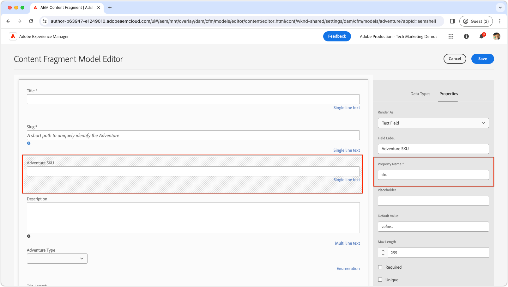

# Campos personalizados

Saiba como criar campos personalizados no Editor de fragmento de conteúdo do AEM.

>[!VIDEO](https://video.tv.adobe.com/v/3427585?learn=on)

As extensões da interface do usuário do AEM devem ser desenvolvidas usando a estrutura [Adobe React Spectrum](https://react-spectrum.adobe.com/react-spectrum/index.html), pois essa estrutura mantém uma aparência consistente com o restante do AEM, além de ter uma ampla biblioteca de funcionalidades pré-criadas, reduzindo o tempo de desenvolvimento.

## Ponto de extensão

Este exemplo substitui um campo existente no Editor de fragmento de conteúdo por uma implementação personalizada.

| Interface do usuário estendida do AEM | Ponto de extensão |
| ------------------------ | --------------------- | 
| [Editor de fragmento de conteúdo](https://developer.adobe.com/uix/docs/services/aem-cf-editor/) | [Renderização de elemento de formulário personalizado](https://developer.adobe.com/uix/docs/services/aem-cf-editor/api/custom-fields/) |

## Exemplo de extensão

Este exemplo demonstra como restringir os valores de campo no Editor de fragmento de conteúdo a um conjunto predeterminado, substituindo o campo padrão por uma lista suspensa personalizada de SKUs predefinidas. Os autores podem selecionar nessa lista de SKUs específica. Embora os SKUs geralmente sejam provenientes de um sistema PIM (Product Information Management, gerenciamento de informações do produto), este exemplo simplifica ao listar estaticamente os SKUs.

O código-fonte deste exemplo é [disponível para download](./assets/editor-custom-field/content-fragment-editor-custom-field-src.zip).

### Definição do modelo de fragmento de conteúdo

Este exemplo está associado a qualquer campo Fragmento do Conteúdo cujo nome seja `sku` (por meio de uma [correspondência de expressão regular](#extension-registration) de `^sku$`) e o substitui por um campo personalizado. O exemplo usa o modelo de Fragmento de conteúdo WKND Adventure que foi atualizado e a definição é a seguinte:



Embora o campo SKU personalizado seja exibido como uma lista suspensa, seu modelo subjacente é configurado como um campo de texto. A implementação do campo personalizado só precisa ser alinhada com o nome e o tipo apropriados da propriedade, facilitando a substituição do campo padrão pela versão suspensa personalizada.


### Rotas de aplicativo

No componente React principal `App.js`, inclua a rota `/sku-field` para renderizar o componente React `SkuField`.

`src/aem-cf-editor-1/web-src/src/components/App.js`

```javascript
import React from "react";
import ErrorBoundary from "react-error-boundary";
import { HashRouter as Router, Routes, Route } from "react-router-dom";
import ExtensionRegistration from "./ExtensionRegistration";
import SkuField from "./SkuField"; // Custom component implemented below

function App() {
  return (
    <Router>
      <ErrorBoundary onError={onError} FallbackComponent={fallbackComponent}>
        <Routes>
          <Route index element={<ExtensionRegistration />} />
          <Route
            exact path="index.html"
            element={<ExtensionRegistration />}
          />
          {/* This is the React route that maps to the custom field */}
          <Route
            exact path="/sku-field"
            element={<SkuField />}/>
        </Routes>
      </ErrorBoundary>
    </Router>
  )
  ...
}
...
```

Esta rota personalizada de `/sku-field` mapeia para o componente `SkuField` e é usada abaixo no [Registro de extensão](#extension-registration).

### Registro de extensão

`ExtensionRegistration.js`, mapeado para a rota index.html, é o ponto de entrada para a extensão AEM e define:

+ A definição do widget na função `getDefinitions()` com os atributos `fieldNameExp` e `url`. A lista completa de atributos disponíveis está disponível na [Referência da API de Renderização do Elemento de Formulário Personalizado](https://developer.adobe.com/uix/docs/services/aem-cf-editor/api/custom-fields/#api-reference).
+ O valor do atributo `url`, um caminho de URL relativo (`/index.html#/skuField`) para carregar a interface do usuário do campo.

`src/aem-cf-editor-1/web-src/src/components/ExtensionRegistration.js`

```javascript
import { Text } from "@adobe/react-spectrum";
import { register } from "@adobe/uix-guest";
import { extensionId } from "./Constants";

function ExtensionRegistration() {
  const init = async () => {
    const guestConnection = await register({
      id: extensionId,
      methods: {
        field: {
          getDefinitions() {
            return [
              // Multiple fields can be registered here.
              {
                fieldNameExp: '^sku$',  // This is a regular expression that matches the field name in the Content Fragment Model to replace with React component specified in the `url` key.
                url: '/#/sku-field',    // The URL, which is mapped vai the Route in App.js, to the React component that will be used to render the field.
              },
              // Other bindings besides fieldNameExp, other bindings can be used as well as defined here:
              // https://developer.adobe.com/uix/docs/services/aem-cf-editor/api/custom-fields/#api-reference
            ];
          },
        },
      }
    });
  };
  init().catch(console.error);

  return <Text>IFrame for integration with Host (AEM)...</Text>;
}

export default ExtensionRegistration;
```

### Campo personalizado

O componente React `SkuField` atualiza o Editor de Fragmento de Conteúdo com uma interface personalizada, usando o Adobe React Spectrum para sua forma seletor. Os destaques incluem:

+ Utilizando `useEffect` para inicialização e conexão com o Editor de Fragmento de Conteúdo do AEM, com um estado de carregamento mostrado até que a instalação seja concluída.
+ A renderização dentro de um iFrame ajusta dinamicamente a altura do iFrame por meio da função `onOpenChange` para acomodar a lista suspensa do Seletor de Espectro do Adobe React.
+ Comunica as seleções de campo de volta ao host usando `connection.host.field.onChange(value)` na função `onSelectionChange`, garantindo que o valor selecionado seja validado e salvo automaticamente de acordo com as diretrizes do Modelo de fragmento de conteúdo.

Os campos personalizados são renderizados em um iFrame inserido no Editor de fragmento de conteúdo. A comunicação entre o código de campo personalizado e o Editor de Fragmento de Conteúdo é feita exclusivamente através do objeto `connection`, estabelecido pela função `attach` do pacote `@adobe/uix-guest`.

`src/aem-cf-editor-1/web-src/src/components/SkuField.js`

```javascript
import React, { useEffect, useState } from "react";
import { extensionId } from "./Constants";
import { attach } from "@adobe/uix-guest";
import { Provider, View, lightTheme } from "@adobe/react-spectrum";
import { Picker, Item } from "@adobe/react-spectrum";

const SkuField = (props) => {
  const [connection, setConnection] = useState(null);
  const [validationState, setValidationState] = useState(null);
  const [value, setValue] = useState(null);
  const [model, setModel] = useState(null);
  const [items, setItems] = useState(null);

  /**
   * Mock function that gets a list of Adventure SKUs to display.
   * The data could come anywhere, AEM's HTTP APIs, a PIM, or other system.
   * @returns a list of items for the picker
   */
  async function getItems() {
    // Data to drive input field validation can come from anywhere.
    // Fo example this commented code shows how it could be fetched from an HTTP API.
    // fetch(MY_API_URL).then((response) => response.json()).then((data) => { return data; }

    // In this example, for simplicity, we generate a list of 25 SKUs.
    return Array.from({ length: 25 }, (_, i) => ({ 
        name: `WKND-${String(i + 1).padStart(3, '0')}`, 
        id: `WKND-${String(i + 1).padStart(3, '0')}` 
    }));
  }

  /**
   * When the fields changes, update the value in the Content Fragment Editor
   * @param {*} value the selected value in the picker
   */
  const onSelectionChange = async (value) => {
    // This sets the value in the React state of the custom field
    setValue(value);
    // This calls the setValue method on the host (AEM's Content Fragment Editor)
    connection.host.field.onChange(value);
  };

  /**
   * Some widgets, like the Picker, have a variable height.
   * In these cases adjust the Content Fragment Editor's iframe's height so the field doesn't get cut off.     *
   * @param {*} isOpen true if the picker is open, false if it's closed
   */
  const onOpenChange = (isOpen) => {
    if (isOpen) {
      // Calculate the height of the picker box and its label, and surrounding padding.
      const pickerHeight = Number(document.body.clientHeight.toFixed(0));
      // Calculate the height of the picker options dropdown, and surrounding padding.
      // We do this  by multiplying the number of items by the height of each item (32px) and adding 12px for padding.
      const optionsHeight = items.length * 32 + 12;

      // Set the height of the iframe to the height of the picker + the height of the options, or 400px, whichever is smaller.
      // The options will scroll if they they cannot fit into 400px
      const height = Math.min(pickerHeight + optionsHeight, 400);

      // Set the height of the iframe in the Content Fragment Editor
      connection.host.field.setStyles({
        current: { height, },
        parent: { height, },
      })
    } else {
      connection.host.field.setStyles({
        current: { height: 74 },
        parent: { height: 74 },
      })
    }
  };

  useEffect(() => {
    const init = async () => {
      // Connect to the host (AEM's Content Fragment Editor)
      const conn = await attach({ id: extensionId });
      setConnection(conn);

      // get the Content Fragment Model
      setModel(await conn.host.field.getModel());

      // Share the validation state back to the client.
      // When conn.host.field.setValue(value) is called, the
      await conn.host.field.onValidationStateChange((state) => {
        // state can be `valid` or `invalid`.
        setValidationState(state);
      });
      // Get default value from the Content Fragment Editor
      // (either the default value set in the model, or a perviously set value)
      setValue(await conn.host.field.getDefaultValue());

      // Get the list of items for the picker; in this case its a list of adventure SKUs 
      // This could come from elsewhere in AEM or from an external system.
      setItems(await getItems());
    };

    init().catch(console.error);
  }, []);

  // If the component is not yet initialized, return a loading state.
  if (!connection || !model || !items) {
    // Put whatever loader you like here...
    return <Provider theme={lightTheme}>Loading custom field...</Provider>;
  }

  // Wrap the Spectrum UI component in a Provider theme, such that it is styled appropriately.
  // Render the picker, and bind to the data and custom event handlers.

  // Set as much of the model as we can, to allow maximum authoring flexibility without developer support.
  return (
    <Provider theme={lightTheme}>
      <View width="100%">
        <Picker
          label={model.fieldLabel}
          isRequired={model.required}
          placeholder={model.emptyText}
          errorMessage={model.customErrorMsg}
          selectedKey={value}
          necessityIndicator="icon"
          shouldFlip={false}
          width={"90%"}
          items={items}
          isInvalid={validationState === "invalid"}
          onSelectionChange={onSelectionChange}
          onOpenChange={onOpenChange}
        >
          {(item) => <Item key={item.value}>{item.name}</Item>}
        </Picker>
      </View>
    </Provider>
  );
};

export default SkuField;
```
