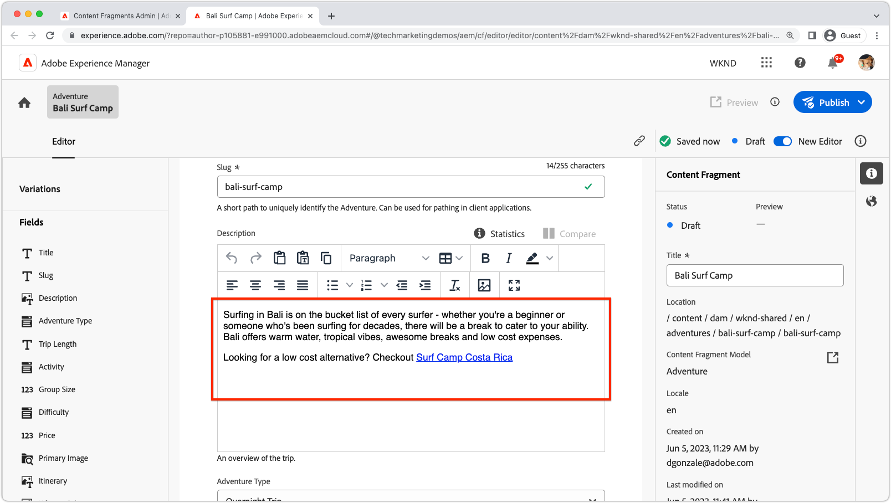

# Extensibilidade de fragmentos de conteúdo do AEM

A interface do usuário de fragmentos de conteúdo do AEM é uma interface extensível e poderosa para gerenciar, criar, gerenciar e editar fragmentos de conteúdo. Há vários pontos de extensão disponíveis para personalizar a interface do usuário de acordo com suas necessidades. Diferentes pontos de extensão estão disponíveis com base na interface do usuário que você está estendendo.

## Pontos de extensão do Console de fragmentos de conteúdo

O Console do fragmento de conteúdo no AEM (Adobe Experience Manager) é uma interface de usuário que fornece um local centralizado para gerenciar e organizar fragmentos de conteúdo. Ele oferece um conjunto abrangente de ferramentas e recursos para criar, editar, publicar e rastrear fragmentos de conteúdo, permitindo que os usuários gerenciem com eficiência o conteúdo estruturado em vários canais e pontos de contato.

[Console de fragmentos de conteúdo do AEM](https://experienceleague.adobe.com/docs/experience-manager-cloud-service/content/sites/administering/content-fragments/content-fragments-console.html?lang=pt-BR) O é a interface do usuário extensível para listar e gerenciar fragmentos de conteúdo. [Extensões do console de fragmentos de conteúdo do AEM são criadas](https://developer.adobe.com/uix/docs/services/aem-cf-console-admin/code-generation) usando o `@adobe/aem-cf-admin-ui-ext-tpl` Modelo do App Builder.

Os seguintes pontos de extensão do Console de fragmentos de conteúdo estão disponíveis:

      

        

          

            <figure class="image is-16by9">
              
            </figure>
          

          

            

              
<a href="https://developer.adobe.com/uix/docs/services/aem-cf-console-admin/api/action-bar/" title="Barra de ação" target="_blank" rel="referrer">Barra de ação</a>

              
Personalize ações para quando um ou mais Fragmentos de conteúdo forem selecionados.

              <a href="https://developer.adobe.com/uix/docs/services/aem-cf-console-admin/api/action-bar/" class="spectrum-Button spectrum-Button--outline spectrum-Button--primary spectrum-Button--sizeM" target="_blank" rel="referrer">
                Exibir os documentos
              </a>
            

          

        

      

  

    

      

        <figure class="image is-16by9">
          
        </figure>
      

      

        

          
<a href="https://developer.adobe.com/uix/docs/services/aem-cf-console-admin/api/grid-columns/" title="Colunas de grade" target="_blank" rel="referrer">Colunas de grade</a>

          
Personalize os dados que aparecem na lista Fragmentos de conteúdo.

          <a href="https://developer.adobe.com/uix/docs/services/aem-cf-console-admin/api/grid-columns/" class="spectrum-Button spectrum-Button--outline spectrum-Button--primary spectrum-Button--sizeM" target="_blank" rel="referrer">
            Exibir os documentos
          </a>
        

      

    

  

  

    

      

        <figure class="image is-16by9">
          
        </figure>
      

      

        

          
<a href="https://developer.adobe.com/uix/docs/services/aem-cf-console-admin/api/header-menu/" title="Menu de cabeçalho" target="_blank" rel="referrer">Menu de cabeçalho</a>

          
Personalize ações para quando nenhum Fragmento de conteúdo for selecionado.

          <a href="https://developer.adobe.com/uix/docs/services/aem-cf-console-admin/api/header-menu/" class="spectrum-Button spectrum-Button--outline spectrum-Button--primary spectrum-Button--sizeM" target="_blank" rel="referrer">
            Exibir os documentos
          </a>
        

      

    

  
  

## Pontos de extensão do Editor de fragmentos de conteúdo

O Editor de fragmento de conteúdo no AEM (Adobe Experience Manager) é um componente da interface do usuário que permite aos usuários criar, editar e gerenciar fragmentos de conteúdo. Ele fornece um ambiente visualmente intuitivo e amigável para trabalhar com conteúdo estruturado, permitindo que os usuários definam e organizem elementos de conteúdo, apliquem modelos, gerenciem variações e visualizem como o conteúdo aparece em diferentes canais. O Editor de fragmento de conteúdo simplifica o processo de criação de conteúdo reutilizável e modular que pode ser facilmente distribuído e publicado em várias experiências digitais.

O Editor de fragmentos de conteúdo do AEM é a interface do usuário extensível para editar fragmentos de conteúdo. [Extensões do Editor de Fragmento de conteúdo do AEM são criadas](https://developer.adobe.com/uix/docs/services/aem-cf-editor/code-generation/) usando o `@adobe/aem-cf-editor-ui-ext-tpl` Modelo do App Builder.

Os seguintes pontos de extensão do Editor de fragmentos de conteúdo estão disponíveis:

    

      

        

          <figure class="image is-16by9">
            
          </figure>
        

        

          

            
<a href="https://developer.adobe.com/uix/docs/services/aem-cf-editor/api/header-menu/" title="Menu de cabeçalho" target="_blank" rel="referrer">Menu de cabeçalho</a>

            
Personalize ações no menu de cabeçalho do Editor de fragmento de conteúdo.

            <a href="https://developer.adobe.com/uix/docs/services/aem-cf-editor/api/header-menu" class="spectrum-Button spectrum-Button--outline spectrum-Button--primary spectrum-Button--sizeM" target="_blank" rel="referrer">
              Exibir os documentos
            </a>
          

        

      

    

  

    

      

        <figure class="image is-16by9">
          
        </figure>
      

      

        

          
<a href="https://developer.adobe.com/uix/docs/services/aem-cf-editor/api/rte-toolbar/" title="Barra de ferramentas do Editor de Rich Text"  target="_blank" rel="referrer">Barra de ferramentas do Editor de Rich Text</a>

          
Adicione o botão personalizado ao Editor de Rich Text (RTE) do Editor de fragmento de conteúdo.

          <a href="https://developer.adobe.com/uix/docs/services/aem-cf-editor/api/rte-toolbar/" class="spectrum-Button spectrum-Button--outline spectrum-Button--primary spectrum-Button--sizeM" target="_blank" rel="referrer">
            Exibir os documentos
          </a>
        

      

    

  

    

      

        <figure class="image is-16by9">
          
        </figure>
      

      

        

          
<a href="https://developer.adobe.com/uix/docs/services/aem-cf-editor/api/rte-widgets/" title="Widgets do Editor de Rich Text" target="_blank" rel="referrer">Widgets do Editor de Rich Text</a>

          
Personalize ações no RTE vinculadas a pressionamentos de tecla.

          <a href="https://developer.adobe.com/uix/docs/services/aem-cf-editor/api/rte-widgets/" class="spectrum-Button spectrum-Button--outline spectrum-Button--primary spectrum-Button--sizeM" target="_blank" rel="referrer">
            Exibir os documentos
          </a>
        

      

    

  

  

    

      

        <figure class="image is-16by9">
          
        </figure>
      

      

        

          
<a href="https://developer.adobe.com/uix/docs/services/aem-cf-editor/api/rte-badges/ " title="Medalhas do editor de rich text" target="_blank" rel="referrer">Medalhas do editor de rich text</a>

          
Personalize blocos com estilo não editáveis dentro do RTE.

          <a href="https://developer.adobe.com/uix/docs/services/aem-cf-editor/api/rte-badges/" class="spectrum-Button spectrum-Button--outline spectrum-Button--primary spectrum-Button--sizeM" target="_blank" rel="referrer">
            Exibir os documentos
          </a>
        

      

    

  

## Exemplos de extensão

Bem-vindo a uma coleção de exemplos de código de extensibilidade da interface do usuário para AEM! Esse recurso foi projetado para fornecer demonstrações práticas e insights sobre a extensão da interface do usuário do Adobe Experience Manager (AEM). Se você é um desenvolvedor que busca aprimorar a funcionalidade do AEM, esses exemplos de código servem como uma referência valiosa.

  

    

      

        <figure class="image is-16by9">
          
        </figure>
      

      

        

          
<a href="./examples/console-bulk-property-update.md" title="Atualização de propriedade em massa">Atualização em massa da propriedade do fragmento de conteúdo</a>

          
Uma extensão da Barra de ação do console de Fragmento de conteúdo com ações modais e do Adobe I/O Runtime.

          <a href="./examples/console-bulk-property-update.md" class="spectrum-Button spectrum-Button--outline spectrum-Button--primary spectrum-Button--sizeM">
            Veja o exemplo
          </a>
        

      

    

  

  

        

            

                <figure class="image is-16by9">
                    
                </figure>
            

            

                

                    
<a href="./examples/console-image-generation-and-image-upload.md" title="Geração de imagens com base em OpenAI e upload para a extensão AEM">Geração de imagem OpenAPI</a>

                    
Explore um exemplo de extensão da barra de ação que gera uma imagem usando OpenAI, faz o upload para AEM e atualiza a propriedade da imagem no Fragmento de conteúdo selecionado.

                    <a href="./examples/console-image-generation-and-image-upload.md" class="spectrum-Button spectrum-Button--outline spectrum-Button--primary spectrum-Button--sizeM">
                        Veja o exemplo
                    </a>
                

            

        

    
    
  

    

      

        <figure class="image is-16by9">
          
        </figure>
      

      

        

          
<a href="./examples/custom-grid-columns.md" title="Colunas personalizadas">Colunas personalizadas</a>

          
Adicione uma coluna personalizada ao Console de fragmentos de conteúdo.

          <a href="./examples/custom-grid-columns.md" class="spectrum-Button spectrum-Button--outline spectrum-Button--primary spectrum-Button--sizeM">
            Veja o exemplo
          </a>
        

      

    

  
    
  

    

      

        <figure class="image is-16by9">
          
        </figure>
      

      

        

          
<a href="./examples/editor-export-to-xml.md" title="Exportar para XML">Exportar para XML</a>

          
Exporte um fragmento de conteúdo como XML do editor de fragmentos de conteúdo.

          <a href="./examples/editor-export-to-xml.md" class="spectrum-Button spectrum-Button--outline spectrum-Button--primary spectrum-Button--sizeM">
            Veja o exemplo
          </a>
        

      

    

  
    
  

    

      

        <figure class="image is-16by9">
          
        </figure>
      

      

        

          
<a href="./examples/editor-rte-toolbar.md" title="Botão da barra de ferramentas do Editor de Rich Text">Botão da barra de ferramentas do Editor de Rich Text</a>

          
Adicionar botões personalizados da barra de ferramentas aos campos do RTE no Editor de fragmento de conteúdo.

          <a href="./examples/editor-rte-toolbar.md" class="spectrum-Button spectrum-Button--outline spectrum-Button--primary spectrum-Button--sizeM">
            Veja o exemplo
          </a>
        

      

    

  
   
  

    

      

        <figure class="image is-16by9">
          
        </figure>
      

      

        

          
<a href="./examples/editor-rte-toolbar.md" title="Widget do editor de rich text">Widget do editor de rich text</a>

          
Adicionar widgets ao Editor de Rich Text no Editor de fragmento de conteúdo.

          <a href="./examples/editor-rte-widget.md" class="spectrum-Button spectrum-Button--outline spectrum-Button--primary spectrum-Button--sizeM">
            Veja o exemplo
          </a>
        

      

    

  
   
  

    

      

        <figure class="image is-16by9">
          
        </figure>
      

      

        

          
<a href="./examples/editor-rte-badges.md" title="Medalha do Editor de Rich Text">Medalha do Editor de Rich Text</a>

          
Adicionar selos ao Editor de Rich Text no Editor de fragmento de conteúdo.

          <a href="./examples/editor-rte-badges.md" class="spectrum-Button spectrum-Button--outline spectrum-Button--primary spectrum-Button--sizeM">
            Veja o exemplo
          </a>
        

      

    

  
 

