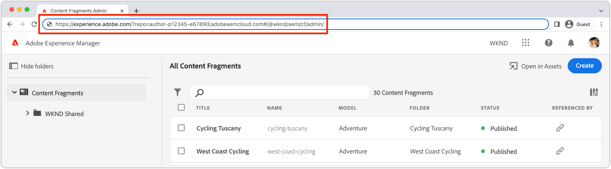

# Verificar uma extensão

As extensões da interface do usuário do AEM AEM podem ser verificadas em relação a qualquer ambiente as a Cloud Service na organização Adobe à qual a extensão pertence.

O teste de uma extensão é feito por meio de um URL especialmente criado que instrui o AEM a carregar a extensão somente para essa solicitação.

>[!VIDEO](https://video.tv.adobe.com/v/3412877?quality=12&learn=on)

>[!IMPORTANT]
>
> O vídeo acima mostra o uso de uma extensão do Console de fragmentos de conteúdo para ilustrar a pré-visualização e a verificação do aplicativo da extensão do App Builder. No entanto, é importante observar que os conceitos abordados podem ser aplicados a todas as extensões da interface do usuário do AEM.

## URL da interface do AEM

{align="center"}

Para criar um URL que monte a extensão de não produção no AEM, o URL da interface do AEM na qual a extensão é inserida deve ser obtido. Navegue até o ambiente as a Cloud Service do AEM para verificar a extensão e abra a interface do usuário na qual a extensão deve ser visualizada.

Por exemplo, para visualizar uma extensão do console de Fragmentos de conteúdo:

1. Faça login no ambiente as a Cloud Service AEM desejado.
2. Selecione o __Fragmentos de conteúdo__ ícone.
3. Aguarde o Console do Fragmento de conteúdo do AEM ser carregado no navegador.
4. Copie o URL do Console do Fragmento de conteúdo do AEM da barra de endereços do navegador. Ele deve se parecer com:

   ```
   https://experience.adobe.com/?repo=author-p1234-e5678.adobeaemcloud.com#/@wknd/aem/cf/admin
   ```

Esse URL é usado abaixo ao criar os URLs para desenvolvimento e verificação de estágio. Se verificar a extensão em relação a outras interfaces do AEM, obtenha esses URLs e aplique as mesmas etapas abaixo.

## Verificar builds de desenvolvimento local

1. Abra uma linha de comando na raiz do projeto de extensão.
1. Execute a extensão da interface do usuário para AEM como um aplicativo local do App Builder

   ```shell
   $ aio app run
   ...
   No change to package.json was detected. No package manager install will be executed.
   
   To view your local application:
     -> https://localhost:9080
   To view your deployed application in the Experience Cloud shell:
     -> https://experience.adobe.com/?devMode=true#/custom-apps/?localDevUrl=https://localhost:9080
   ```

Anote o URL do aplicativo local, mostrado acima como `-> https://localhost:9080`

1. Adicione os dois parâmetros de consulta a seguir à [URL da interface do AEM](#aem-ui-url)
   + `&devMode=true`
   + `&ext=<LOCAL APPLICATION URL>`, normalmente `&ext=https://localhost:9080`.

   Adicione os dois parâmetros de consulta acima (`devMode` e `ext`) como a __primeiro__ parâmetros de consulta no URL. Rotas de hash de uso da interface extensível do AEM (`#/@wknd/aem/...`), então a pós-fixação incorreta dos parâmetros após a variável `#` não funciona.

   O URL de visualização deve ser semelhante a:

   ```
   https://experience.adobe.com/?devMode=true&ext=https://localhost:9080&repo=author-p1234-e5678.adobeaemcloud.com#/@wknd/aem/cf/admin
   ```

2. Copie e cole o URL de visualização no navegador.

   + Talvez seja necessário inicialmente e depois periodicamente, [aceitar o certificado HTTPS](https://developer.adobe.com/uix/docs/services/aem-cf-console-admin/extension-development/#accepting-the-certificate-first-time-users) para o host do aplicativo local (`https://localhost:9080`).

3. A interface do AEM é carregada com a versão local da extensão inserida nela para verificação.

>[!IMPORTANT]
>
>Lembre-se de que, ao usar essa abordagem, a extensão em desenvolvimento afeta apenas sua experiência, e todos os outros usuários da interface do usuário do AEM experimentam a interface do usuário sem a extensão inserida.

## Verificar builds de estágio

1. Abra uma linha de comando na raiz do projeto de extensão.
1. Verifique se o espaço de trabalho Preparo está ativo (ou o espaço de trabalho usado para verificação).

   ```shell
   $ aio app use -w Stage
   ```

   Mesclar alterações em `.env` e `.aio`.

1. Implante o aplicativo App Builder de extensão atualizado. Se não estiver conectado, execute `aio login` primeiro.

   ```shell
   $ aio app deploy
   ...
   Your deployed actions:
   web actions:
     -> https://98765-123aquarat.adobeio-static.net/api/v1/web/aem-cf-console-admin-1/generic 
   To view your deployed application:
     -> https://98765-123aquarat.adobeio-static.net/index.html
   To view your deployed application in the Experience Cloud shell:
     -> https://experience.adobe.com/?devMode=true#/custom-apps/?localDevUrl=https://98765-123aquarat.adobeio-static.net/index.html
   New Extension Point(s) in Workspace 'Production': 'aem/cf-console-admin/1'
   Successful deployment 🏄
   ```

1. Adicione os dois parâmetros de consulta a seguir à [URL da interface do AEM](#aem-ui-url)
   + `&devMode=true`
   + `&ext=<DEPLOYED APPLICATION URL>`

   Adicione os dois parâmetros de consulta acima (`devMode` e `ext`) como a __primeiro__ parâmetros de consulta no URL, já que as interfaces do usuário AEM extensíveis usam uma rota de hash (`#/@wknd/aem/...`), então a pós-fixação incorreta dos parâmetros após a variável `#` não funciona.

   O URL de visualização deve ser semelhante a:

   ```
   https://experience.adobe.com/?devMode=true&ext=https://98765-123aquarat.adobeio-static.net/index.html&repo=author-p1234-e5678.adobeaemcloud.com#/@wknd/aem/cf/admin
   ```

1. Copie e cole o URL de visualização no navegador.
1. O Console do Fragmento de conteúdo do AEM injeta a versão da extensão implantada no espaço de trabalho do Preparo no. Esse URL do Palco pode ser compartilhado com o controle de qualidade ou usuários empresariais para verificação.

Lembre-se de que, ao usar essa abordagem, a extensão Preparada é inserida somente no Console do Fragmento de conteúdo do AEM quando o acesso for feito com o URL do estágio de artesanato.

1. As extensões implantadas podem ser atualizadas executando `aio app deploy` novamente e essas alterações serão refletidas automaticamente ao usar o URL de visualização.
1. Para remover uma extensão para verificação, execute `aio app undeploy`.

## Visualizar bookmarklet

Para facilitar a criação dos URLs de visualização e visualização descritos acima, um bookmarklet JavaScript que carrega a extensão pode ser criado.

O bookmarklet abaixo pré-visualiza a [builds de desenvolvimento local](#verify-local-development-builds) da extensão em `https://localhost:9080`. Para visualizar [builds de estágio](#verify-stage-builds), crie um bookmarklet com a `previewApp` variável definida como o URL do aplicativo App Builder implantado.

1. Crie um marcador no navegador.
2. Edite o marcador.
3. Dê um nome significativo a um marcador, como `AEM UI Extension Preview (localhost:9080)`.
4. Defina o URL do marcador com o seguinte código:

   ```javascript
   javascript: (() => {
       /* Change this to the URL of the local App Builder app if not using https://localhost:9080 */
       const previewApp = 'https://localhost:9080';
   
       const repo = new URL(window.location.href).searchParams.get('repo');
   
       if (window.location.href.match(/https:\/\/experience\.adobe\.com\/.*\/aem\/cf\/(editor|admin)\/.*/i)) {
           window.location = `https://experience.adobe.com/?devMode=true&ext=${previewApp}&repo=${repo}${window.location.hash}`;
       } 
   })();
   ```

5. Navegue até uma interface de usuário AEM extensível para carregar a extensão de visualização no e clique no bookmarklet.

>[!TIP]
>
> Se a extensão do App Builder não carregar, ao usar, `&ext=https://localhost:9080`, abra esse host e porta diretamente em uma guia do navegador e aceite o certificado autoassinado. Em seguida, tente o bookmarklet novamente.
