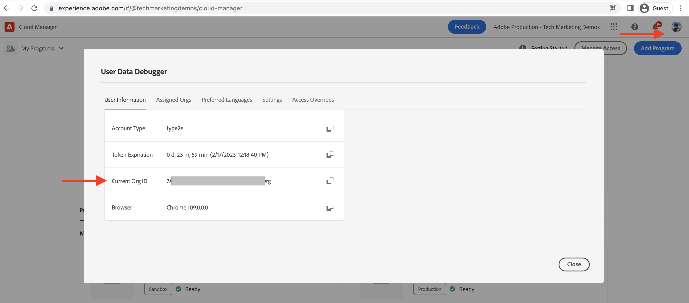

# Como configurar um ambiente de desenvolvimento rápido

Saiba mais **como configurar** Ambiente de desenvolvimento rápido (RDE) no AEM as a Cloud Service.

Este vídeo mostra:

- Adicionar um RDE ao seu programa usando o Cloud Manager
- Fluxo de logon RDE usando o Adobe IMS, como ele é semelhante a qualquer outro ambiente AEM as a Cloud Service
- Configuração de [CLI extensível do Adobe I/O Runtime](https://developer.adobe.com/runtime/docs/guides/tools/cli_install/) também conhecido como `aio CLI`
- Instalação e configuração do AEM RDE e Cloud Manager `aio CLI` plug-in usando o modo não interativo. Para o modo interativo, consulte a [instruções de configuração](#setup-the-aem-rde-plugin)

>[!VIDEO](https://video.tv.adobe.com/v/3415490?quality=12&learn=on)

## Pré-requisitos

Devem ser instalados:

- [Node.js](https://nodejs.org/en/) (LTS - Suporte a longo prazo)
- [npm 8+](https://docs.npmjs.com/)

## Configuração local

Para implantar o [do projeto do WKND Sites](https://github.com/adobe/aem-guides-wknd#aem-wknd-sites-project) código e conteúdo no RDE de sua máquina local, conclua as etapas a seguir.

### CLI extensível do Adobe I/O Runtime

Instale a Adobe I/O Runtime Extensible CLI, também conhecida como a `aio CLI` executando o comando a seguir na linha de comando.

```shell
$ npm install -g @adobe/aio-cli
```

### Instalar e configurar plug-ins da CLI do aio

A CLI aio deve ter plug-ins instalados e configurados com a ID de ambiente de organização, programa e RDE para interagir com seu RDE. A configuração pode ser executada por meio da interface de linha de comando aio usando o modo interativo mais simples ou o modo não interativo.

>[!BEGINTABS]

>[!TAB Modo interativo]

Instale e configure os plug-ins AEM RDE usando o `aio cli`do `plugins:install` comando.

1. Instale o plug-in AEM RDE da CLI do aio usando o `aio cli`do `plugins:install` comando.

   ```shell
   $ aio plugins:install @adobe/aio-cli-plugin-aem-rde    
   $ aio plugins:update
   ```

   O plugin RDE do AEM permite que os desenvolvedores implantem código e conteúdo da máquina local.

2. Faça logon na Adobe I/O Runtime Extensible CLI executando o seguinte comando para obter o token de acesso. Certifique-se de fazer logon na mesma Adobe Org que o Cloud Manager.

   ```shell
   $ aio login
   ```

3. Execute o seguinte comando para configurar o RDE usando o modo interativo.

   ```shell
   $ aio aem:rde:setup
   ```

4. A CLI solicita que você insira a ID da organização, a ID do programa e a ID do ambiente.

   ```shell
   Setup the CLI configuration necessary to use the RDE commands.
   ? Do you want to store the information you enter in this setup procedure locally? (y/N)
   ```

   - Escolher __Não__  se você estiver trabalhando apenas com um único RDE, e quiser armazenar sua configuração de RDE globalmente em sua máquina local.

   - Escolher __Sim__ se estiver trabalhando com vários RDEs ou quiser armazenar a configuração de RDE localmente, na pasta atual do `.aio` para cada projeto.

5. Selecione a ID da organização, a ID do programa e a ID de ambiente RDE na lista de opções disponíveis.

6. Verifique se a Organização, o Programa e o Ambiente corretos estão configurados executando o comando a seguir.

   ```shell
   $ aio aem rde setup --show
   ```

>[!TAB Modo não interativo]

Instale e configure os plug-ins Cloud Manager e AEM RDE usando o `aio cli`do `plugins:install` comando.

```shell
$ aio plugins:install @adobe/aio-cli-plugin-cloudmanager
$ aio plugins:install @adobe/aio-cli-plugin-aem-rde
$ aio plugins:update
```

O plug-in do Cloud Manager permite que os desenvolvedores interajam com o Cloud Manager a partir da linha de comando.

O plugin RDE do AEM permite que os desenvolvedores implantem código e conteúdo da máquina local.

Os plug-ins da CLI aio devem ser configurados para interagir com o RDE.

1. Primeiro, usando o Cloud Manager, copie os valores da Organização, do Programa e da ID de ambiente.

   - ID da organização: copiar o valor de **Imagem do perfil > Informações da conta (internas) > Janela modal > ID da organização atual**

   

   - ID do programa: Copiar o valor de **Visão geral do programa > Ambientes > {ProgramName}-rde > URI do navegador > números entre `program/` e`/environment`**

   

   - ID do ambiente: copiar o valor de **Visão geral do programa > Ambientes > {ProgramName}-rde > URI do navegador > números depois`environment/`**

   

1. Use o `aio cli`do `config:set` defina esses valores executando o comando a seguir.

   ```shell
   $ aio config:set cloudmanager_orgid <ORGANIZATION ID>
   $ aio config:set cloudmanager_programid <PROGRAM ID>
   $ aio config:set cloudmanager_environmentid <ENVIRONMENT ID>
   ```

1. Verifique os valores de configuração atuais executando o comando a seguir.

   ```shell
   $ aio config:list
   ```

1. Alternar ou revisar em qual organização você está conectado no momento:

   ```shell
   $ aio where
   ```

>[!ENDTABS]

## Verificar acesso ao RDE

Verifique a instalação e a configuração do plug-in RDE do AEM executando o seguinte comando.

```shell
$ aio aem:rde:status
```

As informações de status do RDE são exibidas como status do ambiente, a lista de _seu projeto AEM_ pacotes e configurações nos serviços de autoria e publicação.

## Próxima etapa

Saiba mais [como usar](./how-to-use.md) um RDE para implantar código e conteúdo de seu ambiente de desenvolvimento integrado (IDE) favorito para ciclos de desenvolvimento mais rápidos.


## Recursos adicionais

[Habilitar RDE na documentação de um programa](https://experienceleague.adobe.com/docs/experience-manager-cloud-service/content/implementing/developing/rapid-development-environments.html#enabling-rde-in-a-program)

Configuração de [CLI extensível do Adobe I/O Runtime](https://developer.adobe.com/runtime/docs/guides/tools/cli_install/) também conhecido como `aio CLI`

[Uso e comandos da interface de linha de comando aio](https://github.com/adobe/aio-cli#usage)

[Plug-in da CLI do Adobe I/O Runtime para interações com ambientes de desenvolvimento AEM Rapid](https://github.com/adobe/aio-cli-plugin-aem-rde#aio-cli-plugin-aem-rde)

[Plug-in da CLI aio do Cloud Manager](https://github.com/adobe/aio-cli-plugin-cloudmanager)
