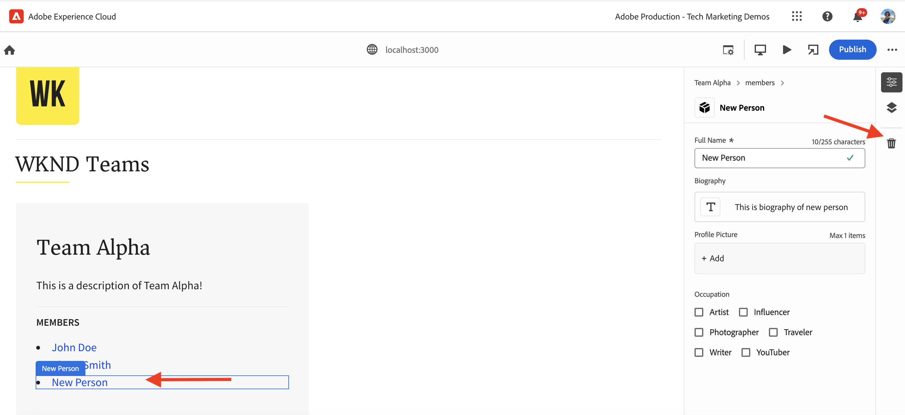

# Instrumentar o aplicativo React para editar conteúdo usando o Editor universal

Saiba como instrumentar o aplicativo React para editar o conteúdo usando o Universal Editor.

## Pré-requisitos

Você configurou o ambiente de desenvolvimento local conforme descrito no [Configuração de desenvolvimento local](./local-development-setup.md) etapa.

## Incluir a biblioteca principal do Editor Universal

Vamos começar incluindo a biblioteca principal do Editor universal no aplicativo WKND Teams React. É uma biblioteca JavaScript que fornece a camada de comunicação entre o aplicativo editado e o Editor universal.

Há duas maneiras de incluir a biblioteca principal do Editor universal no aplicativo React:

1. Dependência do módulo do nó do registro npm, consulte [@adobe/universal-editor-cors](https://www.npmjs.com/package/@adobe/universal-editor-cors).
1. Tag de script (`<script>`) no arquivo HTML.

Para este tutorial, vamos usar a abordagem Tag de script.

1. Instale o `react-helmet-async` pacote para gerenciar o `<script>` no aplicativo React.

   ```bash
   $ npm install react-helmet-async
   ```

1. Atualize o `src/App.js` arquivo do aplicativo WKND Teams React para incluir a biblioteca principal do Universal Editor.

   ```javascript
   ...
   import { Helmet, HelmetProvider } from "react-helmet-async";
   
   function App() {
   return (
       <HelmetProvider>
           <div className="App">
               <Helmet>
                   {/* AEM Universal Editor :: CORE Library
                     Loads the LATEST Universal Editor library
                   */}
                   <script
                       src="https://universal-editor-service.experiencecloud.live/corslib/LATEST"
                       async
                   />
               </Helmet>
               <Router>
                   <header>
                       <Link to={"/"}>
                       
                       </Link>
                       <hr />
                   </header>
                   <Routes>
                       <Route path="/" element={<Home />} />
                       <Route path="/person/:fullName" element={<Person />} />
                   </Routes>
               </Router>
           </div>
       </HelmetProvider>
   );
   }
   
   export default App;
   ```

## Adicionar metadados - fonte de conteúdo

Para conectar o aplicativo WKND Teams React _com a fonte de conteúdo_ para editar, é necessário fornecer metadados de conexão. O serviço do Editor universal usa esses metadados para estabelecer uma conexão com a fonte de conteúdo.

Os metadados da conexão são armazenados como `<meta>` no arquivo HTML. A sintaxe dos metadados da conexão é a seguinte:

```html
<meta name="urn:adobe:aue:<category>:<referenceName>" content="<protocol>:<url>">
```

Vamos adicionar os metadados da conexão ao aplicativo WKND Teams React no `<Helmet>` componente. Atualize o `src/App.js` arquivo com o seguinte `<meta>` tag. Neste exemplo, a fonte de conteúdo é uma instância AEM local em execução `https://localhost:8443`.

```javascript
...
function App() {
return (
    <HelmetProvider>
        <div className="App">
            <Helmet>
                {/* AEM Universal Editor :: CORE Library
                    Loads the LATEST Universal Editor library
                */}
                <script
                    src="https://universal-editor-service.experiencecloud.live/corslib/LATEST"
                    async
                />
                {/* AEM Universal Editor :: Connection metadata 
                    Connects to local AEM instance
                */}
                <meta
                    name="urn:adobe:aue:system:aemconnection"
                    content={`aem:https://localhost:8443`}
                />
            </Helmet>
            ...
    </HelmetProvider>
);
}

export default App;
```

A variável `aemconnection` fornece um nome curto para a fonte de conteúdo. A instrumentação subsequente usa o nome curto para se referir à fonte de conteúdo.

## Adicionar metadados - configuração de serviço local do Editor Universal

Em vez do serviço do Editor universal hospedado em Adobe, uma cópia local do serviço do Editor universal é usada para desenvolvimento local. O serviço local vincula o Editor universal e o SDK do AEM. Vamos adicionar os metadados do serviço Editor universal local ao aplicativo WKND Teams React.

Essas configurações também são armazenadas como `<meta>` no arquivo HTML. A sintaxe dos metadados do serviço Editor universal local é a seguinte:

```html
<meta name="urn:adobe:aue:config:service" content="<url>">
```

Vamos adicionar os metadados da conexão ao aplicativo WKND Teams React no `<Helmet>` componente. Atualize o `src/App.js` arquivo com o seguinte `<meta>` tag. Neste exemplo, o serviço do Editor universal local está em execução em `https://localhost:8001`.

```javascript
...

function App() {
  return (
    <HelmetProvider>
      <div className="App">
        <Helmet>
          {/* AEM Universal Editor :: CORE Library
              Loads the LATEST Universal Editor library
          */}
          <script
            src="https://universal-editor-service.experiencecloud.live/corslib/LATEST"
            async
          />
          {/* AEM Universal Editor :: Connection metadata 
              Connects to local AEM instance
          */}
          <meta
            name="urn:adobe:aue:system:aemconnection"
            content={`aem:https://localhost:8443`}
          />
          {/* AEM Universal Editor :: Configuration for Service
              Using locally running Universal Editor service
          */}
          <meta
            name="urn:adobe:aue:config:service"
            content={`https://localhost:8001`}
          />
        </Helmet>
        ...
    </HelmetProvider>
);
}
export default App;
```

## Instrumentar os componentes do React

Para editar o conteúdo do aplicativo WKND Teams React, como _título da equipe e descrição da equipe_, é necessário instrumentar os componentes do React. A instrumentação significa adicionar atributos de dados relevantes (`data-aue-*`) para os elementos HTML que você deseja tornar editáveis usando o Editor universal. Para obter mais informações sobre atributos de dados, consulte [Atributos e Tipos](https://experienceleague.adobe.com/en/docs/experience-manager-cloud-service/content/implementing/developing/universal-editor/attributes-types).

### Definir elementos editáveis

Vamos começar definindo os elementos que você deseja editar usando o Editor universal. No aplicativo WKND Teams React, o título e a descrição da equipe são armazenados no Fragmento de conteúdo da equipe no AEM, portanto, os melhores candidatos para edição.

Vamos instrumentar o `Teams` Componente do React para tornar editáveis o título e a descrição da equipe.

1. Abra o `src/components/Teams.js` arquivo do aplicativo WKND Teams React.
1. Adicione o `data-aue-prop`, `data-aue-type` e `data-aue-label` ao título da equipe e aos elementos de descrição.

   ```javascript
   ...
   function Teams() {
       const { teams, error } = useAllTeams();
       ...
   
       return (
           <div className="team">
               // AEM Universal Editor :: Instrumentation using data-aue-* attributes
               <h2 className="team__title" data-aue-prop="title" data-aue-type="text" data-aue-label="title">{title}</h2>
               <p className="team__description" data-aue-prop="description" data-aue-type="richtext" data-aue-label="description">{description.plaintext}</p>
               ...
           </div>
       );
   }
   
   export default Teams;
   ```

1. Atualize a página do Editor universal no navegador que carrega o aplicativo WKND Teams React. Agora é possível ver que o título da equipe e os elementos de descrição são editáveis.

   

1. Se você tentar editar o título ou a descrição da equipe usando a edição em linha ou o painel de propriedades, ele mostrará um ponteiro de carregamento, mas não permitirá a edição do conteúdo. Porque o Editor universal não está ciente dos detalhes do recurso AEM para carregar e salvar o conteúdo.

   

Em resumo, as alterações acima marcam o título da equipe e os elementos de descrição como editáveis no Editor universal. No entanto, **não é possível editar (por meio do painel integrado ou de propriedades) e salvar as alterações ainda**, para isso, é necessário adicionar os detalhes do recurso AEM usando o `data-aue-resource` atributo. Vamos fazer isso na próxima etapa.

### Definir detalhes do recurso AEM

Para salvar o conteúdo editado de volta no AEM e também para carregar o conteúdo no painel de propriedades, é necessário fornecer os detalhes do recurso AEM ao Editor universal.

Nesse caso, o recurso AEM é o caminho do Fragmento de conteúdo da equipe, então, vamos adicionar os detalhes do recurso ao `Teams` Componente de reação no nível superior `<div>` elemento.

1. Atualize o `src/components/Teams.js` arquivo a ser adicionado `data-aue-resource`, `data-aue-type` e `data-aue-label` atributos para o nível superior `<div>` elemento.

   ```javascript
   ...
   function Teams() {
       const { teams, error } = useAllTeams();
       ...
   
       // Render single Team
       function Team({ _path, title, shortName, description, teamMembers }) {
           // Must have title, shortName and at least 1 team member
           if (!_path || !title || !shortName || !teamMembers) {
               return null;
           }
   
         return (
           // AEM Universal Editor :: Instrumentation using data-aue-* attributes
           <div className="team" data-aue-resource={`urn:aemconnection:${_path}/jcr:content/data/master`} data-aue-type="reference" data-aue-label={title}>
           ...
           </div>
       );
       }
   }
   export default Teams;
   ```

   O valor de `data-aue-resource` attribute é o caminho de recurso AEM do Fragmento de conteúdo da equipe. A variável `urn:aemconnection:` O prefixo usa o nome curto da fonte de conteúdo definido nos metadados da conexão.

1. Atualize a página do Editor universal no navegador que carrega o aplicativo WKND Teams React. Agora é possível ver que o elemento Equipe de nível superior é editável, mas o painel de propriedades ainda não está carregando o conteúdo. Na guia Rede do navegador, é possível ver o erro 401 Unauthorized para o `details` solicitação que carrega o conteúdo. Ele está tentando usar o token IMS para autenticação, mas o SDK AEM local não é compatível com a autenticação IMS.

   

1. Para corrigir o erro 401 Unauthorized, é necessário fornecer os detalhes de autenticação do SDK do AEM local ao Universal Editor usando o **Cabeçalhos de autenticação** no Editor universal. Como seu SDK AEM local, defina o valor como `Basic YWRtaW46YWRtaW4=` para `admin:admin` credenciais.

   

1. Atualize a página do Editor universal no navegador que carrega o aplicativo WKND Teams React. Agora é possível ver que o painel de propriedades está carregando o conteúdo e editar o título da equipe e a descrição em linha ou usando o painel de propriedades.

   

#### Sob o capô

O painel de propriedades carrega o conteúdo do recurso AEM usando o serviço local do Editor universal. Usando a guia de rede do navegador, você pode ver a solicitação de POST para o serviço Editor universal local (`https://localhost:8001/details`) para carregar o conteúdo.

Ao editar o conteúdo usando a edição em linha ou o painel de propriedades, as alterações são salvas no recurso AEM usando o serviço local do Universal Editor. Usando a guia de rede do navegador, você pode ver a solicitação de POST para o serviço Editor universal local (`https://localhost:8001/update` ou `https://localhost:8001/patch`) para salvar o conteúdo.


O objeto JSON da carga da solicitação contém os detalhes necessários, como o servidor de conteúdo (`connections`), caminho do recurso (`target`) e o conteúdo atualizado (`patch`).


### Expandir o conteúdo editável

Vamos expandir o conteúdo editável e aplicar a instrumentação ao **membros da equipe** para poder editar os membros da equipe usando o painel de propriedades.

Como acima, vamos adicionar o relevante `data-aue-*` atributos aos membros da equipe na `Teams` Componente do React.

1. Atualize o `src/components/Teams.js` arquivo ao qual adicionar atributos de dados `<li key={index} className="team__member">` elemento.

   ```javascript
   ...
   function Teams() {
       const { teams, error } = useAllTeams();
       ...
   
       <div>
           <h4 className="team__members-title">Members</h4>
           <ul className="team__members">
               {/* Render the referenced Person models associated with the team */}
               {teamMembers.map((teamMember, index) => {
                   return (
                       // AEM Universal Editor :: Instrumentation using data-aue-* attributes
                       <li key={index} className="team__member" data-aue-resource={`urn:aemconnection:${teamMember?._path}/jcr:content/data/master`} data-aue-type="component" data-aue-label={teamMember.fullName}>
                       <Link to={`/person/${teamMember.fullName}`}>
                           {teamMember.fullName}
                       </Link>
                       </li>
                   );
               })}
           </ul>
       </div>
       ...
   }
   export default Teams;
   ```

   O valor de `data-aue-type` atributo é `component` como os membros da equipe são armazenados como `Person` Fragmentos de conteúdo no AEM e ajuda a indicar as partes móveis/excluíveis do conteúdo.

1. Atualize a página do Editor universal no navegador que carrega o aplicativo WKND Teams React. Agora é possível ver que os membros da equipe podem ser editados usando o painel de propriedades.

   

#### Sob o capô

Como acima, a recuperação e o salvamento de conteúdo são feitos pelo serviço local do Universal Editor. A variável `/details`, `/update` ou `/patch` As solicitações são feitas ao serviço local do Universal Editor para carregar e salvar o conteúdo.

### Definir como adicionar e excluir conteúdo

Até agora, você tornou o conteúdo existente editável, mas e se quiser adicionar novo conteúdo? Vamos adicionar a capacidade de adicionar ou excluir membros da equipe à equipe WKND usando o Editor universal. Assim, os autores de conteúdo não precisam ir ao AEM para adicionar ou excluir membros da equipe.

No entanto, uma recapitulação rápida, os membros da equipe da WKND são armazenados como `Person` Fragmentos de conteúdo no AEM e estão associados ao Fragmento de conteúdo da equipe usando o `teamMembers` propriedade. Para analisar a definição do modelo na visita ao AEM [my-project](http://localhost:4502/libs/dam/cfm/models/console/content/models.html/conf/my-project).

1. Primeiro, crie o arquivo de definição do componente `/public/static/component-definition.json`. Esse arquivo contém a definição do componente para o `Person` Fragmento do conteúdo. A variável `aem/cf` permite inserir fragmentos de conteúdo, com base em um modelo e um modelo fornecendo os valores padrão a serem aplicados.

   ```json
   {
       "groups": [
           {
           "title": "Content Fragments",
           "id": "content-fragments",
           "components": [
               {
               "title": "Person",
               "id": "person",
               "plugins": {
                   "aem": {
                       "cf": {
                           "name": "person",
                           "cfModel": "/conf/my-project/settings/dam/cfm/models/person",
                           "cfFolder": "/content/dam/my-project/en",
                           "title": "person",
                           "template": {
                               "fullName": "New Person",
                               "biographyText": "This is biography of new person"
                               }
                           }
                       }
                   }
               }
           ]
           }
       ]
   }
   ```

1. Em seguida, consulte o arquivo de definição de componente acima em `index.html` do aplicativo WKND Team React. Atualize o `public/index.html` do arquivo `<head>` para incluir o arquivo de definição do componente.

   ```html
   ...
   <script
       type="application/vnd.adobe.aue.component+json"
       src="/static/component-definition.json"
   ></script>
   <title>WKND App - Basic GraphQL Tutorial</title>
   </head>
   ...
   ```

1. Por fim, atualize o `src/components/Teams.js` arquivo para adicionar atributos de dados. A variável **MEMBROS** para atuar como um contêiner para os membros da equipe, vamos adicionar a `data-aue-prop`, `data-aue-type`, e `data-aue-label` atributos para o `<div>` elemento.

   ```javascript
   ...
   function Teams() {
       const { teams, error } = useAllTeams();
       ...
   
       {/* AEM Universal Editor :: Team Members as container */}
       <div data-aue-prop="teamMembers" data-aue-type="container" data-aue-label="members">
           <h4 className="team__members-title">Members</h4>
           <ul className="team__members">
           {/* Render the referenced Person models associated with the team */}
           {teamMembers.map((teamMember, index) => {
               return (
               // AEM Universal Editor :: Instrumentation using data-aue-* attributes
               <li key={index} className="team__member" data-aue-resource={`urn:aemconnection:${teamMember?._path}/jcr:content/data/master`} data-aue-type="component" data-aue-label={teamMember.fullName}>
                   <Link to={`/person/${teamMember.fullName}`}>
                   {teamMember.fullName}
                   </Link>
               </li>
               );
           })}
           </ul>
       </div>
       ...
   }
   export default Teams;
   ```

1. Atualize a página do Editor universal no navegador que carrega o aplicativo WKND Teams React. Agora você pode ver que a variável **MEMBROS** atua como um container. É possível inserir novos membros da equipe usando o painel de propriedades e a **+** ícone.

   

1. Para excluir um membro da equipe, selecione-o e clique no botão **Excluir** ícone.

   

#### Sob o capô

As operações de adição e exclusão de conteúdo são realizadas pelo serviço local do Universal Editor. A solicitação POST para `/add` ou `/remove` com uma carga detalhada são feitos no serviço local do Universal Editor para adicionar ou excluir o conteúdo do AEM.

## Arquivos de solução

Para verificar as alterações de implementação ou se não conseguir fazer com que o aplicativo WKND Teams React funcione com o Universal Editor, consulte o [basic-tutorial-instrumented-for-UE](https://github.com/adobe/aem-guides-wknd-graphql/tree/solution/basic-tutorial-instrumented-for-UE) ramificação da solução.

Comparação arquivo a arquivo com o modelo de trabalho **basic-tutorial** ramificação disponível [aqui](https://github.com/adobe/aem-guides-wknd-graphql/compare/solution/basic-tutorial...solution/basic-tutorial-instrumented-for-UE?expand=1).

## Parabéns

Você instrumentou com êxito o aplicativo WKND Teams React para adicionar, editar e excluir o conteúdo usando o Editor universal. Você aprendeu a incluir a biblioteca principal, adicionar conexão e os metadados de serviço do editor universal local e instrumentar o componente React usando vários dados (`data-aue-*`) atributos.
