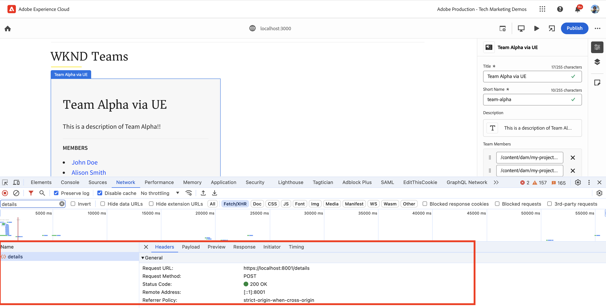
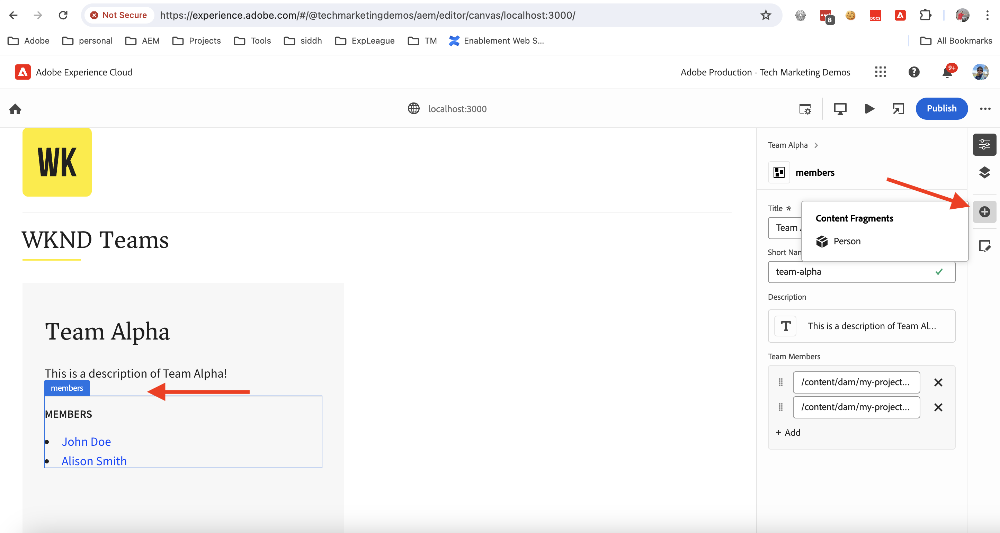

# Instrumentar o aplicativo React para editar conteúdo com o editor universal

Saiba como instrumentar o aplicativo React para editar o conteúdo com o editor universal.

## Pré-requisitos

Você configurou o ambiente de desenvolvimento local conforme descrito na etapa anterior de [configuração do desenvolvimento local](./local-development-setup.md).

## Incluir a biblioteca principal do editor universal

Vamos começar incluindo a biblioteca principal do editor universal no aplicativo WKND Teams em React. Trata-se de uma biblioteca de JavaScript que fornece a camada de comunicação entre o aplicativo editado e o editor universal.

Há duas maneiras de incluir a biblioteca principal do editor universal no aplicativo React:

1. Dependência do módulo do nó do registro npm; consulte [@adobe/universal-editor-cors](https://www.npmjs.com/package/@adobe/universal-editor-cors).
1. Tag de script (`<script>`) no arquivo HTML.

Neste tutorial, vamos usar a abordagem de tag de script.

1. Instale o pacote `react-helmet-async` para gerenciar a marca `<script>` no aplicativo React.

   ```bash
   $ npm install react-helmet-async
   ```

1. Atualize o arquivo `src/App.js` do aplicativo React WKND Teams para incluir a biblioteca principal do editor universal.

   ```javascript
   ...
   import { Helmet, HelmetProvider } from "react-helmet-async";
   
   function App() {
   return (
       <HelmetProvider>
           <div className="App">
               <Helmet>
                   {/* AEM Universal Editor :: CORE Library
                     Loads the LATEST Universal Editor library
                   */}
                   <script
                       src="https://universal-editor-service.adobe.io/cors.js"
                       async
                   />
               </Helmet>
               <Router>
                   <header>
                       <Link to={"/"}>
                       
                       </Link>
                       <hr />
                   </header>
                   <Routes>
                       <Route path="/" element={<Home />} />
                       <Route path="/person/:fullName" element={<Person />} />
                   </Routes>
               </Router>
           </div>
       </HelmetProvider>
   );
   }
   
   export default App;
   ```

## Adicionar metadados: origem do conteúdo

Para conectar o aplicativo React WKND Teams _à origem do conteúdo_ para edição, é necessário fornecer os metadados de conexão. O serviço do editor universal usa esses metadados para estabelecer uma conexão com a origem do conteúdo.

Os metadados da conexão são armazenados como tags `<meta>` no arquivo HTML. A sintaxe dos metadados da conexão é a seguinte:

```html
<meta name="urn:adobe:aue:<category>:<referenceName>" content="<protocol>:<url>">
```

Vamos adicionar os metadados da conexão ao aplicativo React WKND Teams dentro do componente `<Helmet>`. Atualize o arquivo `src/App.js` com a seguinte tag `<meta>`. Neste exemplo, a origem do conteúdo é uma instância do AEM local em execução em `https://localhost:8443`.

```javascript
...
function App() {
return (
    <HelmetProvider>
        <div className="App">
            <Helmet>
                {/* AEM Universal Editor :: CORE Library
                    Loads the LATEST Universal Editor library
                */}
                <script
                    src="https://universal-editor-service.adobe.io/cors.js"
                    async
                />
                {/* AEM Universal Editor :: Connection metadata 
                    Connects to local AEM instance
                */}
                <meta
                    name="urn:adobe:aue:system:aemconnection"
                    content={`aem:https://localhost:8443`}
                />
            </Helmet>
            ...
    </HelmetProvider>
);
}

export default App;
```

O `aemconnection` fornece um nome curto para a origem do conteúdo. A instrumentação subsequente usa o nome curto para referir-se à origem do conteúdo.

## Adicionar metadados: configuração do serviço do editor universal local

Em vez do serviço do editor universal hospedado na Adobe, uma cópia local do serviço do editor universal é usada para o desenvolvimento local. O serviço local vincula o editor universal e o SDK do AEM; portanto, vamos adicionar os metadados do serviço do editor universal local ao aplicativo React WKND Teams.

Essas definições de configuração também são armazenadas como tags `<meta>` no arquivo HTML. A sintaxe dos metadados do serviço do editor universal local é a seguinte:

```html
<meta name="urn:adobe:aue:config:service" content="<url>">
```

Vamos adicionar os metadados da conexão ao aplicativo React WKND Teams dentro do componente `<Helmet>`. Atualize o arquivo `src/App.js` com a seguinte tag `<meta>`. Neste exemplo, o serviço do editor universal local está em execução em `https://localhost:8001`.

```javascript
...

function App() {
  return (
    <HelmetProvider>
      <div className="App">
        <Helmet>
          {/* AEM Universal Editor :: CORE Library
              Loads the LATEST Universal Editor library
          */}
          <script
            src="https://universal-editor-service.adobe.io/cors.js"
            async
          />
          {/* AEM Universal Editor :: Connection metadata 
              Connects to local AEM instance
          */}
          <meta
            name="urn:adobe:aue:system:aemconnection"
            content={`aem:https://localhost:8443`}
          />
          {/* AEM Universal Editor :: Configuration for Service
              Using locally running Universal Editor service
          */}
          <meta
            name="urn:adobe:aue:config:service"
            content={`https://localhost:8001`}
          />
        </Helmet>
        ...
    </HelmetProvider>
);
}
export default App;
```

## Instrumentar os componentes do React

Para editar o conteúdo do aplicativo React WKND Teams, como _título da equipe e descrição da equipe_, é necessário instrumentar os componentes do React. Instrumentação significa adicionar atributos de dados relevantes (`data-aue-*`) aos elementos HTML que você deseja tornar editáveis com o editor universal. Para mais informações sobre atributos de dados, consulte [Atributos e tipos](https://experienceleague.adobe.com/en/docs/experience-manager-cloud-service/content/implementing/developing/universal-editor/attributes-types).

### Definir elementos editáveis

Vamos começar definindo os elementos que você deseja editar com o editor universal. No aplicativo React WKND Teams, o título e a descrição da equipe são armazenados no fragmento de conteúdo da equipe no AEM; portanto, são os melhores candidatos para edição.

Vamos instrumentar o componente do React `Teams` para tornar editáveis o título e a descrição da equipe.

1. Abra o arquivo `src/components/Teams.js` do aplicativo React WKND Teams.
1. Adicione os atributos `data-aue-prop`, `data-aue-type` e `data-aue-label` ao título da equipe e aos elementos de descrição.

   ```javascript
   ...
   function Teams() {
       const { teams, error } = useAllTeams();
       ...
   
       return (
           <div className="team">
               // AEM Universal Editor :: Instrumentation using data-aue-* attributes
               <h2 className="team__title" data-aue-prop="title" data-aue-type="text" data-aue-label="title">{title}</h2>
               <p className="team__description" data-aue-prop="description" data-aue-type="richtext" data-aue-label="description">{description.plaintext}</p>
               ...
           </div>
       );
   }
   
   export default Teams;
   ```

1. Atualize a página do editor universal no navegador onde o aplicativo React WKND Teams está aberto. Agora, é possível ver que o título da equipe e os elementos de descrição são editáveis.

   

1. Se você tentar editar o título ou a descrição da equipe com a edição em linha ou o painel de propriedades, ele mostrará um ponteiro de carregamento, mas não permitirá a edição do conteúdo. Isso ocorre porque o editor universal não está ciente dos detalhes dos recursos do AEM para carregar e salvar o conteúdo.

   

Em resumo, as alterações acima marcam o título da equipe e os elementos de descrição como editáveis no editor universal. No entanto, **você ainda não pode editar (por meio do painel de propriedades ou em linha) e salvar as alterações**, pois é necessário adicionar os detalhes do recurso do AEM com o atributo `data-aue-resource`. Vamos fazer isso na próxima etapa.

### Definir detalhes de recursos do AEM

Para salvar o conteúdo editado de volta no AEM e carregar o conteúdo no painel de propriedades também, é necessário fornecer os detalhes de recursos do AEM ao editor universal.

Neste caso, o recurso do AEM é o caminho do fragmento de conteúdo da equipe. Então, vamos adicionar os detalhes do recurso ao componente do React `Teams` no elemento `<div>` de alto nível.

1. Atualize o arquivo `src/components/Teams.js` para adicionar os atributos `data-aue-resource`, `data-aue-type` e `data-aue-label` ao elemento `<div>` de alto nível.

   ```javascript
   ...
   function Teams() {
       const { teams, error } = useAllTeams();
       ...
   
       // Render single Team
       function Team({ _path, title, shortName, description, teamMembers }) {
           // Must have title, shortName and at least 1 team member
           if (!_path || !title || !shortName || !teamMembers) {
               return null;
           }
   
         return (
           // AEM Universal Editor :: Instrumentation using data-aue-* attributes
           <div className="team" data-aue-resource={`urn:aemconnection:${_path}/jcr:content/data/master`} data-aue-type="reference" data-aue-label={title}>
           ...
           </div>
       );
       }
   }
   export default Teams;
   ```

   O valor do atributo `data-aue-resource` é o caminho do recurso do AEM do fragmento de conteúdo da equipe. O prefixo `urn:aemconnection:` usa o nome curto da origem do conteúdo definido nos metadados da conexão.

1. Atualize a página do editor universal no navegador onde o aplicativo React WKND Teams está aberto. Agora, é possível ver que o elemento da equipe de alto nível é editável, mas o painel de propriedades ainda não está carregando o conteúdo. Na guia “Rede do navegador, você verá o erro “401 Não autorizado” referente à solicitação `details` que carrega o conteúdo. Ele está tentando usar o token do IMS para realizar a autenticação, mas o SDK do AEM local não é compatível com a autenticação do IMS.

   

1. Para corrigir o erro “401 Não autorizado”, você precisa fornecer os detalhes de autenticação do SDK do AEM local ao editor universal, usando a opção **Cabeçalhos de autenticação** no editor universal. Como o SDK do AEM local, defina o valor como `Basic YWRtaW46YWRtaW4=` para as credenciais `admin:admin`.

   

1. Atualize a página do editor universal no navegador onde o aplicativo React WKND Teams está aberto. Agora, é possível ver que o painel de propriedades está carregando o conteúdo, permitindo editar o título da equipe e a descrição em linha ou por meio do painel de propriedades.

   

#### Nos bastidores

O painel de propriedades carrega o conteúdo do recurso do AEM por meio do serviço local do editor universal. Usando a guia de rede do navegador, você pode ver a solicitação POST do serviço local do editor universal (`https://localhost:8001/details`) para carregar o conteúdo.

Ao editar o conteúdo por meio da edição em linha ou do painel de propriedades, as alterações são salvas de volta no recurso do AEM por meio do serviço local do editor universal. Usando a guia de rede do navegador, você verá a solicitação POST do serviço local do editor universal (`https://localhost:8001/update` ou `https://localhost:8001/patch`) para salvar o conteúdo.



O objeto JSON do conteúdo da solicitação contém os detalhes necessários, como o servidor de conteúdo (`connections`), o caminho do recurso (`target`) e o conteúdo atualizado (`patch`).


### Expandir o conteúdo editável

Vamos expandir o conteúdo editável e aplicar a instrumentação aos **membros da equipe**, para que você possa editar os membros da equipe por meio do painel de propriedades.

Como acima, vamos adicionar os atributos `data-aue-*` relevantes aos membros da equipe no componente do React `Teams`.

1. Atualize o arquivo `src/components/Teams.js` para adicionar atributos ao elemento `<li key={index} className="team__member">`.

   ```javascript
   ...
   function Teams() {
       const { teams, error } = useAllTeams();
       ...
   
       <div>
           <h4 className="team__members-title">Members</h4>
           <ul className="team__members">
               {/* Render the referenced Person models associated with the team */}
               {teamMembers.map((teamMember, index) => {
                   return (
                       // AEM Universal Editor :: Instrumentation using data-aue-* attributes
                       <li key={index} className="team__member" data-aue-resource={`urn:aemconnection:${teamMember?._path}/jcr:content/data/master`} data-aue-type="component" data-aue-label={teamMember.fullName}>
                       <Link to={`/person/${teamMember.fullName}`}>
                           {teamMember.fullName}
                       </Link>
                       </li>
                   );
               })}
           </ul>
       </div>
       ...
   }
   export default Teams;
   ```

   O valor do atributo `data-aue-type` é `component`, já que os membros da equipe são armazenados como fragmentos de conteúdo `Person` no AEM e ajudam a indicar as partes móveis/excluíveis do conteúdo.

1. Atualize a página do editor universal no navegador onde o aplicativo React WKND Teams está aberto. Agora, é possível ver que os membros da equipe podem ser editados por meio do painel de propriedades.

   

#### Nos bastidores

Como acima, a recuperação e o salvamento do conteúdo são feitos pelo serviço local do editor universal. As solicitações `/details`, `/update` ou `/patch` são feitas ao serviço local do editor universal para carregar e salvar o conteúdo.

### Definir adição e exclusão de conteúdo

Até agora, você tornou o conteúdo existente editável, mas e se quiser adicionar um novo conteúdo? Vamos acrescentar a capacidade de adicionar ou excluir membros da equipe no WKND Teams por meio do editor universal. Assim, os criadores de conteúdo não precisarão acessar o AEM para adicionar ou excluir membros da equipe.

No entanto, uma recapitulação rápida: os membros da equipe da WKND são armazenados como fragmentos de conteúdo `Person` no AEM e associados ao fragmento de conteúdo da equipe com base na propriedade `teamMembers`. Para revisar a definição do modelo no AEM, acesse [my-project](http://localhost:4502/libs/dam/cfm/models/console/content/models.html/conf/my-project).

1. Primeiro, crie o arquivo de definição do componente `/public/static/component-definition.json`. Este arquivo contém a definição do componente para o fragmento de conteúdo `Person`. O plug-in `aem/cf` permite a inserção de fragmentos de conteúdo com base em um padrão e um modelo que fornece os valores padrão a serem aplicados.

   ```json
   {
       "groups": [
           {
           "title": "Content Fragments",
           "id": "content-fragments",
           "components": [
               {
               "title": "Person",
               "id": "person",
               "plugins": {
                   "aem": {
                       "cf": {
                           "name": "person",
                           "cfModel": "/conf/my-project/settings/dam/cfm/models/person",
                           "cfFolder": "/content/dam/my-project/en",
                           "title": "person",
                           "template": {
                               "fullName": "New Person",
                               "biographyText": "This is biography of new person"
                               }
                           }
                       }
                   }
               }
           ]
           }
       ]
   }
   ```

1. Em seguida, consulte o arquivo de definição do componente acima em `index.html` do aplicativo React WKND Team. Atualize a seção `<head>` do arquivo `public/index.html` para incluir o arquivo de definição do componente.

   ```html
   ...
   <script
       type="application/vnd.adobe.aue.component+json"
       src="/static/component-definition.json"
   ></script>
   <title>WKND App - Basic GraphQL Tutorial</title>
   </head>
   ...
   ```

1. Por fim, atualize o arquivo `src/components/Teams.js` para adicionar atributos de dados. A seção **MEMBROS** atuará como um container para os membros da equipe. Para isso, vamos adicionar os atributos `data-aue-prop`, `data-aue-type` e `data-aue-label` ao elemento `<div>`.

   ```javascript
   ...
   function Teams() {
       const { teams, error } = useAllTeams();
       ...
   
       {/* AEM Universal Editor :: Team Members as container */}
       <div data-aue-prop="teamMembers" data-aue-type="container" data-aue-label="members">
           <h4 className="team__members-title">Members</h4>
           <ul className="team__members">
           {/* Render the referenced Person models associated with the team */}
           {teamMembers.map((teamMember, index) => {
               return (
               // AEM Universal Editor :: Instrumentation using data-aue-* attributes
               <li key={index} className="team__member" data-aue-resource={`urn:aemconnection:${teamMember?._path}/jcr:content/data/master`} data-aue-type="component" data-aue-label={teamMember.fullName}>
                   <Link to={`/person/${teamMember.fullName}`}>
                   {teamMember.fullName}
                   </Link>
               </li>
               );
           })}
           </ul>
       </div>
       ...
   }
   export default Teams;
   ```

1. Atualize a página do editor universal no navegador onde o aplicativo React WKND Teams está aberto. Agora ,você pode ver que a seção **MEMBROS** atua como um container. É possível inserir novos membros da equipe por meio do painel de propriedades e do ícone **+**.

   

1. Para excluir um membro da equipe, selecione-o e clique no ícone **Excluir**.

   

#### Nos bastidores

As operações de adição e exclusão de conteúdo são realizadas pelo serviço local do editor universal. A solicitação POST para `/add` ou `/remove` com uma carga detalhada é feita ao serviço local do editor universal para adicionar ou excluir o conteúdo do AEM.

## Arquivos de solução

Para verificar as alterações de implementação ou se não conseguir fazer com que o aplicativo React WKND Teams funcione com o editor universal, consulte a ramificação da solução [basic-tutorial-instrumented-for-UE](https://github.com/adobe/aem-guides-wknd-graphql/tree/solution/basic-tutorial-instrumented-for-UE).

A comparação entre arquivos com a ramificação de trabalho **basic-tutorial** está disponível [aqui](https://github.com/adobe/aem-guides-wknd-graphql/compare/solution/basic-tutorial...solution/basic-tutorial-instrumented-for-UE?expand=1).

## Parabéns!

Você instrumentou com sucesso o aplicativo React WKND Teams para adicionar, editar e excluir o conteúdo com o editor universal. Você aprendeu a incluir a biblioteca principal, adicionar a conexão e os metadados de serviço do editor universal local, e instrumentar o componente do React com vários atributos de dados (`data-aue-*`).
