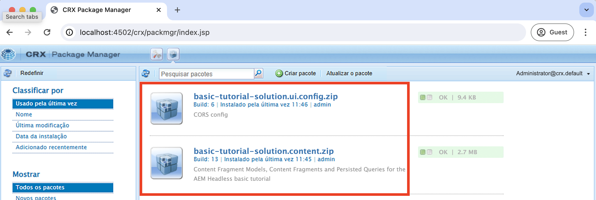
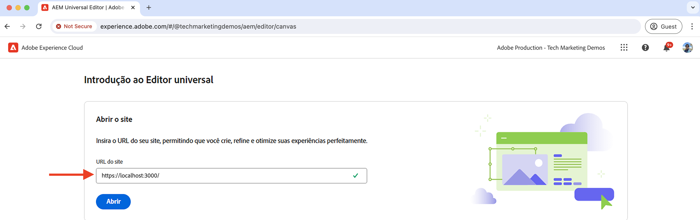
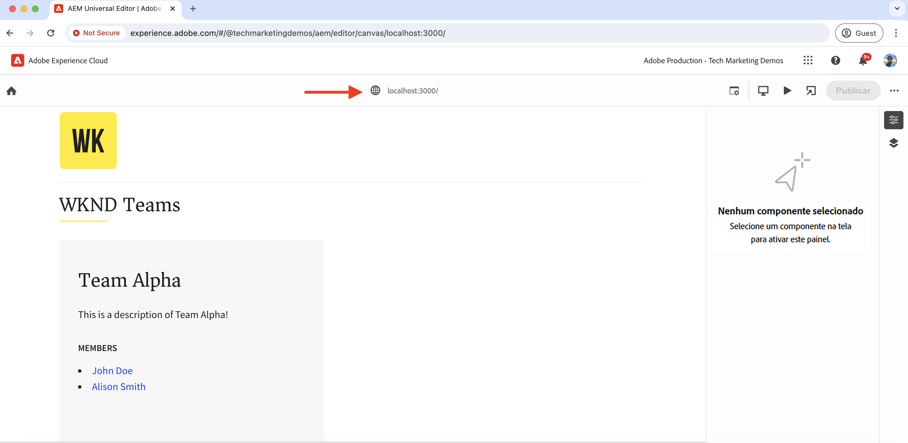

# Configuração de desenvolvimento local

Saiba como configurar um ambiente de desenvolvimento local para editar o conteúdo de um aplicativo React usando o Editor universal de AEM.

## Pré-requisitos

São necessários os seguintes itens para seguir este tutorial:

- Habilidades básicas em HTML e JavaScript.
- As seguintes ferramentas devem ser instaladas localmente:
   - [Node.js](https://nodejs.org/en/download/)
   - [Git](https://git-scm.com/downloads)
   - Um editor de código IDE ou, como [Código do Visual Studio](https://code.visualstudio.com/)
- Baixe e instale o seguinte:
   - [SDK AS A CLOUD SERVICE AEM](https://experienceleague.adobe.com/en/docs/experience-manager-learn/cloud-service/local-development-environment-set-up/aem-runtime#download-the-aem-as-a-cloud-service-sdk): contém o Quickstart Jar usado para executar o AEM Author e Publish localmente para fins de desenvolvimento.
   - [Serviço de Editor Universal](https://experienceleague.adobe.com/en/docs/experience-cloud/software-distribution/home): uma cópia local do serviço Universal Editor, que tem um subconjunto de recursos e pode ser baixada no Portal de distribuição de software.
   - [local-ssl-proxy](https://www.npmjs.com/package/local-ssl-proxy#local-ssl-proxy): um proxy HTTP SSL local simples usando um certificado autoassinado para desenvolvimento local. O Editor universal de AEM requer o URL HTTPS do aplicativo React para carregá-lo no editor.

## Configuração local

Siga as etapas abaixo para configurar o ambiente de desenvolvimento local:

### SDK do AEM

Para fornecer o conteúdo para o aplicativo WKND Teams React, instale os seguintes pacotes no SDK AEM local.

- [Equipes da WKND - Pacote de conteúdo](./assets/basic-tutorial-solution.content.zip): contém os modelos de fragmento de conteúdo, fragmentos de conteúdo e consultas persistentes do GraphQL.
- [Equipes da WKND - Pacote de configuração](./assets/basic-tutorial-solution.ui.config.zip): contém as configurações de Compartilhamento de recursos entre origens (CORS) e Manipulador de autenticação de token. O CORS facilita que propriedades da Web que não sejam AEM façam chamadas do lado do cliente baseadas em navegador para APIs do AEM GraphQL e o Manipulador de autenticação de token é usado para autenticar cada solicitação para o AEM.

  

### aplicativo React

Para configurar o aplicativo WKND Teams React, siga as etapas abaixo:

1. Clonar o [Aplicativo WKND Teams React](https://github.com/adobe/aem-guides-wknd-graphql/tree/solution/basic-tutorial) do `basic-tutorial` ramificação da solução.

   ```bash
   $ git clone -b solution/basic-tutorial git@github.com:adobe/aem-guides-wknd-graphql.git
   ```

1. Navegue até a `basic-tutorial` e abra-o no editor de código.

   ```bash
   $ cd aem-guides-wknd-graphql/basic-tutorial
   $ code .
   ```

1. Instale as dependências e inicie o aplicativo React.

   ```bash
   $ npm install
   $ npm start
   ```

1. Abra o aplicativo WKND Teams React no navegador em [http://localhost:3000](http://localhost:3000). Ele exibe uma lista de membros da equipe e seus detalhes. O conteúdo do aplicativo React é fornecido pelo AEM SDK local usando APIs do GraphQL (`/graphql/execute.json/my-project/all-teams`), que pode ser verificado usando a guia Rede do navegador.

   

### Serviço de Editor Universal

Para configurar o **local** Serviço do Universal Editor, siga as etapas abaixo:

1. Baixe a versão mais recente do serviço Editor universal na [Portal de distribuição de software](https://experience.adobe.com/downloads).

   

1. Extraia o arquivo zip baixado e copie o `universal-editor-service.cjs` para um novo diretório chamado `universal-editor-service`.

   ```bash
   $ unzip universal-editor-service-vproduction-<version>.zip
   $ mkdir universal-editor-service
   $ cp universal-editor-service.cjs universal-editor-service
   ```

1. Criar `.env` arquivo no `universal-editor-service` e adicione as seguintes variáveis de ambiente:

   ```bash
   # The port on which the Universal Editor service runs
   EXPRESS_PORT=8000
   # Disable SSL verification
   NODE_TLS_REJECT_UNAUTHORIZED=0
   ```

1. Iniciar o serviço Editor Universal local.

   ```bash
   $ cd universal-editor-service
   $ node universal-editor-service.cjs
   ```

O comando acima inicia o serviço do Editor Universal na porta `8000` e você deverá ver a seguinte saída:

```bash
Either no private key or certificate was set. Starting as HTTP server
Universal Editor Service listening on port 8000 as HTTP Server
```

### Proxy HTTP SSL local

O Editor universal de AEM requer que o aplicativo React seja distribuído por HTTPS. Vamos configurar um proxy HTTP SSL local que use um certificado autoassinado para desenvolvimento local.

Siga as etapas abaixo para configurar o proxy HTTP SSL local e servir o SDK do AEM e o serviço do Editor universal por HTTPS:

1. Instale o `local-ssl-proxy` globalmente.

   ```bash
   $ npm install -g local-ssl-proxy
   ```

1. Inicie duas instâncias do proxy HTTP SSL local para os seguintes serviços:

   - Proxy HTTP SSL local do SDK do AEM na porta `8443`.
   - Proxy HTTP SSL local do serviço do Universal Editor na porta `8001`.

   ```bash
   # AEM SDK local SSL HTTP proxy on port 8443
   $ local-ssl-proxy --source 8443 --target 4502
   
   # Universal Editor service local SSL HTTP proxy on port 8001
   $ local-ssl-proxy --source 8001 --target 8000
   ```

### Atualizar o aplicativo React para usar HTTPS

Para habilitar o HTTPS para o aplicativo WKND Teams React, siga as etapas abaixo:

1. Interrompa o React pressionando `Ctrl + C` no terminal.
1. Atualize o `package.json` arquivo a ser incluído `HTTPS=true` variável de ambiente no `start` script.

   ```json
   "scripts": {
       "start": "HTTPS=true react-scripts start",
       ...
   }
   ```

1. Atualize o `REACT_APP_HOST_URI` no `.env.development` arquivo para usar o protocolo HTTPS e a porta de proxy HTTP SSL local do SDK do AEM.

   ```bash
   REACT_APP_HOST_URI=https://localhost:8443
   ...
   ```

1. Atualize o `../src/proxy/setupProxy.auth.basic.js` arquivo para usar configurações SSL relaxadas usando `secure: false` opção.

   ```javascript
   ...
   module.exports = function(app) {
   app.use(
       ['/content', '/graphql'],
       createProxyMiddleware({
       target: REACT_APP_HOST_URI,
       changeOrigin: true,
       secure: false, // Ignore SSL certificate errors
       // pass in credentials when developing against an Author environment
       auth: `${REACT_APP_BASIC_AUTH_USER}:${REACT_APP_BASIC_AUTH_PASS}`
       })
   );
   };
   ```

1. Inicie o aplicativo React.

   ```bash
   $ npm start
   ```

## Verificar a configuração

Depois de configurar o ambiente de desenvolvimento local usando as etapas acima, vamos verificar a configuração.

### Verificação local

Verifique se os seguintes serviços estão sendo executados localmente em HTTPS. Talvez seja necessário aceitar o aviso de segurança no navegador para o certificado autoassinado:

1. Aplicativo WKND Teams React ativado [https://localhost:3000](https://localhost:3000)
1. AEM SDK ativado [https://localhost:8443](https://localhost:8443)
1. Serviço do Editor Universal ativado [https://localhost:8001](https://localhost:8001)

### Carregar o aplicativo WKND Teams React no Editor universal

Vamos carregar o aplicativo WKND Teams React no Editor universal para verificar a configuração:

1. Abra o Editor universal https://experience.adobe.com/#/aem/editor no navegador. Se solicitado, faça logon usando sua Adobe ID.

1. Insira o URL do aplicativo WKND Teams React no campo de entrada URL do site do editor universal e clique em `Open`.

   

1. O aplicativo WKND Teams React é carregado no editor universal **mas ainda não é possível editar o conteúdo**. É necessário instrumentar o aplicativo React para habilitar a edição de conteúdo usando o Editor universal.

   


## Próxima etapa

Saiba como [instrumentar o aplicativo React para editar o conteúdo](./instrument-to-edit-content.md).
