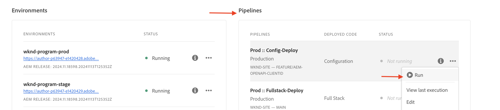

# Eventos do AEM Assets para integração do PIM

>[!IMPORTANT]
>
>Este tutorial usa APIs do AEM baseadas em OpenAPI. Elas estão disponíveis como parte de um programa de acesso antecipado. Se você estiver interessado em acessá-las, recomendamos que envie um email para [aem-apis@adobe.com](mailto:aem-apis@adobe.com) com uma descrição do caso de uso.

Saiba como receber um evento do AEM e agir sobre ele para atualizar o estado do conteúdo no AEM usando a API do autor do Assets baseada em OpenAPI.

Como processar o evento recebido depende dos requisitos de negócios. Por exemplo, os dados do evento podem ser usados para atualizar o sistema de terceiros, o AEM ou ambos.

Este exemplo demonstra como um sistema de terceiros, como um sistema de Gerenciamento de informações de produtos (PIM), pode ser integrado ao AEM as a Cloud Service Assets. Ao receber um evento do AEM Assets, ele é processado para recuperar metadados adicionais do sistema PIM e atualizar os metadados do ativo no AEM. Os metadados de ativos atualizados podem incluir informações adicionais, como SKU, nome do fornecedor ou outros detalhes do produto.

Para receber e processar o evento do AEM Assets, o [Adobe I/O Runtime](https://developer.adobe.com/runtime/docs/guides/overview/what_is_runtime/), é usada uma plataforma sem servidor. No entanto, outros sistemas de processamento de eventos, como o Webhook em seu sistema de terceiros ou o Amazon EventBridge, também podem ser usados.

O fluxo de alto nível da integração é o seguinte:


1. O serviço de Autor do AEM aciona um evento _Processamento de ativos concluído_ quando o carregamento de um ativo é concluído e todas as atividades de processamento de ativos também são concluídas. Aguardar a conclusão do processamento de ativos garante que qualquer processamento pronto para uso, como extração de metadados, tenha sido concluído.
1. O evento é enviado para o serviço [Adobe I/O Events](https://developer.adobe.com/events/).
1. O serviço Adobe I/O Events passa o evento para a [Ação do Adobe I/O Runtime](https://developer.adobe.com/runtime/docs/guides/using/creating_actions/) para processamento.
1. A Ação do Adobe I/O Runtime chama a API do sistema PIM para recuperar metadados adicionais, como SKU, informações do fornecedor ou outros detalhes.
1. Os metadados adicionais recuperados do PIM são atualizados no AEM Assets usando a [API do autor do Assets](https://developer.adobe.com/experience-cloud/experience-manager-apis/api/experimental/assets/author/) baseada em OpenAPI.

## Pré-requisitos

Para concluir este tutorial, você precisa:

- Ambiente AEM as a Cloud Service com [Evento AEM habilitado](https://developer.adobe.com/experience-cloud/experience-manager-apis/guides/events/#enable-aem-events-on-your-aem-cloud-service-environment). Além disso, o projeto [WKND Sites](https://github.com/adobe/aem-guides-wknd?#aem-wknd-sites-project) de amostra deve ser implantado nele.

- Acesso à [Adobe Developer Console](https://developer.adobe.com/developer-console/docs/guides/getting-started/).

- [Adobe Developer CLI](https://developer.adobe.com/runtime/docs/guides/tools/cli_install/) instalada no computador local.

## Etapas de desenvolvimento

As etapas de desenvolvimento de alto nível são:

1. [Modernização do ambiente do AEM as a Cloud Service](https://experienceleague.adobe.com/en/docs/experience-manager-learn/cloud-service/aem-apis/invoke-openapi-based-aem-apis#modernization-of-aem-as-a-cloud-service-environment)
1. [Habilitar o acesso às APIs do AEM](https://experienceleague.adobe.com/en/docs/experience-manager-learn/cloud-service/aem-apis/invoke-openapi-based-aem-apis#enable-aem-apis-access)
1. [Criar um projeto no Adobe Developer Console (ADC)](./runtime-action.md#Create-project-in-Adobe-Developer-Console)
1. [Inicializar o projeto para desenvolvimento local](./runtime-action.md#initialize-project-for-local-development)
1. Configurar o projeto no ADC
1. Configure o serviço do Autor do AEM para habilitar a comunicação do projeto ADC
1. Desenvolver uma ação de tempo de execução para orquestrar
   1. recuperação de metadados do sistema PIM
   1. atualização de metadados no AEM Assets usando a API do autor do Assets
1. Criar e aplicar o esquema de metadados de ativos
1. Verificação do upload de ativos e da atualização de metadados

Para obter detalhes sobre as etapas 1 a 2, consulte o [guia Invocar APIs do AEM baseadas em OpenAPI](https://experienceleague.adobe.com/en/docs/experience-manager-learn/cloud-service/aem-apis/invoke-openapi-based-aem-apis) e, para as etapas 3 a 4, consulte o [exemplo de Ação do Adobe I/O Runtime e Eventos do AEM](./runtime-action.md#). Para as etapas 5 a 9, consulte as seções a seguir.

### Configurar o projeto no Adobe Developer Console (ADC)

Para receber Eventos do AEM Assets e executar a Ação do Adobe I/O Runtime criada na etapa anterior, configure o projeto no ADC.

- No ADC, navegue até o [projeto](https://developer.adobe.com/console/projects) que você criou na etapa 3. A partir desse projeto, selecione o espaço de trabalho `Stage` onde a ação de tempo de execução é implantada quando você executa `aio app deploy` como parte das instruções da etapa 4.

- Clique no botão **Adicionar Serviço** e selecione a opção **Evento**. Na caixa de diálogo **Adicionar Eventos**, selecione **Experience Cloud** > **AEM Assets** e clique em **Avançar**.
  

- Na etapa **Configurar registro de evento**, selecione a instância do AEMCS desejada, o evento _Processamento de ativos concluído_ e o tipo de autenticação de servidor para servidor OAuth.

  

- Finalmente, na etapa **Como receber eventos**, expanda a opção **Ação em tempo de execução** e selecione a ação _genérica_ criada na etapa anterior. Clique em **Salvar eventos configurados**.

  

- Da mesma forma, clique no botão **Adicionar serviço** e selecione a opção **API**. No modal **Adicionar uma API**, selecione **Experience Cloud** > **API do AEM Assets Author** e clique em **Avançar**.

  

- Em seguida, selecione **OAuth Server-to-Server** para o tipo de autenticação e clique em **Próximo**.

- Em seguida, selecione o **Perfil de Produto** correto que esteja associado ao ambiente do AEM Assets a partir do qual o evento está sendo produzido e tenha acesso suficiente para atualizar os ativos lá. Finalmente, clique no botão **Salvar API configurada**.

  

  No meu caso, o perfil de produto _Administradores do AEM - autor - Programa XXX - Ambiente YYY_ está selecionado, ele tem o serviço **Usuários da API AEM Assets** habilitado.

  

## Configurar instância do AEM para habilitar a comunicação do Projeto ADC

Para habilitar a ClientID da credencial do servidor para servidor OAuth do projeto ADC para comunicação com a instância do AEM, é necessário configurar a instância do AEM.

Isso é feito definindo a configuração no arquivo `config.yaml` no Projeto AEM. Em seguida, implante o arquivo `config.yaml` usando o Pipeline de configuração na Cloud Manager.

- No AEM Project, localize ou crie o arquivo `config.yaml` da pasta `config`.

  

- Adicione a configuração a seguir ao arquivo `config.yaml`.

  ```yaml
  kind: "API"
  version: "1.0"
  metadata: 
      envTypes: ["dev", "stage", "prod"]
  data:
      allowedClientIDs:
          author:
          - "<ADC Project's OAuth Server-to-Server credential ClientID>"
  ```

  Substitua `<ADC Project's OAuth Server-to-Server credential ClientID>` pela ClientID real da credencial servidor para servidor OAuth do projeto ADC.

  >[!CAUTION]
  >
  > Para fins de demonstração, a mesma ClientID é usada para todos os ambientes. É recomendável usar uma ID do cliente separada por ambiente (desenvolvimento, preparo, produção) para melhorar a segurança e o controle.


- Confirme as alterações de configuração no repositório Git e envie as alterações para o repositório remoto.

- Implante as alterações acima usando o Pipeline de configuração no Cloud Manager. Observe que o arquivo `config.yaml` também pode ser instalado em um RDE, usando ferramentas de linha de comando.

  

### Desenvolver ação em tempo de execução

Para executar a recuperação e atualização de metadados, comece atualizando o código de ação _genérico_ criado automaticamente na pasta `src/dx-excshell-1/actions/generic`.

Consulte o arquivo [WKND-Assets-PIM-Integration.zip](../assets/examples/assets-pim-integration/WKND-Assets-PIM-Integration.zip) anexo para obter o código completo, e a seção abaixo destaca os arquivos principais.

- O arquivo `src/dx-excshell-1/actions/generic/mockPIMCommunicator.js` faz o mascaramento da chamada da API do PIM para recuperar metadados adicionais como SKU e nome do fornecedor. Este arquivo é usado para fins de demonstração. Depois que o fluxo de ponta a ponta estiver funcionando, substitua essa função por uma chamada para o sistema PIM real para recuperar metadados do ativo.

  ```javascript
  /**
   * Mock PIM API to get the product data such as SKU, Supplier, etc.
   *
   * In a real-world scenario, this function would call the PIM API to get the product data.
   * For this example, we are returning mock data.
   *
   * @param {string} assetId - The assetId to get the product data.
   */
  module.exports = {
      async getPIMData(assetId) {
          if (!assetId) {
          throw new Error('Invalid assetId');
          }
          // Mock response data for demo purposes
          const data = {
          SKUID: 'MockSKU 123',
          SupplierName: 'mock-supplier',
          // ... other product data
          };
          return data;
      },
  };
  ```

- O arquivo `src/dx-excshell-1/actions/generic/aemCommunicator.js` atualiza os metadados do ativo no AEM usando a [API do Assets Author](https://developer.adobe.com/experience-cloud/experience-manager-apis/api/experimental/assets/author/).

  ```javascript
  const fetch = require('node-fetch');
  ...
  /**
  *  Get IMS Access Token using Client Credentials Flow
  *
  * @param {*} clientId - IMS Client ID from ADC project's OAuth Server-to-Server Integration
  * @param {*} clientSecret - IMS Client Secret from ADC project's OAuth Server-to-Server Integration
  * @param {*} scopes - IMS Meta Scopes from ADC project's OAuth Server-to-Server Integration as comma separated strings
  * @returns {string} - Returns the IMS Access Token
  */
  async function getIMSAccessToken(clientId, clientSecret, scopes) {
    const adobeIMSV3TokenEndpointURL = 'https://ims-na1.adobelogin.com/ims/token/v3';
    const options = {
      method: 'POST',
      headers: {
        'Content-Type': 'application/x-www-form-urlencoded',
      },
      body: `grant_type=client_credentials&client_id=${clientId}&client_secret=${clientSecret}&scope=${scopes}`,
    };
    const response = await fetch(adobeIMSV3TokenEndpointURL, options);
    const responseJSON = await response.json();
    return responseJSON.access_token;
  }    
  async function updateAEMAssetMetadata(metadataDetails, aemAssetEvent, params) {
    ...
    // Transform the metadata details to JSON Patch format,
    // see https://developer.adobe.com/experience-cloud/experience-manager-apis/api/experimental/assets/author/#operation/patchAssetMetadata
    const transformedMetadata = Object.keys(metadataDetails).map((key) => ({
      op: 'add',
      path: `wknd-${key.toLowerCase()}`,
      value: metadataDetails[key],
    }));
    ...
    // Get ADC project's OAuth Server-to-Server Integration credentials
    const clientId = params.ADC_CECREDENTIALS_CLIENTID;
    const clientSecret = params.ADC_CECREDENTIALS_CLIENTSECRET;
    const scopes = params.ADC_CECREDENTIALS_METASCOPES;
    // Get IMS Access Token using Client Credentials Flow
    const access_token = await getIMSAccessToken(clientId, clientSecret, scopes);
    // Call AEM Author service to update the metadata using Assets Author API
    // See https://developer.adobe.com/experience-cloud/experience-manager-apis/api/experimental/assets/author/
    const res = await fetch(`${aemAuthorHost}/adobe/assets/${assetId}/metadata`, {
      method: 'PATCH',
      headers: {
        'Content-Type': 'application/json-patch+json',
        'If-Match': '*',
        'X-Adobe-Accept-Experimental': '1',
        'X-Api-Key': 'aem-assets-management-api', // temporary value
        Authorization: `Bearer ${access_token}`,
      },
      body: JSON.stringify(transformedMetadata),
    });
    ...
  }
  module.exports = { updateAEMAssetMetadata };
  ```

  O arquivo `.env` armazena os detalhes das credenciais de Servidor para Servidor OAuth do projeto ADC, e eles são passados como parâmetros para a ação usando o arquivo `ext.config.yaml`. Consulte os [Arquivos de Configuração do App Builder](https://developer.adobe.com/app-builder/docs/guides/configuration/) para gerenciar segredos e parâmetros de ação.
- A pasta `src/dx-excshell-1/actions/model` contém arquivos `aemAssetEvent.js` e `errors.js`, que são usados pela ação para analisar o evento recebido e manipular erros, respectivamente.
- O arquivo `src/dx-excshell-1/actions/generic/index.js` usa os módulos mencionados acima para orquestrar a recuperação e atualização de metadados.

  ```javascript
  ...
  let responseMsg;
  // handle the challenge probe request, they are sent by I/O to verify the action is valid
  if (params.challenge) {
    logger.info('Challenge probe request detected');
    responseMsg = JSON.stringify({ challenge: params.challenge });
  } else {
    logger.info('AEM Asset Event request received');
    // create AEM Asset Event object from request parameters
    const aemAssetEvent = new AEMAssetEvent(params);
    // Call mock PIM API to get the product data such as SKU, Supplier, etc.
    const mockPIMData = await mockPIMAPI.getPIMData(
      aemAssetEvent.getAssetName(),
    );
    logger.info('Mock PIM API response', mockPIMData);
    // Update PIM received data in AEM as Asset metadata
    const aemUpdateStatus = await updateAEMAssetMetadata(
      mockPIMData,
      aemAssetEvent,
      params,
    );
    logger.info('AEM Asset metadata update status', aemUpdateStatus);
    if (aemUpdateStatus) {
      // create response message
      responseMsg = JSON.stringify({
        message:
          'AEM Asset Event processed successfully, updated the asset metadata with PIM data.',
        assetdata: {
          assetName: aemAssetEvent.getAssetName(),
          assetPath: aemAssetEvent.getAssetPath(),
          assetId: aemAssetEvent.getAssetId(),
          aemHost: aemAssetEvent.getAEMHost(),
          pimdata: mockPIMData,
        },
      });
    } 
    // response object
    const response = {
      statusCode: 200,
      body: responseMsg,
    };
    // Return the response to the caller
    return response;
    ...
  }
  ```

- Implante a ação atualizada no Adobe I/O Runtime usando o seguinte comando:

  ```bash
  $ aio app deploy
  ```

### Criar e aplicar o esquema de metadados de ativos

Por padrão, o projeto WKND Sites não tem o esquema de metadados do ativo para exibir os metadados específicos do PIM, como SKU, Nome do fornecedor etc. Vamos criar e aplicar o esquema de metadados de ativos a uma pasta de ativos na instância do AEM.

1. Faça logon na instância do AEM as a Cloud Service Asset e esteja na [Exibição do Asset](https://experienceleague.adobe.com/en/docs/experience-manager-learn/assets/authoring/switch-views).

   

1. Navegue até a opção **Configurações** > **Forms de metadados** no painel esquerdo e clique no botão **Criar**. Na caixa de diálogo **Criar Formulário de Metadados**, insira os detalhes a seguir e clique em **Criar**.
   - Nome: `PIM`
   - Usar estrutura de formulário existente como modelo: `Check`
   - Escolher de: `default`

   

1. Clique no ícone **+** para adicionar uma nova guia **PIM** e adicionar componentes de **Texto de Linha Única** a ela.

   

   A tabela a seguir lista as propriedades de metadados e os campos correspondentes.

   | Rótulo | Espaço reservado | Propriedade de metadados |
   | --- | --- | --- |
   | SKU | Preenchido automaticamente por meio da integração do AEM Eventing | `wknd-skuid` |
   | Nome do Fornecedor | Preenchido automaticamente por meio da integração do AEM Eventing | `wknd-suppliername` |

1. Clique em **Salvar** e **Fechar** para salvar o formulário de metadados.

1. Finalmente, aplique o esquema de metadados **PIM** à pasta **PIM**.

   

Com as etapas acima, os ativos da pasta **Aventuras** estão prontos para exibir os metadados específicos do PIM, como SKU, Nome do Fornecedor etc.

### Upload de ativos e verificação de metadados

Para verificar a integração do AEM Assets e do PIM, faça upload de um ativo para a pasta **Aventuras** no AEM Assets. A guia PIM na página de detalhes do ativo deve exibir os metadados SKU e Nome do fornecedor.


## Conceito e principais pontos

A sincronização de metadados de ativos entre o AEM e outros sistemas, como o PIM, geralmente é necessária na empresa. É possível obter esses requisitos usando o Evento do AEM.

- O código de recuperação de metadados de ativos é executado fora do AEM, evitando a carga no serviço do Autor do AEM, portanto, uma arquitetura orientada por eventos que é dimensionada de forma independente.
- A recém-introduzida API do autor do Assets é usada para atualizar os metadados do ativo no AEM.
- A autenticação de API usa OAuth de servidor para servidor (também conhecido como fluxo de credenciais de cliente). Consulte o [guia de implementação de credenciais de servidor para servidor do OAuth](https://developer.adobe.com/developer-console/docs/guides/authentication/ServerToServerAuthentication/implementation/).
- Em vez de Ações do Adobe I/O Runtime, outros webhooks ou o Amazon EventBridge podem ser usados para receber o evento do AEM Assets e processar a atualização de metadados.
- Os eventos de ativos por meio do AEM Eventing capacitam as empresas a automatizar e simplificar processos críticos, promovendo a eficiência e a coerência em todo o ecossistema de conteúdo.
