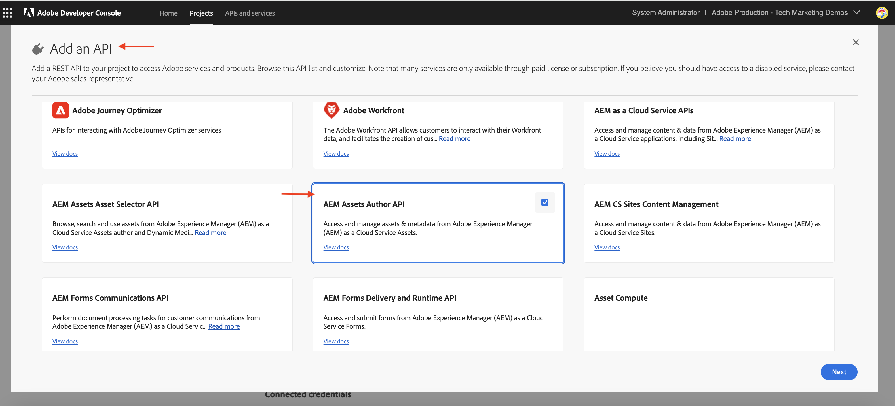

# Eventos do AEM Assets para integração do PIM

>[!IMPORTANT]
>
>Este tutorial usa APIs experimentais do AEM as a Cloud Service. Para obter acesso a essas APIs, você deve aceitar um contrato de software de pré-lançamento e ter essas APIs habilitadas manualmente para o seu ambiente pela engenharia de Adobe. Para solicitar acesso, entre em contato com o suporte do Adobe.

Saiba como integrar o AEM Assets a um sistema de terceiros, como um sistema de Gerenciamento de Informações de Produto (PIM) ou de Gerenciamento de Linha de Produto (PLM), para atualizar metadados de ativos **usando eventos nativos de AEM IO**. Ao receber um evento do AEM Assets, os metadados do ativo podem ser atualizados no AEM, no PIM ou em ambos os sistemas, com base nos requisitos comerciais. No entanto, este exemplo demonstra a atualização dos metadados do ativo no AEM.

>[!VIDEO](https://video.tv.adobe.com/v/3427592?quality=12&learn=on)

Para executar a atualização de metadados de ativos **código fora do AEM**, o [Adobe I/O Runtime](https://developer.adobe.com/runtime/docs/guides/overview/what_is_runtime/), é usada uma plataforma sem servidor.

O fluxo de processamento de eventos é o seguinte:


1. O serviço de Autor do AEM aciona um evento _Processamento de ativos concluído_ quando o carregamento de um ativo é concluído e todas as atividades de processamento de ativos são concluídas. Aguardar a conclusão do processamento garante que qualquer processamento pronto para uso, como extração de metadados, tenha sido concluído.
1. O evento é enviado para o serviço [Adobe I/O Events](https://developer.adobe.com/events/).
1. O serviço de Eventos Adobe I/O passa o evento para a [Ação do Adobe I/O Runtime](https://developer.adobe.com/runtime/docs/guides/using/creating_actions/) para processamento.
1. A Ação do Adobe I/O Runtime chama a API do sistema PIM para recuperar metadados adicionais, como SKU, informações do fornecedor ou outros detalhes.
1. Os metadados adicionais recuperados do PIM são atualizados no AEM Assets usando a [API do Assets Author](https://developer.adobe.com/experience-cloud/experience-manager-apis/api/experimental/assets/author/).

## Pré-requisitos

Para concluir este tutorial, você precisa:

- Ambiente AEM as a Cloud Service com [evento AEM habilitado](https://developer.adobe.com/experience-cloud/experience-manager-apis/guides/events/#enable-aem-events-on-your-aem-cloud-service-environment). Além disso, o projeto [WKND Sites](https://github.com/adobe/aem-guides-wknd?#aem-wknd-sites-project) de amostra deve ser implantado nele.

- Acesso ao [Adobe Developer Console](https://developer.adobe.com/developer-console/docs/guides/getting-started/).

- [Adobe Developer CLI](https://developer.adobe.com/runtime/docs/guides/tools/cli_install/) instalada no computador local.

## Etapas de desenvolvimento

As etapas de desenvolvimento de alto nível são:

1. [Criar um projeto no Adobe Developer Console (ADC)](./runtime-action.md#Create-project-in-Adobe-Developer-Console)
1. [Inicializar o projeto para desenvolvimento local](./runtime-action.md#initialize-project-for-local-development)
1. Configurar o projeto no ADC
1. Configurar o serviço do autor do AEM para habilitar a comunicação do projeto ADC
1. Desenvolver uma ação de tempo de execução que orquestre a recuperação e a atualização de metadados
1. Faça upload de um ativo para o serviço de Autor do AEM e verifique se os metadados foram atualizados

Para obter detalhes sobre as etapas 1 a 2, consulte o exemplo [Ação do Adobe I/O Runtime e Eventos AEM](./runtime-action.md#), e para as etapas 3 a 6, consulte as seguintes seções.

### Configurar o projeto no Adobe Developer Console (ADC)

Para receber Eventos do AEM Assets e executar a Ação do Adobe I/O Runtime criada na etapa anterior, configure o projeto no ADC.

- No ADC, navegue até o [projeto](https://developer.adobe.com/console/projects). Selecione o espaço de trabalho `Stage`. Foi aqui que a ação de tempo de execução foi implantada.

- Clique no botão **Adicionar Serviço** e selecione a opção **Evento**. Na caixa de diálogo **Adicionar eventos**, selecione **Experience Cloud** > **AEM Assets** e clique em **Avançar**. Siga as etapas de configuração adicionais, selecione a instância do AEM, o evento _Processamento de ativos concluído_, o tipo de autenticação de servidor para servidor OAuth e outros detalhes.

  

- Finalmente, na etapa **Como receber eventos**, expanda a opção **Ação em tempo de execução** e selecione a ação _genérica_ criada na etapa anterior. Clique em **Salvar eventos configurados**.

  

- Da mesma forma, clique no botão **Adicionar serviço** e selecione a opção **API**. No modal **Adicionar uma API**, selecione **Experience Cloud** > **API do AEM as a Cloud Service** e clique em **Avançar**.

  

- Em seguida, selecione **OAuth Server-to-Server** para o tipo de autenticação e clique em **Próximo**.

- Em seguida, selecione o perfil de produto **Administradores do AEM-XXX** e clique em **Salvar API configurada**. Para atualizar o ativo em questão, o perfil de produto selecionado deve estar associado ao ambiente do AEM Assets do qual o evento está sendo produzido e ter acesso suficiente para atualizar os ativos lá.

  

### Configurar o serviço do autor no AEM para habilitar a comunicação do projeto ADC

Para atualizar os metadados do ativo no AEM do projeto ADC acima, configure o serviço do autor do AEM com a ID do cliente do projeto ADC. A _ID do cliente_ é adicionada como variável de ambiente usando a interface do usuário do [Adobe Cloud Manager](https://experienceleague.adobe.com/docs/experience-manager-cloud-service/content/implementing/using-cloud-manager/environment-variables.html#add-variables).

- Faça logon no [Adobe Cloud Manager](https://my.cloudmanager.adobe.com/), selecione a guia **Programa** > **Ambiente** > **Reticências** > **Exibir Detalhes** > **Configuração**.

  

- Em seguida, **Adicione o botão Configuração** e insira os detalhes da variável como

  | Nome | Valor | Serviço de AEM | Tipo |
  | ----------- | ----------- | ----------- | ----------- |
  | ADOBE_PROVIDED_CLIENT_ID | &lt;COPY_FROM_ADC_PROJECT_CREDENTIALS> | Autor | Variável |

  

- Clique em **Adicionar** e **Salvar** a configuração.

### Desenvolver ação em tempo de execução

Para executar a recuperação e atualização de metadados, comece atualizando o código de ação _genérico_ criado automaticamente na pasta `src/dx-excshell-1/actions/generic`.

Consulte o arquivo [WKND-Assets-PIM-Integration.zip](../assets/examples/assets-pim-integration/WKND-Assets-PIM-Integration.zip) anexado para obter o código completo, e a seção abaixo destaca os arquivos principais.

- O arquivo `src/dx-excshell-1/actions/generic/mockPIMCommunicator.js` faz o mascaramento da chamada da API do PIM para recuperar metadados adicionais como SKU e nome do fornecedor. Este arquivo é usado para fins de demonstração. Depois que o fluxo de ponta a ponta estiver funcionando, substitua essa função por uma chamada para o sistema PIM real para recuperar metadados do ativo.

  ```javascript
  /**
   * Mock PIM API to get the product data such as SKU, Supplier, etc.
   *
   * In a real-world scenario, this function would call the PIM API to get the product data.
   * For this example, we are returning mock data.
   *
   * @param {string} assetId - The assetId to get the product data.
   */
  module.exports = {
      async getPIMData(assetId) {
          if (!assetId) {
          throw new Error('Invalid assetId');
          }
          // Mock response data for demo purposes
          const data = {
          SKUID: 'MockSKU 123',
          SupplierName: 'mock-supplier',
          // ... other product data
          };
          return data;
      },
  };
  ```

- O arquivo `src/dx-excshell-1/actions/generic/aemCommunicator.js` atualiza os metadados do ativo no AEM usando a [API do Assets Author](https://developer.adobe.com/experience-cloud/experience-manager-apis/api/experimental/assets/author/).

  ```javascript
  const fetch = require('node-fetch');
  
  ...
  
  /**
  *  Get IMS Access Token using Client Credentials Flow
  *
  * @param {*} clientId - IMS Client ID from ADC project's OAuth Server-to-Server Integration
  * @param {*} clientSecret - IMS Client Secret from ADC project's OAuth Server-to-Server Integration
  * @param {*} scopes - IMS Meta Scopes from ADC project's OAuth Server-to-Server Integration as comma separated strings
  * @returns {string} - Returns the IMS Access Token
  */
  async function getIMSAccessToken(clientId, clientSecret, scopes) {
    const adobeIMSV3TokenEndpointURL = 'https://ims-na1.adobelogin.com/ims/token/v3';
  
    const options = {
      method: 'POST',
      headers: {
        'Content-Type': 'application/x-www-form-urlencoded',
      },
      body: `grant_type=client_credentials&client_id=${clientId}&client_secret=${clientSecret}&scope=${scopes}`,
    };
  
    const response = await fetch(adobeIMSV3TokenEndpointURL, options);
    const responseJSON = await response.json();
  
    return responseJSON.access_token;
  }    
  
  async function updateAEMAssetMetadata(metadataDetails, aemAssetEvent, params) {
    ...
    // Transform the metadata details to JSON Patch format,
    // see https://developer.adobe.com/experience-cloud/experience-manager-apis/api/experimental/assets/author/#operation/patchAssetMetadata
    const transformedMetadata = Object.keys(metadataDetails).map((key) => ({
      op: 'add',
      path: `wknd-${key.toLowerCase()}`,
      value: metadataDetails[key],
    }));
  
    ...
  
    // Get ADC project's OAuth Server-to-Server Integration credentials
    const clientId = params.ADC_CECREDENTIALS_CLIENTID;
    const clientSecret = params.ADC_CECREDENTIALS_CLIENTSECRET;
    const scopes = params.ADC_CECREDENTIALS_METASCOPES;
  
    // Get IMS Access Token using Client Credentials Flow
    const access_token = await getIMSAccessToken(clientId, clientSecret, scopes);
  
    // Call AEM Author service to update the metadata using Assets Author API
    // See https://developer.adobe.com/experience-cloud/experience-manager-apis/api/experimental/assets/author/
    const res = await fetch(`${aemAuthorHost}/adobe/assets/${assetId}/metadata`, {
      method: 'PATCH',
      headers: {
        'Content-Type': 'application/json-patch+json',
        'If-Match': '*',
        'X-Adobe-Accept-Experimental': '1',
        'X-Api-Key': 'aem-assets-management-api', // temporary value
        Authorization: `Bearer ${access_token}`,
      },
      body: JSON.stringify(transformedMetadata),
    });
  
    ...
  }
  
  module.exports = { updateAEMAssetMetadata };
  ```

  O arquivo `.env` armazena os detalhes das credenciais de Servidor para Servidor OAuth do projeto ADC, e eles são passados como parâmetros para a ação usando o arquivo `ext.config.yaml`. Consulte os [Arquivos de Configuração do App Builder](https://developer.adobe.com/app-builder/docs/guides/configuration/) para gerenciar segredos e parâmetros de ação.

- A pasta `src/dx-excshell-1/actions/model` contém arquivos `aemAssetEvent.js` e `errors.js`, que são usados pela ação para analisar o evento recebido e manipular erros, respectivamente.

- O arquivo `src/dx-excshell-1/actions/generic/index.js` usa os módulos mencionados anteriormente para orquestrar a recuperação e atualização de metadados.

  ```javascript
  ...
  
  let responseMsg;
  // handle the challenge probe request, they are sent by I/O to verify the action is valid
  if (params.challenge) {
    logger.info('Challenge probe request detected');
    responseMsg = JSON.stringify({ challenge: params.challenge });
  } else {
    logger.info('AEM Asset Event request received');
  
    // create AEM Asset Event object from request parameters
    const aemAssetEvent = new AEMAssetEvent(params);
  
    // Call mock PIM API to get the product data such as SKU, Supplier, etc.
    const mockPIMData = await mockPIMAPI.getPIMData(
      aemAssetEvent.getAssetName(),
    );
    logger.info('Mock PIM API response', mockPIMData);
  
    // Update PIM received data in AEM as Asset metadata
    const aemUpdateStatus = await updateAEMAssetMetadata(
      mockPIMData,
      aemAssetEvent,
      params,
    );
    logger.info('AEM Asset metadata update status', aemUpdateStatus);
  
    if (aemUpdateStatus) {
      // create response message
      responseMsg = JSON.stringify({
        message:
          'AEM Asset Event processed successfully, updated the asset metadata with PIM data.',
        assetdata: {
          assetName: aemAssetEvent.getAssetName(),
          assetPath: aemAssetEvent.getAssetPath(),
          assetId: aemAssetEvent.getAssetId(),
          aemHost: aemAssetEvent.getAEMHost(),
          pimdata: mockPIMData,
        },
      });
    } 
  
    // response object
    const response = {
      statusCode: 200,
      body: responseMsg,
    };
  
    // Return the response to the caller
    return response;
  
    ...
  }
  ```

Implante a ação atualizada no Adobe I/O Runtime usando o seguinte comando:

```bash
$ aio app deploy
```

### Upload de ativos e verificação de metadados

Para verificar a integração do AEM Assets e do PIM, siga estas etapas:

- Para exibir os metadados fornecidos pelo PIM modelo, como SKU e Nome do Fornecedor, crie o esquema de metadados no AEM Assets. Consulte [Esquema de metadados](https://experienceleague.adobe.com/docs/experience-manager-learn/assets/configuring/metadata-schemas.html) que exibe as propriedades de metadados do SKU e do nome do fornecedor.

- Carregue um ativo no serviço do autor do AEM e verifique a atualização dos metadados.

  

## Conceito e principais pontos

A sincronização de metadados de ativos entre o AEM e outros sistemas, como o PIM, geralmente é necessária na empresa. O uso do evento AEM desses requisitos pode ser obtido.

- O código de recuperação de metadados de ativos é executado fora do AEM, evitando a carga no serviço de Autor AEM, portanto, uma arquitetura orientada por eventos que é dimensionada de forma independente.
- A recém-introduzida API do autor do Assets é usada para atualizar os metadados de ativos no AEM.
- A autenticação de API usa OAuth de servidor para servidor (também conhecido como fluxo de credenciais de cliente). Consulte o [guia de implementação de credenciais de servidor para servidor do OAuth](https://developer.adobe.com/developer-console/docs/guides/authentication/ServerToServerAuthentication/implementation/).
- Em vez de Ações do Adobe I/O Runtime, outros webhooks ou o Amazon EventBridge podem ser usados para receber o evento do AEM Assets e processar a atualização de metadados.
- Os eventos de ativos por meio do evento AEM capacitam as empresas a automatizar e simplificar processos críticos, promovendo a eficiência e a coerência em todo o ecossistema de conteúdo.
