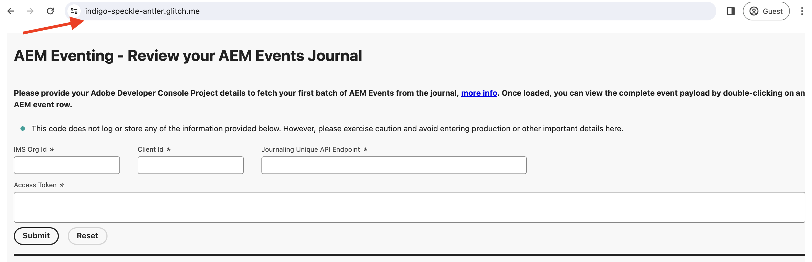

# Eventos de registro e AEM

Saiba como recuperar o conjunto inicial de eventos AEM do journal e explorar os detalhes sobre cada evento.

>[!VIDEO](https://video.tv.adobe.com/v/3427052?quality=12&learn=on)

O registro em log é um método de recebimento para consumir Eventos AEM, e um registro em log é uma lista ordenada de eventos. Usando a API de registro de eventos Adobe I/O, você pode buscar os eventos AEM no registro e processá-los no aplicativo. Essa abordagem permite gerenciar eventos com base em uma cadência especificada e processá-los com eficiência em massa. Consulte a [Registro em log](https://developer.adobe.com/events/docs/guides/journaling_intro/) para obter insights detalhados, incluindo considerações essenciais, como períodos de retenção, paginação e muito mais.

No projeto do Adobe Developer Console, cada registro de evento é ativado automaticamente para registro, permitindo uma integração perfeita.

Neste exemplo, utilizar uma variável fornecida por Adobe _aplicativo web hospedado_ O permite buscar o primeiro lote de eventos AEM do journal sem a necessidade de configurar o aplicativo. Este aplicativo web fornecido pelo Adobe está hospedado em [Falha](https://glitch.com/), uma plataforma conhecida por oferecer um ambiente baseado na Web, propício à criação e à implantação de aplicativos da Web. No entanto, a opção de usar seu próprio aplicativo também está disponível, se preferir.

## Pré-requisitos

Para concluir este tutorial, você precisa:

- Ambiente as a Cloud Service AEM com [Evento AEM ativado](https://developer.adobe.com/experience-cloud/experience-manager-apis/guides/events/#enable-aem-events-on-your-aem-cloud-service-environment).

- [Projeto do console do Adobe Developer configurado para eventos AEM](https://developer.adobe.com/experience-cloud/experience-manager-apis/guides/events/#how-to-subscribe-to-aem-events-in-the-adobe-developer-console).

## Acessar aplicativo web

Para acessar o aplicativo web fornecido pelo Adobe, siga estas etapas:

- Verifique se você pode acessar o [Falha - aplicativo Web hospedado](https://indigo-speckle-antler.glitch.me/) em uma nova guia do navegador.

  

## Coletar detalhes do projeto do console do Adobe Developer

Para buscar os eventos AEM no journal, credenciais como _IMS Organization ID_, _ID do cliente_, e _Token de acesso_ são obrigatórios. Para coletar essas credenciais, siga estas etapas:

- No [Console do Adobe Developer](https://developer.adobe.com), navegue até o projeto e clique em para abri-lo.

- No **Credenciais** clique na guia **Servidor OAuth para servidor** link para abrir a **Detalhes das credenciais** guia.

- Clique em **Gerar token de acesso** botão para gerar o token de acesso.

  

- Copie o **Token de acesso gerado**, **ID DO CLIENTE**, e **ID DA ORGANIZAÇÃO**. Você precisa deles mais tarde neste tutorial.

  

- Cada registro de evento é ativado automaticamente para registro em log. Para obter a _ponto de acesso exclusivo da API de registro em diário_ do seu registro de evento, clique no cartão de evento que está inscrito no evento AEM. No **Detalhes do registro** , copie o **PONTO DE EXTREMIDADE DE API EXCLUSIVA DE REGISTRO EM DIÁRIO**.

  

## Carregar diário de eventos AEM

Para simplificar, essa aplicação Web hospedada busca somente o primeiro lote de eventos AEM no journal. Esses são os eventos mais antigos disponíveis no journal. Para obter mais detalhes, consulte [primeiro lote de eventos](https://developer.adobe.com/events/docs/guides/api/journaling_api/#fetching-your-first-batch-of-events-from-the-journal).

- No [Falha - aplicativo Web hospedado](https://indigo-speckle-antler.glitch.me/), insira o **IMS Organization ID**, **ID do cliente**, e **Token de acesso** copiado anteriormente do projeto do Console do Adobe Developer e clique em **Enviar**.

- Após o sucesso, o componente de tabela exibe os dados do diário de eventos AEM.

  

- Para exibir a carga útil completa do evento, clique duas vezes na linha. Você pode ver que os detalhes do evento AEM têm todas as informações necessárias para processar o evento no webhook. Por exemplo, o tipo de evento (`type`), fonte do evento (`source`), id de evento (`event_id`), hora do evento (`time`) e dados do evento (`data`).

  

## Recursos adicionais

- [Código de origem do webhook com falha](https://glitch.com/edit/#!/indigo-speckle-antler) O está disponível para referência. É um aplicativo simples do React que usa [Espectro de Reação Adobe](https://react-spectrum.adobe.com/react-spectrum/index.html) componentes para renderizar a interface.

- [API de registro de eventos Adobe I/O](https://developer.adobe.com/events/docs/guides/api/journaling_api/) O fornece informações detalhadas sobre a API, como primeiro, próximo e último lote de eventos, paginação e muito mais.
