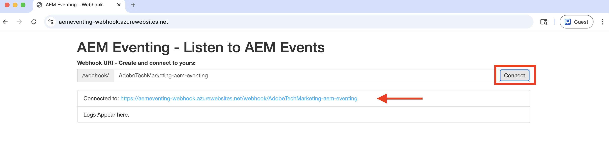

# Webhooks e eventos do AEM

Saiba como receber eventos do AEM em um webhook e revisar os detalhes do evento, como carga, cabeçalhos e metadados.


>[!VIDEO](https://video.tv.adobe.com/v/3427051?quality=12&learn=on)


>[!IMPORTANT]
>
>O vídeo faz referência a um endpoint de webhook hospedado por falha. Como o Glitch descontinuou seu serviço de hospedagem, o webhook foi migrado para o Serviço de Aplicativo do Azure.
>
>A funcionalidade permanece a mesma — somente a plataforma de hospedagem foi alterada.


Em vez de usar o webhook de amostra fornecido pela Adobe, você também pode usar seu próprio endpoint de webhook para receber Eventos da AEM.

## Pré-requisitos

Para concluir este tutorial, você precisa:

- Ambiente AEM as a Cloud Service com [Evento AEM habilitado](https://developer.adobe.com/experience-cloud/experience-manager-apis/guides/events/#enable-aem-events-on-your-aem-cloud-service-environment).

- [Projeto do Adobe Developer Console configurado para AEM Events](https://developer.adobe.com/experience-cloud/experience-manager-apis/guides/events/#how-to-subscribe-to-aem-events-in-the-adobe-developer-console).


## Acessar webhook

Para acessar o webhook de amostra fornecido pelo Adobe, siga estas etapas:

- Verifique se você pode acessar o [webhook de amostra](https://aemeventing-webhook.azurewebsites.net/) fornecido pela Adobe em uma nova guia do navegador.

  

- Digite um nome exclusivo para o seu webhook, por exemplo `<YOUR_PETS_NAME>-aem-eventing` e clique em **Conectar**. Você deve ver a mensagem `Connected to: ${YOUR-WEBHOOK-URL}` aparecendo na tela.

  

- Anote a **URL do Webhook**. Você precisa disso mais tarde neste tutorial.

## Configurar webhook no projeto do Adobe Developer Console

Para receber Eventos do AEM no URL do webhook acima, siga estas etapas:

- Na [Adobe Developer Console](https://developer.adobe.com), navegue até o projeto e clique em para abri-lo.

- Na seção **Produtos e serviços**, clique nas reticências `...` ao lado do cartão de eventos desejado que deve enviar eventos do AEM para o webhook e selecione **Editar**.

  

- Na caixa de diálogo **Configurar registro de evento** recém-aberta, clique em **Avançar** para prosseguir para a etapa **Como receber eventos**.

  

- Na etapa **Como receber eventos**, selecione a opção **Webhook** e cole a **URL do Webhook** copiada anteriormente do webhook de amostra fornecido pela Adobe e clique em **Salvar eventos configurados**.

  

- Na página de webhook de amostra fornecida pela Adobe, você deve ver uma solicitação do GET. Trata-se de uma solicitação de desafio enviada pela Adobe I/O Events para verificar o URL do webhook.

  


## Acionar eventos do AEM

Para acionar eventos do AEM a partir do ambiente do AEM as a Cloud Service que foi registrado no projeto do Adobe Developer Console acima, siga estas etapas:

- Acesse e faça logon no ambiente de criação do AEM as a Cloud Service via [Cloud Manager](https://my.cloudmanager.adobe.com/).

- Dependendo dos seus **Eventos nos quais você se inscreveu**, crie, atualize, exclua, publique ou cancele a publicação de um Fragmento de conteúdo.

## Revisar detalhes do evento

Depois de concluir as etapas acima, você deve ver os Eventos da AEM sendo entregues ao webhook. Procure a solicitação POST na página de webhook de amostra fornecida pela Adobe.


Estes são os principais detalhes da solicitação POST:

- caminho: `/webhook/${YOUR-WEBHOOK-URL}`, por exemplo `/webhook/AdobeTM-aem-eventing`

- cabeçalhos: cabeçalhos de solicitação enviados pela Adobe I/O Events, por exemplo:

```json
{
  "host": "aemeventing-webhook.azurewebsites.net",
  "user-agent": "Adobe/1.0",
  "accept-encoding": "deflate,compress,identity",
  "max-forwards": "10",
  "x-adobe-public-key2-path": "/prod/keys/pub-key-kruhWwu4Or.pem",
  "x-adobe-delivery-id": "25c36f70-9238-4e4c-b1d8-4d9a592fed9d",
  "x-adobe-provider": "aemsites_7ABB3E6A5A7491460A495D61@AdobeOrg_acct-aem-p63947-e1249010@adobe.com",
  "x-adobe-public-key1-path": "/prod/keys/pub-key-lyTiz3gQe4.pem",
  "x-adobe-event-id": "b555a1b1-935b-4541-b410-1915775338b5",
  "x-adobe-event-code": "aem.sites.contentFragment.modified",
  "x-adobe-digital-signature-2": "Lvw8+txbQif/omgOamJXJaJdJMLDH5BmPA+/RRLhKG2LZJYWKiomAE9DqKhM349F8QMdDq6FXJI0vJGdk0FGYQa6JMrU+LK+1fGhBpO98LaJOdvfUQGG/6vq8/uJlcaQ66tuVu1xwH232VwrQOKdcobE9Pztm6UX0J11Uc7vtoojUzsuekclKEDTQx5vwBIYK12bXTI9yLRsv0unBZfNRrV0O4N7KA9SRJFIefn7hZdxyYy7IjMdsoswG36E/sDOgcnW3FVM+rhuyWEizOd2AiqgeZudBKAj8ZPptv+6rZQSABbG4imOa5C3t85N6JOwffAAzP6qs7ghRID89OZwCg==",
  "x-adobe-digital-signature-1": "ZQywLY1Gp/MC/sXzxMvnevhnai3ZG/GaO4ThSGINIpiA/RM47ssAw99KDCy1loxQyovllEmN0ifAwfErQGwDa5cuJYEoreX83+CxqvccSMYUPb5JNDrBkG6W0CmJg6xMeFeo8aoFbePvRkkDOHdz6nT0kgJ70x6mMKgCBM+oUHWG13MVU3YOmU92CJTzn4hiSK8o91/f2aIdfIui/FDp8U20cSKKMWpCu25gMmESorJehe4HVqxLgRwKJHLTqQyw6Ltwy2PdE0guTAYjhDq6AUd/8Fo0ORCY+PsS/lNxim9E9vTRHS7TmRuHf7dpkyFwNZA6Au4GWHHS87mZSHNnow==",
  "x-arr-log-id": "881073f0-7185-4812-9f17-4db69faf2b68",
  "client-ip": "52.37.214.82:46066",
  "disguised-host": "aemeventing-webhook.azurewebsites.net",
  "x-site-deployment-id": "aemeventing-webhook",
  "was-default-hostname": "aemeventing-webhook.azurewebsites.net",
  "x-forwarded-proto": "https",
  "x-appservice-proto": "https",
  "x-arr-ssl": "2048|256|CN=Microsoft Azure RSA TLS Issuing CA 03, O=Microsoft Corporation, C=US|CN=*.azurewebsites.net, O=Microsoft Corporation, L=Redmond, S=WA, C=US",
  "x-forwarded-tlsversion": "1.3",
  "x-forwarded-for": "52.37.214.82:46066",
  "x-original-url": "/webhook/AdobeTechMarketing-aem-eventing",
  "x-waws-unencoded-url": "/webhook/AdobeTechMarketing-aem-eventing",
  "x-client-ip": "52.37.214.82",
  "x-client-port": "46066",
  "content-type": "application/cloudevents+json; charset=UTF-8",
  "content-length": "1178"
}
```

- body/payload: corpo da solicitação enviado pela Adobe I/O Events, por exemplo:

```json
{
  "specversion": "1.0",
  "id": "83b0eac0-56d6-4499-afa6-4dc58ff6ac7f",
  "source": "acct:aem-p63947-e1249010@adobe.com",
  "type": "aem.sites.contentFragment.modified",
  "datacontenttype": "application/json",
  "dataschema": "https://ns.adobe.com/xdm/aem/sites/events/content-fragment-modified.json",
  "time": "2025-07-24T13:53:23.994109827Z",
  "eventid": "b555a1b1-935b-4541-b410-1915775338b5",
  "event_id": "b555a1b1-935b-4541-b410-1915775338b5",
  "recipient_client_id": "606d4074c7ea4962aaf3bc2a5ac3b7f9",
  "recipientclientid": "606d4074c7ea4962aaf3bc2a5ac3b7f9",
  "data": {
    "user": {
      "imsUserId": "ims-933E1F8A631CAA0F0A495E53@80761f6e631c0c7d495fb3.e",
      "principalId": "xx@adobe.com",
      "displayName": "Sachin Mali"
    },
    "path": "/content/dam/wknd-shared/en/adventures/beervana-portland/beervana-in-portland",
    "sourceUrl": "https://author-p63947-e1249010.adobeaemcloud.com",
    "model": {
      "id": "L2NvbmYvd2tuZC1zaGFyZWQvc2V0dGluZ3MvZGFtL2NmbS9tb2RlbHMvYWR2ZW50dXJl",
      "path": "/conf/wknd-shared/settings/dam/cfm/models/adventure"
    },
    "id": "9e1e9835-64c8-42dc-9d36-fbd59e28f753",
    "tags": [
      "wknd-shared:region/nam/united-states",
      "wknd-shared:activity/social",
      "wknd-shared:season/fall"
    ],
    "properties": [
      {
        "name": "price",
        "changeType": "modified"
      }
    ]
  }
}
```

Você pode ver que os detalhes do evento do AEM têm todas as informações necessárias para processar o evento no webhook. Por exemplo, o tipo de evento (`type`), a origem do evento (`source`), a ID do evento (`event_id`), a hora do evento (`time`) e os dados do evento (`data`).

## Recursos adicionais

- O código-fonte do [Webhook de eventos do AEM](../assets/examples/webhook/aemeventing-webhook.tgz) está disponível para sua referência.
