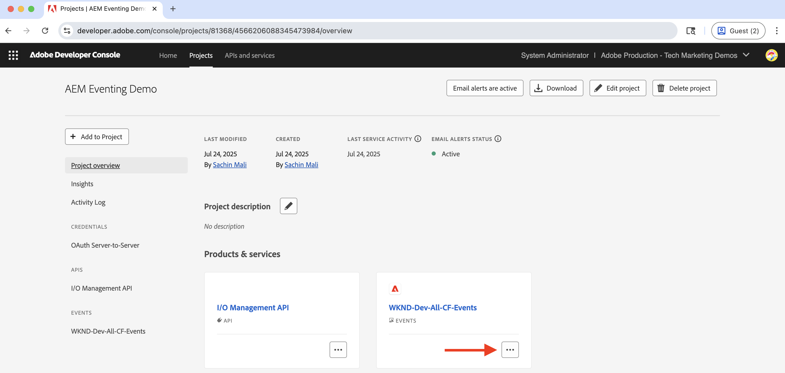

# Webhooks e eventos do AEM

Saiba como receber eventos do AEM em um webhook e revisar os detalhes do evento, como carga, cabeçalhos e metadados.


>[!VIDEO](https://video.tv.adobe.com/v/3427051?quality=12&learn=on)


>[!IMPORTANT]
>
>Os pontos de extremidade de demonstração ao vivo deste tutorial foram hospedados anteriormente em [Falha](https://glitch.com/). A partir de julho de 2025, o Glitch descontinuou seu serviço de hospedagem e os endpoints não estão mais acessíveis.
>>Estamos trabalhando ativamente na migração das demonstrações para uma plataforma alternativa. O conteúdo do tutorial permanece preciso e os links atualizados serão fornecidos em breve.
>>Obrigado por sua compreensão e paciência.

Use seu próprio webhook até que os endpoints de demonstração ao vivo estejam disponíveis novamente.

## Pré-requisitos

Para concluir este tutorial, você precisa:

- Ambiente AEM as a Cloud Service com [Evento AEM habilitado](https://developer.adobe.com/experience-cloud/experience-manager-apis/guides/events/#enable-aem-events-on-your-aem-cloud-service-environment).

- [Projeto do Adobe Developer Console configurado para AEM Events](https://developer.adobe.com/experience-cloud/experience-manager-apis/guides/events/#how-to-subscribe-to-aem-events-in-the-adobe-developer-console).


## Acessar webhook

Para acessar o webhook fornecido pela Adobe, siga estas etapas:

- Verifique se você pode acessar o [Falha - webhook hospedado](https://lovely-ancient-coaster.glitch.me/) em uma nova guia do navegador.

  

- Digite um nome exclusivo para o seu webhook, por exemplo `<YOUR_PETS_NAME>-aem-eventing` e clique em **Conectar**. Você deve ver a mensagem `Connected to: ${YOUR-WEBHOOK-URL}` aparecendo na tela.

  

- Anote a **URL do Webhook**. Você precisa disso mais tarde neste tutorial.

## Configurar webhook no projeto do Adobe Developer Console

Para receber Eventos do AEM no URL do webhook acima, siga estas etapas:

- Na [Adobe Developer Console](https://developer.adobe.com), navegue até o projeto e clique em para abri-lo.

- Na seção **Produtos e serviços**, clique nas reticências `...` ao lado do cartão de eventos desejado que deve enviar eventos do AEM para o webhook e selecione **Editar**.

  

- Na caixa de diálogo **Configurar registro de evento** recém-aberta, clique em **Avançar** para prosseguir para a etapa **Como receber eventos**.

  

- Na etapa **Como receber eventos**, selecione a opção **Webhook** e cole a **URL do Webhook** copiada anteriormente do webhook hospedado por Falha e clique em **Salvar eventos configurados**.

  

- Na página do webook Glitch, você deve ver uma solicitação do GET, é uma solicitação de desafio enviada pelo Adobe I/O Events para verificar o URL do webhook.

  


## Acionar eventos do AEM

Para acionar eventos do AEM a partir do ambiente do AEM as a Cloud Service que foi registrado no projeto do Adobe Developer Console acima, siga estas etapas:

- Acesse e faça logon no ambiente de criação do AEM as a Cloud Service via [Cloud Manager](https://my.cloudmanager.adobe.com/).

- Dependendo dos seus **Eventos nos quais você se inscreveu**, crie, atualize, exclua, publique ou cancele a publicação de um Fragmento de conteúdo.

## Revisar detalhes do evento

Depois de concluir as etapas acima, você deve ver os Eventos da AEM sendo entregues ao webhook. Procure a solicitação POST na página do webhook Falha.


Estes são os principais detalhes da solicitação POST:

- caminho: `/webhook/${YOUR-WEBHOOK-URL}`, por exemplo `/webhook/AdobeTM-aem-eventing`

- cabeçalhos: cabeçalhos de solicitação enviados pela Adobe I/O Events, por exemplo:

```json
{
"connection": "close",
"x-forwarded-for": "34.205.178.127,::ffff:10.10.10.136,::ffff:10.10.84.114",
"x-forwarded-proto": "https,http,http",
"x-forwarded-port": "443,80,80",
"host": "lovely-ancient-coaster.glitch.me",
"content-length": "826",
"x-adobe-public-key2-path": "/prod/keys/pub-key-IkpzhSpTw0.pem",
"x-adobe-delivery-id": "18abfb47-d24a-4684-ade8-f442a3444033",
"x-adobe-provider": "aemsites_7ABB3E6A5A7491460A495D61@AdobeOrg_acct-aem-p46652-e1074060@adobe.com",
"x-adobe-public-key1-path": "/prod/keys/pub-key-Ptc2pD9vT9.pem",
"x-adobe-event-id": "a0f3fb7d-b02c-4612-aac6-e472b80af793",
"x-adobe-event-code": "aem.sites.contentFragment.modified",
"user-agent": "Adobe/1.0",
"x-adobe-digital-signature-2": "zGLso15+6PV6X6763/x6WqgxDlEXpkv5ty8q4njaq3aUngAI9VCcYonbScEjljRluzjZ05uMJmRfNxwjj60syxEJPuc0dpmMU635gfna7I4T7IaHs496wx4m2E5mvCM+aKbNQ+NPOutyTqI8Ovq29P2P87GIgMlGhAtOaxRVGNc6ksBxc2tCWbrKUhW8hPJ0sHphU499dN4TT32xrZaiRw4akT3M/hYydsA8dcWpJ7S4dpuDS21YyDHAB8s9Dawtr3fyPEyLgZzpwZDfCqQ8gdSCGqKscE4pScwqPkKOYCHDnBvDZVe583jhcZbHGjk7Ncp/FrgQk7avWsk5XlzcuA==",
"x-adobe-digital-signature-1": "QD7THFJ1vmJqD/BatIpzO6+ACQ9cSKPR7XVaW0LI7cN/xs7ucyri6dmkerOPe9EJpjGoqCg8rxWedrIRQB3lgVskChbHH3Ujx5YG0aTQLSd1Lsn5CFbW1U0l0GqId9Cnd6MccrqSznZXcdW1rMFuRk8+gqwabBifSaLbu3r30G5hmqQd72VtiYTE4m23O3jYIMiv62pRP+a+p4NjNj1XG320uRSry+BPniTjDJ6oN/Ng7aUEKML8idZ/ZTqeh/rJSrVO95UryUolFDRwDkRn5zKonbvhSLAeXzaPhvimWUHtldq9M1WTyRMpsBk8BRzaklxlq+woJ2UjYPUIEzjotw==",
"accept-encoding": "deflate,compress,identity",
"content-type": "application/cloudevents+json; charset=UTF-8",
"x-forwarded-host": "lovely-ancient-coaster.glitch.me",
"traceparent": "00-c27558588d994f169186ca6a3c6607d4-a7e7ee36625488d4-01"
}
```

- body/payload: corpo da solicitação enviado pela Adobe I/O Events, por exemplo:

```json
{
  "specversion": "1.0",
  "type": "aem.sites.contentFragment.modified",
  "source": "acct:aem-p46652-e1074060@adobe.com",
  "id": "bf922a49-9db4-4377-baf4-70e96e15c45f",
  "time": "2023-12-12T20:36:43.583228Z",
  "dataschema": "https://ns.adobe.com/xdm/aem/sites/events/content-fragment-modified.json",
  "datacontenttype": "application/json",
  "data": {
    "user": {
      "imsUserId": "933E1F8A631CAA0F0A495E53@80761f6e631c0c7d495fb3.e",
      "principalId": "xxx@adobe.com",
      "displayName": "First LastName",
    },
    "path": "/content/dam/wknd-shared/en/adventures/beervana-portland/beervana-in-portland",
    "model": {
      "id": "/conf/wknd-shared/settings/dam/cfm/models/adventure"
    },
    "id": "9a2d3e6a-efda-4079-a86e-0ef2ede692da",
    "properties": [
      {
        "name": "groupSize",
        "changeType": "modified"
      }
    ]
  },
  "event_id": "a0f3fb7d-b02c-4612-aac6-e472b80af793",
  "recipient_client_id": "f51ea733ba404db299fefbf285dc1c42"
}
```

Você pode ver que os detalhes do evento do AEM têm todas as informações necessárias para processar o evento no webhook. Por exemplo, o tipo de evento (`type`), a origem do evento (`source`), a ID do evento (`event_id`), a hora do evento (`time`) e os dados do evento (`data`).

## Recursos adicionais

- O código-fonte do [Webhook de eventos do AEM](../assets/examples/webhook/aemeventing-webhook.tgz) está disponível para sua referência.
