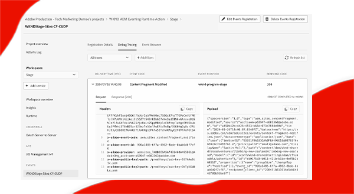

# Evento AEM

Saiba mais sobre eventos de AEM, o que é, por que e quando usá-los e exemplos deles.

>[!VIDEO](https://video.tv.adobe.com/v/3426686?quality=12&learn=on)

## O que é

O AEM Eventing é um sistema de eventos nativo em nuvem que permite assinaturas de eventos AEM para processamento em sistemas externos. Um evento AEM é uma notificação de alteração de estado enviada pelo AEM sempre que uma ação específica ocorre. Por exemplo, isso pode incluir eventos quando um fragmento de conteúdo é criado, atualizado ou excluído.

O diagrama acima visualizou como o AEM as a Cloud Service produz eventos e os envia para os Eventos Adobe I/O, que por sua vez os expõem aos assinantes de eventos.

Em resumo, há três componentes principais:

1. **Provedor de eventos:** AEM as a Cloud Service.
1. **Eventos Adobe I/O:** plataforma de desenvolvedor para integrar, estender e criar aplicativos e experiências com base em produtos e tecnologias do Adobe.
1. **Consumidor de eventos:** sistemas de propriedade do cliente que assinou os Eventos AEM. Por exemplo, um CRM (Customer Relationship Management), PIM (Product Information Management), OMS (Order Management System) ou um aplicativo personalizado.

### Como é diferente

Os [eventos do Apache Sling](https://sling.apache.org/documentation/bundles/apache-sling-eventing-and-job-handling.html), os eventos OSGi e a [observação JCR](https://jackrabbit.apache.org/oak/docs/features/observation.html) oferecem todos os mecanismos para assinar e processar eventos. No entanto, eles são distintos do evento AEM, conforme discutido nesta documentação.

As principais distinções do evento AEM incluem:

- O código do consumidor do evento é executado fora do AEM, não sendo executado na mesma JVM que o AEM.
- O código de produto AEM é responsável por definir os eventos e enviá-los para Eventos Adobe I/O.
- As informações do evento são padronizadas e enviadas no formato JSON. Para obter mais detalhes, consulte [cloudevents](https://cloudevents.io/).
- Para se comunicar de volta ao AEM, o consumidor de eventos usa a API do AEM as a Cloud Service.

## Por que e quando usá-lo

O evento AEM oferece inúmeras vantagens para a arquitetura do sistema e a eficiência operacional. Os principais motivos para usar o evento AEM incluem:

- **Para criar Arquiteturas orientadas por eventos**: facilita a criação de sistemas dispersos que podem ser dimensionados independentemente e são resilientes a falhas.
- **Código baixo e custos operacionais mais baixos**: evita personalizações no AEM, resultando em sistemas mais fáceis de manter e estender, reduzindo assim as despesas operacionais.
- **Simplificar a comunicação entre o AEM e sistemas externos**: elimina conexões ponto a ponto ao permitir que Adobe I/O Eventos gerenciem comunicações, como determinar quais eventos do AEM devem ser entregues a sistemas ou serviços específicos.
- **Maior durabilidade dos eventos**: o Adobe I/O Events é um sistema altamente disponível e escalonável, projetado para lidar com grandes volumes de eventos e entregá-los de forma confiável aos assinantes.
- **Processamento paralelo de eventos**: permite a entrega de eventos para vários assinantes simultaneamente, permitindo o processamento de eventos distribuídos em vários sistemas.
- **Desenvolvimento de aplicativos sem servidor**: oferece suporte à implantação do código de consumidor de eventos como um aplicativo sem servidor, melhorando ainda mais a flexibilidade e escalabilidade do sistema.

### Limitações

O evento AEM, embora poderoso, tem certas limitações a serem consideradas:

- **Disponibilidade restrita ao AEM as a Cloud Service**: atualmente, o evento AEM está disponível exclusivamente para o AEM as a Cloud Service.

- **Tipos de evento disponíveis**: revise a lista atual de tipos de evento disponíveis [aqui](https://developer.adobe.com/experience-cloud/experience-manager-apis/guides/events/#available-event-types).

## Como ativar

Consulte [Habilitar eventos de AEM no ambiente do AEM Cloud Service](https://developer.adobe.com/experience-cloud/experience-manager-apis/guides/events/#enable-aem-events-on-your-aem-cloud-service-environment) para obter as próximas etapas.

## Como se inscrever

Para se inscrever em Eventos AEM, não é necessário gravar nenhum código no AEM, mas um projeto do [Adobe Developer Console](https://developer.adobe.com/) está configurado. O Adobe Developer Console é um gateway para APIs Adobe, SDKs, Eventos, Tempo de execução e App Builder.

Nesse caso, um _projeto_ no Adobe Developer Console permite que você assine eventos emitidos do ambiente do AEM as a Cloud Service e configure a entrega do evento para sistemas externos.

Para obter mais informações, consulte [Como assinar eventos de AEM na Adobe Developer Console](https://developer.adobe.com/experience-cloud/experience-manager-apis/guides/events/#how-to-subscribe-to-aem-events-in-the-adobe-developer-console).

## Como consumir

Existem dois métodos primários para consumo de Eventos AEM: o método _push_ e o método _pull_.

- **Método de push**: nessa abordagem, o consumidor de eventos é notificado proativamente pelos Adobe I/O Events quando um evento se torna disponível. As opções de integração incluem Webhooks, Adobe I/O Runtime e Amazon EventBridge.
- **Método de pull**: aqui, o consumidor de eventos sonda ativamente Eventos Adobe I/O para verificar se há novos eventos. A principal opção de integração para esse método é a API do Adobe Developer Journaling.

Para obter mais informações, consulte [Processamento de eventos AEM via Adobe I/O Events](https://developer.adobe.com/experience-cloud/experience-manager-apis/guides/events/#aem-events-processing-via-adobe-io).

## Exemplos

<table>
  <tr>
    <td>
        
        
<strong><a href="./examples/webhook.md">Receber eventos de AEM em um webhook</a></strong>

        

          Use o webhook fornecido pelo Adobe para receber Eventos AEM e revisar os detalhes do evento.
        

      </td>
      <td>
        
        
<strong><a href="./examples/journaling.md">Carregar diário de Eventos AEM</a></strong>

        

          Use o aplicativo da Web fornecido pelo Adobe para carregar Eventos AEM do journal e revisar os detalhes do evento.
        

      </td>
    </tr>
  <tr>
    <td>
        
        
<strong><a href="./examples/runtime-action.md">Receber Eventos AEM na Ação do Adobe I/O Runtime</a></strong>

        

          Receba eventos de AEM e analise os detalhes do evento.
        

      </td>
      <td>
        
        
<strong><a href="./examples/event-processing-using-runtime-action.md">Processamento de eventos do AEM usando a Ação do Adobe I/O Runtime</a></strong>

        

          Saiba como processar eventos AEM recebidos usando a ação do Adobe I/O Runtime. O processamento do evento inclui o retorno de chamada do AEM, a persistência de dados do evento e sua exibição no SPA.
        

      </td>
  </tr>
  <tr>
    <td>
        
        
<strong><a href="./examples/assets-pim-integration.md">Eventos do AEM Assets para integração com o PIM</a></strong>

        

          Saiba como integrar o AEM Assets e os sistemas de Gerenciamento de informações de produtos (PIM) para atualizações de metadados.
        

      </td>
  </tr> 
</table>
