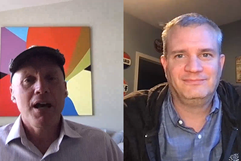

# Cloud 5 temporada 1

## Introdução

Bem-vindo à Cloud série 5 da engenharia AEM. Um dos principais problemas na fase de implementação de qualquer produto é ter amostras de código suficientes e/ou demonstrações em tempo real dessas amostras, ferramentas ou APIs. O objetivo desta série é fornecer informações úteis sobre o AEM as a Cloud Service em 5 minutos ou menos.

Visite a [Caixa de Sugestões](https://forms.office.com/r/74P5Xz4UH0) para enviar ideias sobre tópicos.

## Temporada 1

Cada temporada varia em duração e é lançada em um cronograma fixo. Os tópicos da primeira temporada são impulsionados principalmente por solicitações anteriores que encontramos em nossos envolvimentos diários com clientes e parceiros. Visite esta página para obter atualizações semanais ou siga-nos na rede social de sua escolha.

<table>
  <tr>
   <td>
      
      

         <a href="./cloud5-aem-cdn-part1.md"><strong>Aprofundamento do CDN com AEM (parte 1)</strong></a>         
          <em>com Darin Kuntze e James Talbot, arquitetos de nuvem sênior</em>
      

      

         
         A Parte 1 é uma análise da CDN da AEM as a Cloud Service e de como usá-la na implementação.
      

     </td>   
     <td>
      
      

         <a href="./cloud5-aem-cdn-part2.md"><strong>Aprofundamento do CDN com AEM (parte 2)</strong></a>
          <em>com Darin Kuntze e James Talbot, arquitetos de nuvem sênior</em>
      

      

         
         A Parte 2 é uma continuação de nossa visão da CDN da AEM as a Cloud Service. Respondemos a algumas das perguntas e mitos mais comuns sobre quais recursos você obtém com a nova CDN.
      

   </td>
     <td>
        
      

         <a href="./cloud5-aem-log-files.md"><strong>Arquivos de Log e Log</strong></a>
          <em>com Darin Kuntze e James Talbot, arquitetos de nuvem sênior</em>
      

      

         
         Esta é uma visão rápida de como acessar logs no AEM as a Cloud Service, incluindo como acessá-los por meio da interface do usuário, bem como de APIs.
      

   </td> 
  </tr>
  <tr>
   <td>
        
      

        <a href="./cloud5-getting-login-token-integrations.md"><strong>Integração com tokens de acesso</strong></a>        
          <em>com Darin Kuntze e James Talbot, arquitetos de nuvem sênior</em>
      

      

         
         Uma visão geral e uma demonstração rápidas da interação com tokens de logon para fazer o trabalho de integração nos ambientes do Cloud Service.
      

     </td>   
     <td>
        
      

        <a href="./cloud5-aem-dispatcher-cloud.md"><strong>Dispatcher na nuvem</strong></a>
          <em>com Darin Kuntze e James Talbot, arquitetos de nuvem sênior</em>
      

      

         
        Darin e James discutem sobre o Dispatcher na nuvem de AEM, incluindo algumas práticas recomendadas e diferenças em relação ao AMS/On-Prem. 
      

   </td>
     <td>
        
      

         <a href="./cloud5-aem-content-migration-part-1.md"><strong>Migração (parte 1)</strong></a>
          <em>com Darin Kuntze e James Talbot, arquitetos de nuvem sênior e Dr. Applesmith</em>
      

      

         
         A primeira parte (de duas) de nossas dicas e truques para migrar para a nuvem. Nosso foco principal, na primeira parte, é a prática recomendada e o trabalho preparatório que preparam você para a migração.
      

   </td> 
  </tr>
    <tr>
        <td>
            
            

                <a href="./cloud5-adobe-app-builder.md"><strong>Adobe App Builder</strong></a>         
                <em>com Darin Kuntze e James Talbot, arquitetos de nuvem sênior e Amol Anand</em>
            

            
 
                Confira algumas coisas interessantes que você pode fazer com o Adobe App Builder e saiba mais sobre o futuro das personalizações em nuvem.
            

        </td>
        <td></td>
        <td></td>
    </tr>
</table>
