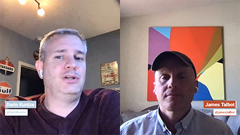

# Cloud 5 temporada 2

>[!VIDEO](https://video.tv.adobe.com/v/346567?quality=12&learn=on)

## Introdução

Bem-vindo à segunda temporada da Cloud 5 Series da AEM Engineering. Um dos principais problemas na fase de implementação de qualquer produto é ter amostras de código suficientes e/ou demonstrações em tempo real dessas amostras, ferramentas ou APIs. O objetivo desta série é fornecer informações úteis sobre o AEM as a Cloud Service em 5 minutos ou menos.

## Caixa de Sugestão

Visite o [Caixa de Sugestão](https://forms.office.com/r/74P5Xz4UH0) para enviar ideias de tópicos.

## Temporada 2

Cada temporada varia em duração e é lançada em um cronograma fixo. Os tópicos da segunda temporada são impulsionados principalmente por solicitações anteriores que encontramos em nossos envolvimentos diários com clientes e parceiros. Visite esta página para obter atualizações semanais ou siga-nos na rede social de sua escolha.

<table>
    <tr>
        <td>
            
            

                <a href="season-2/cloud5-experience-v-content-fragments.md"><strong>Fragmentos</strong></a>        
                 <em>com Darin Kuntze e James Talbot, arquitetos sênior da nuvem</em>
            

            

                 
                Uma visão colorida das diferenças entre fragmentos de experiência e conteúdo. Spoiler: todo mundo ganha.
            

        </td>   
         <td>
            
            

                <a href="season-2/cloud5-repo-modernizer.md"><strong>Modernizador de repositório</strong></a> 
                <em>com Darin Kuntze e James Talbot, arquitetos sênior da nuvem</em>
            

            

                 
                Visão rápida do uso do modernizador de repositório para reestruturar pacotes de projetos existentes para pacotes discretos compatíveis com o AEM as a cloud service.
            

         </td>
         <td>
            
            

                  <a href="season-2/cloud5-admin-console.md"><strong>Admin Console</strong></a>
                <em>com Darin Kuntze e James Talbot, arquitetos sênior da nuvem</em>
            

            

             
               Darin e James discutem algumas coisas comuns que as pessoas devem saber sobre o Admin Console, o provisionamento e o acesso.
            

         </td> 
  </tr>
  <tr>
         <td>
            
            

                  <a href="season-2/cloud5-sling-job-scheduler.md"><strong>Sling Jobs</strong></a>
                <em>com Darin Kuntze e James Talbot, arquitetos sênior da nuvem</em>
            

            

             
               Darin e James discutem as armadilhas e coisas a serem observadas para o agendamento de trabalhos e o consumo de AEM como um serviço na nuvem.
            

         </td> 
         <td>
            
            

                  <a href="season-2/cloud5-repoinit.md"><strong>Inicializador do repositório Sling</strong></a>
                <em>com Darin Kuntze e James Talbot, arquitetos sênior da nuvem</em>
            

            

             
              Aprenda alguns truques para explorar o potencial de usar o Sling Repository Initializer, também conhecido como repoinit.
            

         </td>   
     <td>
            
      

         <a href="season-2/cloud5-fix-your-cache.md"><strong>Corrigir... Cache</strong></a>
          <em>com Damian Langsweirdt e James Talbot, arquitetos seniores da nuvem</em>
      

      

          
             Explore áreas para otimizar o cache e acelerar a execução do site no AEM as a Cloud Service.
      

   </td> 
  </tr>
<tr>
   <td>
           
      

            <a href="season-2/cloud5-fix-your-rewrites.md"><strong>Corrigir... Substitui</strong></a>
          <em>com Darin Kuntze e James Talbot, arquitetos sênior da nuvem</em>
      

      

         
         Visão rápida de coisas que ajudarão a acelerar seu desenvolvimento de reescrita e otimização no AEM as a Cloud Service.
      

     </td>   
     <td>
            
      

            <a href="season-2/cloud5-mocm-experience-audit.md"><strong>Mistérios do Cloud Manager... Auditoria de experiência</strong></a>
          <em>com Darin Kuntze, arquiteto sênior de nuvem</em>
      

      

         
        Explore as noções básicas do Cloud Manager e seus recursos de Auditoria de experiência.
      

   </td>
     <td>
            
      

            <a href="season-2/cloud5-mocm-unit-tests.md"><strong>Mistérios do Cloud Manager... Testes de unidade</strong></a>
          <em>com Darin Kuntze e Bryan Stopp, arquitetos sênior da nuvem</em>
      

      

         
        Darin e Bryan discutem como o Cloud Manager integra a execução de testes de unidade e relatórios de cobertura de código ao pipeline de CI/CD para ajudar a incentivar e promover a prática recomendada de teste de unidade de código AEM.
      

   </td> 
  </tr>
    <tr>
        <td>
               
            

                <a href="season-2/cloud5-mocm-functional-tests.md"><strong>Mistérios do Cloud Manager... Testes funcionais</strong> </a>        
                <em>com Darin Kuntze e Bryan Stopp, arquitetos sênior da nuvem</em>
            

            
 
                Darin e Bryan discutem diferentes tipos de testes funcionais integrados ao processo de implantação as a Cloud Service do AEM para garantir a qualidade e a confiabilidade do seu código.
            

        </td>
        <td></td>
        <td></td>
    </tr>
</table>
