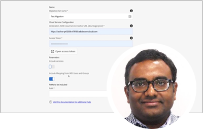

# Série para especialistas da Adobe Experience Manager as a Cloud Service

Saiba mais sobre o Adobe Experience Manager (AEM) as a Cloud Service dos engenheiros especialistas da Adobe que o criaram e da equipe de serviços profissionais que o fornece. Junte-se a especialistas do Adobe para explorar o que é o AEM, como ele é o mesmo e diferente do as a Cloud Service 6 e como migrar do AEM AEM AEM 6 para o as a Cloud Service.

  
 

## Introdução ao AEM as a Cloud Service

Saiba mais sobre os fundamentos do AEM como um Cloud Services e como ele difere do AEM 6, dos arquitetos em nuvem sênior da engenharia Adobe.

<table>
  <tr>
   <td>
      
      

         <a href="../../migration/moving-to-aem-as-a-cloud-service/introduction.md"><strong>Pensar de forma diferente</strong></a>         
          <em>com Darin Kuntze, arquiteto sênior de nuvem</em>
      

      

         
         Uma olhada na arquitetura do AEM as a Cloud Service, e como pensar de forma diferente sobre implementações as a Cloud Service do AEM.
      

     </td>   
     <td>
      
      

         <a href="../../migration/moving-to-aem-as-a-cloud-service/onboarding.md"><strong>Integração com o AEM as a Cloud Service</strong></a>
          <em>com Damian Langsweirdt, arquiteto sênior de nuvem</em>
      

      

         
         Saiba mais sobre a integração com o AEM as a Cloud Service, desde a fase de contrato até a configuração de ambientes de autoatendimento usando o Cloud Manager.
      

   </td>     
   </td>   
     <td>
      
      

         <a href="../../migration/moving-to-aem-as-a-cloud-service/cloud-manager.md"><strong>Cloud Manager para AEM as a Cloud Service</strong></a>
          <em>com Bryan Stopp, arquiteto sênior de nuvem</em>
      

      

         
         Saiba mais sobre o Cloud Manager para AEM as a Cloud Service e suas diferenças com o Cloud Manager para AEM no Adobe Manage Services (AMS).
      

   </td> 
  </tr>
</table>

## Migração para o AEM as a Cloud Service?

Planeia a transição do AEM 6 para o AEM as a Cloud Service? Saiba mais sobre a metodologia Adobe para migrar para o AEM as a Cloud Service, bem como as várias ferramentas e recursos que tornam essa transição suave.

<table>
  <tr>
   <td>
      
      

         <a href="../../migration/moving-to-aem-as-a-cloud-service/bpa-and-cam.md" target="_aem-experts-series-video"><strong>Metodologia de migração</strong></a>
          <em>com Roger Blanton, arquiteto técnico de serviços da Adobe Consulting</em>
      

      

         
        Consulte a metodologia de migração de práticas recomendadas para mudar do AEM 6 para o AEM as a Cloud Service usando o Analisador de práticas recomendadas (BPA) e o Cloud Acceleration Manager (CAM) do AEM.
      

   </td>   
     <td>
      
      

         <a href="../../migration/moving-to-aem-as-a-cloud-service/aem-modernization-tools.md" target="_aem-experts-series-video"><strong>Modernização de conteúdo</strong></a>
          <em>com Bryan Stopp, arquiteto sênior de nuvem</em>
      

      

         
         Saiba como modernizar automaticamente seu conteúdo AEM para aproveitar os recursos mais recentes do AEM as a Cloud Service.
      

   </td>     
   </td>   
     <td>
      
      

         <a href="../../migration/moving-to-aem-as-a-cloud-service/repository-modernization.md" target="_aem-experts-series-video"><strong>Modernizar seu projeto AEM Maven</strong></a>
          <em>com Varun Mitra, arquiteto da nuvem</em>
      

      

         
         Saiba como modernizar automaticamente a estrutura e a organização do projeto Maven do aplicativo AEM personalizado para que ele seja compatível com o AEM as a Cloud Service e se alinhe às práticas recomendadas mais recentes do Adobe.
      

   </td> 
  </tr>
  <tr>
   <td>
      
      

         <a href="../../migration/moving-to-aem-as-a-cloud-service/search-and-indexing.md" target="_aem-experts-series-video"><strong>Modernização de índices do Oak</strong></a>
          <em>com Darin Kuntze, arquiteto sênior de nuvem</em>
      

      

         
        Saiba como converter automaticamente as definições do índice AEM 6 Oak para que sejam compatíveis com o AEM as a Cloud Service AEM as a Cloud Service, bem como manter os índices Oak para o daqui para frente.
      

   </td>   
     <td>
      
      

         <a href="../../migration/moving-to-aem-as-a-cloud-service/dispatcher.md" target="_aem-experts-series-video"><strong>Modernização da configuração do Dispatcher</strong></a>
          <em>com Bryan Stopp, arquiteto sênior de nuvem</em>
      

      

         
         Saiba mais sobre o AEM Dispatcher para AEM as a Cloud Service, com foco em alterações notáveis do Dispatcher para AEM 6, a ferramenta de conversão do Dispatcher e como usar o SDK de ferramentas do Dispatcher.
      

   </td>     
   </td>   
     <td>
      
      

         <a href="../../migration/moving-to-aem-as-a-cloud-service/content-migration/content-transfer-tool.md" target="_aem-experts-series-video"><strong>Transferir seu conteúdo para o AEM as a Cloud Service</strong></a>
          <em>com Kiran Murugulla, arquiteto sênior da nuvem</em>
      

      

         
         Saiba como a Ferramenta de transferência de conteúdo ajuda a migrar o conteúdo para o AEM as a Cloud Service do AEM 6.3+.
      

   </td> 
  </tr>  
</table>

## Recursos do AEM as a Cloud Services

Saiba mais sobre os recursos exclusivos do AEM de especialistas em Adobe as a Cloud Service.

<table>
  <tr>
   <td>
      
      

         <a href="../../migration/moving-to-aem-as-a-cloud-service/asset-compute-microservices.md" target="_aem-experts-series-video"><strong>microsserviços do Asset compute</strong></a>
          <em>com Amol Anand, arquiteto principal da nuvem</em>
      

      

         
        Saiba mais sobre os microsserviços do Asset compute do AEM Assets, como eles substituem o processamento de ativos do AEM 6 e como eles podem ser estendidos para gerar representações de ativos personalizados.
      

   </td>   
   <td>
      
      

         <a href="../../migration/moving-to-aem-as-a-cloud-service/content-migration/bulk-import-service.md" target="_aem-experts-series-video"><strong>Importação de conteúdo em massa</strong></a>
          <em>com Kiran Murugulla, arquiteto sênior da nuvem</em>
      

      

         
        Saiba como importar conteúdo em massa para o AEM as a Cloud Service com segurança e eficiência usando o Serviço de importação em massa e o Gerenciador de pacotes do AEM.
      

   </td> 
    <td></td>
  </tr>
</table>

## Precisa de ajuda com AEM como um Cloud Services?

Saiba como depurar e solucionar problemas do AEM as a Cloud Service e do AEM SDK dos especialistas!

<table>
  <tr>
   <td>
      
      

         <a href="../../migration/moving-to-aem-as-a-cloud-service/troubleshooting.md" 
         target="_aem-experts-series-video"><strong>Solução de problemas do AEM as a Cloud Service</strong></a>
          <em>com Kunwar Saluja, arquiteto da nuvem</em>
      

      

         
        Saiba como solucionar vários aspectos do AEM as a Cloud Service, desde a depuração do SDK do AEM AEM as a Cloud Service e do até as falhas de compilação e implantação do Cloud Manager.
      

   </td>   
    <td></td>
    <td></td>
  </tr>
</table>
