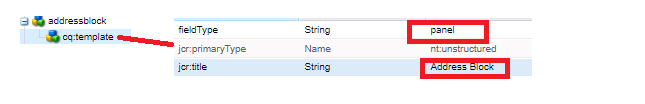

# Criar componente de endereço

Faça logon no CRXDE da instância do AEM Forms pronta para nuvem local.

Faça uma cópia do nó ``/apps/bankingapplication/components/adaptiveForm/button`` e renomeie-o para addressblock. Selecione o nó addressblock e defina suas propriedades conforme mostrado abaixo.

>[!NOTE]
>
> ``bankingapplication`` é o appId fornecido ao criar o projeto Maven. Esta appId pode ser diferente no seu ambiente. Você pode fazer uma cópia de qualquer componente; por acaso, fiz uma cópia do componente de botão

## propriedades do nó cq-template

Selecione o nó ``cq-template`` sob o nó ``addressblock`` e defina suas propriedades conforme mostrado abaixo. Observe que fieldType está definido como panel

## Adicionar nós no cq-template

Adicionar os seguintes nós do tipo ``nt:unstructured`` em ``cq-template``

* streetaddress
* cidade
* zip
* estado

Esses nós representam os campos do componente de bloco de endereço. Os campos streetaddress, city e zip serão um campo de entrada de texto e o campo state será um campo suspenso.

## Definir as propriedades do nó streetaddress

>[!NOTE]
>
> O **_bankingapplication_** no caminho se refere ao appId do projeto maven. Pode ser diferente no seu ambiente

Selecione o nó ``streetaddress`` e defina suas propriedades conforme mostrado abaixo.

## Definir as propriedades do nó city

Selecione o nó ``city`` e defina suas propriedades conforme mostrado abaixo.

## Definir as propriedades do nó zip

Selecione o nó ``zip`` e defina suas propriedades conforme mostrado abaixo.

## Definir as propriedades do nó de estado

Selecione o nó ``state`` e defina suas propriedades conforme mostrado abaixo. Observe o fieldType do estado - ele está definido como uma lista suspensa

## Definir valores padrão para o campo de estado

Selecione o nó ``state`` e adicione as seguintes propriedades.

| Nome | Tipo | Valor |
|----------|----------|---------------------|
| enum | Cadeia de caracteres[] | CA,NY |
| enumName | Cadeia de caracteres[] | Califórnia, Nova York |

O componente de bloco de endereço final terá esta aparência

## Próximas etapas

[Implantar o projeto](./deploy-your-project.md)
