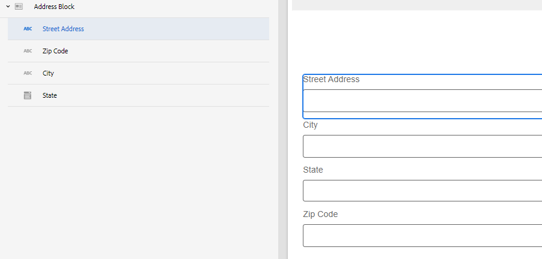

# Criação de um novo componente principal no AEM Forms

No Adobe Experience Manager (AEM), os componentes são os elementos usados para criar páginas e formulários. Eles fornecem uma maneira simples e eficiente para os autores criarem e gerenciarem conteúdo, além de fornecerem aos desenvolvedores a flexibilidade e a extensibilidade necessárias para criar componentes personalizados. Eles foram projetados para acelerar o tempo de desenvolvimento e reduzir os custos de manutenção de sites e formulários, ser flexíveis e poder ser facilmente personalizados para atender às necessidades específicas de um site e formulário.

Neste tutorial, criaremos um componente de bloco de endereço. O componente de bloco de endereço terá campos para capturar o endereço, a cidade, o estado e o CEP.

## Pré-requisitos

* Acesso à instância as a Cloud Service do AEM Forms
* Alguma experiência no desenvolvimento de formulários usando o módulo AEM Forms
* Experiência na configuração do ambiente de desenvolvimento para AEM/AEM Forms (Git, IntelliJ etc.)

## Próximas etapas

[Configurar ambiente de desenvolvimento](./set-up.md)
