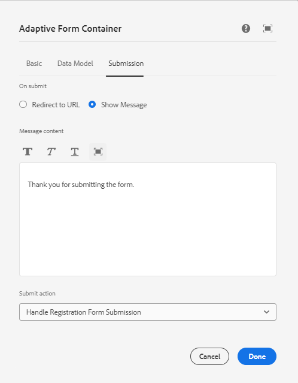

# Criação de envio personalizado

O AEM Forms fornece várias opções de envio prontas para uso que satisfazem a maioria dos casos de uso. Além dessas ações de envio predefinidas, o AEM Forms permite que você escreva seu próprio manipulador de envio personalizado para processar o envio do formulário de acordo com suas necessidades.

Para escrever um serviço de envio personalizado, as seguintes etapas foram seguidas

## Criar projeto AEM

Se você já tiver um projeto AEM Forms Cloud Service existente, é possível [ir para o serviço de envio personalizado de gravação](#Write-the-custom-submit-service)

* Crie uma pasta chamada cloudmanager na unidade c.
* Navegar até esta pasta recém-criada
* Copie e cole o conteúdo de [este arquivo de texto](./assets/creating-maven-project.txt) na janela do prompt de comando. Talvez seja necessário alterar DarchetypeVersion=41 dependendo da [versão mais recente](https://github.com/adobe/aem-project-archetype/releases). No momento em que este artigo foi escrito, a última versão era a 41.
* Execute o comando pressionando a tecla Enter. Se tudo correr corretamente, você verá a mensagem de sucesso da build.

## Escrever o serviço de envio personalizado{#Write-the-custom-submit-service}

Inicie o IntelliJ e abra o projeto AEM. Crie uma nova classe java chamada **HandleRegistrationFormSubmission** como mostrado na captura de tela abaixo


O código a seguir foi gravado para implementar o serviço

```java
package com.aem.bankingapplication.core;
import java.util.HashMap;
import java.util.Map;
import com.google.gson.Gson;
import org.osgi.service.component.annotations.Component;
import com.adobe.aemds.guide.model.FormSubmitInfo;
import com.adobe.aemds.guide.service.FormSubmitActionService;
import com.adobe.aemds.guide.utils.GuideConstants;
import com.google.gson.JsonObject;
import org.slf4j.*;

@Component(
        service=FormSubmitActionService.class,
        immediate = true
)
public class HandleRegistrationFormSubmission implements FormSubmitActionService {
    private static final String serviceName = "Core Custom AF Submit";
    private static Logger logger = LoggerFactory.getLogger(HandleRegistrationFormSubmission.class);


    @Override
    public String getServiceName() {
        return serviceName;
    }

    @Override
    public Map<String, Object> submit(FormSubmitInfo formSubmitInfo) {
        logger.error("in my custom submit service");
        Map<String, Object> result = new HashMap<>();
        logger.error("in my custom submit service");
        String data = formSubmitInfo.getData();
        JsonObject formData = new Gson().fromJson(data,JsonObject.class);
        logger.error("The form data is "+formData);
        JsonObject jsonObject = new JsonObject();
        jsonObject.addProperty("firstName",formData.get("firstName").getAsString());
        jsonObject.addProperty("lastName",formData.get("lastName").getAsString());
        result.put(GuideConstants.FORM_SUBMISSION_COMPLETE, Boolean.TRUE);
        result.put("json",jsonObject.toString());
        return result;
    }

}
```

## Crie um nó crx em aplicativos

Expanda o nó ui.apps e crie um novo pacote chamado **HandleRegistrationFormSubmission** no nó aplicativos, como mostrado na captura de tela abaixo

Crie um arquivo chamado .content.xml sob o **HandleRegistrationFormSubmission**. Copie e cole o seguinte código no arquivo .content.xml

```xml
<?xml version="1.0" encoding="UTF-8"?>
<jcr:root xmlns:jcr="http://www.jcp.org/jcr/1.0" xmlns:sling="http://sling.apache.org/jcr/sling/1.0"
    jcr:description="Handle Registration Form Submission"
    jcr:primaryType="sling:Folder"
    guideComponentType="fd/af/components/guidesubmittype"
    guideDataModel="xfa,xsd,basic"
    submitService="Core Custom AF Submit"/>
```

O valor de **submitService** o elemento deve corresponder  **serviceName = &quot;Envio de AF personalizado principal&quot;** na implementação FormSubmitActionService.

## Implante o código na instância local do AEM Forms

Antes de enviar as alterações para o repositório do Cloud Manager, é recomendável implantar o código na instância do autor local pronta para nuvem para testar o código. Verifique se a instância do autor está em execução.
Para implantar o código na instância do autor pronta para nuvem, navegue até a pasta raiz do projeto AEM e execute o seguinte comando

```
mvn clean install -PautoInstallSinglePackage
```

Isso implantará o código como um único pacote na instância do autor

## Envie o código ao Cloud Manager e Implante o código

Depois de verificar o código na instância local, envie o código para a instância da nuvem.
Envie as alterações para o repositório Git local e, em seguida, para o repositório do cloud manager. Você pode consultar o  [Configuração do Git](https://experienceleague.adobe.com/docs/experience-manager-learn/cloud-service/forms/developing-for-cloud-service/setup-git.html), [envio do projeto AEM para o repositório do cloud manager](https://experienceleague.adobe.com/docs/experience-manager-learn/cloud-service/forms/developing-for-cloud-service/push-project-to-cloud-manager-git.html) e [implantação no ambiente de desenvolvimento](https://experienceleague.adobe.com/docs/experience-manager-learn/cloud-service/forms/developing-for-cloud-service/deploy-to-dev-environment.html) artigos.

Depois que o pipeline for executado com sucesso, você poderá associar a ação de envio do seu formulário ao manipulador de envio personalizado, conforme mostrado na captura de tela abaixo


## Próximas etapas

[Exibir a resposta personalizada no aplicativo react](./handle-response-react-app.md)
