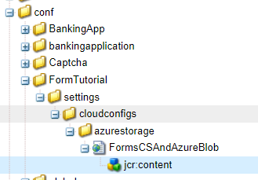

# Configurações da nuvem sensível ao contexto

Ao criar a configuração de nuvem em seu ambiente local e em testes bem-sucedidos, você gostaria de usar a mesma configuração de nuvem em seus ambientes upstream, mas sem precisar alterar o terminal, a chave secreta/senha e ou o nome do usuário. Para obter esse caso de uso, o AEM Forms no Cloud Service introduziu a capacidade de definir configurações de nuvem sensíveis ao contexto.
Por exemplo, a configuração de nuvem da conta de armazenamento do Azure pode ser reutilizada em ambientes de desenvolvimento, estágio e produção usando diferentes strings de conexão e chaves para.

As etapas a seguir são necessárias para criar a configuração de nuvem com reconhecimento de contexto

## Criar variáveis de ambiente

As variáveis de ambiente padrão podem ser configuradas e gerenciadas pelo Cloud Manager. Eles são fornecidos para o ambiente de tempo de execução e podem ser usados em configurações do OSGi. [As variáveis de ambiente podem ser valores específicos do ambiente ou segredos de ambiente, com base no que está sendo alterado.](https://experienceleague.adobe.com/docs/experience-manager-cloud-service/content/implementing/using-cloud-manager/environment-variables.html?lang=en)


A seguinte captura de tela mostra as variáveis de ambiente azure_key e azure_connection_string definidas


Essas variáveis de ambiente podem ser especificadas nos arquivos de configuração a serem usados no ambiente apropriado. Por exemplo, se você quiser que todas as instâncias do autor usem essas variáveis de ambiente, defina o arquivo de configuração na pasta config.author , conforme especificado abaixo

## Criar arquivo de configuração

Abra o projeto no IntelliJ. Navegue até config.author e crie um arquivo chamado

```java
org.apache.sling.caconfig.impl.override.OsgiConfigurationOverrideProvider-integrationTest.cfg.json
```


Copie o texto a seguir no arquivo criado na etapa anterior. O código neste arquivo está substituindo o valor das propriedades accountName e accountKey pelas variáveis de ambiente **azure_connection_string** e **azure_key**.

```json
{
  "enabled":true,
  "description":"dermisITOverrideConfig",
  "overrides":[
   "cloudconfigs/azurestorage/FormsCSAndAzureBlob/accountName=\"$[env:azure_connection_string]\"",
   "cloudconfigs/azurestorage/FormsCSAndAzureBlob/accountKey=\"$[secret:azure_key]\""

  ]
}
```

>[!NOTE]
>
>Essa configuração será aplicada a todos os ambientes do autor na instância do serviço de nuvem. Para aplicar a configuração a ambientes de publicação, você terá que colocar o mesmo arquivo de configuração na pasta config.publish do seu projeto intelliJ
>[!NOTE]
> Verifique se a propriedade que está sendo substituída é uma propriedade válida da configuração de nuvem. Navegue até a configuração da nuvem para encontrar a propriedade que você deseja substituir, como mostrado abaixo.



Para configurações de nuvem baseadas em REST com autenticação básica, normalmente você deseja criar variáveis de ambiente para propriedades serviceEndPoint, userName e password.
