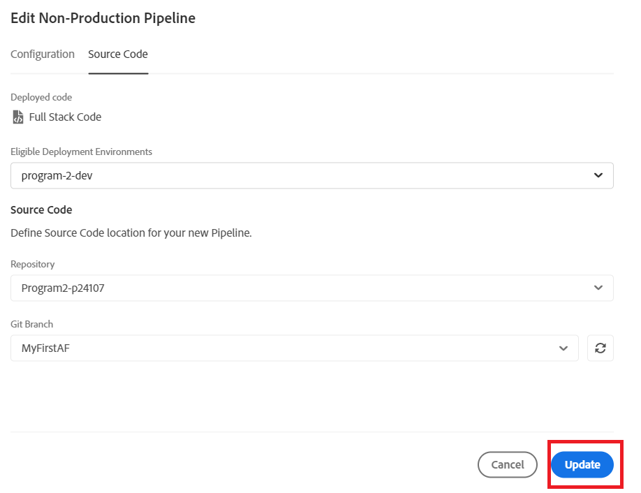

# Implantar no ambiente de desenvolvimento

Na etapa anterior, enviamos nossa ramificação principal do repositório Git local para a ramificação MyFirstAF do repositório do cloud manager.

A próxima etapa é implantar o código no ambiente de desenvolvimento.
Faça logon no cloud manager e selecione seu programa

Selecione a opção Implantar no desenvolvimento conforme mostrado abaixo

Selecione Pipeline de Implantação como mostrado

Selecione o código-fonte e a ramificação Git apropriada

Certifique-se de atualizar suas alterações

Executar o pipeline

Once the code is deployed, you should see the changes in your cloud service instance of AEM Forms.
