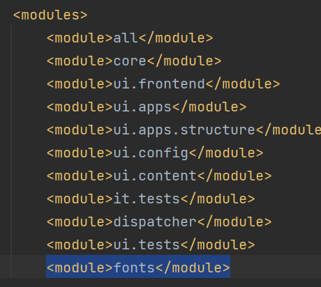

# Instalação do IntelliJ

Instalar [Edição da comunidade IntelliJ](https://www.jetbrains.com/idea/download/#section=windows). Você pode aceitar as configurações padrão, enquanto sugerido durante a instalação.

## Importar o AEM Project

* Iniciar o IntelliJ
* Importe o AEM projeto criado na etapa anterior. Depois que o projeto é importado, a tela deve ficar assim . Normalmente, você trabalhará com subprojetos core,ui.apps,ui.config e ui.content.
* Se você não vir a janela maven e terminal, vá para view->Tools Window e selecione Maven and Terminal

## Adicionar o módulo de fontes

Se quiser usar fontes personalizadas no arquivo PDF, será necessário enviar as fontes personalizadas para a instância do AEM Forms CS. Siga as etapas a seguir

* Crie uma pasta chamada **fontes** em C:\CloudManager\aem-banking-application
* Extrair o conteúdo de [font.zip](assets/fonts.zip) na pasta fontes recém-criadas
* Incluídas no módulo de fontes estão algumas fontes personalizadas.Você pode adicionar as fontes personalizadas de sua organização à pasta C:\CloudManager\aem-banking-application\fonts\src\main\resources folder of the fonts module
* Abra o arquivo C:\CloudManager\aem-banking-application\pom.xml
* Adicione a seguinte linha  ```<module>fonts</module>``` na seção de módulos do pom.xml
* Salve seu pom.xml
* Atualizar o projeto aem-banking-application no IntelliJ

Estrutura do projeto com módulo de fontes


Módulo de fontes incluído no POM de projetos

