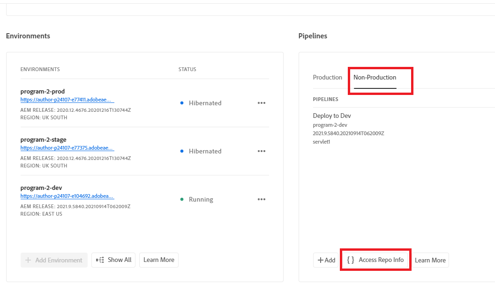
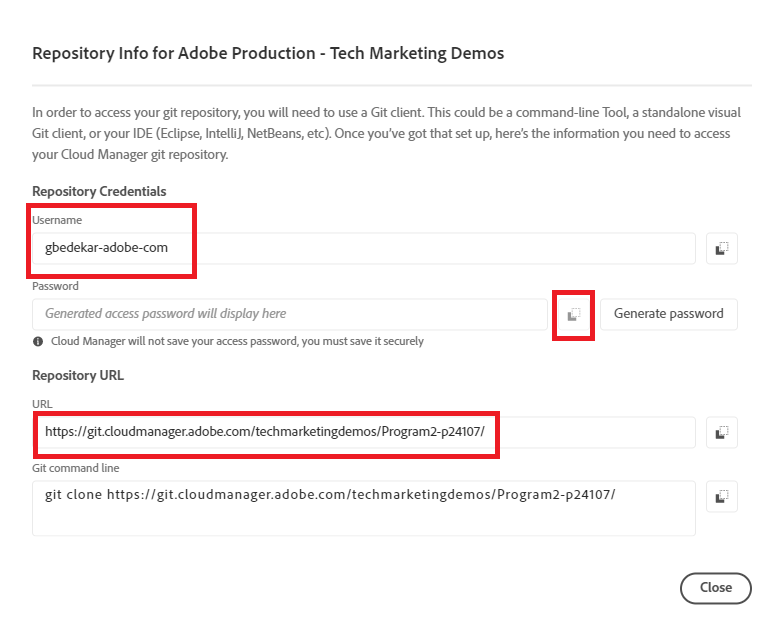

# Instalar Git


[Instalar Git](https://git-scm.com/downloads). Você pode selecionar as configurações padrão e concluir o processo de instalação.
Vá para o prompt de comando Navegue até c:\cloudmanager\aem-banking-app type in git —version. Você deve ver a versão do GIT instalada em seu sistema

## Inicializar Repositório Git Local

Verifique se você está na pasta c:\cloudmanager\aem-banking-app folder

```
git init
```

O comando acima inicializará o projeto como um repositório local Git

```
git add .
```

Isso adiciona todos os arquivos de projeto ao repositório Git pronto para ser confirmado no repositório Git

```
git commit -m "initial commit"
```

Isso confirma os arquivos no repositório Git


## Registre o repositório do cloud manager com nosso repositório Git local

Acesse seu repositório do cloud manager

Obter as credenciais do repo do cloud manager


Salve o nome de usuário no arquivo de configuração

```java
git config --global credential.username "gbedekar-adobe-com"
```

salvar a senha no arquivo de configuração

```java
git config --global user.password "bqwxfvxq2akawtqx3oztacb5tkx5a7"
```

(A senha é a senha do repositório git do cloud manager)

Registre o repositório git do cloud manager com seu repositório Git local. O comando abaixo associa **adobe** com o repositório git do gerenciador de nuvem remoto. Você poderia ter usado qualquer nome em vez de **adobe**


```java
git remote add adobe https://git.cloudmanager.adobe.com/techmarketingdemos/Program2-p24107/
```

(Certifique-se de usar o URL do repositório)

Verifique se o repositório remoto está registrado

```java
git remote -v
```


