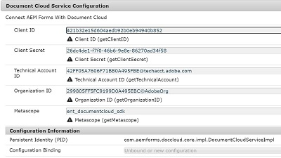

# Introdução

Criar configuração OSGi personalizada para capturar as credenciais da conta da nuvem de documentos


Para fazer uma configuração OSGi personalizada, precisamos primeiro criar uma interface cujos métodos públicos representarão os campos na configuração.




Crie uma interface chamada DocumentCloudConfiguration e cole o seguinte código nela.

```java
package com.aemforms.doccloud.core;

import org.osgi.service.metatype.annotations.AttributeDefinition;
import org.osgi.service.metatype.annotations.ObjectClassDefinition;

@ObjectClassDefinition(name="Document Cloud Service Configuration", description = "Connect AEM Forms With Document Cloud")
public @interface DocumentCloudConfiguration {
	  @AttributeDefinition(name="Client ID", description="Client ID")
	  String getClientID() default "";
	  
	  @AttributeDefinition(name="Client Secret", description="Client Secret")
	  public String getClientSecret() default "26dc4de1-f7f0-46b6-9e8e-86270ad34f58";
	  
	  @AttributeDefinition(name="Technical Account ID", description="Technical Account ID")
	  public String getTechnicalAccount() default "42FF05A7606F71BB0A495FBE@techacct.adobe.com";

	  @AttributeDefinition(name="Organization ID", description="Organization ID")
	  String getOrganizationID() default "299805FF5FC9199D0A495EBC@AdobeOrg";
	  
	  @AttributeDefinition(name="Metascope", description="Metascope")
	  String getMetascope() default "ent_documentcloud_sdk";


}
```
