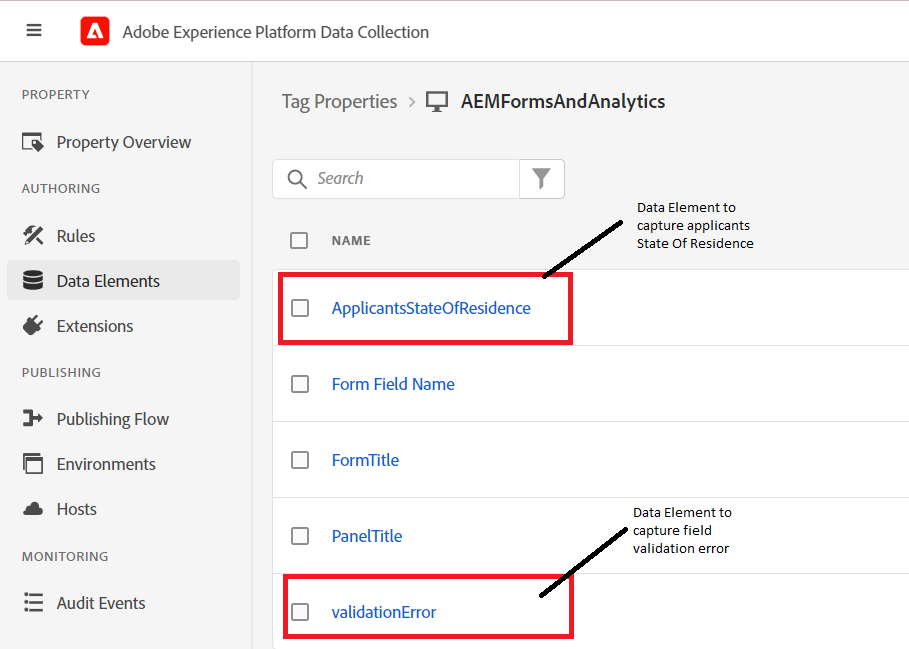

# Criar elementos de dados

Na propriedade Tags, adicionamos dois novos elementos de dados (ApplicantsStateOfResidence e validationError).



## EstadoDeResidênciaCandidato

O elemento de dados **ApplicantStateOfResidence** foi configurado ao selecionar **Core** no menu suspenso de extensões e **Custom Code** para o Tipo de Elemento de Dados, conforme mostrado na captura de tela abaixo


O código personalizado a seguir foi usado para capturar o valor do campo de formulário adaptável **_state_**.

```javascript
// use the GuideBridge API to access adaptive form elements
//The state field's SOM expression is used to access the state field
var ApplicantsStateOfResidence = guideBridge.resolveNode("guide[0].guide1[0].guideRootPanel[0].state[0]").value;
_satellite.logger.log("Returning  Applicants State Of Residence is "+ApplicantsStateOfResidence);
return ApplicantsStateOfResidence;
```

## validationError

O elemento de dados **ValidationError** foi configurado ao selecionar **Core** no menu suspenso de extensões e **Custom Code** para o Tipo de Elemento de Dados conforme mostrado na captura de tela abaixo


O código personalizado a seguir foi gravado para definir o valor do elemento de dados `validationError`.

```javascript
var validationError = "";
// Using GuideBridge API to access adaptive forms fields using the fields SOM expression
var tel = guideBridge.resolveNode("guide[0].guide1[0].guideRootPanel[0].telephone[0]");
var email = guideBridge.resolveNode("guide[0].guide1[0].guideRootPanel[0].email[0]");

_satellite.logger.log("Got tel in Tags custom script "+tel.isValid)
_satellite.logger.log("Got email in Tags custom script "+email.isValid)

if (tel.isValid == false) {  
  validationError = "error: telephone number";
  _satellite.logger.log("Validation error is "+ validationError);
}

if (email.isValid == false) {  
  validationError = "error: invalid email";
  _satellite.logger.log("Validation error is "+ validationError);
}

return validationError;
```

## Próximas etapas

[Criar regras](./rules.md)