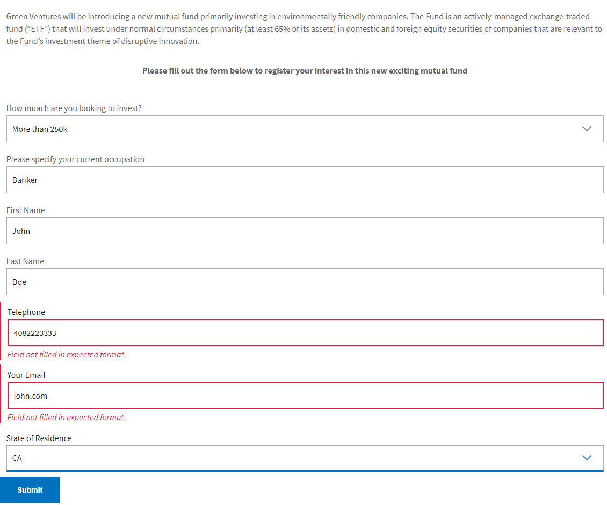

# Relatar valores de campos de dados de formulário e erros de validação de campos de formulário usando o Adobe Analytics

Saiba como implementar análises em seus formulários adaptáveis usando tags e o Adobe Analytics. Este exemplo guiará você pelas etapas de configuração e implementação para produzir relatórios relevantes sobre como os visitantes interagem com seus formulários.

## Pré-requisitos

Para aproveitar ao máximo este tutorial, o recomendou que você atenda aos seguintes pré-requisitos:

* Alguma experiência com o AEM Forms CS
* Acesso a tags Adobe
* Acesso ao Adobe Analytics

Este tutorial usa um formulário adaptável simples integrado ao AEM Forms e mede os envios de formulários para o estado dos valores de residência, bem como campos que geram erros de validação.

