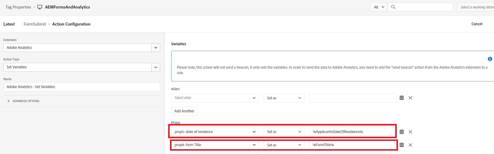

# Definir a regra

Na propriedade Tags, criamos dois novos [regras](https://experienceleague.adobe.com/docs/platform-learn/implement-in-websites/configure-tags/add-data-elements-rules.html) (**Erro de validação de campo e FormSubmit**).

## Erro de validação de campo

A variável **Erro de validação de campo** a regra é acionada sempre que há erro de validação no campo de formulário adaptável. Por exemplo, em nosso formulário, se o número de telefone ou o email não estiver no formato esperado, uma mensagem de erro de validação será exibida.

A regra Erro de validação de campo é configurada definindo o evento como _**Adobe Experience Manager Forms-Error**_ como mostrado na captura de tela

O Adobe Analytics - Definir variáveis é configurado da seguinte maneira

## Regra de envio de formulário

A regra de Envio de formulário é acionada toda vez que um Formulário adaptável é enviado com êxito.

A regra de envio de formulário é configurada usando o _**Adobe Experience Manager Forms - Enviar**_ evento

Na regra Enviar formulário, o valor do elemento de dados _**CandidatosEstadoDeResidência**_ é mapeado para prop5 e o valor do elemento de dados FormTitle é mapeado para prop8.

As variáveis Adobe Analytics - Set são configuradas da seguinte maneira.

Quando estiver pronto para testar o código de tags,[publicar as alterações feitas nas tags](https://experienceleague.adobe.com/docs/experience-platform/tags/publish/publishing-flow.html) usando o fluxo de publicação.

## Próximas etapas

[Testar a solução](./test.md)