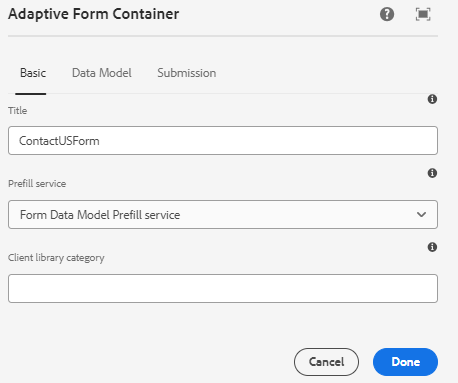

# Preencher previamente o formulário adaptável com os dados da lista de pontos de compartilhamento

Na versão anterior do Formulário AEM (6.5), o código personalizado precisava ser gravado para preencher previamente o formulário adaptável com suporte ao modelo de dados de formulário usando o atributo de solicitação. No AEM Forms as a cloud service, a necessidade de gravar código personalizado não é mais necessária.

Este artigo explica as etapas necessárias para preencher/preencher previamente o formulário adaptável com dados obtidos da lista do SharePoint usando o serviço de preenchimento do modelo de dados de formulário.

Este artigo supõe que você tenha [configurado com êxito um formulário adaptável para enviar dados à lista do SharePoint.](https://experienceleague.adobe.com/docs/experience-manager-cloud-service/content/forms/adaptive-forms-authoring/authoring-adaptive-forms-core-components/create-an-adaptive-form-on-forms-cs/configure-submit-actions-core-components.html?lang=en#connect-af-sharepoint-list)

A seguir estão os dados na lista do SharePoint


Para preencher previamente um formulário adaptável com os dados associados a um guid específico, as etapas a seguir precisam ser executadas

## Configurar o serviço get

* Criar um serviço get para o objeto de nível superior do modelo de dados de formulário usando o atributo guid
  

Nesta captura de tela, a coluna guid é associada por meio de um atributo de solicitação chamado `submissionid`.

O serviço de obtenção totalmente configurado tem esta aparência


## Configurar o formulário adaptável para usar o serviço de preenchimento do modelo de dados de formulário

* Abra um formulário adaptável com base no modelo de dados de formulário da lista de pontos de compartilhamento. Associar o serviço de Preenchimento de modelo de dados de formulário
  

## Testar o formulário

Pré-visualize o formulário incluindo o `submissionid` na URL, como mostrado abaixo

```html
http://localhost:4502/content/dam/formsanddocuments/contactusform/jcr:content?wcmmode=disabled&submissionid=57e12249-751a-4a38-a81f-0a4422b24412
```
