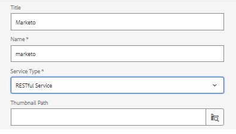

# Criar Source de dados

As REST APIs do Marketo são autenticadas com OAuth 2.0 de duas pernas. Podemos criar facilmente uma fonte de dados usando o arquivo swagger baixado na etapa anterior

## Criar contêiner de configuração

* Faça logon no AEM.
* Clique no menu Ferramentas e, em seguida, em **Navegador de Configuração**, conforme mostrado abaixo

* 

* Clique em **Criar** e forneça um nome significativo, conforme mostrado abaixo. Selecione a opção Configurações de nuvem como mostrado abaixo

* 

## Criar serviços em nuvem

* Navegue até o menu Ferramentas e clique em serviços em nuvem -> Fontes de dados

* 

* Selecione o contêiner de configuração criado na etapa anterior e clique em **Criar** para criar uma nova fonte de dados.Forneça um nome significativo e selecione o serviço RESTful na lista suspensa Tipo de serviço e clique em **Avançar**
* 

* Faça upload do arquivo swagger e especifique o tipo de concessão, a ID do cliente, o segredo do cliente e o URL do token de acesso específicos para sua instância do Marketo, como mostrado na captura de tela abaixo.

* Teste a conexão e, se a conexão for bem-sucedida, clique no botão azul **Criar** para concluir o processo de criação da fonte de dados.

* 

## Próximas etapas

[Criar modelo de dados do formulário](./part3.md)
