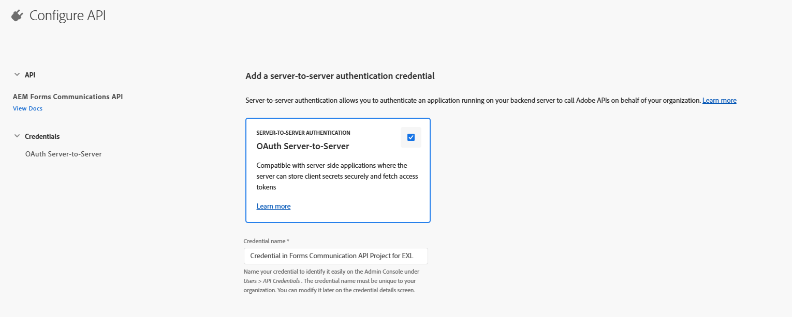

# Configurar APIs de comunicação do AEM Forms com base em OpenAPI no AEM Forms as a Cloud Service

## Pré-requisitos

* Última instância do AEM Forms as a Cloud Service.
* Todos os [perfis de produto necessários são adicionados ao ambiente.](https://experienceleague.adobe.com/en/docs/experience-manager-learn/cloud-service/aem-apis/invoke-openapi-based-aem-apis)

* Ative o acesso da API do AEM ao perfil do produto, conforme mostrado abaixo
  
  

## Criar projeto do Adobe Developer Console

Faça logon no [Adobe Developer Console](https://developer.adobe.com/console/) usando sua Adobe ID.
Crie um novo projeto clicando no ícone apropriado

Dê um nome significativo ao projeto e clique no ícone Adicionar API

Selecionar Experience Cloud

Selecione API de comunicações do AEM Forms e clique em Avançar

Verifique se você selecionou a autenticação de servidor para servidor e clique em Avançar

Selecione os perfis e clique no botão Salvar API configurada para salvar suas configurações

Clique no campo Servidor para servidor do OAuth

Copie a ID do cliente, o segredo do cliente e os escopos

## Configurar instância do AEM para habilitar a comunicação do Projeto ADC

Se você já tiver um projeto do AEM Forms, [siga estas instruções](https://experienceleague.adobe.com/en/docs/experience-manager-learn/cloud-service/aem-apis/invoke-openapi-based-aem-apis) para habilitar a credencial de servidor para servidor OAuth do projeto do Adobe Developer Console para comunicação com a instância do AEM

Se você não tiver um projeto do AEM Forms, crie um [Projeto do AEM Forms seguindo esta documentação.](https://experienceleague.adobe.com/en/docs/experience-manager-learn/cloud-service/forms/developing-for-cloud-service/getting-started) e habilite a credencial ClientID do servidor para servidor OAuth do Adobe Developer Console Project para se comunicar com a instância do AEM [usando esta documentação.](https://experienceleague.adobe.com/en/docs/experience-manager-learn/cloud-service/aem-apis/invoke-openapi-based-aem-apis)

## Próximas etapas

[Gerar token de acesso](./generate-access-token.md)
