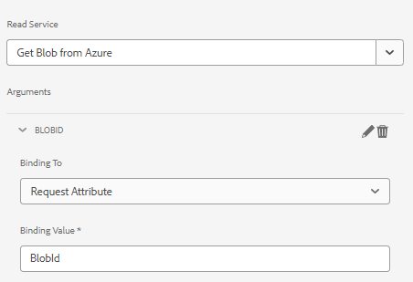

# Componente de Página 

Um componente de página é um componente regular responsável pela renderização de uma página. Vamos criar um novo componente de página e associaremos esse componente de página a um novo modelo de formulário adaptável. Isso garante que nosso código seja executado somente quando um formulário adaptável for baseado nesse modelo específico.

## Criar componente de página

Faça logon na sua instância do AEM Forms pronta para nuvem local. Crie a seguinte estrutura na pasta de aplicativos


1. Clique com o botão direito do mouse na pasta de páginas e crie um nó chamado storeandfetch do tipo cq:Component
1. Salve as alterações
1. Adicione as seguintes propriedades à `storeandfetch` nó e salvar

| **Nome da Propriedade** | **Tipo de propriedade** | **Valor da propriedade** |
|-------------------------|-------------------|----------------------------------------|
| componentGroup | String | oculto |
| jcr:description | String | Tipo de página do modelo de formulário adaptável |
| jcr:title | String | Página do modelo de formulário adaptável |
| sling:resourceSuperType | String | `fd/af/components/page2/aftemplatedpage` |

Copie o `/libs/fd/af/components/page2/aftemplatedpage/aftemplatedpage.jsp` e cole-o sob o `storeandfetch` nó. Renomeie o `aftemplatedpage.jsp` para `storeandfetch.jsp`.

Abertura `storeandfetch.jsp` e adicione a seguinte linha:

```jsp
<cq:include script="azureportal.jsp"/>
```

no

```jsp
<cq:include script="fallbackLibrary.jsp"/>
```

O código final deve ser semelhante ao mostrado abaixo

```jsp
<cq:include script="fallbackLibrary.jsp"/>
<cq:include script="azureportal.jsp"/>
```

Crie um arquivo chamado azureportal.jsp no nó storeandfetch, copie o seguinte código no azureportal.jsp e salve as alterações

```jsp
<%@page session="false" %>
<%@include file="/libs/fd/af/components/guidesglobal.jsp" %>
<%@ page import="org.apache.commons.logging.Log" %>
<%@ page import="org.apache.commons.logging.LogFactory" %>
<%
    if(request.getParameter("guid")!=null) {
            logger.debug( "Got Guid in the request" );
            String BlobId = request.getParameter("guid");
            java.util.Map paraMap = new java.util.HashMap();
            paraMap.put("BlobId",BlobId);
            slingRequest.setAttribute("paramMap",paraMap);
    } else {
            logger.debug( "There is no Guid in the request " );
    }            
%>
```

Neste código, obtemos o valor do parâmetro de solicitação **guid** e armazene-o em uma variável chamada BlobId. Esse BlobId é passado para a solicitação do sling usando o atributo paramMap. Para que esse código funcione, presume-se que você tenha um formulário baseado em um modelo de dados de formulário com suporte do Armazenamento do Azure e o serviço de leitura do modelo de dados de formulário esteja vinculado a um atributo de solicitação chamado BlobId, conforme mostrado na captura de tela abaixo.



### Próximas etapas

[Associar o componente de página ao modelo](./associate-page-component.md)
