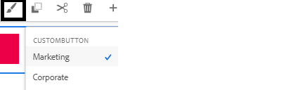
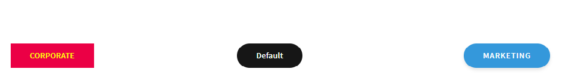

# Testar as alterações

Crie um formulário adaptável com base no modelo **&quot;Em branco com Componentes principais&quot;**. Arraste e solte três botões no formulário e rotule-os como &quot;Corporativo&quot;, &quot;Marketing&quot; e &quot;Padrão&quot;.
Atribua as variantes de estilo apropriadas aos botões Corporativo e Marketing, selecionando o pincel de pintura, conforme mostrado abaixo.

O terceiro botão terá o estilo padrão aplicado.

## Criar o projeto de tema

A próxima etapa é criar o projeto de tema. Navegue até a pasta raiz do projeto de tema e execute o comando _**npm run build**_, conforme mostrado na captura de tela abaixo

Depois que o projeto de tema for criado com sucesso, você estará pronto para testar as alterações.

## Maneira rápida e fácil de testar o css

* Abra o arquivo theme.css localizado na pasta dist do projeto do tema. Selecione e copie todo o conteúdo do arquivo.
* Visualize o formulário criado na etapa anterior.
* Clique com o botão direito do mouse em um dos botões e selecione Inspect para abrir o console do desenvolvedor.
* No console do desenvolvedor, clique em theme.css para abrir o theme.css
* Selecione e exclua todo o conteúdo de theme.css usando o CTR-A e pressione o botão Delete.
* Copie e cole o conteúdo de theme.css que você criou na etapa anterior.
* Os botões devem ser atualizados com os estilos apropriados, conforme mostrado abaixo.

