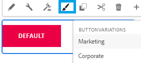

# Introdução

O Sistema de estilos no Adobe Experience Manager (AEM) permite que os usuários criem várias variações visuais de um componente e, em seguida, selecionem qual estilo usar ao criar um formulário. Isso torna os componentes mais flexíveis e reutilizáveis, sem a necessidade de criar componentes personalizados para cada estilo.

Este artigo ajudará você a criar variações do componente de botão e testar as variações no ambiente pronto para nuvem local antes de enviar as alterações para a instância da nuvem usando o cloud manager.

A captura de tela mostra as 2 variações de estilo do componente de botão disponíveis para o autor do formulário.

## Pré-requisitos

* Instância pronta para nuvem do AEM Forms com componentes principais.
* Clonagem de um tema: você precisa se familiarizar com a clonagem de um tema. Para fins deste tutorial, clonamos o [tema do cavalete](https://github.com/adobe/aem-forms-theme-easel). Você pode clonar qualquer um dos temas disponíveis para atender às suas necessidades.

* Instale a versão mais recente do Apache Maven. O Apache Maven é uma ferramenta de automação de build comumente usada para projetos Java™. A instalação da versão mais recente garante que você tenha as dependências necessárias para a personalização de temas.
* Instale um editor de texto simples. Por exemplo, Microsoft® Visual Studio Code. O uso de um editor de texto simples, como o Microsoft® Visual Studio Code, fornece um ambiente amigável para a edição e modificação de arquivos de tema.

## Próximas etapas

[Criar política de estilo](./style-policy.md)
