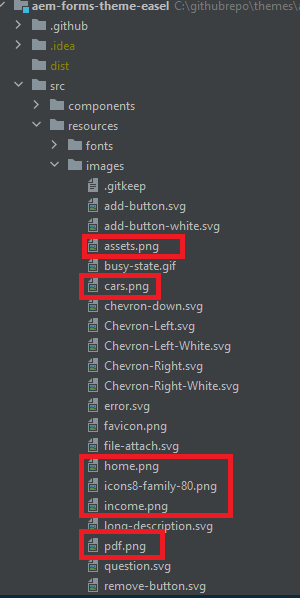
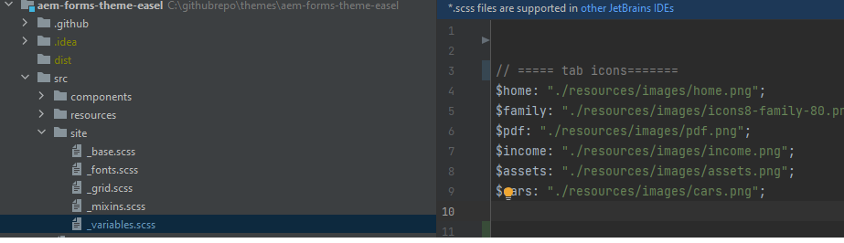

# Adição de ícones personalizados

Adicionar ícones personalizados às guias pode melhorar a experiência do usuário e o apelo visual de algumas maneiras:

* Usabilidade aprimorada: os ícones podem transmitir rapidamente o propósito de cada guia, facilitando para os usuários encontrar o que estão procurando rapidamente. Dicas visuais como ícones ajudam os usuários a navegar de forma mais intuitiva.

* Hierarquia visual e foco: os ícones criam uma separação mais distinta entre as guias, melhorando a hierarquia visual. Isso pode ajudar guias importantes a se destacarem e orientar efetivamente a atenção dos usuários.
Ao seguir este artigo, você poderá colocar os ícones como mostrado abaixo


## Pré-requisitos

Para seguir este artigo, você precisa se familiarizar com o Git, criar e implantar um projeto do AEM usando o Cloud Manager, configurar um pipeline de front-end no AEM Cloud Manager e um pouco de CSS. Se você não estiver familiarizado com os tópicos mencionados acima, siga o artigo [uso de temas para estilizar os componentes principais](https://experienceleague.adobe.com/en/docs/experience-manager-cloud-service/content/forms/adaptive-forms-authoring/authoring-adaptive-forms-core-components/create-an-adaptive-form-on-forms-cs/using-themes-in-core-components#rename-env-file-theme-folder).

## Adicionar ícones ao tema

Abra o projeto de tema no código visual studio ou em qualquer outro editor de sua escolha.
Adicione os ícones de sua escolha à pasta de imagens.
Os ícones marcados em vermelho são os novos ícones adicionados.


## Criar mapa de ícones para armazenar os ícones

Crie o mapa de ícones no arquivo _variable.scss. O mapa de CSS $icon-map é uma coleção de pares de valores chave, onde cada chave representa um nome de ícone (como início, família, etc.) e cada valor é o caminho para o arquivo de imagem associado a esse ícone.



```css
$icon-map: (
    home: "./resources/images/home.png",
    family: "./resources/images/icons8-family-80.png",
    pdf: "./resources/images/pdf.png",
    income: "./resources/images/income.png",
    assets: "./resources/images/assets.png",
    cars: "./resources/images/cars.png"
);
```

## Adicionar mixin

Adicione o seguinte código ao _mixin.scss

```css
@mixin add-icon-to-vertical-tab($image-url) {
  display: inline-flex;
  align-self: center;
  &::before {
    content: "";
    display:inline-block;
    background: url($image-url) left center / cover no-repeat;
    margin-right: 8px; /* Space between icon and text */
    height:40px;
    width:40px;
    vertical-align:middle;
    
  }
  
}
```

A combinação de adicionar ícone à guia vertical foi projetada para adicionar um ícone personalizado ao lado do texto em uma guia vertical. Ele permite incluir facilmente uma imagem como um ícone nas guias, posicionando-a ao lado do texto e estilizando-a para garantir consistência e alinhamento.

Detalhamento do mixin, aqui está o que cada parte do mixin faz:

Parâmetros:

* $image-url: O URL do ícone ou imagem que você deseja exibir ao lado do texto da guia. Passar esse parâmetro torna o mixin versátil, pois permite que ícones diferentes sejam adicionados a guias diferentes, conforme necessário.

* Estilos Aplicados:

   * exibição: inline-flex: isso transforma o elemento em um contêiner flexível, alinhando qualquer conteúdo aninhado (como o ícone e o texto) horizontalmente.
   * align-self: center: garante que o elemento esteja centralizado verticalmente em seu contêiner.
   * Pseudo elemento (::before):
   * content: &quot;&quot;: Inicializa o pseudoelemento ::before, que é usado para exibir o ícone como uma imagem de plano de fundo.
   * display: inline-block: Define o pseudoelemento como inline-block, permitindo que ele se comporte como um ícone colocado em linha com o texto.
   * background: url($image-url) left center / cover no-repeat;: Adiciona a imagem de fundo usando o URL fornecido via $image-url. O ícone é alinhado à esquerda e centralizado verticalmente.

## Atualize o _verticaltabs.scss

Para o propósito do artigo, criei uma nova classe css (cmp-verticaltabs—marketing) para exibir os ícones de guia. Nesta nova classe, estendemos o elemento tab adicionando os ícones. A lista completa da classe css é a seguinte

```css
.cmp-verticaltabs--marketing
{
  .cmp-verticaltabs
    {
      &__tab 
        {
          cursor:pointer;
            @each $name, $url in $icon-map {
            &[data-icon-name="#{$name}"]
              {
                  @include add-icon-to-vertical-tab($url);
              }
            }
        }
    }
}
```

## Modificar o componente de guias verticais

Copie o arquivo verticaltabs.html de ```/apps/core/fd/components/form/verticaltabs/v1/verticaltabs/verticaltabs.html``` e cole-o no componente verticaltabs do seu projeto. Adicione a seguinte linha ```data-icon-name="${tab.name}"``` ao arquivo copiado na função li, como mostrado na imagem abaixo

estamos configurando um atributo de dados personalizado chamado data-icon-name com o valor do nome da guia.Se o nome da guia corresponder a um nome de imagem no mapa de ícones, a imagem correspondente será associada à guia.


## Testar o código

Implante o componente de guias verticais atualizado na instância da nuvem.
Implante o tema atualizado usando o pipeline de front-end.
Crie uma variação de estilo para os componentes de guia vertical, como mostrado abaixo

Criamos uma variação de estilo chamada Marketing que está associada à classe css _&#x200B;**cmp-verticaltabs—marketing**&#x200B;_.
Crie um formulário adaptável com um componente de guia vertical. Associe o componente de guia vertical à variação de estilo de marketing.
Adicione algumas guias às guias verticais e nomeie-as para corresponder às imagens definidas no mapa de ícones, como página inicial, família.


Para visualizar o formulário, você deve ver os ícones apropriados associados à guia
