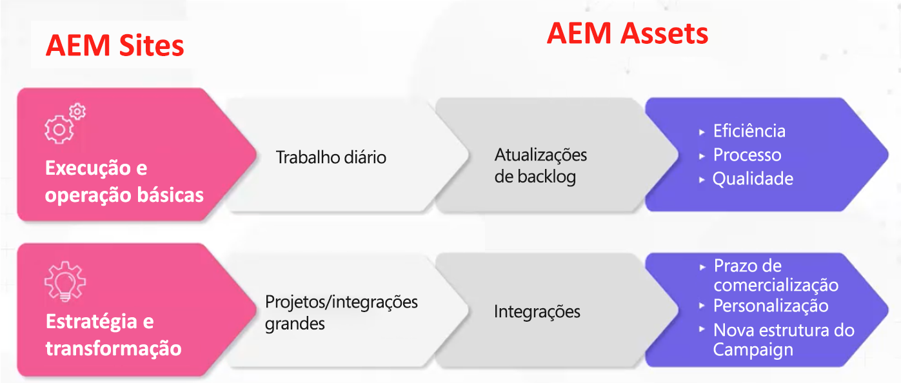

# Adobe Experience Manager (AEM) - modelos e arquétipos de governança e equipe

Como líder em experiência do cliente, a Adobe entende o desafio que pode ser para você garantir que tenha as pessoas certas e a estrutura de governança para impulsionar a eficiência operacional. Com os modelos de governança e contratação de pessoal comprovados pelo setor do Adobe, você tem as ferramentas e o conhecimento para criar uma base sólida de gerenciamento de conteúdo e ativos. Neste artigo, discutiremos maneiras de operacionalizar sua plataforma Adobe Experience Manager (AEM) e obter o máximo valor de seus esforços.

## Criar uma estrutura operacional superior

Para poder executar e operar o AEM, considere os seguintes elementos:

* Executar marcos estratégicos - Haverá muitos marcos estratégicos (personalização, integração de vários canais etc.) que não podem ser executadas a menos que você tenha o modelo de pessoal adequado em vigor.
* Criar uma base para a transformação digital - o AEM é usado com frequência como a primeira etapa do processo de modernização de uma organização. Definir uma base permite que você aproveite o AEM até sua capacidade total.
* Engajamento do usuário - tenha uma equipe em vigor para executar trabalho tático (atualizar workflows, permissões, CSS etc.) Quanto mais você tiver lacunas entre o que os usuários querem e o que eles recebem, mais frustrados eles podem se tornar. É importante manter os usuários investidos no sistema, investidos na solução e que você tenha o modelo operacional certo em vigor.

Então, qual é o modelo correto? Qual é a matriz correta de funções a ser criada?

Não há uma única resposta específica porque, da mesma forma que as organizações variam muito, uma configuração de AEM também pode variar muito, resultando na necessidade de diferentes funções de suporte. Cada vertical, setor, estrutura de equipe exigirá uma implementação diferente. Mas é possível criar uma linha de base estabelecendo arquétipos.

## Arquétipos

Arquétipos são ideias de função específicas de alto nível que são mapeadas para atributos específicos. Isso, por sua vez, pode ser usado para criar uma premissa fundamental que ajuda a informar qual modelo você realmente precisa. É importante observar que os arquétipos não estão limitados a uma pessoa por arquétipo. Por exemplo, um bibliotecário do DAM pode ter alguma experiência técnica.

### Fluxos de operacionalização

Há dois fluxos de operacionalização para [!DNL AEM Sites] e [!DNL AEM Assets]:

1. Execução básica e operação do trabalho diário (atualização de metadados)

1. Trabalho de estratégia e transformação, como grandes projetos interorganizacionais

### Funções de alto nível do ativo AEM

**Lacuna geral:** esta linha de base oferece suporte a modelos centralizados e descentralizados. Se você tem um modelo descentralizado, AEM pode ser usado de forma abstrata. Observe que a função Proprietário do produto deve ser usada de forma criativa, mas você também precisa ter um Proprietário do produto que possua os diferentes estilos para um tipo de ativo e outro que supervisione toda a organização.

1. Funções básicas de execução e operação

   * Recurso técnico - Alguém com experiência no AEM entende de permissões e pode atualizar o esquema de metadados
   * Gerente de versão
   * Proprietário do produto — essa é uma função alinhada à solução. Alguns proprietários de produtos podem estar envolvidos na análise.
   * Bibliotecário DAM - este é alguém que pode ajudar a conduzir os processos de estrutura integrativa. Essa função criativa pode se sobrepor a outras funções. (Observação: essa é uma função que aumentou de popularidade nos últimos cinco anos.)
   * Equipe de criação

1. Estratégia e transformação

   * Equipe de desenvolvimento - essa equipe é necessária ao se envolver com uma grande etapa estratégica.
   * Arquiteto de negócios — desenvolve requisitos para auxiliar em marcos técnicos e iniciativas estratégicas; pode ser compensado com um proprietário de produto adicional
   * Arquiteto técnico — alguém que tem compreensão de nível empresarial e está constantemente presente em toda a organização. Essa função serve como ponto central da verdade do DAM.

**Cenários de exemplo**

1. **Executar e operar:**

Veja a seguir exemplos de funções de um cenário leve (empresa de vestuário esportivo) e pesado (empresa de cosméticos):

1. Light - Funções da empresa de vestuário esportivo:

   * 2 desenvolvedores de meio período - Meio período, offshore
   * 1 Proprietário do produto - Tempo integral, em terra
   * 1 Bibliotecário DAM - Tempo integral, onshore
   * 1 Arquiteto técnico - Meio período, onshore
   * 1 Gerente de versão - Part time, onshore

1. Pesado - empresa de cosméticos (multi-marca)

   * 3 desenvolvedores em tempo integral - Tempo integral, no exterior
   * 4 Proprietários do produto - 3 específicos da marca, 1 principal
   * 1 Bibliotecário DAM - Tempo integral, onshore
   * 4 principais administradores SME por marca
   * 1 Arquiteto técnico

### Funções de alto nível [!DNL AEM Sites]

1. Execução e operação básicas

   **Lacuna geral:** desenvolvedores de CSS criam novas capas para componentes. O consultor de negócios Adobe Sr, Joseph Van Buskirk, recomenda &quot;Obter componentes sem cortinas e sistemas de estilo. Essa é a função que gera economia de custos. 80% das experiências criadas devem ser criadas usando componentes principais ou criados anteriormente.&quot; O objetivo é redefinir os objetivos dos componentes principais ou personalizados com novos estilos usando um desenvolvedor de CSS (ou equipe de desenvolvimento de front-end) .

   Exemplos de funções:

   * Desenvolvimento em CSS - o cria artefatos de experiência por meio da redefinição de objetivos de componentes com novos estilos.
   * Desenvolvimento de back-end - cria novos componentes ou pode estender um componente principal. Se feita corretamente, essa função não deverá ter mais de uma pessoa, a menos que haja necessidade de grandes tarefas de animação.
   * Gerenciamento de versão - supervisiona a implantação do código e atua como a Equipe de conta do Adobe atual.
   * Proprietário do produto: colabora com a BU para unir visões técnicas e estratégicas; cria tarefas de manutenção e melhorias e atua como proprietário da solução.
   * Autores administradores - atualiza o skin CSS e fornece orientação para os autores que estão atualizando e aplicando conteúdo. Essa função funciona em configurações de fluxo de trabalho e cria documentação de orientação para os autores de conteúdo aplicarem. OBSERVAÇÃO: Na versão 6.5, o Adobe recomenda o uso de modelos editáveis.
   * Autores de conteúdo — aplica conteúdo, propriedade hierárquica e fornece problemas e preocupações de comunicação conforme surgem com o CSM.

1. Estratégia e transformação

   Exemplos de funções:

   * Equipe de desenvolvimento - fornece conhecimento sobre AEM e executa novos marcos transformadores com o arquiteto técnico.
   * Arquiteto técnico - fornece conhecimento de integração, trabalha com o proprietário do produto para mapear marcos técnicos e fornece conhecimento técnico profundo do AEM.
   * Arquiteto de negócios — cria tarefas para histórias de usuários e ajuda o proprietário do produto a gerenciar marcos técnicos e de negócios.

### Exemplos de cenários

Veja a seguir exemplos de funções para um cenário de cliente leve e pesado:

1. Claro

   * 2 desenvolvedores de CSS - online
   * 1 Proprietário do produto — tempo integral, onshore
   * 1 Desenvolvedor de backend - offshore
   * 1 Arquiteto técnico - onshore
   * 1 Gerente de versão - meio período, onshore

1. Pesado (centrado em campanhas)

   * 4 desenvolvedores de CSS - em tempo integral, onshore
   * 2 desenvolvedores de back-end - tempo integral, onshore
   * 1 Arquiteto técnico - onshore
   * 1 Proprietário do produto
   * 2 Arquitetos comerciais - offshore

### Principais pontos

**Entender os arquétipos** — Começar devagar, entender e analisar os arquétipos. Seja criativo e flexível, tendo em mente que não há um modelo correto a ser seguido.

**Entenda seu roteiro** - Algumas organizações têm muitos marcos que desejam executar. Esteja preparado para alocar mais recursos técnicos do que você pode estimar.

**Aproveitar recursos internos** - As lacunas podem aparecer inesperadamente. Talvez você possa preenchê-los mais rapidamente fornecendo membros da equipe interna, em vez de pesquisar fora da organização.

Para uma discussão mais aprofundada sobre Governança e Modelos e Arquétipos de Equipe, ouça esta discussão de uma hora do painel: [Arquétipos de Função e Criação de uma Estrutura Operacional para [!DNL AEM Assets] e [!DNL Sites]](https://adobecustomersuccess.adobeconnect.com/p8ml5nmy0758mp4/)

Saiba mais sobre estratégia e liderança de pensamento na central de [Sucesso do cliente](https://experienceleague.adobe.com/docs/customer-success/customer-success/overview.html?lang=pt-BR).
