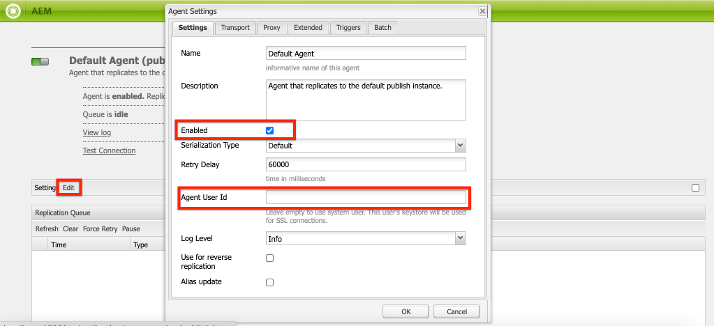

# Configurar tempo de execução de AEM local

>[!CONTEXTUALHELP]
>id="aemcloud_localdev_aemruntime"
>title="Tempo de Execução do AEM Local"
>abstract="O Adobe Experience Manager (AEM) pode ser executado localmente usando o Quickstart Jar AEM do SDK as a Cloud Service. Isso permite que os desenvolvedores implantem e testem código, configuração e conteúdo personalizados antes de confirmá-los no controle de origem e implantá-los em um ambiente AEM as a Cloud Service."
>additional-url="https://experienceleague.adobe.com/docs/experience-manager-cloud-service/implementing/developing/aem-as-a-cloud-service-sdk.html?lang=pt-BR" text="SDK do AEM as a Cloud Service"
>additional-url="https://experience.adobe.com/#/downloads/content/software-distribution/en/aemcloud.html" text="Baixar AEM SDK as a Cloud Service"

O Adobe Experience Manager (AEM) pode ser executado localmente usando o Quickstart Jar AEM do SDK as a Cloud Service. Isso permite que os desenvolvedores implantem e testem código, configuração e conteúdo personalizados antes de confirmá-los no controle de origem e implantá-los em um ambiente AEM as a Cloud Service.

Observe que `~` é usado como abreviado para o Diretório do usuário. No Windows, isso é equivalente a `%HOMEPATH%`.

## Instalar Java

O Experience Manager é um aplicativo Java e, portanto, requer o SDK do Java para oferecer suporte às ferramentas de desenvolvimento.

1. [Baixe e instale o Java SDK 11 mais recente](https://experience.adobe.com/#/downloads/content/software-distribution/en/general.html?1_group.propertyvalues.property=.%2Fjcr%3Acontent%2Fmetadata%2Fdc%3AsoftwareType&amp;1_group.propertyvalues.operation=equals&amp;1_group.propertyvalues.0_values=software-type%3Atooling&amp;fulltext=Oracle%7E+JDK%7E+11%7E&amp;orderby=%40jcr%3Acontent%2Fjcr%3AlastModified&amp;orderby.sort=desc&amp;layout=list&amp;p.offset=0&amp;p.limit=14)
1. Verifique se o SDK do Java 11 está instalado executando o comando:
   + Windows:`java -version`
   + macOS / Linux: `java --version`


## Baixe o SDK AEM as a Cloud Service

O AEM SDK as a Cloud Service, ou SDK AEM, contém o Quickstart Jar usado para executar o AEM Author e Publicar localmente para desenvolvimento, bem como a versão compatível das Ferramentas do Dispatcher.

1. Faça logon em [https://experience.adobe.com/#/downloads](https://experience.adobe.com/#/downloads) com sua Adobe ID
   + Observe que sua organização do Adobe __must__ ser provisionado para AEM as a Cloud Service para baixar o SDK as a Cloud Service AEM.
1. Navegue até o __AEM as a Cloud Service__ guia
1. Classificar por __Data de publicação__ em __Decrescente__ pedido
1. Clique no mais recente __AEM SDK__ linha de resultado
1. Revise e aceite o EULA e toque no __Baixar__ botão

## Extraia o Jar do Quickstart do zip AEM SDK

1. Descompacte o arquivo baixado `aem-sdk-XXX.zip` arquivo

## Configurar o serviço de autor do AEM local{#set-up-local-aem-author-service}

O Serviço de criação do AEM local fornece aos desenvolvedores uma experiência local com os profissionais de marketing digital/autores de conteúdo compartilhados para criar e gerenciar conteúdo.  O AEM Author Service foi projetado como um ambiente de criação e visualização, permitindo que a maioria das validações de desenvolvimento de recursos possa ser executada em relação a ele, tornando-o um elemento vital do processo de desenvolvimento local.

1. Criar a pasta `~/aem-sdk/author`
1. Copie o __JAR de início rápido__ para  `~/aem-sdk/author` e renomeie-o para `aem-author-p4502.jar`
1. Inicie o Serviço de criação do AEM local executando o seguinte na linha de comando:
   + `java -jar aem-author-p4502.jar`
      + Forneça a senha do administrador como `admin`. Qualquer senha de administrador é aceitável, no entanto, sua recomendação é usar o padrão para desenvolvimento local para reduzir a necessidade de reconfigurar.

   Você *cannot* inicie o AEM como Cloud Service Quickstart Jar [clicando duas vezes em](#troubleshooting-double-click).
1. Acesse o Serviço de criação do AEM local em [http://localhost:4502](http://localhost:4502) em um navegador da Web

Windows:

```shell
$ mkdir -p c:\Users\<My User>\aem-sdk\author
$ copy aem-sdk-Quickstart-XXX.jar c:\Users\<My User>\aem-sdk\author\aem-author-p4502.jar
$ cd c:\Users\<My User>\aem-sdk\author
$ java -jar aem-author-p4502.jar
```

macOS / Linux:

```shell
$ mkdir -p ~/aem-sdk/author
$ cp aem-sdk-Quickstart-XXX.jar ~/aem-sdk/author/aem-author-p4502.jar
$ cd ~/aem-sdk/author
$ java -jar aem-author-p4502.jar
```

## Configurar o serviço de publicação do AEM local

O Serviço de publicação do AEM local fornece aos desenvolvedores a experiência local que os usuários finais do AEM terão, como navegar no site hospedado no AEM. Um serviço de publicação do AEM local é importante, pois integra-se AEM SDKs [Ferramentas do Dispatcher](./dispatcher-tools.md) e permite que os desenvolvedores façam testes de fumaça e ajustem a experiência final voltada para o usuário final.

1. Criar a pasta `~/aem-sdk/publish`
1. Copie o __JAR de início rápido__ para  `~/aem-sdk/publish` e renomeie-o para `aem-publish-p4503.jar`
1. Inicie o AEM Publish Service local executando o seguinte na linha de comando:
   + `java -jar aem-publish-p4503.jar`
      + Forneça a senha do administrador como `admin`. Qualquer senha de administrador é aceitável, no entanto, sua recomendação é usar o padrão para desenvolvimento local para reduzir a necessidade de reconfigurar.

   Você *cannot* inicie o AEM como Cloud Service Quickstart Jar [clicando duas vezes em](#troubleshooting-double-click).
1. Acesse o Serviço de publicação do AEM local em [http://localhost:4503](http://localhost:4503) em um navegador da Web

Windows:

```shell
$ mkdir -p c:\Users\<My User>\aem-sdk\publish
$ copy aem-sdk-Quickstart-XXX.jar c:\Users\<My User>\aem-sdk\publish\aem-publish-p4503.jar
$ cd c:\Users\<My User>\aem-sdk\publish
$ java -jar aem-publish-p4503.jar
```

macOS / Linux:

```shell
$ mkdir -p ~/aem-sdk/publish
$ cp aem-sdk-Quickstart-XXX.jar ~/aem-sdk/publish/aem-publish-p4503.jar
$ cd ~/aem-sdk/publish
$ java -jar aem-publish-p4503.jar
```

## Simular distribuição de conteúdo {#content-distribution}

Em um ambiente Cloud Service, o conteúdo é distribuído do Serviço de autor para o Serviço de publicação usando [Distribuição de conteúdo Sling](https://sling.apache.org/documentation/bundles/content-distribution.html) e o Adobe Pipeline. O [Pipeline Adobe](https://experienceleague.adobe.com/docs/experience-manager-cloud-service/core-concepts/architecture.html?lang=en#content-distribution) é um microsserviço isolado disponível somente no ambiente de nuvem.

Durante o desenvolvimento, pode ser desejável simular a distribuição de conteúdo usando o serviço local Autor e Publicação . Isso pode ser feito habilitando os agentes de Replicação herdados.

>[!NOTE]
>
> Os agentes de replicação só estão disponíveis para uso no Quickstart JAR local e fornecem apenas uma simulação da distribuição de conteúdo.

1. Faça logon no **Autor** e navegue até [http://localhost:4502/etc/replication/agents.author.html](http://localhost:4502/etc/replication/agents.author.html).
1. Clique em **Agente padrão (publicar)** para abrir o agente Replicação padrão.
1. Clique em **Editar** para abrir a configuração do agente.
1. Em **Configurações** , atualize os seguintes campos:

   + **Ativado** - verificar verdadeiro
   + **ID de usuário do agente** - Deixe este campo vazio

   

1. Em **Transportes** , atualize os seguintes campos:

   + **URI** - `http://localhost:4503/bin/receive?sling:authRequestLogin=1`
   + **Usuário** - `admin`
   + **Senha** - `admin`

   

1. Clique em **Ok** para salvar a configuração e ativar o **Padrão** Agente de replicação.
1. Agora é possível fazer alterações no conteúdo no serviço Autor e publicá-las no serviço de Publicação.


## Modos de inicialização do Jar de início rápido

O nome do Quickstart Jar, `aem-<tier>_<environment>-p<port number>.jar` especifica como ele será iniciado. Depois de AEM iniciado em um nível, autor ou publicação específico, ele não pode ser alterado para o nível alternativo. Para fazer isso, o `crx-Quickstart` a pasta gerada durante a primeira execução deve ser excluída e o Quickstart Jar deve ser executado novamente. Ambiente e portas podem ser alteradas, no entanto exigem a interrupção/inicialização da instância de AEM local.

Alterar ambientes, `dev`, `stage` e `prod`, pode ser útil para desenvolvedores para garantir que configurações específicas do ambiente sejam definidas e resolvidas corretamente pelo AEM. Recomenda-se que o desenvolvimento local seja feito principalmente em relação ao padrão `dev` modo de execução do ambiente.

As permutas disponíveis são as seguintes:

| Nome do arquivo Jar do Quickstart | Descrição do modo |
|------------------------------|-----------------------------------------------------------------------------|
| `aem-author-p4502.jar` | Como Autor no modo de execução Dev na porta 4502 |
| `aem-author_dev-p4502.jar` | Como Autor no modo de execução Dev na porta 4502 (igual a `aem-author-p4502.jar`) |
| `aem-author_stage-p4502.jar` | Como autor no modo de execução de preparo na porta 4502 |
| `aem-author_prod-p4502.jar` | Como Autor no modo de execução Produção na porta 4502 |
| `aem-publish-p4503.jar` | Como Publicar no modo de execução Dev na porta 4503 |
| `aem-publish_dev-p4503.jar` | Como Publicar no modo de execução Dev na porta 4503 (igual a `aem-publish-p4503.jar`) |
| `aem-publish_stage-p4503.jar` | Como Publicar no modo de execução de preparo na porta 4503 |
| `aem-publish_prod-p4503.jar` | Como Publicar no modo de execução Produção na porta 4503 |

Observe que o número da porta pode ser qualquer porta disponível na máquina de desenvolvimento local, no entanto, por convenção:

+ Port __4502__ é usado para o __serviço de autor do AEM local__
+ Port __4503__ é usado para o __serviço local de publicação do AEM__

Alterar esses itens pode exigir ajustes nas configurações AEM SDK

## Interrompendo um tempo de execução de AEM local

Para interromper um tempo de execução de AEM local, seja o AEM Author ou Publish service, abra a janela de linha de comando que foi usada para iniciar o AEM Runtime e toque em `Ctrl-C`. Aguarde AEM desligamento. Quando o processo de desligamento estiver concluído, o prompt da linha de comando estará disponível.

## Tarefas opcionais de configuração de tempo de execução de AEM local

+ __Variáveis de ambiente de configuração OSGi e variáveis secretas__ são [especialmente concebido para o tempo de execução local AEM](https://experienceleague.adobe.com/docs/experience-manager-cloud-service/implementing/deploying/configuring-osgi.html#local-development), em vez de gerenciá-los usando a CLI do aio.

## Quando atualizar o Quickstart Jar

Atualize o SDK do AEM pelo menos mensalmente na última quinta-feira de cada mês, ou logo depois dela, que é a cadência de lançamento AEM &quot;lançamentos de recursos&quot; as a Cloud Service.

>[!WARNING]
>
> Atualizar o Quickstart Jar para uma nova versão requer a substituição de todo o ambiente de desenvolvimento local, resultando na perda de todo o código, configuração e conteúdo nos repositórios de AEM locais. Certifique-se de que qualquer código, configuração ou conteúdo que não deve ser destruído esteja comprometido com o Git ou seja exportado da instância de AEM local como AEM Pacotes.

### Como evitar perda de conteúdo ao atualizar o SDK do AEM

A atualização do SDK do AEM está criando um novo tempo de execução do AEM, incluindo um novo repositório, o que significa que todas as alterações feitas em um repositório do SDK anterior AEM são perdidas. A seguir estão estratégias viáveis para ajudar no conteúdo persistente entre atualizações AEM SDK e podem ser usadas discretamente ou em conjunto:

1. Crie um pacote de conteúdo dedicado a conter conteúdo de &quot;amostra&quot; para auxiliar no desenvolvimento e o mantenha no Git. Qualquer conteúdo que deve ser mantido por meio de atualizações AEM SDK seria mantido neste pacote e reimplantado após a atualização do SDK AEM.
1. Use [oak-upgrade](https://jackrabbit.apache.org/oak/docs/migration.html) com o `includepaths` diretiva, para copiar o conteúdo do repositório SDK AEM anterior para o novo repositório SDK AEM.
1. Faça backup de qualquer conteúdo usando AEM Pacote Manager e pacotes de conteúdo no SDK AEM anterior e reinstale-os no novo SDK AEM.

Lembre-se de que usar as abordagens acima para manter o código entre AEM atualizações do SDK indica um antipadrão de desenvolvimento. O código não descartável deve se originar no IDE de desenvolvimento e fluir para AEM SDK por meio de implantações.

## Resolução de problemas

### Clicar duas vezes no arquivo Quickstart Jar resulta em um erro{#troubleshooting-double-click}

Ao clicar duas vezes no Quickstart Jar para iniciar, é exibido um modal de erros que impede o AEM de iniciar localmente.


Isso ocorre porque AEM o Quickstart Jar as a Cloud Service não oferece suporte ao clique duplo do Quickstart Jar para iniciar AEM localmente. Em vez disso, você deve executar o arquivo Jar a partir dessa linha de comando.

Para iniciar o serviço de Autor do AEM, `cd` no diretório que contém o Quickstart Jar e execute o comando:

`$ java -jar aem-author-p4502.jar`

ou, para iniciar o serviço de publicação do AEM, `cd` no diretório que contém o Quickstart Jar e execute o comando:

`$ java -jar aem-publish-p4503.jar`

### Iniciar o Jar Quickstart a partir da linha de comando aborta imediatamente{#troubleshooting-java-8}

Ao iniciar o Quickstart Jar a partir da linha de comando, o processo é interrompido imediatamente e o serviço de AEM não é iniciado, com o seguinte erro:

```shell
➜  ~/aem-sdk/author: java -jar aem-author-p4502.jar
Loading quickstart properties: default
Loading quickstart properties: instance
java.lang.Exception: Quickstart requires a Java Specification 11 VM, but your VM (Java HotSpot(TM) 64-Bit Server VM / Oracle Corporation) reports java.specification.version=1.8
  at com.adobe.granite.quickstart.base.impl.Main.checkEnvironment(Main.java:1046)
  at com.adobe.granite.quickstart.base.impl.Main.<init>(Main.java:646)
  at com.adobe.granite.quickstart.base.impl.Main.main(Main.java:981)
Quickstart: aborting
```

Isso ocorre porque AEM as a Cloud Service requer o Java SDK 11 e você está executando uma versão diferente, provavelmente o Java 8. Para resolver esse problema, baixe e instale [Oracle Java SDK 11](https://experience.adobe.com/#/downloads/content/software-distribution/en/general.html?1_group.propertyvalues.property=.%2Fjcr%3Acontent%2Fmetadata%2Fdc%3AsoftwareType&amp;1_group.propertyvalues.operation=equals&amp;1_group.propertyvalues.0_values=software-type%3Atooling&amp;fulltext=Oracle%7E+JDK%7E+11%7E&amp;orderby=%40jcr%3Acontent%2Fjcr%3AlastModified&amp;orderby.sort=desc&amp;layout=list&amp;p.offset=0&amp;p.limit=14).
Depois que o Java SDK 11 tiver sido instalado, verifique se é a versão ativa executando o seguinte na linha de comando.

Depois que o Java 11 SDK estiver instalado, verifique se é a versão ativa executando o comando a partir da linha de comando:

+ Windows: `java -version`
+ macOS / Linux: `java --version`

## Recursos adicionais

+ [Baixar AEM SDK](https://experience.adobe.com/#/downloads)
+ [Adobe Cloud Manager](https://my.cloudmanager.adobe.com/)
+ [Baixar Docker](https://www.docker.com/)
+ [Documentação do Dispatcher do Experience Manager](https://experienceleague.adobe.com/docs/experience-manager-dispatcher/using/dispatcher.html?lang=pt-BR)
