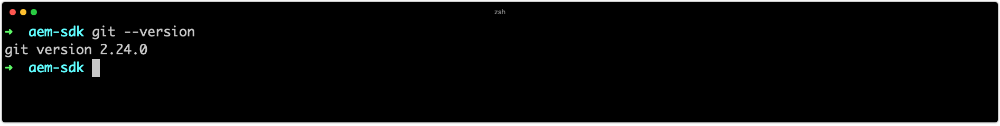

# Configurar ferramentas de desenvolvimento

O desenvolvimento do Adobe Experience Manager (AEM) requer que um conjunto mínimo de ferramentas de desenvolvimento seja instalado e configurado na máquina do desenvolvedor. Estas ferramentas apoiam o desenvolvimento e a construção de projetos AEM.

Observe que `~` é usado como abreviação para o Diretório do usuário. No Windows, isso é o equivalente a `%HOMEPATH%`.

## Instalar Java

O Experience Manager é um aplicativo Java e, portanto, requer que o Java SDK suporte o desenvolvimento e o AEM como um SDK Cloud Service.

1. [Baixe e instale a versão mais recente do Java 11 SDK](https://experience.adobe.com/#/downloads/content/software-distribution/en/general.html?1_group.propertyvalues.property=.%2Fjcr%3Acontent%2Fmetadata%2Fdc%3AsoftwareType&amp;1_group.propertyvalues.operation=equals&amp;1_group.propertyvalues.0_values=software-type%3Atooling&amp;fulltext=Oracle%7E+JDK%7E+11%7E&amp;orderby=%40jcr%3Acontent%2Fjcr jcr%3AlastModified&amp;orderby.sort=desc&amp;layout=lista&amp;p.offset=0&amp;p.limit=14)
1. Verifique se o Java 11 SDK está instalado executando o comando:
   + Windows: `java -version`
   + macOS / Linux: `java --version`

## Instalar o Homebrew

_O uso de Homebrew é opcional, mas recomendado._

Homebrew é um gerenciador de pacote de código aberto para macOS, Windows e Linux. Todas as ferramentas de suporte podem ser instaladas separadamente, o Homebrew fornece uma maneira conveniente de instalar e atualizar uma variedade de ferramentas de desenvolvimento necessárias para o desenvolvimento de Experience Manager.

1. Abrir o terminal
1. Verifique se o Homebrew já está instalado executando o comando: `brew --version`.
1. Se o Homebrew não estiver instalado, instale o Homebrew
   + [Instale o Homebrew no macOS](https://brew.sh/)
      + Homebrew no macOS requer [Xcode](https://apps.apple.com/us/app/xcode/id497799835) ou Ferramentas [de linha de](https://developer.apple.com/download/more/)comando, instalável por meio do comando:
         + `xcode-select --install`
   + [Instale o Homebrew no Linux](https://docs.brew.sh/Installation#linux-or-windows-10-subsystem-for-linux)
   + [Instale o Homebrew no Windows 10](https://docs.brew.sh/Installation#linux-or-windows-10-subsystem-for-linux)
1. Verifique se o Homebrew está instalado executando o comando: `brew --version`

Se estiver a utilizar Homebrew, siga as instruções de __instalação utilizando Homebrew__ nas seções abaixo. Se __não__ estiver usando o Homebrew, instale as ferramentas usando os links específicos do SO.

## Instalar Git

[O Git](https://git-scm.com/) é o sistema de gerenciamento de controle de origem usado pelo [Adobe Cloud Manager](https://docs.adobe.com/content/help/en/experience-manager-cloud-manager/using/requirements/source-code-repository.html)e, portanto, é necessário para o desenvolvimento.

+ Instale o Git usando o Homebrew
   1. Abra o terminal/prompt de comando
   1. Execute o comando: `brew install git`
   1. Verifique se o Git está instalado, usando o comando: `git --version`
+ Ou, baixe e instale o Git (macOS, Linux ou Windows)
   1. [Baixar e instalar o Git](https://git-scm.com/downloads)
   1. Abra o terminal/prompt de comando
   1. Verifique se o Git está instalado, usando o comando: `git --version`

## Instalar Node.js (e npm){#node-js}

[Node.js](https://nodejs.org) é um ambiente de tempo de execução JavaScript usado para trabalhar com os ativos front-end de um subprojeto __ui.frontende__ de um projeto AEM. Node.js é distribuído com [npm](https://www.npmjs.com/), é o gerenciador de pacote Node.js, usado para gerenciar dependências JavaScript.

+ Instalar o Node.js usando o Homebrew
   1. Abra o terminal/prompt de comando
   1. Execute o comando: `brew install node`
   1. Verifique se Node.js está instalado, usando o comando: `node -v`
   1. Verifique se npm está instalado, usando o comando: `npm -v`
+ Ou baixe e instale o Node.js (macOS, Linux ou Windows)
   1. [Baixe e instale o Node.js](https://nodejs.org/en/download/)
   1. Abra o terminal/prompt de comando
   1. Verifique se Node.js está instalado, usando o comando: `node -v`
   1. Verifique se npm está instalado, usando o comando: `npm -v`

>[!TIP]
> [AEM Projetos baseados no AEM Project Archetype](https://github.com/adobe/aem-project-archetype)instalam uma versão isolada do Node.js no momento da criação. É bom manter a versão do sistema de desenvolvimento local sincronizada (ou próxima) das versões Node.js e npm especificadas no AEM Maven project&#39;s Reator pom.xml.
Consulte este exemplo [AEM Project Reator pom.xml](https://github.com/adobe/aem-guides-wknd/blob/9ac94f3f40c978a53ec88fae79fbc17dd2db72f2/pom.xml#L117-L118) para saber onde localizar as versões de compilação Node.js e npm.

## Instalar o Maven

O Apache Maven é a ferramenta de linha de comando Java de código aberto usada para criar AEM Projetos gerados pelo Arquétipo de Maven do Projeto AEM. Todos os principais IDEs ([IntelliJ IDEA](https://www.jetbrains.com/idea/), Código [do](https://code.visualstudio.com/)Visual Studio, [Eclipse](https://www.eclipse.org/)etc.) tenham suporte integrado ao Maven.

+ Instale o Maven usando o Homebrew
   1. Abra o terminal/prompt de comando
   1. Execute o comando: `brew install maven`
   1. Verifique se o Maven está instalado, usando o comando: `mvn -v`
+ Ou, baixe e instale o Maven (macOS, Linux ou Windows)
   1. [Baixar o Maven](https://maven.apache.org/download.cgi)
   1. [Instalar o Maven](https://maven.apache.org/install.html)
   1. Abra o terminal/prompt de comando
   1. Verifique se o Maven está instalado, usando o comando: `mvn -v`

## Configurar CLI de E/S de Adobe{#aio-cli}

A CLI [de E/S do](https://github.com/adobe/aio-cli)Adobe, ou `aio`, fornece acesso de linha de comando a uma variedade de serviços do Adobe, incluindo o [Cloud Manager](https://github.com/adobe/aio-cli-plugin-cloudmanager) e a [Asset Compute](https://github.com/adobe/aio-cli-plugin-asset-compute). A CLI de E/S do Adobe desempenha um papel integral no desenvolvimento da AEM como Cloud Service, pois oferece aos desenvolvedores a capacidade de:

+ Registros de caixa de AEM como serviços Cloud Services
+ Gerenciar pipelines do Cloud Manager da CLI

### Instale a CLI de E/S do Adobe

1. Verifique se o [Node.js está instalado](#node-js) como a CLI de E/S do Adobe é um módulo npm
   + Executar `node --version` para confirmar
1. Execute `npm install -g @adobe/aio-cli` para instalar o módulo `aio` npm globalmente

### Configurar o plug-in Adobe I/O CLI Cloud Manager{#aio-cloud-manager}

O plug-in Adobe I/O Cloud Manager permite que a CLI do rádio interaja com o Adobe Cloud Manager por meio do `aio cloudmanager` comando.

1. Execute `aio plugins:install @adobe/aio-cli-plugin-cloudmanager` para instalar o plug-in [do](https://github.com/adobe/aio-cli-plugin-cloudmanager)Gerenciador da nuvem do rádio.

### Configurar o plug-in Adobe I/O CLI Asset Compute{#aio-asset-compute}

O plug-in Adobe I/O Cloud Manager permite que a CLI do rádio gere e execute os funcionários da Asset Compute por meio do `aio asset-compute` comando.

1. Execute `aio plugins:install @adobe/aio-cli-plugin-cloudmanager` para instalar o plug-in aio Asset Compute.

### Configurar a autenticação CLI de E/S do Adobe

Para que a CLI de E/S do Adobe se comunique com o Cloud Manager, é necessário criar uma integração do Gerenciador de nuvem no Console de E/S do Adobe, e obter credenciais para a autenticação bem-sucedida.

>[!VIDEO](https://video.tv.adobe.com/v/35094?quality=12&learn=on)

1. Faça logon no [console.adobe.io](https://console.adobe.io)
1. Certifique-se de que a organização que inclui o produto Cloud Manager ao qual se conectar esteja ativa no comutador Adobe Org
1. Criar um novo programa de E/S de [Adobe existente ou abri-lo](https://www.adobe.io/apis/experienceplatform/console/docs.html#!AdobeDocs/adobeio-console/master/projects.md)
   + Programas do Console de E/S do Adobe são simplesmente agrupamentos organizacionais de integrações, criação ou uso e programa existente com base em como você deseja gerenciar suas integrações
   + Se estiver criando um novo projeto, selecione &quot;Projeto vazio&quot; se solicitado (vs. Criar de modelo)
   + Programas do console de E/S do Adobe são conceitos diferentes para programas do Cloud Manager
1. Criar uma nova integração da API do Cloud Manager com o perfil &quot;Desenvolvedor - Cloud Service&quot;
1. Obtenha as credenciais da Conta de Serviço (JWT) necessárias para preencher o [config.json da CLI de E/S do Adobe](https://github.com/adobe/aio-cli-plugin-cloudmanager#authentication)
1. Carregue o `config.json` arquivo na CLI de E/S do Adobe
   + `$ aio config:set jwt-auth PATH_TO_CONFIG_JSON_FILE --file --json`
1. Carregue o `private.key` arquivo na CLI de E/S do Adobe
   + `$ aio config:set jwt-auth.jwt_private_key PATH_TO_PRIVATE_KEY_FILE --file`

Comece a [executar comandos](https://github.com/adobe/aio-cli-plugin-cloudmanager#commands) para o Cloud Manager por meio da CLI de E/S do Adobe.

## Configurar o IDE de desenvolvimento

AEM desenvolvimento consiste principalmente em desenvolvimento Java e Front-end (JavaScript, CSS etc) e gerenciamento XML. Os seguintes são os IDEs mais populares para o desenvolvimento AEM.

### IntelliJ IDEA

__[O IntelliJ IDEA](https://www.jetbrains.com/idea/)__ é um IDE poderoso para o desenvolvimento do Java. A IntelliJ IDEA é composta de dois sabores, uma edição comunitária gratuita e uma versão comercial (paga) Ultimate. A versão comunitária gratuita é suficiente para AEM desenvolvimento, no entanto, o Ultimate [amplia seu conjunto](https://www.jetbrains.com/idea/download)de recursos.

>[!VIDEO](https://video.tv.adobe.com/v/26089/?quality=12&learn=on)

+ [Baixar o IntelliJ IDEA](https://www.jetbrains.com/idea/download)
+ [Download da ferramenta Repo](https://github.com/Adobe-Marketing-Cloud/tools/tree/master/repo#installation)

### Código do Microsoft Visual Studio

__[Visual Studio Code](https://code.visualstudio.com/)__ (Código VS) é uma ferramenta gratuita de código aberto para desenvolvedores front-end. O código do Visual Studio pode ser configurado para integrar sincronização de conteúdo com AEM com a ajuda de uma ferramenta Adobe, __[repo](https://github.com/Adobe-Marketing-Cloud/tools/tree/master/repo#integration-into-visual-studio-code)__.

O código do Visual Studio é a escolha ideal para desenvolvedores front-end criando primeiramente código front-end; JavaScript, CSS e HTML. Embora o código VS tenha suporte para Java por meio de [extensões](https://code.visualstudio.com/docs/java/java-tutorial), ele pode não ter alguns dos recursos avançados fornecidos por mais específicos para Java.

>[!VIDEO](https://video.tv.adobe.com/v/25907?quality=12&learn=on)

+ [Baixar código do Visual Studio](https://code.visualstudio.com/Download)
+ [Download da ferramenta Repo](https://github.com/Adobe-Marketing-Cloud/tools/tree/master/repo#integration-into-visual-studio-code)
+ [Baixar extensão de código VS alimentada por email](https://aemfed.io/)
+ [Baixar AEM Sincronizar extensão de código VS](https://marketplace.visualstudio.com/items?itemName=Yinkai15.aemsync)

### Eclipse

__[O Eclipse IDE](https://www.eclipse.org/ide/)__ é um popular IDEs para desenvolvimento de Java e oferece suporte ao plug-in __[AEM Developer Tools](https://eclipse.adobe.com/aem/dev-tools/)__ fornecido pelo Adobe, fornecendo uma GUI no IDE para criação e para sincronizar o conteúdo do JCR com uma instância AEM local.

>[!VIDEO](https://video.tv.adobe.com/v/25906?quality=12&learn=on)

+ [Baixar Eclipse](https://www.eclipse.org/ide/)
+ [Baixar Ferramentas De Desenvolvimento Do Eclipse](https://eclipse.adobe.com/aem/dev-tools/)
