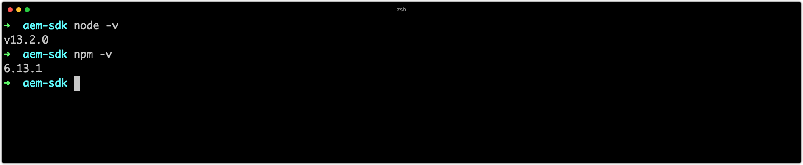

# Configurar ferramentas de desenvolvimento

O desenvolvimento do Adobe Experience Manager (AEM) requer que um conjunto mínimo de ferramentas de desenvolvimento seja instalado e configurado na máquina do desenvolvedor. Essas ferramentas suportam o desenvolvimento e a criação de projetos do AEM.

Observe que `~` é usado como abreviado para o Diretório do usuário. No Windows, este é o equivalente a `%HOMEPATH%`.

## Instalar Java

O Experience Manager é um aplicativo Java e, portanto, requer que o SDK do Java ofereça suporte ao desenvolvimento e ao SDK do AEM as a Cloud Service.

1. [Baixe e instale a versão mais recente do SDK do Java 11](https://experience.adobe.com/#/downloads/content/software-distribution/en/general.html?1_group.propertyvalues.property=.%2Fjcr%3Acontent%2Fmetadata%2Fdc%3AsoftwareType&amp;1_group.propertyvalues.operation=equals&amp;1_group.propertyvalues.0_values=software-type%3Atooling&amp;fulltext=Oracle%7E+JDK%7E+11%7E&amp;orderby=%40jcr%3Acontent%2Fjcr%3AlastModified&amp;orderby.sort=desc&amp;layout=list&amp;p.offset=0&amp;p.limit=14)
1. Verifique se o SDK do Java 11 está instalado executando o comando:
   + Windows: `java -version`
   + macOS / Linux: `java --version`

## Instalar o Homebrew

_O uso do Homebrew é opcional, mas recomendado._

Homebrew é um gerenciador de pacotes de código aberto para macOS, Windows e Linux. Todas as ferramentas de suporte podem ser instaladas separadamente, o Homebrew fornece uma maneira conveniente de instalar e atualizar uma variedade de ferramentas de desenvolvimento necessárias para o desenvolvimento do Experience Manager.

1. Abra o terminal
1. Verifique se o Homebrew já está instalado executando o comando: `brew --version`.
1. Se o Homebrew não estiver instalado, instale o Homebrew
   + [Instale o Homebrew no macOS](https://brew.sh/)
      + Para homebrew no macOS, é necessário [Xcode](https://apps.apple.com/us/app/xcode/id497799835) ou [Ferramentas de Linha de Comando](https://developer.apple.com/download/more/), instalável por meio do comando:
         + `xcode-select --install`
   + [Instale o Homebrew no Linux](https://docs.brew.sh/Installation#linux-or-windows-10-subsystem-for-linux)
   + [Instale o Homebrew no Windows 10](https://docs.brew.sh/Installation#linux-or-windows-10-subsystem-for-linux)
1. Verifique se o Homebrew está instalado executando o comando: `brew --version`

Se estiver usando o Homebrew, siga as instruções __Instalar usando o Homebrew__ nas seções abaixo. Se você estiver __not__ usando o Homebrew, instale as ferramentas usando os links específicos do SO.

## Instalar Git

 Obtém o sistema de gerenciamento do controle de origem usado pelo  [Adobe Cloud Manager](https://docs.adobe.com/content/help/en/experience-manager-cloud-manager/using/requirements/source-code-repository.html) e, portanto, é necessário para o desenvolvimento.

+ Instalar o Git usando o Homebrew
   1. Abra o terminal/prompt de comando
   1. Execute o comando: `brew install git`
   1. Verifique se o Git está instalado, usando o comando: `git --version`
+ Ou, baixar e instalar o Git (macOS, Linux ou Windows)
   1. [Baixe e instale o Git](https://git-scm.com/downloads)
   1. Abra o terminal/prompt de comando
   1. Verifique se o Git está instalado, usando o comando: `git --version`

## Instalar o Node.js (e npm){#node-js}

[Node.](https://nodejs.org) jsis é um ambiente de tempo de execução JavaScript usado para trabalhar com os ativos de front-end de um projeto AEM  __ui.__ frontendsub. O Node.js é distribuído com [npm](https://www.npmjs.com/), é o gerenciador de pacotes Node.js defato, usado para gerenciar dependências do JavaScript.

+ Instalar o Node.js usando o Homebrew
   1. Abra o terminal/prompt de comando
   1. Execute o comando: `brew install node`
   1. Verifique se Node.js está instalado, usando o comando: `node -v`
   1. Verifique se o npm está instalado, usando o comando: `npm -v`
+ Ou baixe e instale o Node.js (macOS, Linux ou Windows)
   1. [Baixe e instale o Node.js](https://nodejs.org/en/download/)
   1. Abra o terminal/prompt de comando
   1. Verifique se Node.js está instalado, usando o comando: `node -v`
   1. Verifique se o npm está instalado, usando o comando: `npm -v`

>[!TIP]
>
>[Os AEM Projects baseados no Arquétipo](https://github.com/adobe/aem-project-archetype) de projeto do AEM instalam uma versão isolada do Node.js no momento da criação. É bom manter a versão do sistema de desenvolvimento local sincronizada (ou próxima) das versões Node.js e npm especificadas no Reator pom.xml do projeto AEM Maven.
>
>Consulte este exemplo [AEM Project Reator pom.xml](https://github.com/adobe/aem-guides-wknd/blob/9ac94f3f40c978a53ec88fae79fbc17dd2db72f2/pom.xml#L117-L118) para onde localizar as versões de compilação Node.js e npm.

## Instalar o Maven

O Apache Maven é a ferramenta de linha de comando Java de código aberto usada para criar projetos AEM gerados a partir do Arquétipo Maven do projeto AEM. Todos os principais IDEs ([IntelliJ IDEA](https://www.jetbrains.com/idea/), [Visual Studio Code](https://code.visualstudio.com/), [Eclipse](https://www.eclipse.org/), etc.) têm suporte integrado para Maven.

+ Instale o Maven usando o Homebrew
   1. Abra o terminal/prompt de comando
   1. Execute o comando: `brew install maven`
   1. Verifique se o Maven está instalado, usando o comando: `mvn -v`
+ Ou, baixar e instalar o Maven (macOS, Linux ou Windows)
   1. [Baixar o Maven](https://maven.apache.org/download.cgi)
   1. [Instalar o Maven](https://maven.apache.org/install.html)
   1. Abra o terminal/prompt de comando
   1. Verifique se o Maven está instalado, usando o comando: `mvn -v`

## Configurar a CLI do Adobe I/O{#aio-cli}

O [Adobe I/O CLI](https://github.com/adobe/aio-cli), ou `aio`, fornece acesso de linha de comando a uma variedade de serviços da Adobe, incluindo o [Cloud Manager](https://github.com/adobe/aio-cli-plugin-cloudmanager) e o [Asset Compute](https://github.com/adobe/aio-cli-plugin-asset-compute). A CLI do Adobe I/O desempenha um papel integral no desenvolvimento do AEM as a Cloud Service, pois fornece aos desenvolvedores a capacidade de:

+ Logs finais dos serviços do AEM as a Cloud Services
+ Gerenciar pipelines do Cloud Manager da CLI

### Instalar a CLI do Adobe I/O

1. Verifique se [Node.js está instalado](#node-js), pois a CLI do Adobe I/O é um módulo npm
   + Execute `node --version` para confirmar
1. Execute `npm install -g @adobe/aio-cli` para instalar o módulo `aio` npm globalmente

### Configurar o plug-in do Adobe I/O CLI Cloud Manager{#aio-cloud-manager}

O plug-in do Adobe I/O Cloud Manager permite que a CLI do aio interaja com o Adobe Cloud Manager por meio do comando `aio cloudmanager`.

1. Execute `aio plugins:install @adobe/aio-cli-plugin-cloudmanager` para instalar o [plug-in do aio Cloud Manager](https://github.com/adobe/aio-cli-plugin-cloudmanager).

### Configurar o plug-in do Adobe I/O CLI Asset Compute{#aio-asset-compute}

O plug-in do Adobe I/O Cloud Manager permite que a CLI do aio gere e execute trabalhadores do Asset Compute por meio do comando `aio asset-compute`.

1. Execute `aio plugins:install @adobe/aio-cli-plugin-asset-compute` para instalar o plug-in [aio Asset Compute](https://github.com/adobe/aio-cli-plugin-asset-compute).

### Configurar a autenticação da CLI do Adobe I/O

Para que a CLI do Adobe I/O se comunique com o Cloud Manager, uma integração do Cloud Manager deve ser criada no Adobe I/O Console e as credenciais devem ser obtidas para a autenticação bem-sucedida.

>[!VIDEO](https://video.tv.adobe.com/v/35094?quality=12&learn=on)

1. Faça logon em [console.adobe.io](https://console.adobe.io)
1. Certifique-se de que a organização que inclui o produto do Cloud Manager ao qual se conectar esteja ativa no alternador de organização da Adobe
1. Crie um novo ou abra um [programa do Adobe I/O](https://www.adobe.io/apis/experienceplatform/console/docs.html#!AdobeDocs/adobeio-console/master/projects.md) existente
   + Os programas do Console de E/S da Adobe são simplesmente agrupamentos organizacionais de integrações, criar ou usar e programas existentes com base em como você deseja gerenciar suas integrações
   + Se estiver criando um novo projeto, selecione &quot;Projeto vazio&quot;, se solicitado (vs. Criar a partir do modelo)
   + Os programas do Console de E/S da Adobe são conceitos diferentes dos programas do Cloud Manager
1. Crie uma nova integração da API do Cloud Manager com o perfil &quot;Desenvolvedor - Cloud Service&quot;
1. Obter as credenciais da conta de serviço (JWT) precisam preencher as CLIs do Adobe I/O [config.json](https://github.com/adobe/aio-cli-plugin-cloudmanager#authentication)
1. Carregue o arquivo `config.json` na CLI do Adobe I/O
   + `$ aio config:set jwt-auth PATH_TO_CONFIG_JSON_FILE --file --json`
1. Carregue o arquivo `private.key` na CLI do Adobe I/O
   + `$ aio config:set jwt-auth.jwt_private_key PATH_TO_PRIVATE_KEY_FILE --file`

Comece a [executar comandos](https://github.com/adobe/aio-cli-plugin-cloudmanager#commands) para o Cloud Manager por meio da CLI do Adobe I/O.

## Configurar o IDE de desenvolvimento

O desenvolvimento do AEM consiste principalmente no desenvolvimento de Java e Front-end (JavaScript, CSS etc) e no gerenciamento de XML. Veja a seguir os IDEs mais populares para o desenvolvimento do AEM.

### IntelliJ IDEA

__[O IntelliJ ](https://www.jetbrains.com/idea/)__ IDEA é um IDE poderoso para o desenvolvimento do Java. O IntelliJ IDEA tem dois sabores, uma edição comunitária gratuita e uma versão Ultimate comercial (paga). A versão gratuita da Comunidade é suficiente para o desenvolvimento do AEM, no entanto, o Ultimate [expande seu conjunto de recursos](https://www.jetbrains.com/idea/download).

>[!VIDEO](https://video.tv.adobe.com/v/26089/?quality=12&learn=on)

+ [Baixar o IntelliJ IDEA](https://www.jetbrains.com/idea/download)
+ [Baixe a ferramenta Repo](https://github.com/Adobe-Marketing-Cloud/tools/tree/master/repo#installation)

### Código do Microsoft Visual Studio

__[O Visual Studio Code](https://code.visualstudio.com/)__  (Código VS) é uma ferramenta gratuita e de código aberto para desenvolvedores front-end. O Visual Studio Code pode ser configurado para integrar sincronização de conteúdo com o AEM com a ajuda de uma ferramenta da Adobe, __[repo](https://github.com/Adobe-Marketing-Cloud/tools/tree/master/repo#integration-into-visual-studio-code)__.

O Visual Studio Code é a escolha ideal para desenvolvedores front-end que criam código front-end principalmente; JavaScript, CSS e HTML. Embora o Código VS tenha suporte para Java por meio de [extensões](https://code.visualstudio.com/docs/java/java-tutorial), talvez não tenha alguns dos recursos avançados fornecidos por recursos mais específicos do Java.

>[!VIDEO](https://video.tv.adobe.com/v/25907?quality=12&learn=on)

+ [Baixar código do Visual Studio](https://code.visualstudio.com/Download)
+ [Baixe a ferramenta Repo](https://github.com/Adobe-Marketing-Cloud/tools/tree/master/repo#integration-into-visual-studio-code)
+ [Baixar extensão de código VS aprimorada](https://aemfed.io/)
+ [Baixar a extensão de código VS do AEM Sync](https://marketplace.visualstudio.com/items?itemName=Yinkai15.aemsync)

### Eclipse

__[O Eclipse ](https://www.eclipse.org/ide/)__ IDEs é um IDEs popular para desenvolvimento de Java e oferece suporte ao   __[AEM Developer ](https://eclipse.adobe.com/aem/dev-tools/)__ Toolsplug-in fornecido pela Adobe, fornecendo uma GUI no IDE para criação e para sincronizar o conteúdo JCR com uma instância do AEM local.

>[!VIDEO](https://video.tv.adobe.com/v/25906?quality=12&learn=on)

+ [Baixar o Eclipse](https://www.eclipse.org/ide/)
+ [Download de ferramentas de desenvolvimento do Eclipse](https://eclipse.adobe.com/aem/dev-tools/)
