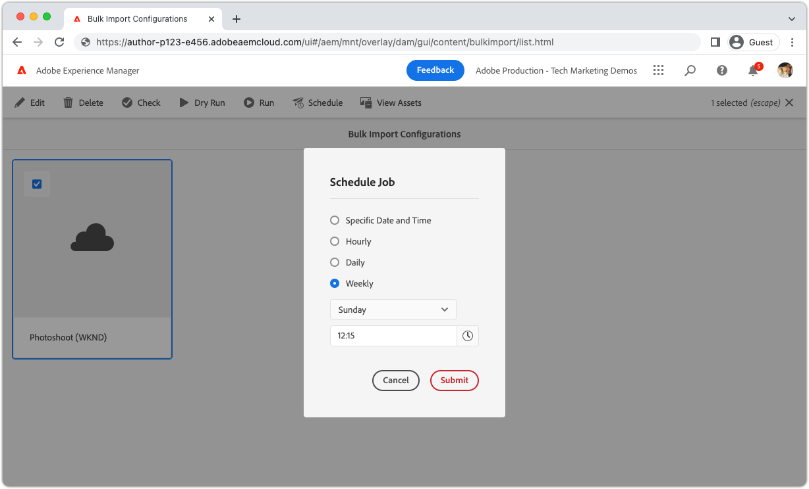

# Uso da importação em massa

A ferramenta Importação em massa no AEM as a Cloud Service permite que os administradores importem ativos em massa do armazenamento na nuvem de maneira segura e eficiente.

>[!BEGINTABS]

>[!TAB Exibição de ativos]

Saiba como importar vários arquivos para o AEM Assets usando o [Exibição do ativo](https://experienceleague.adobe.com/docs/experience-manager-cloud-service/content/assets/assets-view/assets-view-introduction.html) [Importação em massa](https://experienceleague.adobe.com/docs/experience-manager-cloud-service/content/assets/assets-view/bulk-import-assets-view.html), com o Dropbox servindo como um exemplo de provedor de armazenamento em nuvem para um processo de integração claro e fácil de seguir.

>[!VIDEO](https://video.tv.adobe.com/v/3426857/?learn=on)

>[!TAB Exibição do administrador]

>[!VIDEO](https://video.tv.adobe.com/v/329680?quality=12&learn=on)

>[!TIP]
>
> As fontes de entrada neste vídeo mostram apenas o Armazenamento de blobs do Azure e o Amazon S3; no entanto, as fontes disponíveis continuam a crescer com o tempo. Para obter uma lista completa de fontes de entrada compatíveis, consulte as opções disponíveis no produto ou [documentação](https://experienceleague.adobe.com/docs/experience-manager-cloud-service/content/assets/manage/add-assets.html#bulk-upload).

## Programar importação em massa

A Importação em massa é compatível com a execução agendada de configurações, incluindo:

+ Execução única em uma data e hora definidas
+ Execuções do período a cada hora, dia ou semana

>[!ENDTABS]
