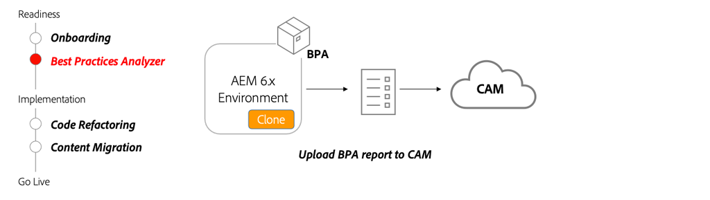

# Gerenciador de aceleração de nuvem e do Analisador de práticas recomendadas

Saiba como o BPA (Best Practices Analyzer) e o CAM (Cloud Acceleration Manager) fornecem um guia personalizado para migrar para AEM as a Cloud Service. 

>[!VIDEO](https://video.tv.adobe.com/v/336957/?quality=12&learn=on)

## Uso de BPA e CAM

O pacote BPA deve ser instalado em um clone do ambiente de produção AEM 6.x. O BPA gerará um relatório que poderá ser carregado para o CAM, o que fornecerá orientação sobre as atividades principais que precisam ocorrer para se mudarem para o AEM as a Cloud Service.

## Atividades principais

+ Faça um clone do ambiente 6.x de produção. À medida que você migra o conteúdo e o código de refatoração, ter um clone de um ambiente de produção será valioso para testar várias ferramentas e alterações.
+ Baixe a ferramenta BPA mais recente da [Portal de distribuição de software](https://experience.adobe.com/#/downloads/content/software-distribution/en/aemcloud.html) e instale no ambiente clonado do AEM 6.x.
+ Use a ferramenta BPA para gerar um relatório que pode ser carregado para o Cloud Acceleration Manager (CAM). O CAM é acessado por meio de [https://experience.adobe.com/](https://experience.adobe.com/) > **Experience Manager** > **Cloud Acceleration Manager**.
+ Use CAM para fornecer orientação sobre quais atualizações precisam ser feitas na base de código e no ambiente atuais, a fim de mudar para AEM as a Cloud Service.

## Exercício prático

Aplique o seu conhecimento experimentando o que aprendeu com este exercício prático.

Antes de experimentar o exercício prático, certifique-se de ter assistido e compreendido o vídeo acima e os seguintes materiais:

+ [Pensando de forma diferente sobre AEM as a Cloud Service](./introduction.md)
+ [O que é AEM as a Cloud Service?](https://experienceleague.adobe.com/docs/experience-manager-learn/cloud-service/introduction/what-is-aem-as-a-cloud-service.html?lang=en)
+ [Arquitetura do AEM as a Cloud Service](https://experienceleague.adobe.com/docs/experience-manager-learn/cloud-service/introduction/architecture.html?lang=en)
+ [Conteúdo variável e imutável](https://experienceleague.adobe.com/docs/experience-manager-learn/cloud-service/developing/basics/mutable-immutable.html?lang=en)
+ [Diferenças no desenvolvimento para AEM as a Cloud Service e AEM 6.x](https://experienceleague.adobe.com/docs/experience-manager-cloud-service/implementing/developing/development-guidelines.html#developing)

<table style="border-width:0">
    <tr>
        <td style="width:150px">
                    
        </td>
        <td style="width:100%;margin-bottom:1rem;">
            
Manual com o Analisador de práticas recomendadas

            

                Explore o BPA (Best Practices Analyzer) e revise os resultados executando-o em uma base de código WKND herdada que contém exemplos de violações.
            

            <a  rel="noreferrer"
                target="_blank"
                href="https://github.com/adobe/aem-cloud-engineering-video-series-exercises/tree/session1-differently#bootcamp---session-1-introduction-and-thinking-differently" class="spectrum-Button spectrum-Button--primary spectrum-Button--sizeM">
                Experimente o Analisador de práticas recomendadas
            </a>
        </td>
    </tr>
</table>

## Outros recursos

+ [Baixe o Analisador de práticas recomendadas](https://experience.adobe.com/#/downloads/content/software-distribution/en/aemcloud.html?fulltext=Best*+Practices*+Analyzer*&amp;orderby=%40jcr%3Acontent%2Fjcr%3AlastModified&amp;orderby.sort=desc&amp;layout=list&amp;p.offset=0&amp;p.limit=1)