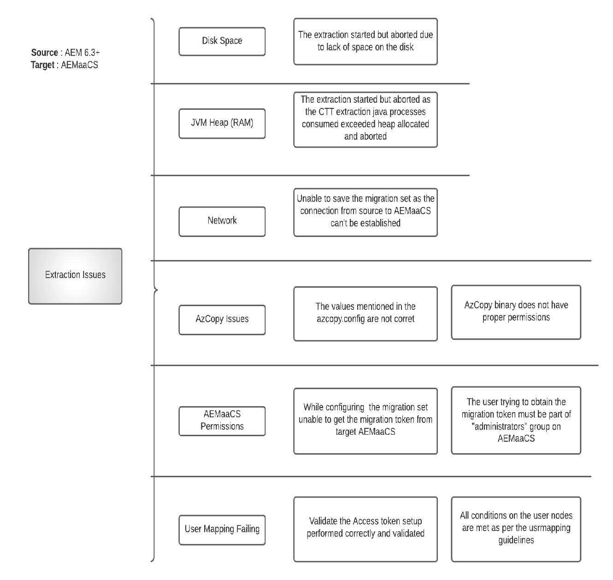

# Perguntas frequentes sobre migração de conteúdo as a Cloud Service do AEM

Obtenha respostas para perguntas frequentes sobre a migração de conteúdo para AEM as a Cloud Service.

## Terminologia

+ **AEMaaCS**: [AEM as a Cloud Service](https://experienceleague.adobe.com/docs/experience-manager-cloud-service/content/overview/introduction.html)
+ **BPA**: [Analisador de práticas recomendadas](https://experienceleague.adobe.com/docs/experience-manager-cloud-service/content/migration-journey/cloud-migration/best-practices-analyzer/overview-best-practices-analyzer.html)
+ **CTT**: [Ferramenta Transferência de conteúdo](https://experienceleague.adobe.com/docs/experience-manager-cloud-service/content/migration-journey/cloud-migration/content-transfer-tool/overview-content-transfer-tool.html)
+ **CAM**: [Cloud Acceleration Manager](https://experienceleague.adobe.com/docs/experience-manager-cloud-service/content/migration-journey/cloud-acceleration-manager/using-cam/getting-started-cam.html)
+ **IMS**: [Sistema Identity Management](https://experienceleague.adobe.com/docs/experience-manager-cloud-service/content/security/ims-support.html)

Use o modelo abaixo para fornecer mais detalhes ao criar tíquetes de suporte a Adobe relacionados a CTT.

 { align=&quot;center&quot; }

### P: Quais são os diferentes métodos para migrar o conteúdo para o AEM como Cloud Services?

A: Há três métodos diferentes disponíveis

+ Usar a ferramenta Transferência de conteúdo (AEM 6.3+ → AEMaaCS)
+ Por meio do Gerenciador de pacotes (AEM → AEMaaCS)
+ Serviço de importação em massa pronto para uso do Assets (S3/Azure → AEMaaCS)

### P: Existe um limite para a quantidade de conteúdo que pode ser transferida usando a CTT?

A: Não. O CTT como ferramenta pode extrair AEM origem e assimilar no AEMaaCS. No entanto, há limites específicos na plataforma AEMaaCS que devem ser considerados antes da migração.

Para obter mais informações, consulte [pré-requisitos de migração da nuvem](https://experienceleague.adobe.com/docs/experience-manager-cloud-service/content/migration-journey/cloud-migration/content-transfer-tool/prerequisites-content-transfer-tool.html).

### P: Tenho o relatório BPA mais recente do meu sistema de origem, o que devo fazer com ele?

A: Exporte o relatório como CSV e faça upload dele para o Cloud Acceleration Manager, [associado à sua IMS Org](https://experienceleague.adobe.com/docs/experience-manager-cloud-service/moving/cloud-acceleration-manager/using-cam/getting-started-cam.html). Em seguida, passe pelo processo de revisão como [descrito na Fase de preparação](https://experienceleague.adobe.com/docs/experience-manager-cloud-service/moving/cloud-acceleration-manager/using-cam/cam-readiness-phase.html).

Revise a avaliação da complexidade de código e conteúdo fornecida pela ferramenta e anote os itens de ação associados que levam à refatoração de código do backlog ou à Avaliação da migração da nuvem.

### P: É recomendável extrair sobre o autor da origem e assimilar no autor e na publicação do AEMaaCS?

A: É sempre recomendável executar a extração e a assimilação 1:1 entre os níveis de criação e publicação. Dito isso, é aceitável extrair o autor de produção de origem e assimilá-lo no Dev, Stage e Production CS.

### P: Existe uma maneira de estimar o tempo, é necessário migrar o conteúdo da AEM de origem para o AEMaaCS usando a CTT?

A: Como o processo de migração depende da largura da banda da Internet, do heap alocado para o processo de CTT, da memória livre disponível e da E/S do disco, que são subjetivos para cada sistema de origem, é recomendável executar a Prova de migrações antecipadamente e extrapolar que os pontos de dados apresentem estimativas.

### P: Como o desempenho do AEM de origem será afetado se eu iniciar o processo de extração de CTT?

A: A ferramenta CTT é executada em seu próprio processo Java™, que utiliza heap de até 4 gb, que é configurável por meio da configuração OSGi. Esse número pode mudar, mas você pode optar pelo processo Java™ e descobrir isso.

Se o AZCopy estiver instalado e/ou opção de pré-cópia/recurso de validação ativado, o processo AZCopy consumirá ciclos da CPU.

Além do jvm , a ferramenta também usa E/S de disco para armazenar os dados em um espaço temporário transitório e isso será limpo após o ciclo de extração. Além da RAM, CPU e E/S de disco, a ferramenta CTT também usa a largura da banda de rede do sistema de origem para carregar dados no armazenamento de blobs do Azure.

A quantidade de recursos que o processo de extração de CTT utiliza depende do número de nós, do número de blobs e do tamanho agregado. É difícil fornecer uma fórmula e, portanto, é recomendável executar uma pequena Prova de migração para determinar os requisitos de upsize do servidor de origem.

Se os ambientes de clone forem usados para migração, isso não afetará a utilização de recursos do servidor de produção em tempo real, mas terá suas próprias desvantagens em relação à sincronização de conteúdo entre a produção em tempo real e o clone

### P: No meu sistema de autor de origem, temos o SSO configurado para os usuários se autenticarem na instância do autor. Preciso usar o recurso Mapeamento de usuário da CTT neste caso?

A: A resposta curta é &quot;**Sim**&quot;.

Extração e ingestão de TPC **without** o mapeamento de usuário migra somente o conteúdo, os princípios associados (usuários, grupos) do AEM de origem para o AEMaaCS. Mas há um requisito para esses usuários (identidades) presentes no Adobe IMS e terem (fornecido com) acesso à instância do AEMaaCS para serem autenticados com êxito. O trabalho de [ferramenta de mapeamento do usuário](https://experienceleague.adobe.com/docs/experience-manager-cloud-service/moving/cloud-migration/content-transfer-tool/user-mapping-tool/overview-user-mapping-tool.html) O é mapear o usuário do AEM local para o usuário IMS para que a autenticação e as autorizações trabalhem juntas.

Nesse caso, o provedor de identidade SAML é configurado em relação ao Adobe IMS para usar o Federated / Enterprise ID, em vez de diretamente para AEM usando o manipulador de autenticação.

### P: No meu sistema de autor de origem, temos autenticação básica configurada para os usuários se autenticarem na instância do autor com usuários de AEM locais. Preciso usar o recurso Mapeamento de usuário da CTT neste caso?

A: A resposta curta é &quot;**Sim**&quot;.

A extração e assimilação de CTT sem mapeamento de usuário migra o conteúdo, os princípios associados (usuários, grupos) do AEM de origem para o AEMaaCS. Mas há um requisito para esses usuários (identidades) presentes no Adobe IMS e terem (fornecido com) acesso à instância do AEMaaCS para serem autenticados com êxito. O trabalho de [ferramenta de mapeamento do usuário](https://experienceleague.adobe.com/docs/experience-manager-cloud-service/moving/cloud-migration/content-transfer-tool/user-mapping-tool/overview-user-mapping-tool.html) O é mapear o usuário do AEM local para o usuário IMS para que a autenticação e as autorizações trabalhem juntas.

Nesse caso, os usuários usam o Adobe ID pessoal e o Adobe ID é usado pelo administrador do IMS para fornecer acesso ao AEMaaCS.

### P: O que significam os termos &quot;limpar&quot; e &quot;substituir&quot; no contexto da CTT?

A: No contexto de [fase de extração](https://experienceleague.adobe.com/docs/experience-manager-cloud-servicemoving/cloud-migration/content-transfer-tool/extracting-content.html), as opções são substituir os dados no contêiner de preparo de ciclos de extração anteriores ou adicionar o diferencial (adicionado/atualizado/excluído) a ele. O Contêiner de preparo não é nada, mas o contêiner de armazenamento de blob associado ao conjunto de migração. Cada conjunto de migração recebe seu próprio contêiner de preparo.

No contexto de [fase de assimilação](https://experienceleague.adobe.com/docs/experience-manager-cloud-service/moving/cloud-migration/content-transfer-tool/ingesting-content.html), as opções são + para substituir todo o repositório de conteúdo do AEMaaCS ou sincronizar o conteúdo diferencial (adicionado/atualizado/excluído) do contêiner de migração de preparo.

### P: Há vários sites, ativos associados, usuários e grupos no sistema de origem. É possível migrá-los em fases para o AEMaaCS?

A: Sim, é possível, mas requer um planejamento cuidadoso em relação a:

+ Criar conjuntos de migração supondo que os sites, os ativos estão em suas respectivas hierarquias
   + Verifique se é aceitável migrar todos os ativos como parte de um conjunto de migração e depois trazer os sites que os estão usando em fases
+ No estado atual, o processo de assimilação do autor torna a instância do autor indisponível para a criação de conteúdo, mesmo que o nível de publicação ainda possa servir o conteúdo
   + Isso significa que até que a assimilação seja concluída no autor, as atividades de criação de conteúdo serão congeladas

Revise o processo de extração e assimilação complementar conforme documentado antes de planejar as migrações.

### P: Meus sites estarão disponíveis para usuários finais mesmo que a assimilação esteja acontecendo nas instâncias de criação ou publicação do AEMaaCS?

A: Sim. O tráfego do usuário final não é interrompido pela atividade de migração de conteúdo. No entanto, a assimilação do autor congela a criação de conteúdo até sua conclusão.

### P: O relatório BPA mostra itens relacionados a renderizações originais ausentes. Devo limpá-los na origem antes da extração?

A: Sim. A representação original ausente significa que o binário de ativo não é carregado corretamente. Considerando-os como dados incorretos, revise, faça o backup usando o Gerenciador de Pacotes (conforme necessário) e remova-os do AEM de origem antes de executar a extração. Os dados incorretos terão resultados negativos nas etapas de processamento do ativo.

### P: O relatório BPA tem itens relacionados à falta `jcr:content` nó para pastas. O que devo fazer com eles?

A: When `jcr:content` estiver ausente no nível da pasta, qualquer ação para propagar configurações, como perfis de processamento, etc. de pais vão quebrar nesse nível. Revise o motivo da falta `jcr:content`. Mesmo que essas pastas possam ser migradas, observe que elas degradam a experiência do usuário e causam ciclos desnecessários de solução de problemas posteriormente.

### P: Criei um conjunto de migração. é possível verificar o seu tamanho?

A: Sim, há um [Verificar tamanho](https://experienceleague.adobe.com/docs/experience-manager-cloud-service/content/migration-journey/cloud-migration/content-transfer-tool/getting-started-content-transfer-tool.html#migration-set-size) que faz parte da CTT.

### P: Estou executando a migração (extração, ingestão). É possível validar se todo o meu conteúdo extraído é assimilado no target?

A: Sim, há um [validação](https://experienceleague.adobe.com/docs/experience-manager-cloud-service/content/migration-journey/cloud-migration/content-transfer-tool/validating-content-transfers.html) recurso que faz parte da CTT.

### P: Meu cliente tem um requisito para mover o conteúdo entre ambientes AEMaaCS, como do AEMaaCS Dev para AEMaaCS Stage ou para o AEMaaCS Prod. Posso usar a ferramenta de transferência de conteúdo para esses casos de uso?

A: Infelizmente, não. O caso de uso da CTT é para migrar o conteúdo da origem do AEM 6.3+ hospedado no local/AMS para ambientes da nuvem AEMaaCS. [Leia a documentação da CTT](https://experienceleague.adobe.com/docs/experience-manager-cloud-service/content/migration-journey/cloud-migration/content-transfer-tool/overview-content-transfer-tool.html).

### P: Que tipo de problemas se antecipam durante a extração?

A: A Fase de extração é um processo envolvido que requer que vários aspectos funcionem conforme o esperado. Estar ciente de diferentes tipos de problemas que podem ocorrer e como atenuá-los aumenta o sucesso geral da migração de conteúdo.

A documentação pública é continuamente melhorada com base nos aprendizados, mas aqui estão algumas categorias de problemas de alto nível e possíveis razões subjacentes.

 { align=&quot;center&quot; }

### P: Que tipo de problemas se prevê durante a ingestão?

A: A fase de assimilação ocorre completamente na plataforma de nuvem e requer ajuda dos recursos que têm acesso à infraestrutura do AEMaaCS. Crie um tíquete de suporte para obter mais ajuda.

Estas são possíveis categorias de problema (não considere isso como uma lista exclusiva)

 { align=&quot;center&quot; }

### P: Meu servidor de origem precisa ter conexão de Internet de saída para que a CTT funcione?

A: A resposta curta é &quot;**Sim**&quot;.

O processo de CTT requer conectividade com os recursos abaixo:

+ O público-alvo AEM ambiente as a Cloud Service: `author-p<program_id>-e<env_id>.adobeaemcloud.com`
+ O serviço de armazenamento de blobs do Azure: `casstorageprod.blob.core.windows.net`
+ O ponto de extremidade de E/S de Mapeamento de Usuário: `usermanagement.adobe.io`

Consulte a documentação para obter mais informações sobre [conectividade de origem](https://experienceleague.adobe.com/docs/experience-manager-cloud-service/content/migration-journey/cloud-migration/content-transfer-tool/getting-started-content-transfer-tool.html#source-environment-connectivity).

## Processamento de ativos Mídia dinâmica Perguntas relacionadas

### P: Os ativos serão reprocessados automaticamente após a assimilação no AEMaaCS?

A: Não. Para processar os ativos, a solicitação de reprocessamento deve ser iniciada.

### P: Os ativos serão reindexados automaticamente após a assimilação no AEMaaCS?

A: Sim. Os ativos são reindexados com base nas definições de índice disponíveis no AEMaaCS.

### P: O AEM de origem tem uma integração com o Dynamic Media. Há algo específico que deve ser considerado antes da Migração de conteúdo?

A: Sim, considere o seguinte quando o AEM de origem tiver a Integração do Dynamic Media.

+ O AEMaaCS suporta apenas o Dynamic Media Scene7 Mode. Se o sistema de origem estiver no modo híbrido, a migração de DM para os modos Scene7 será necessária.
+ Se a abordagem for migrar das instâncias do clone de origem, é seguro desativar a integração do DM no clone que seria usado para o CTT. Essa etapa é apenas para evitar gravações no DM ou carregar o tráfego do DM.
+ Observe que a CTT migra nós, metadados de um conjunto de migração de AEM de origem para AEMaaCS. Ele não executará nenhuma operação diretamente no DM.

### P: Quais são as diferentes abordagens de migração quando a integração do DM está presente no AEM de origem?

A: Leia a pergunta acima e responda antes de

(Estas são duas opções possíveis, mas não se limitam a estas duas opções). Depende de como o cliente deseja se aproximar da UAT, dos testes de desempenho, do ambiente disponível e se um clone está sendo usado para migração ou não. Por favor, considere estes dois pontos como ponto de partida para a discussão

**Opção 1**

Se o número de ativos / nós no ambiente de origem estiver no fim inferior (~100K), supondo que eles possam ser migrados por um período de 24 + 72 horas, incluindo extração e ingestão, a melhor abordagem será

+ Executar migração diretamente da produção
+ Execute uma extração e assimilação iniciais no AEMaaCS com `wipe=true`
   + Esta etapa migra todos os nós e binários
+ Continue trabalhando no local / Autor do Prod do AMS
+ A partir de agora, execute todas as outras provas de ciclos de migração com `wipe=true`
   + Observe que essa operação migra o armazenamento de nó completo, mas somente os blobs modificados, em vez de blobs inteiros. O conjunto anterior de blobs está lá no armazenamento de blobs do Azure da instância do AEMaaCS de destino.
   + Use esta prova de migrações para medir a duração da migração, mapeamento de usuário, Teste, validação de todas as outras funcionalidades
+ Finalmente, antes da semana de ativação, execute uma migração wipe=true
   + Conecte a Dynamic Media no AEMaaCS
   + Desconectar a configuração do DM da origem AEM local

Com essa opção, você pode executar a migração uma para uma, ou seja, no local → AEMaaCS Dev e assim por diante. e mover as configurações do DM dos respectivos ambientes

(Caso a migração esteja sendo planejada para ser executada a partir do Clone)

**Opção 2**

+ Criar clone do autor de Produção, remover a configuração do DM do clone
+ Migrar clone no local → AEMaaCS Dev / Stage
   + Conecte a empresa de DM de produção brevemente ao AEMaaCS Dev/Stage para fins de validação
   + Durante a conexão DM estiver ativa, evite a assimilação de ativos no AEMaaCS
   + Isso permite validar validações específicas de CTT e DM
+ Quando o teste for concluído no AEMaaCS
   + Execute uma migração de limpeza do estágio no local para o AEMaaCS Stage

Execute uma migração de limpeza de desenvolvimento local para desenvolvimento AEMaaCS.

A abordagem acima pode ser usada apenas para medir a duração da migração, mas requer limpá-la posteriormente.

### Recursos adicionais

+ [Dicas e truques para migrar para o Experience Manager na nuvem (Summit 2022)](https://business.adobe.com/summit/2022/sessions/tips-and-tricks-for-migrating-to-experience-manage-tw109.html)

+ [Vídeo da série de especialistas CTT](https://experienceleague.adobe.com/docs/experience-manager-learn/cloud-servicemigration/moving-to-aem-as-a-cloud-service/content-migration/content-transfer-tool.html)

+ [Vídeos de séries de especialistas em outros tópicos do AEMaaCS](https://experienceleague.adobe.com/docs/experience-manager-learncloud-service/aem-experts-series.html)
