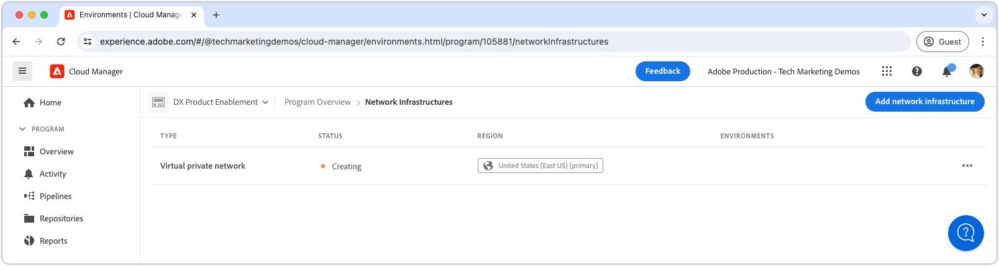

# VPN (Virtual Private Network)

Saiba como conectar o AEM as a Cloud Service com sua VPN para criar canais de comunicação seguros entre o AEM e os serviços internos.

## O que é a rede privada virtual?

A VPN (Virtual Private Network) permite que um cliente as a Cloud Service AEM se conecte **os ambientes AEM** de um programa do Cloud Manager para um existente, [suportado](https://experienceleague.adobe.com/en/docs/experience-manager-cloud-service/content/security/configuring-advanced-networking) VPN. A VPN permite conexões seguras e controladas entre o AEM as a Cloud Service e os serviços na rede do cliente.

Um programa do Cloud Manager só pode ter um __solteiro__ tipo de infraestrutura de rede. Certifique-se de que a Rede Virtual Privada seja a mais [tipo adequado de infraestrutura de rede](https://experienceleague.adobe.com/en/docs/experience-manager-cloud-service/content/security/configuring-advanced-networking) para o AEM as a Cloud Service antes de executar os seguintes comandos.

>[!NOTE]
>
>Observe que não há suporte para a conexão do ambiente de compilação do Cloud Manager a uma VPN. Se você precisar acessar artefatos binários de um repositório privado, configure um repositório seguro e protegido por senha com um URL que esteja disponível na Internet pública [conforme descrito aqui](https://experienceleague.adobe.com/en/docs/experience-manager-cloud-service/content/implementing/using-cloud-manager/create-application-project/setting-up-project).

>[!MORELIKETHIS]
>
> Leia o as a Cloud Service do AEM [documentação avançada de configuração de rede](https://experienceleague.adobe.com/en/docs/experience-manager-cloud-service/content/security/configuring-advanced-networking) para obter mais detalhes sobre a Rede privada virtual.

## Pré-requisitos

Os seguintes itens são necessários ao configurar uma Rede privada virtual usando as APIs do Cloud Manager:

+ conta Adobe com [Permissões do proprietário da empresa no Cloud Manager](https://developer.adobe.com/experience-cloud/cloud-manager/guides/getting-started/permissions/)
+ Acesso a [Credenciais de autenticação da API do Cloud Manager](https://developer.adobe.com/experience-cloud/cloud-manager/guides/getting-started/create-api-integration/)
   + ID da organização (também conhecida como ID da organização IMS)
   + ID do cliente (também conhecida como Chave de API)
   + Token de acesso (também conhecido como Token do portador)
+ A ID do programa do Cloud Manager
+ As IDs de ambiente do Cloud Manager
+ A **Baseado em Rota** Virtual Private Network, com acesso a todos os parâmetros de conexão necessários.

Para obter mais detalhes, assista à seguinte apresentação de como configurar e obter credenciais da API do Cloud Manager e como usá-las para fazer uma chamada de API do Cloud Manager.

>[!VIDEO](https://video.tv.adobe.com/v/342235?quality=12&learn=on)

Este tutorial usa `curl` para fazer as configurações da API do Cloud Manager. Os dados fornecidos `curl` assumem uma sintaxe Linux/macOS. Se estiver usando o prompt de comando do Windows, substitua o `\` caractere de quebra de linha com `^`.

## Habilitar Rede Virtual Privada por programa

Comece habilitando a Rede privada virtual no AEM as a Cloud Service.


>[!BEGINTABS]

>[!TAB Cloud Manager]

A saída de porta flexível pode ser ativada usando o Cloud Manager. As etapas a seguir descrevem como ativar a saída de porta flexível no AEM as a Cloud Service usando o Cloud Manager.

1. Faça logon no [Adobe Experience Manager Cloud Manager](https://experience.adobe.com/cloud-manager/) como Proprietário da empresa do Cloud Manager.
1. Navegue até o Programa desejado.
1. No menu esquerdo, navegue até __Serviços > Infraestrutura de rede__.
1. Selecione o __Adicionar infraestrutura de rede__ botão.

   

1. No __Adicionar infraestrutura de rede__ , selecione a __Rede privada virtual__ opção. Preencha os campos e selecione __Continuar__. Trabalhe com o administrador de rede da organização para obter os valores corretos.

   

1. Crie pelo menos uma conexão VPN. Dê um nome significativo à conexão e selecione o __Adicionar conexão__ botão.

   

1. Configure a conexão VPN. Trabalhe com o administrador de rede da organização para obter os valores corretos. Selecionar __Salvar__ para confirmar a adição da conexão.

   

1. Se forem necessárias várias conexões VPN, forneça mais conexões conforme necessário. Quando todas as conexões VPN forem adicionadas, selecione __Continuar__.

   

1. Selecionar __Salvar__ para confirmar a adição da VPN e todas as conexões configuradas.

   

1. Aguardar a infraestrutura de rede ser criada e marcada como __Pronto__. Esse processo pode levar até 1 hora.

   

Com a VPN criada, agora é possível configurá-la usando as APIs do Cloud Manager, conforme descrito abaixo.

>[!TAB APIs do Cloud Manager]

A Rede privada virtual pode ser ativada usando as APIs do Cloud Manager. As etapas a seguir descrevem como habilitar a VPN no AEM as a Cloud Service usando a API do Cloud Manager.

1. Primeiro, determine a região em que a Rede avançada é necessária usando a API do Cloud Manager [listRegions](https://developer.adobe.com/experience-cloud/cloud-manager/reference/api/) operação. A variável `region name` O é necessário para fazer chamadas de API subsequentes do Cloud Manager. Normalmente, a região em que o ambiente de Produção reside é usada.

   Encontre a região do seu ambiente as a Cloud Service AEM em [Cloud Manager](https://my.cloudmanager.adobe.com) no [detalhes do ambiente](https://experienceleague.adobe.com/en/docs/experience-manager-cloud-service/content/implementing/using-cloud-manager/manage-environments). O nome da região exibido no Cloud Manager pode ser [mapeado para o código de região](https://developer.adobe.com/experience-cloud/cloud-manager/guides/api-usage/creating-programs-and-environments/#creating-aem-cloud-service-environments) usada na API do Cloud Manager.

   __solicitação HTTP listRegions__

   ```shell
   $ curl -X GET https://cloudmanager.adobe.io/api/program/{programId}/regions \
       -H 'x-gw-ims-org-id: <ORGANIZATION_ID>' \
       -H 'x-api-key: <CLIENT_ID>' \
       -H 'Authorization: Bearer <ACCESS_TOKEN>' \
       -H 'Content-Type: application/json'
   ```

1. Ativar a rede privada virtual para um programa do Cloud Manager usando as APIs do Cloud Manager [createNetworkInfrastructure](https://developer.adobe.com/experience-cloud/cloud-manager/reference/api/) operação. Use o `region` código obtido da API do Cloud Manager `listRegions` operação.

   __solicitação HTTP createNetworkInfrastructure__

   ```shell
   $ curl -X POST https://cloudmanager.adobe.io/api/program/{programId}/networkInfrastructures \
       -H 'x-gw-ims-org-id: <ORGANIZATION_ID>' \
       -H 'x-api-key: <CLIENT_ID>' \
       -H 'Authorization: Bearer <ACCESS_TOKEN>' \
       -H 'Content-Type: application/json'
       -d @./vpn-create.json
   ```

   Defina os parâmetros JSON em uma `vpn-create.json` e fornecido para curl via `... -d @./vpn-create.json`.

   [Baixe o exemplo vpn-create.json](./assets/vpn-create.json).  Este arquivo é apenas um exemplo. Configure seu arquivo conforme necessário com base nos campos opcionais/obrigatórios documentados em [enableEnvironmentAdvancedNetworkingConfiguration](https://developer.adobe.com/experience-cloud/cloud-manager/reference/api/).

   ```json
   {
       "kind": "vpn",
       "region": "va7",
       "addressSpace": [
           "10.104.182.64/26"
       ],
       "dns": {
           "resolvers": [
               "10.151.201.22",
               "10.151.202.22",
               "10.154.155.22"
           ],
           "domains": [
               "wknd.site",
               "wknd.com"
           ]
       },
       "connections": [{
           "name": "connection-1",
           "gateway": {
               "address": "195.231.212.78",
               "addressSpace": [
                   "10.151.0.0/16",
                   "10.152.0.0/16",
                   "10.153.0.0/16",
                   "10.154.0.0/16",
                   "10.142.0.0/16",
                   "10.143.0.0/16",
                   "10.124.128.0/17"
               ]
           },
           "sharedKey": "<secret_shared_key>",
           "ipsecPolicy": {
               "dhGroup": "ECP256",
               "ikeEncryption": "AES256",
               "ikeIntegrity": "SHA256",
               "ipsecEncryption": "AES256",
               "ipsecIntegrity": "SHA256",
               "pfsGroup": "ECP256",
               "saDatasize": 102400000,
               "saLifetime": 3600
           }
       }]
   }
   ```

   Aguarde de 45 a 60 minutos para que o programa do Cloud Manager provisione a infraestrutura de rede.

1. Verifique se o ambiente terminou __Rede privada virtual__ configuração usando a API do Cloud Manager [getNetworkInfrastructure](https://developer.adobe.com/experience-cloud/cloud-manager/reference/api/#operation/getNetworkInfrastructure) operação, utilizando o `id` retornado do `createNetworkInfrastructure` Solicitação HTTP na etapa anterior.

   __solicitação HTTP getNetworkInfrastructure__

   ```shell
   $ curl -X GET https://cloudmanager.adobe.io/api/program/{programId}/networkInfrastructure/{networkInfrastructureId} \
       -H 'x-gw-ims-org-id: <ORGANIZATION_ID>' \
       -H 'x-api-key: <CLIENT_ID>' \
       -H 'Authorization: <YOUR_BEARER_TOKEN>' \
       -H 'Content-Type: application/json'
   ```

   Verifique se a resposta HTTP contém um __status__ de __pronto__. Se ainda não estiver pronto, verifique novamente o status a cada poucos minutos.


Com a VPN criada, agora é possível configurá-la usando as APIs do Cloud Manager, conforme descrito abaixo.

>[!ENDTABS]

## Configurar proxies de Rede Virtual Privada por ambiente

1. Habilite e configure o __Rede privada virtual__ configuração em cada ambiente do AEM as a Cloud Service usando a API do Cloud Manager [enableEnvironmentAdvancedNetworkingConfiguration](https://developer.adobe.com/experience-cloud/cloud-manager/reference/api/) operação.

   __solicitação HTTP enableEnvironmentAdvancedNetworkingConfiguration__

   ```shell
   $ curl -X PUT https://cloudmanager.adobe.io/api/program/{programId}/environment/{environmentId}/advancedNetworking \
       -H 'x-gw-ims-org-id: <ORGANIZATION_ID>' \
       -H 'x-api-key: <CLIENT_ID>' \
       -H 'Authorization: Bearer <ACCESS_TOKEN>' \
       -H 'Content-Type: application/json' \
       -d @./vpn-configure.json
   ```

   Defina os parâmetros JSON em uma `vpn-configure.json` e fornecido para curl via `... -d @./vpn-configure.json`.

[Baixe o exemplo vpn-configure.json](./assets/vpn-configure.json)

   ```json
   {
       "nonProxyHosts": [
           "example.net",
           "*.example.org"
       ],
       "portForwards": [
           {
               "name": "mysql.example.com",
               "portDest": 3306,
               "portOrig": 30001
           },
           {
               "name": "smtp.sendgrid.com",
               "portDest": 465,
               "portOrig": 30002
           }
       ]
   }
   ```

   `nonProxyHosts` declara um conjunto de hosts para o qual a porta 80 ou 443 deve ser roteada por meio dos intervalos de endereços IP compartilhados padrão em vez do IP de saída dedicado. `nonProxyHosts` pode ser útil, pois a criação de tráfego por meio de IPs compartilhados é otimizada automaticamente pelo Adobe.

   Para cada `portForwards` de rede avançada define a seguinte regra de encaminhamento:

   | Host do proxy | Porta do proxy |  | Host externo | Porta externa |
   |---------------------------------|----------|----------------|------------------|----------|
   | `AEM_PROXY_HOST` | `portForwards.portOrig` | → | `portForwards.name` | `portForwards.portDest` |

   Se a sua implantação do AEM __somente__ exige conexões HTTP/HTTPS para o serviço externo, deixe o `portForwards` matriz vazia, pois essas regras são necessárias somente para solicitações não HTTP/HTTPS.


2. Para cada ambiente, valide se as regras de roteamento VPN estão em vigor usando as APIs do Cloud Manager [getEnvironmentAdvancedNetworkingConfiguration](https://developer.adobe.com/experience-cloud/cloud-manager/reference/api/) operação.

   __solicitação HTTP getEnvironmentAdvancedNetworkingConfiguration__

   ```shell
   $ curl -X GET https://cloudmanager.adobe.io/api/program/{programId}/environment/{environmentId}/advancedNetworking \
       -H 'x-gw-ims-org-id: <ORGANIZATION_ID>' \
       -H 'x-api-key: <CLIENT_ID>' \
       -H 'Authorization: Bearer <ACCESS_TOKEN>' \
       -H 'Content-Type: application/json'
   ```

3. As configurações de proxy de rede privada virtual podem ser atualizadas usando a API do Cloud Manager [enableEnvironmentAdvancedNetworkingConfiguration](https://developer.adobe.com/experience-cloud/cloud-manager/reference/api/) operação. Lembrar `enableEnvironmentAdvancedNetworkingConfiguration` é um `PUT` para que todas as regras sejam fornecidas com cada chamada desta operação.

4. Agora, você pode usar a configuração de saída da rede privada virtual em seu código e configuração personalizados do AEM.

## Conexão com serviços externos através da Rede Virtual Privada

Com a rede privada virtual ativada, o código e a configuração do AEM podem usá-los para fazer chamadas para serviços externos por meio da VPN. Há duas opções de chamadas externas que o AEM trata de forma diferente:

1. Chamadas HTTP/HTTPS para serviços externos
   + Inclui chamadas HTTP/HTTPS feitas para serviços executados em portas diferentes das portas padrão 80 ou 443.
1. chamadas não HTTP/HTTPS para serviços externos
   + Inclui chamadas não HTTP, como conexões com servidores de email, bancos de dados SQL ou serviços que são executados em outros protocolos não HTTP/HTTPS.

As solicitações HTTP/HTTPS do AEM em portas padrão (80/443) são permitidas por padrão, mas não usam a conexão VPN se não estiverem configuradas adequadamente conforme descrito abaixo.

### HTTP/HTTPS

Ao criar conexões HTTP/HTTPS a partir do AEM, ao usar VPN, as conexões HTTP/HTTPS são automaticamente enviadas por proxy do AEM. Nenhum código ou configuração adicional é necessário para oferecer suporte a conexões HTTP/HTTPS.

>[!TIP]
>
> Consulte a documentação da Rede privada virtual do AEM as a Cloud Service para [o conjunto completo de regras de roteamento](https://experienceleague.adobe.com/en/docs/experience-manager-cloud-service/content/security/configuring-advanced-networking).

#### Exemplos de código

<table>
<tr>
<td>
    <a  href="./examples/http-dedicated-egress-ip-vpn.md"></a>
    <div><strong><a href="./examples/http-dedicated-egress-ip-vpn.md">HTTP/HTTPS</a></strong></div>
    <p>
        Exemplo de código Java™ que faz a conexão HTTP/HTTPS do AEM as a Cloud Service para um serviço externo usando o protocolo HTTP/HTTPS.
    </p>
</td>
<td></td>
<td></td>
</tr>
</table>

### Exemplos de código de conexões não HTTP/HTTPS

Ao criar conexões não HTTP/HTTPS (por exemplo, SQL, SMTP e assim por diante) do AEM, a conexão deve ser feita por meio de um nome de host especial fornecido pelo AEM.

| Nome da variável | Utilização | Código Java™ | Configuração OSGi |
| - |  - | - | - |
| `AEM_PROXY_HOST` | Host proxy para conexões não HTTP/HTTPS | `System.getenv("AEM_PROXY_HOST")` | `$[env:AEM_PROXY_HOST]` |


As conexões com serviços externos são então chamadas por meio do `AEM_PROXY_HOST` e a porta mapeada (`portForwards.portOrig`), que o AEM roteia para o nome de host externo mapeado (`portForwards.name`) e porta (`portForwards.portDest`).

| Host do proxy | Porta do proxy |  | Host externo | Porta externa |
|---------------------------------|----------|----------------|------------------|----------|
| `AEM_PROXY_HOST` | `portForwards.portOrig` | → | `portForwards.name` | `portForwards.portDest` |


#### Exemplos de código

<table><tr>
   <td>
      <a  href="./examples/sql-datasourcepool.md"></a>
      <div><strong><a href="./examples/sql-datasourcepool.md">Conexão SQL usando JDBC DataSourcePool</a></strong></div>
      <p>
            Exemplo de código Java™ conectando-se a bancos de dados SQL externos configurando o pool de fontes de dados JDBC do AEM.
      </p>
    </td>
   <td>
      <a  href="./examples/sql-java-apis.md"></a>
      <div><strong><a href="./examples/sql-java-apis.md">Conexão SQL usando APIs Java™</a></strong></div>
      <p>
            Exemplo de código Java™ conectando-se a bancos de dados SQL externos usando APIs SQL do Java™.
      </p>
    </td>
   <td>
      <a  href="./examples/email-service.md"></a>
      <div><strong><a href="./examples/email-service.md">Serviço de e-mail</a></strong></div>
      <p>
        Exemplo de configuração OSGi usando AEM para se conectar a serviços de email externos.
      </p>
    </td>
</tr></table>

### Limitar o acesso ao AEM as a Cloud Service via VPN

A configuração da Rede privada virtual limita o acesso a ambientes as a Cloud Service AEM para uma VPN.

#### Exemplos de configuração

<table><tr>
   <td>
      <a href="https://experienceleague.adobe.com/en/docs/experience-manager-cloud-service/content/implementing/using-cloud-manager/ip-allow-lists/apply-allow-list"></a>
      <div><strong><a href="https://experienceleague.adobe.com/en/docs/experience-manager-cloud-service/content/implementing/using-cloud-manager/ip-allow-lists/apply-allow-list">Aplicação de uma inclui na lista de permissões de IP</a></strong></div>
      <p>
            Configure uma inclui na lista de permissões de IP de modo que somente o tráfego de VPN possa acessar o AEM.
      </p>
    </td>
   <td>
      <a  href="https://experienceleague.adobe.com/en/docs/experience-manager-cloud-service/content/security/configuring-advanced-networking"></a>
      <div><strong><a href="https://experienceleague.adobe.com/en/docs/experience-manager-cloud-service/content/security/configuring-advanced-networking">Restrições de acesso à VPN baseada em caminho para publicação no AEM</a></strong></div>
      <p>
            Exigir acesso VPN para caminhos específicos na publicação do AEM.
      </p>
    </td>
   <td></td>
</tr></table>
