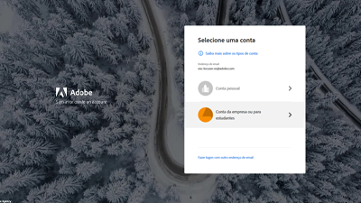

# Visão geral {#overview}

Agora o Adobe Experience Manager (AEM) está disponível as a Cloud Service. AEM como Cloud Service introduz a próxima geração da linha de produtos Experience Manager, com base em investimentos e inovações passados, preservando e ampliando todos os casos de uso e funcionalidades.

>[!VIDEO](https://video.tv.adobe.com/v/31085/?quality=12&learn=on)

## Novidades

* **[Extensibilidade de microserviços do asset compute (Tutorial)](./asset-compute/overview.md)**

   *Saiba como desenvolver funcionários de Asset computes para gerar representações de ativos personalizados*

* **[Configuração do acesso ao AEM como Cloud Service (Tutorial)](./accessing/overview.md)**

   *Saiba como configurar usuários do IMS no Adobe Admin Console para que possam acessar AEM*

* **[Depuração de AEM como Cloud Service (Tutorial)](./debugging/cloud-service/overview.md)**

   *Explore como depurar AEM como um Cloud Service*

* **[Depuração AEM SDK (Tutorial)](./debugging/aem-sdk-local-quickstart/overview.md)**

   *Explore as várias ferramentas usadas para depurar seu aplicativo no AEM como uma inicialização rápida local do SDK do Cloud Service*

* **[Configuração do Ambiente de desenvolvimento local (Tutorial)](./local-development-environment/overview.md)**

   *Saiba como configurar sua máquina de desenvolvimento local para AEM como um desenvolvimento de Cloud Service*

## Separações de Pessoal

<table>
   <td>
      
      

         <a href="./accessing/overview.md">
         <strong>Configuração do acesso a AEM tutorial</strong>
         </a>
      

      

         <em>Configure usuários IMS no Adobe Admin Console para acessar AEM.</em>
      

   </td>   
   <td>
      
      

         <a href="./local-development-environment/overview.md">
         <strong>Tutorial de configuração do Ambiente de desenvolvimento local</strong>
         </a>
      

      

         <em>Prepare sua máquina de desenvolvimento local para AEM como um desenvolvimento de Cloud Service!</em>
      

   </td>   
   <td>
      
      

         <a href="./debugging/aem-sdk-local-quickstart/overview.md">
         <strong>Depuração AEM SDK</strong>
         </a>
      

      

         <em>Explore as ferramentas usadas para depurar seu aplicativo no AEM como uma inicialização rápida local do SDK do Cloud Service.</em>
      

   </td>
</table>

## Recursos adicionais

* [Experience League - Explore o Adobe Experience Manager](https://experienceleague.adobe.com/#recommended/solutions/experience-manager)
* [Adobe Experience Manager como uma documentação do Cloud Service](https://docs.adobe.com/content/help/en/experience-manager-cloud-service/landing/home.html)
