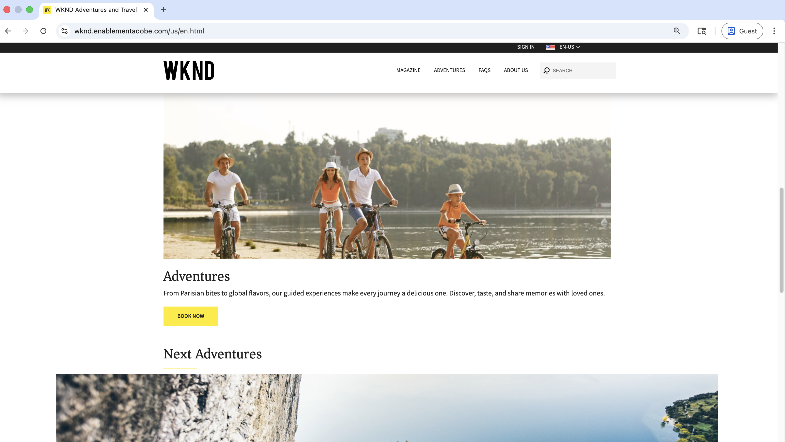
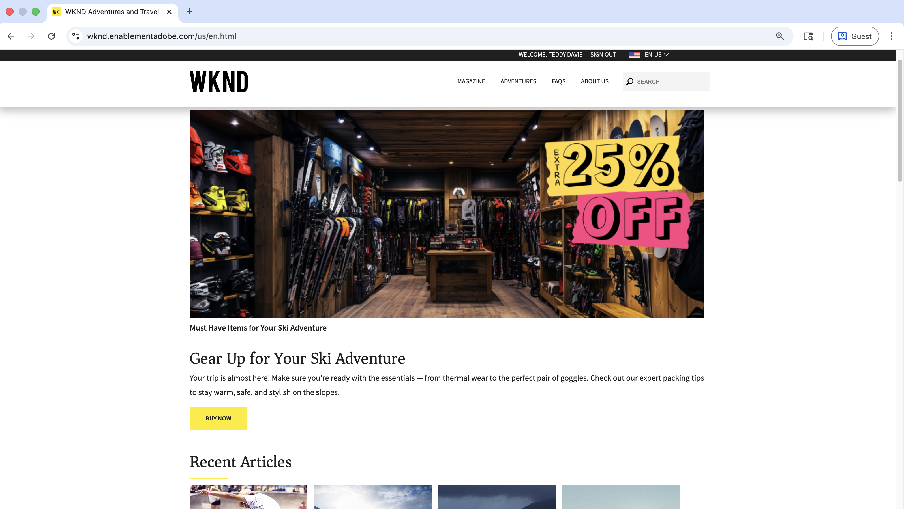

# Demonstração em tempo real de casos de uso de personalização

Visite o [site de Ativação da WKND](https://wknd.enablementadobe.com/us/en.html){target="wknd"} para ver exemplos reais de testes A/B, definição de metas comportamentais e personalização de usuários conhecidos.

>[!VIDEO](https://video.tv.adobe.com/v/3476461/?learn=on&enablevpops)

Esta página o orienta por meio de demonstrações práticas de cada cenário de personalização. Use-o para explorar o que é possível antes de criar esses recursos em seu próprio site do AEM.

>[!IMPORTANT]
>
> Abra o site de demonstração em várias janelas do navegador ou no modo de navegação incógnito/privado para experimentar diferentes variações personalizadas simultaneamente.
> Ao usar o modo de navegação privado, o Firefox e o Safari podem bloquear o cookie ECID. Como alternativa, use o modo de navegação regular ou limpe os cookies antes de tentar um novo cenário de personalização.

## Casos de uso de demonstração

O [site de Habilitação do WKND](https://wknd.enablementadobe.com/us/en.html){target="wknd"} demonstra três tipos de personalização:

| Tipo de Personalization | O que você verá | Horário |
|---------------------|-----------------|---------|
| **Direcionamento comportamental** | O conteúdo se adapta com base no comportamento e nos interesses de navegação. Geralmente chamada de _personalização de próxima página ou mesma página_ | Tempo real e lote |
| **Personalization de usuário conhecido** | Experiências personalizadas com base em perfis completos de clientes criados a partir de dados de vários sistemas. Geralmente chamado de _personalização em escala_ | Tempo real |
| **Teste A/B** | Diferentes variações de conteúdo testadas para encontrar o melhor desempenho. Geralmente citado como _experimentação_ | Tempo real |

## Segmentação comportamental

O conteúdo se adapta automaticamente com base nas ações e interesses do visitante durante a sessão de navegação. Geralmente, isso é chamado de _personalização de próxima página ou de mesma página_.

### Páginas Início, Aventuras e Revistas

Essas experiências são exibidas imediatamente com base no comportamento de navegação atual (personalização em tempo real). O Adobe Experience Platform Edge Network é usado para tomar decisões de personalização em tempo real.

| Página | O que você verá | Como testar | Experiência |
|------|-----------------|-------------|------------|
| [Residência](https://wknd.enablementadobe.com/us/en.html){target="wknd"} | Um **banner de herói de Aventuras familiar** personalizado com um ciclismo familiar junto a um lago, promovendo experiências guiadas que criam memórias compartilhadas | Visite o [Campo de Surf de Bali](https://wknd.enablementadobe.com/us/en/adventures/bali-surf-camp.html){target="wknd"} ou o [Tour pelo Gastronomic Marais](https://wknd.enablementadobe.com/us/en/adventures/gastronomic-marais-tour.html){target="wknd"} e volte à página inicial | {width="200" zoomable="yes"} |
| [Aventuras](https://wknd.enablementadobe.com/us/en/adventures.html){target="wknd"} | Um herói promocional **&quot;Free Bike Tune Up&quot; focado no ciclismo** com mensagens &quot;We&#39;ve Got You Covered&quot; e oferta de manutenção de bicicleta complementar dos parceiros especialistas da WKND | Visite qualquer aventura relacionada a ciclismo (por exemplo, [Toscana de Ciclismo](https://wknd.enablementadobe.com/us/en/adventures/cycling-tuscany.html){target="wknd"}) e acesse a página Aventuras | {width="200" zoomable="yes"} |
| [Aventuras](https://wknd.enablementadobe.com/us/en/adventures.html){target="wknd"} | Um **herói da coleção de engrenagens** com tema de acampamento apresentando equipamentos essenciais de acampamento (sacos de dormir, jaquetas, botas) com a mensagem &quot;Sua Próxima Aventura Começa com a Engrenagem Certa&quot; | Visite qualquer aventura relacionada ao acampamento (por exemplo, [Yosemite Backpacking](https://wknd.enablementadobe.com/us/en/adventures/yosemite-backpacking.html){target="wknd"}) e acesse a página Aventuras | {width="200" zoomable="yes"} |
| [Revista](https://wknd.enablementadobe.com/us/en/magazine.html){target="wknd"} | Uma **promoção de venda de revista** sensível ao tempo, com revistas WKND enroladas com &quot;VENDA!&quot; proeminente medalhas e preços de leitores especiais em edições e coleções externas | Leia um ou mais artigos da revista (por exemplo, [Ski Touring](https://wknd.enablementadobe.com/us/en/magazine/ski-touring.html){target="wknd"}) e navegue até a página de aterrissagem da revista | {width="200" zoomable="yes"} |

### Páginas Aventuras e Revistas (lote)

Essas experiências são baseadas no comportamento histórico e aparecem na próxima visita ou posteriormente no mesmo dia (personalização em lote). Os dados são agregados, processados em atributos de perfil e ativados para o Adobe Experience Platform Edge Network.

| Página | O que você verá | Como testar | Experiência |
|------|-----------------|-------------|------------|
| [Aventuras](https://wknd.enablementadobe.com/us/en/adventures.html){target="wknd"} | Um herói com temas de surf apresentando **pranchas coloridas sob palmeiras** com mensagens &quot;Sua Jornada de Surf começa aqui&quot; e conteúdo de destino de surf com curadoria baseado em seus interesses | Visite várias [aventuras relacionadas a surfe](https://wknd.enablementadobe.com/us/en/adventures.html#tabs-b4210c6ff3-item-b411b19941-tab){target="wknd"} e retorne à página Aventuras no dia seguinte | {width="200" zoomable="yes"} |
| [Revista](https://wknd.enablementadobe.com/us/en/magazine.html){target="wknd"} | Uma **oferta de assinatura de revista personalizada** apresentando destinos de viagem mundiais com uma van VW clássica, enfatizando &quot;Sua experiência de revista personalizada&quot; com benefícios exclusivos de assinantes | Leia 3 ou mais [artigos de revistas](https://wknd.enablementadobe.com/us/en/magazine.html){target="wknd"} e volte à página de aterrissagem da Revista no dia seguinte | {width="200" zoomable="yes"} |

**Saiba mais:** Pronto para implementar o direcionamento comportamental no seu próprio site do AEM? Comece com o [Tutorial de direcionamento comportamental](./use-cases/behavioral-targeting.md) para saber mais sobre o processo de configuração completo.

## Personalização de usuário conhecido

Experiências personalizadas com base em perfis completos de clientes criados a partir de dados de vários sistemas, incluindo o histórico de compras e o estágio de ciclo de vida do cliente. O Adobe Experience Platform Edge Network é usado para tomar decisões de personalização em tempo real.

### Herói da página inicial

O banner principal da página inicial do WKND é personalizado com base em perfis de usuário autenticados. Teste com estas contas de demonstração para ver uma experiência personalizada:

| Página | O que você verá | Como testar | Contexto do perfil | Experiência |
|------|-----------------|-------------|-----------------|------------|
| [Residência](https://wknd.enablementadobe.com/us/en.html){target="wknd"} | Um interior de loja de esqui apresentando **equipamentos de esqui premium com promoção &quot;EXTRA 25% OFF&quot;**, com dicas de embalagem especializadas para se preparar para sua próxima aventura de esqui | Entre com `rwilson/rwilson` e atualize a página | Aventuras de esqui recentemente compradas, revendendo equipamentos de esqui | {width="200" zoomable="yes"} |

**Saiba mais:** Pronto para implementar a personalização de usuário conhecido no seu próprio site do AEM? Comece com o [Tutorial do Personalization para usuários conhecidos](./use-cases/known-user-personalization.md) para saber mais sobre o processo de configuração completo.

## Teste A/B (experimentação)

Teste diferentes variações de conteúdo para determinar qual tem o melhor desempenho para suas metas comerciais. O Adobe Target disponibiliza aleatoriamente diferentes variações para visitantes e faixas com melhor desempenho. Geralmente, isso é chamado de _experimentação_.

### Artigo em destaque da página inicial

A página inicial da WKND executa um teste A/B ativo com três variações do artigo em destaque _Camping na Austrália Ocidental_. Cada visitante é atribuído aleatoriamente para ver uma dessas variações:

| Página | O que você verá | Como testar | Experiência |
|------|-----------------|-------------|------------|
| [Residência](https://wknd.enablementadobe.com/us/en.html){target="wknd"} | Uma das três variações de artigo em destaque atribuídas aleatoriamente na seção &quot;Our Feature&quot;: **&quot;Off the Grid: Epic Camping Routes Across Western Australia&quot;** ou **&quot;Wandering the Wild: Camping Adventures in Western Australia&quot;** (ou uma terceira variação), cada uma com imagens e mensagens exclusivas para testar qual é a melhor resposta | Visite a página inicial em navegadores diferentes, use o modo incógnito/privado ou limpe os cookies para ver diferentes variações | {width="200" zoomable="yes"} |

**Saiba mais:** Pronto para implementar o teste A/B no seu próprio site do AEM? Comece com o [Tutorial de experimentação (teste A/B)](./use-cases/experimentation.md) para saber mais sobre o processo completo de instalação.

## Próximas etapas

Pronto para implementar a personalização em seu próprio site do AEM? Comece com a [Visão geral do Personalization](./overview.md) para saber mais sobre o processo de configuração completo.

