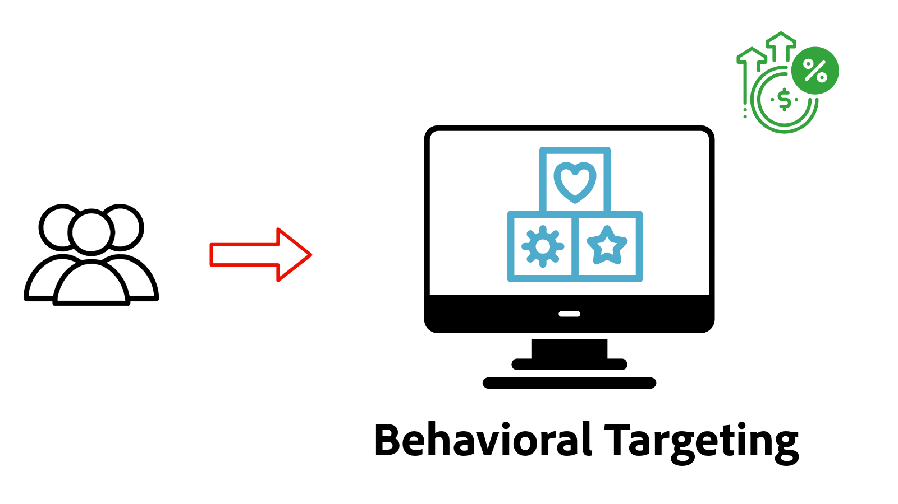

# Visão geral da personalização

Saiba como o AEM as a Cloud Service (AEMCS) se integra ao Adobe Target e ao Adobe Experience Platform (AEP) para fornecer experiências personalizadas. Usando fragmentos de experiência como conteúdo personalizado, descubra como executar testes A/B, direcionar usuários com base no comportamento em tempo real ou personalizar conteúdo usando perfis unificados de clientes criados a partir de dados em vários sistemas.

## Pré-requisitos

Para demonstrar vários cenários de personalização, este tutorial usa a amostra de projeto [WKND](https://github.com/adobe/aem-guides-wknd/) do AEM. Em seguida, é necessário:

- Uma organização da Adobe com acesso a:
   - **Ambiente do AEM as a Cloud Service** - para criar e gerenciar conteúdo
   - **Adobe Target** - para compor e entregar experiências personalizadas
   - **aplicativos do Adobe Experience Platform** - para gerenciar perfis e públicos-alvo de clientes
   - **Marcas (antigo Launch) na AEP** - para implantar a Web SDK e o JavaScript personalizado para coleta e personalização de dados

- Uma compreensão básica dos componentes do AEM e Fragmentos de experiência

- O projeto [WKND](https://github.com/adobe/aem-guides-wknd/) do AEM foi implantado em seu ambiente AEM as a Cloud Service.

## Demonstração em tempo real de casos de uso do Personalization

Personalização de experiência em ação no [site de Habilitação do WKND](https://wknd.enablementadobe.com/us/en.html){target="_blank"}. O site de demonstração demonstra três tipos de personalização: teste A/B, direcionamento comportamental e personalização de usuário conhecido.

>[!TIP]
>
> Explorar a demonstração ao vivo primeiro ajuda você a entender o valor e os recursos de cada técnica de personalização antes de investir tempo na configuração e na implementação.

<!-- CARDS
{target = _self}

* ./live-demo.md
  {title = Live Demo of Personalization Use Cases}
  {description = Experience personalization in action on the [WKND Enablement website](https://wknd.enablementadobe.com/us/en.html). The demo site demonstrates three types of personalization: A/B testing, behavioral targeting, and known-user personalization.}
  {image = ./assets/live-demo/live-demo.png}
  {cta = Live Demo}
-->
<!-- START CARDS HTML - DO NOT MODIFY BY HAND -->

    

        

            

                <figure class="image x-is-16by9">
                    
                </figure>
            

            

                

                    

                        <a href="./live-demo.md" target="_self" rel="referrer" title="Demonstração em tempo real de casos de uso do Personalization">Demonstração em tempo real dos casos de uso do Personalization</a>
                    

                    
Personalização de experiência em ação no site de Ativação da WKND. O site de demonstração demonstra três tipos de personalização: teste A/B, direcionamento comportamental e personalização de usuário conhecido.

                

                <a href="./live-demo.md" target="_self" rel="referrer" class="spectrum-Button spectrum-Button--outline spectrum-Button--primary spectrum-Button--sizeM" style="align-self: flex-start; margin-top: 1rem;">
                    Demonstração ao vivo
                </a>
            

        

    

<!-- END CARDS HTML - DO NOT MODIFY BY HAND -->

## Introdução

Antes de explorar casos de uso específicos, primeiro configure o AEM as a Cloud Service para personalização. Comece integrando o Adobe Target e as tags para permitir a personalização no lado do cliente usando a Web SDK. Essas etapas fundamentais permitem que suas páginas do AEM sejam compatíveis com experimentação, direcionamento de público-alvo e personalização em tempo real.

<!-- CARDS
{target = _self}

* ./setup/integrate-adobe-target.md
  {title = Integrate Adobe Target}
  {description = Integrate AEMCS with Adobe Target to activate personalized content, such as Experience Fragments, as offers.}
  {image = ./assets/setup/integrate-target.png}
  {cta = Integrate Target}

* ./setup/integrate-adobe-tags.md
  {title = Integrate Tags}
  {description = Integrate AEMCS with Tags to inject the Web SDK and custom JavaScript for data collection and personalization.}
  {image = ./assets/setup/integrate-tags.png}
  {cta = Integrate Tags}
  
-->
<!-- START CARDS HTML - DO NOT MODIFY BY HAND -->

    

        

            

                <figure class="image x-is-16by9">
                    
                </figure>
            

            

                

                    

                        <a href="./setup/integrate-adobe-target.md" target="_self" rel="referrer" title="Integrar o Adobe Target">Integrar o Adobe Target</a>
                    

                    
Integre o AEM CS com o Adobe Target para ativar conteúdo personalizado, como Fragmentos de experiência, como ofertas.

                

                <a href="./setup/integrate-adobe-target.md" target="_self" rel="referrer" class="spectrum-Button spectrum-Button--outline spectrum-Button--primary spectrum-Button--sizeM" style="align-self: flex-start; margin-top: 1rem;">
                    Integrar o Target
                </a>
            

        

    

    

        

            

                <figure class="image x-is-16by9">
                    
                </figure>
            

            

                

                    

                        <a href="./setup/integrate-adobe-tags.md" target="_self" rel="referrer" title="Integrar tags">Integrar marcas</a>
                    

                    
Integre o AEMCS com tags para inserir o Web SDK e o JavaScript personalizado para coleta e personalização de dados.

                

                <a href="./setup/integrate-adobe-tags.md" target="_self" rel="referrer" class="spectrum-Button spectrum-Button--outline spectrum-Button--primary spectrum-Button--sizeM" style="align-self: flex-start; margin-top: 1rem;">
                    Integrar Marcas
                </a>
            

        

    

<!-- END CARDS HTML - DO NOT MODIFY BY HAND -->

## Casos de uso

Explore os seguintes casos de uso comuns de personalização compatíveis com o AEM, o Adobe Target e o Adobe Experience Platform.

<!-- CARDS
{target = _self}

* ./use-cases/experimentation.md
    {title = Experimentation (A/B Testing)}
    {description = Learn how to test different content variations on an AEMCS website using Adobe Target for A/B testing.}
    {image = ./assets/use-cases/experiment/experimentation.png}
    {cta = Learn Experimentation}

* ./use-cases/behavioral-targeting.md
    {title = Behavioral Targeting}
    {description = Learn how to personalize content based on user behavior using Adobe Experience Platform and Adobe Target.}
    {image = ./assets/use-cases/behavioral-targeting/behavioral-targeting.png}
    {cta = Learn Behavioral Targeting}

* ./use-cases/known-user-personalization.md
    {title = Known-user personalization}
    {description = Learn how to personalize content based on known user data by stitching information from multiple systems into a complete customer profile.}
    {image = ./assets/use-cases/known-user-personalization/known-user-personalization.png}
    {cta = Learn Known-user personalization}
-->
<!-- START CARDS HTML - DO NOT MODIFY BY HAND -->

    

        

            

                <figure class="image x-is-16by9">
                    
                </figure>
            

            

                

                    

                        <a href="./use-cases/experimentation.md" target="_self" rel="referrer" title="Experimentação (teste A/B)">Experimentação (Teste A/B)</a>
                    

                    
Saiba como testar diferentes variações de conteúdo em um site do AEM CS usando o Adobe Target para testes A/B.

                

                <a href="./use-cases/experimentation.md" target="_self" rel="referrer" class="spectrum-Button spectrum-Button--outline spectrum-Button--primary spectrum-Button--sizeM" style="align-self: flex-start; margin-top: 1rem;">
                    Aprender experimentação
                </a>
            

        

    

    

        

            

                <figure class="image x-is-16by9">
                    
                </figure>
            

            

                

                    

                        <a href="./use-cases/behavioral-targeting.md" target="_self" rel="referrer" title="Direcionamento comportamental">Direcionamento comportamental</a>
                    

                    
Saiba como personalizar o conteúdo com base no comportamento do usuário usando o Adobe Experience Platform e o Adobe Target.

                

                <a href="./use-cases/behavioral-targeting.md" target="_self" rel="referrer" class="spectrum-Button spectrum-Button--outline spectrum-Button--primary spectrum-Button--sizeM" style="align-self: flex-start; margin-top: 1rem;">
                    Aprender Direcionamento comportamental
                </a>
            

        

    

    

        

            

                <figure class="image x-is-16by9">
                    
                </figure>
            

            

                

                    

                        <a href="./use-cases/known-user-personalization.md" target="_self" rel="referrer" title="Personalização de usuário conhecido">Personalização de usuário conhecido</a>
                    

                    
Saiba como personalizar o conteúdo com base em dados de usuários conhecidos, compilando informações de vários sistemas em um perfil de cliente completo.

                

                <a href="./use-cases/known-user-personalization.md" target="_self" rel="referrer" class="spectrum-Button spectrum-Button--outline spectrum-Button--primary spectrum-Button--sizeM" style="align-self: flex-start; margin-top: 1rem;">
                    Saiba mais sobre a personalização de usuário conhecido
                </a>
            

        

    

<!-- END CARDS HTML - DO NOT MODIFY BY HAND -->
