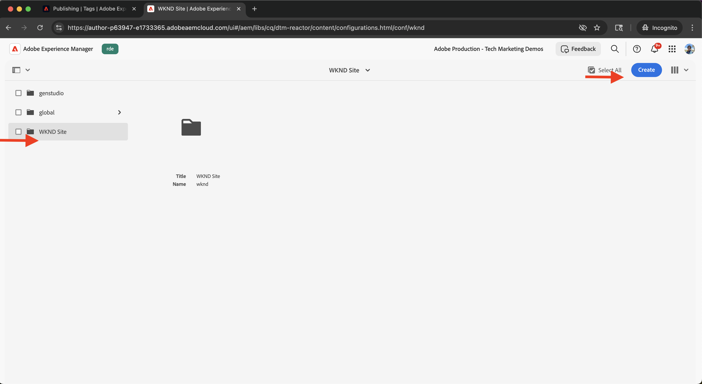

# Integrar tags na Adobe Experience Platform

Saiba como integrar o AEM as a Cloud Service (AEMCS) com tags na Adobe Experience Platform. A integração de Tags (também conhecida como Launch) permite implantar a Adobe Web SDK e inserir JavaScript personalizado para coleta e personalização de dados em suas páginas do AEM.

A integração permite que sua equipe de marketing ou desenvolvimento gerencie e implante o JavaScript para personalização e coleta de dados, sem precisar reimplantar o código do AEM.

## Etapas de alto nível

O processo de integração envolve quatro etapas principais que estabelecem a conexão entre o AEM e as tags:

1. **Criar, configurar e publicar uma propriedade de marcas no Adobe Experience Platform**
2. **Verificar uma configuração do Adobe IMS para Marcas no AEM**
3. **Criar uma configuração de Marcas no AEM**
4. **Aplicar a configuração de Marcas às suas páginas do AEM**

## Criar, configurar e publicar uma propriedade de tags no Adobe Experience Platform

Comece criando uma propriedade de Tags no Adobe Experience Platform. Essa propriedade ajuda você a gerenciar a implantação do Adobe Web SDK e de qualquer JavaScript personalizada necessária para personalização e coleta de dados.

1. Vá para a [Adobe Experience Platform](https://experience.adobe.com/platform), entre com sua Adobe ID e navegue até **Marcas** no menu à esquerda.\
   

2. Clique em **Nova propriedade** para criar uma nova propriedade de marcas.\
   

3. Na caixa de diálogo **Criar Propriedade**, digite o seguinte:
   - **Nome da propriedade**: um nome para a propriedade de marcas
   - **Tipo de Propriedade**: Selecionar **Web**
   - **Domínio**: o domínio onde você implanta a propriedade (por exemplo, `.adobeaemcloud.com`)

   Clique em **Salvar**.

   

4. Abra a nova propriedade. A extensão **Core** já deve estar incluída. Posteriormente, você adicionará a extensão **Web SDK** ao configurar o caso de uso Experimentação, pois ela requer configuração adicional, como a **ID de sequência de dados**.\
   

5. Publique a propriedade Tags em **Fluxo de Publicação** e clicando em **Adicionar Biblioteca** para criar uma biblioteca de implantação.
   

6. Na caixa de diálogo **Criar Biblioteca**, forneça:
   - **Nome**: um nome para a biblioteca
   - **Ambiente**: Selecionar **Desenvolvimento**
   - **Alterações de Recursos**: Escolher **Adicionar Todos os Recursos Alterados**

   Clique em **Salvar e criar no desenvolvimento**.

    de marcas do Adobe

7. Para publicar a biblioteca na produção, clique em **Aprovar e publicar na produção**. Quando a publicação estiver concluída, a propriedade estará pronta para uso no AEM.\
   

## Verificar uma configuração do Adobe IMS para tags na AEM

Quando um ambiente do AEMCS é provisionado, ele inclui automaticamente uma configuração do Adobe IMS para tags, juntamente com um projeto correspondente do Adobe Developer Console. Essa configuração garante a comunicação de API segura entre o AEM e as tags.

1. No AEM, navegue até **Ferramentas** > **Segurança** > **Configurações do Adobe IMS**.\
   

2. Localize a configuração do **Adobe Launch**. Se disponível, selecione-a e clique em **Verificar Integridade** para verificar a conexão. Você deve ver uma resposta de sucesso.\
   

## Criar uma configuração de tags no AEM

Crie uma configuração de Tags no AEM para especificar a propriedade e as configurações necessárias para as páginas do site.

1. No AEM, vá para **Ferramentas** > **Serviços na Nuvem** > **Configurações do Adobe Launch**.\
   

2. Selecione a pasta raiz do site (por exemplo, Site WKND) e clique em **Criar**.\
   

3. Na caixa de diálogo, digite o seguinte:
   - **Título**: por exemplo, &quot;Marcas Adobe&quot;
   - **Configuração do IMS**: selecione a configuração do IMS verificada do **Adobe Launch**
   - **Empresa**: selecione a empresa vinculada à sua propriedade de marcas
   - **Propriedade**: escolha a propriedade Marcas criada anteriormente

   Clique em **Avançar**.

   

4. Para fins de demonstração, mantenha os valores padrão para ambientes de **Preparo** e **Produção**. Clique em **Criar**.\
   

5. Selecione a configuração recém-criada e clique em **Publicar** para disponibilizá-la para as páginas do site.\
   

## Aplicar a configuração de tags ao seu site do AEM

Aplique a configuração de Tags para inserir o Web SDK e a lógica de personalização nas páginas do site.

1. No AEM, vá para **Sites**, selecione a pasta do site raiz (por exemplo, Site WKND) e clique em **Propriedades**.\
   

2. Na caixa de diálogo **Propriedades do Site**, abra a guia **Avançado**. Em **Configurações**, verifique se `/conf/wknd` está selecionado para **Configuração na Nuvem**.\
   

## Verificar a integração

Para confirmar se a configuração de Tags está funcionando corretamente, você pode:

1. Verifique a origem de exibição de uma página de publicação do AEM ou inspecione-a usando as ferramentas de desenvolvedor do navegador
2. Usar o [Adobe Experience Platform Debugger](https://chromewebstore.google.com/detail/adobe-experience-platform/bfnnokhpnncpkdmbokanobigaccjkpob) para validar a injeção do Web SDK e do JavaScript

## Recursos adicionais

- [visão geral do Adobe Experience Platform Debugger](https://experienceleague.adobe.com/en/docs/experience-platform/debugger/home)
- [Visão geral das tags](https://experienceleague.adobe.com/en/docs/experience-platform/tags/home)
