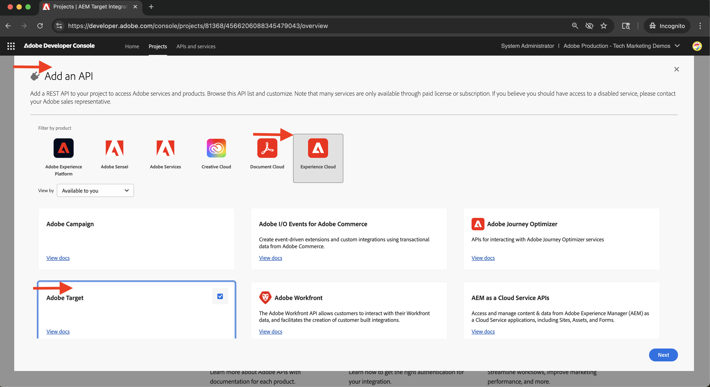

# Integrar o Adobe Target

Saiba como integrar o AEM as a Cloud Service (AEMCS) ao Adobe Target para ativar conteúdo personalizado, como fragmentos de experiência, como ofertas no Adobe Target.

A integração permite que sua equipe de marketing crie e gerencie conteúdo personalizado centralmente no AEM. Esse conteúdo pode ser ativado facilmente como ofertas no Adobe Target.

>[!IMPORTANT]
>
>A etapa de integração é opcional se sua equipe preferir gerenciar ofertas totalmente no Adobe Target, sem usar o AEM como um repositório de conteúdo centralizado.

## Etapas de alto nível

O processo de integração envolve quatro etapas principais que estabelecem a conexão entre o AEM e o Adobe Target:

1. **Criar e configurar um projeto do Adobe Developer Console**
2. **Criar uma configuração do Adobe IMS para o Target no AEM**
3. **Criar uma configuração herdada do Adobe Target no AEM**
4. **Aplicar a configuração do Adobe Target aos Fragmentos de experiência**

## Criar e configurar um projeto do Adobe Developer Console

Para permitir que o AEM se comunique com segurança com o Adobe Target, você deve configurar um projeto do Adobe Developer Console usando a autenticação de servidor para servidor do OAuth. Você pode usar um projeto existente ou criar um novo.

1. Vá para a [Adobe Developer Console](https://developer.adobe.com/console) e entre com sua Adobe ID.

2. Crie um novo projeto ou selecione um existente.\
   

3. Clique em **Adicionar API**. Na caixa de diálogo **Adicionar uma API**, filtre por **Experience Cloud**, selecione **Adobe Target** e clique em **Avançar**.\
   

4. Na caixa de diálogo **Configurar API**, selecione o método de autenticação **Servidor para Servidor do OAuth** e clique em **Avançar**.\
   

5. Na etapa **Selecionar Perfis de Produto**, selecione o **Workspace Padrão** e clique em **Salvar API Configurada**.\
   

6. Na navegação à esquerda, selecione **OAuth Server-to-Server** e revise os detalhes de configuração. Observe a ID do cliente e o Segredo do cliente - você precisa desses valores para configurar a integração do IMS no AEM.
   

## Criar uma configuração do Adobe IMS para o Target no AEM

No AEM, crie uma configuração do Adobe IMS para o Target usando as credenciais da Adobe Developer Console. Essa configuração permite que o AEM se autentique com as APIs do Adobe Target.

1. No AEM, navegue até **Ferramentas** > **Segurança** e selecione **Configurações do Adobe IMS**.\
   

2. Clique em **Criar**.\
   

3. Na página **Configuração de conta técnica do Adobe IMS**, digite o seguinte:
   - **Solução da nuvem**: Adobe Target
   - **Título**: um rótulo para a configuração, como &quot;Adobe Target&quot;
   - **Servidor de autorização**: `https://ims-na1.adobelogin.com`
   - **ID do cliente**: da Adobe Developer Console
   - **Segredo do cliente**: da Adobe Developer Console
   - **Escopo**: da Adobe Developer Console
   - **ID da Organização**: da Adobe Developer Console

   Depois clique em **Criar**.

   

4. Selecione a configuração e clique em **Verificar integridade** para verificar a conexão. Uma mensagem de sucesso confirma que o AEM pode se conectar ao Adobe Target.\
   

## Criar uma configuração herdada do Adobe Target no AEM

Para exportar Fragmentos de experiência como ofertas para o Adobe Target, crie uma configuração herdada do Adobe Target no AEM.

1. No AEM, navegue até **Ferramentas** > **Serviços na nuvem** e selecione **Serviços na nuvem herdados**.\
   

2. Na seção **Adobe Target**, clique em **Configurar agora**.\
   

3. Na caixa de diálogo **Criar Configuração**, digite um nome como &quot;Adobe Target Legacy&quot; e clique em **Criar**.\
   

4. Na página **Configuração herdada do Adobe Target**, forneça o seguinte:
   - **Autenticação**: IMS
   - **Código do cliente**: seu código de cliente do Adobe Target (encontrado no Adobe Target em **Administração** > **Implementação**)
   - **Configuração do IMS**: a configuração do IMS criada anteriormente

   Clique em **Conectar-se ao Adobe Target** para validar a conexão.

   

## Aplicar a configuração do Adobe Target aos fragmentos de experiência

Associe a configuração do Adobe Target aos Fragmentos de experiência para que eles possam ser exportados e usados como ofertas no Target.

1. No AEM, vá para **Fragmentos de experiência**.\
   

2. Selecione a pasta raiz que contém os Fragmentos de experiência (por exemplo, `WKND Site Fragments`) e clique em **Propriedades**.\
   

3. Na página **Propriedades**, abra a guia **Serviços da Nuvem**. Na seção **Configurações do Cloud Service**, selecione a configuração do Adobe Target.\
   

4. Na seção **Adobe Target** exibida, conclua o seguinte:
   - **Formato de Exportação Adobe Target**: HTML
   - **Adobe Target Workspace**: selecione o espaço de trabalho a ser usado (por exemplo, &quot;Workspace padrão&quot;)
   - **Domínios Externalizer**: insira os domínios para gerar URLs externas

   

5. Clique em **Salvar e fechar** para aplicar a configuração.

## Verificar a integração

Para confirmar se a integração funciona corretamente, teste a funcionalidade de exportação:

1. No AEM, crie um novo Fragmento de experiência ou abra um existente. Clique em **Exportar para o Adobe Target** na barra de ferramentas.\
   

2. No Adobe Target, vá para a seção **Ofertas** e verifique se o Fragmento de experiência aparece como uma oferta.\
   

## Recursos adicionais

- [Visão geral da API do Target](https://experienceleague.adobe.com/pt-br/docs/target-dev/developer/api/target-api-overview)
- [Oferta do Target](https://experienceleague.adobe.com/pt-br/docs/target/using/experiences/offers/manage-content)
- [Adobe Developer Console](https://developer.adobe.com/developer-console/docs/guides/)
- [Fragmentos de experiência no AEM](https://experienceleague.adobe.com/pt-br/docs/experience-manager-learn/sites/experience-fragments/experience-fragments-feature-video-use)