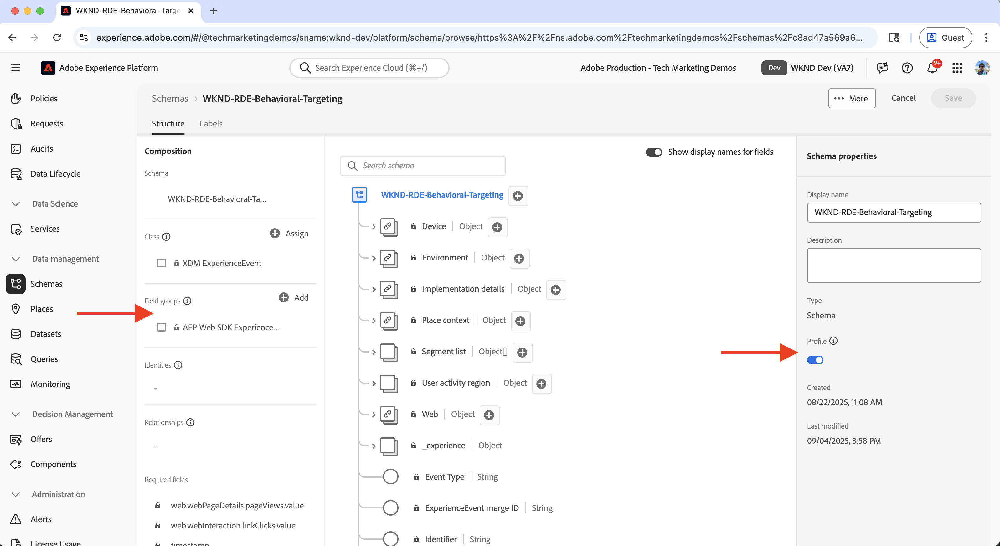
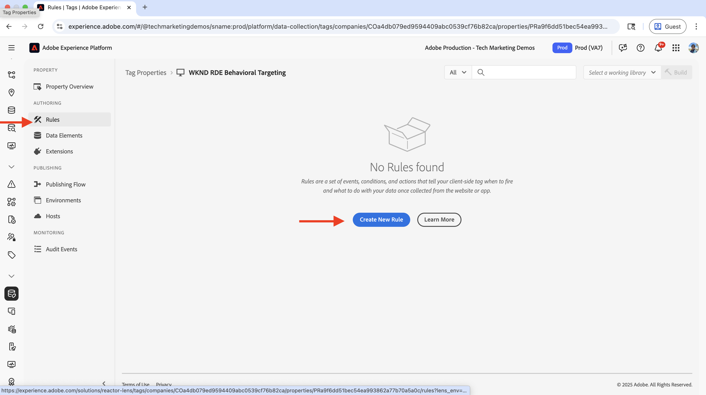
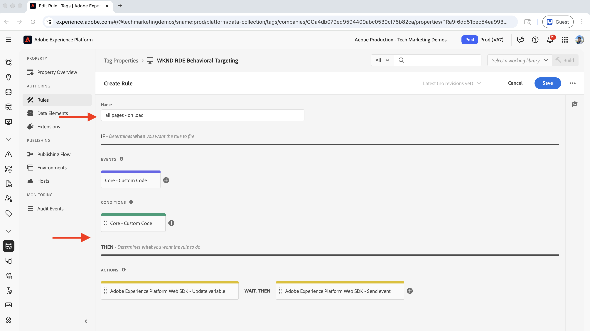
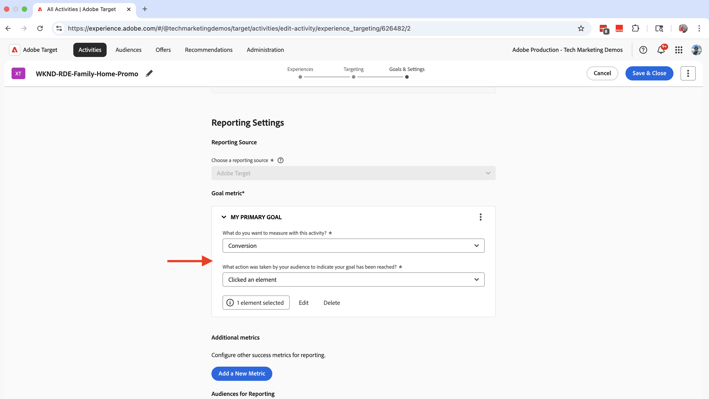

# Direcionamento comportamental

Saiba como personalizar o conteúdo com base no comportamento do usuário usando o Adobe Experience Platform (AEP) e o Adobe Target.

O direcionamento comportamental ajuda a fornecer personalização da próxima página com base no comportamento do usuário, como as páginas visitadas, os produtos ou categorias que navegaram. Cenários comuns incluem:

- **Hero Section Personalization**: exibir conteúdo herói personalizado na próxima página com base na atividade de navegação do usuário
- **Personalização de Elemento de Conteúdo**: Altere títulos, imagens ou botões do call-to-action com base na atividade de navegação do usuário
- **Adaptação do conteúdo da página**: modifique o conteúdo da página inteiro com base na atividade de navegação do usuário

## Caso de uso de demonstração

Neste tutorial, o processo demonstra como **usuários anônimos** que visitaram as páginas de aventura _Bali Surf Camp_, _Riverside Camping_ ou _Tahoe Skiing_ veem um herói personalizado exibido acima da seção **Próximas Aventuras** na página inicial da WKND.


Para fins de demonstração, os usuários com este comportamento de navegação são categorizados como o público-alvo de **Family Travelers**.

### Demonstração ao vivo

Visite o [site de Ativação WKND](https://wknd.enablementadobe.com/us/en.html) para ver a definição de metas comportamentais em ação. O site apresenta três experiências comportamentais diferentes de direcionamento:

- **Página inicial**: quando usuários visitam a página inicial após navegarem pelas _páginas de aventura do Campo de Surfe de Bali_, _Campo de Acampamento à beira-rio_ ou _Esqui de Tahoe_, eles são categorizados como o público-alvo de **Viajantes em Família** e veem uma seção principal personalizada acima da seção _Próximas Aventuras_.

- **Página de Aventura**: quando os usuários visualizam as _páginas de aventura do Campo de Surf de Bali_ ou _Campo de Surf da Costa Rica_, eles são categorizados como **Público-alvo de Interesse para Surfe** e veem uma seção principal personalizada na página de aventura.

- **Página da revista**: quando os usuários leem _três ou mais_ artigos, eles são categorizados como **Leitores da revista** público-alvo e veem uma seção principal personalizada na página da revista.

>[!VIDEO](https://video.tv.adobe.com/v/3474001/?learn=on&enablevpops)

>[!TIP]
>
>O primeiro público-alvo usa a avaliação do **Edge** para personalização em tempo real, enquanto o segundo e o terceiro públicos-alvo usam a avaliação do **Batch** para personalização, que é ideal para visitantes recorrentes.

## Pré-requisitos

Antes de continuar com o caso de uso de direcionamento comportamental, verifique se você concluiu o seguinte:

- [Integrar o Adobe Target](../setup/integrate-adobe-target.md): permite que as equipes criem e gerenciem conteúdo personalizado centralmente no AEM e o ativem como ofertas no Adobe Target.
- [Integrar marcas no Adobe Experience Platform](../setup/integrate-adobe-tags.md): permite que as equipes gerenciem e implantem o JavaScript para personalização e coleta de dados sem precisar reimplantar o código AEM.

Familiarize-se também com os conceitos do [Adobe Experience Cloud Identity Service (ECID)](https://experienceleague.adobe.com/pt-br/docs/id-service/using/home) e do [Adobe Experience Platform](https://experienceleague.adobe.com/pt-br/docs/experience-platform/landing/home), como esquema, sequência de dados, públicos-alvo, identidades e perfis.

Embora seja possível criar públicos-alvo simples no Adobe Target, o Adobe Experience Platform (AEP) fornece a abordagem moderna para criar e gerenciar públicos-alvo e criar perfis completos de clientes usando várias fontes de dados, como dados comportamentais e transacionais.

## Etapas de alto nível

O processo de configuração de direcionamento comportamental envolve etapas no Adobe Experience Platform, AEM e Adobe Target.

1. **No Adobe Experience Platform:**
   1. Criar e configurar um esquema
   2. Criar e configurar um conjunto de dados
   3. Criar e configurar um fluxo de dados
   4. Criar e configurar uma propriedade de tag
   5. Configurar política de mesclagem para o perfil
   6. Configurar o destino do Adobe Target (V2)
   7. Criar e configurar um público-alvo

2. **No AEM:**
   1. Criar ofertas personalizadas usando o Fragmento de experiência
   2. Integrar e inserir a propriedade Tags nas páginas do AEM
   3. Integrar o Adobe Target e exportar ofertas personalizadas para o Adobe Target

3. **No Adobe Target:**
   1. Verificar os públicos e as ofertas
   2. Criar e configurar uma atividade

4. **Verificar a implementação de direcionamento comportamental nas páginas do AEM**

As várias soluções da AEP são usadas para coletar, gerenciar e coletar dados comportamentais para criar públicos-alvo. Esses públicos são ativados no Adobe Target. Usando atividades no Adobe Target, experiências personalizadas são entregues aos usuários.

## Etapas do Adobe Experience Platform

Para criar públicos-alvo com base em dados comportamentais, é necessário coletar e armazenar dados quando os usuários visitam ou interagem com seu site. Neste exemplo, para categorizar um usuário como **público-alvo de Viagem em Família**, os dados de exibição de página precisam ser coletados. O processo começa no Adobe Experience Platform para configurar os componentes necessários para coletar esses dados.

Faça logon no [Adobe Experience Cloud](https://experience.adobe.com/) e navegue até o **Experience Platform** a partir do Alternador de Aplicativos ou da seção de Acesso Rápido.


### Criar e configurar um esquema

Um esquema define a estrutura e o formato dos dados coletados no Adobe Experience Platform. Ele garante a consistência dos dados e permite criar públicos-alvo significativos com base em campos de dados padronizados. Para o direcionamento comportamental, é necessário um esquema que possa capturar eventos de exibição de página e interações do usuário.

Crie um esquema para coletar dados de exibição de página para direcionamento comportamental.

- Na página inicial do **Adobe Experience Platform**, clique em **Esquemas** na navegação à esquerda e clique em **Criar esquema**.

  

- No assistente **Criar Esquema**, para a etapa **Detalhes do esquema**, selecione a opção **Evento de experiência** e clique em **Avançar**.

  

- Para a etapa **Nome e revisão**, insira o seguinte:
   - **Nome de exibição do esquema**: WKND-RDE-Behavioral-Targeting
   - **Classe selecionada**: XDM ExperienceEvent

  

- Atualize o esquema da seguinte maneira:
   - **Adicionar grupo de campos**: ExperienceEvent do AEP Web SDK
   - **Perfil**: Habilitar

  

- Clique em **Salvar** para criar o esquema.

### Criar e configurar um conjunto de dados

Um conjunto de dados é um container de dados que segue um esquema específico. Ele atua como um local de armazenamento onde os dados comportamentais são coletados e organizados. O conjunto de dados deve ser ativado para que o Perfil permita a criação e a personalização de públicos-alvo.

Vamos criar um conjunto de dados para armazenar os dados de exibição da página.

- No **Adobe Experience Platform**, clique em **Conjuntos de Dados** na navegação à esquerda e clique em **Criar conjunto de dados**.
  

- Na etapa **Criar conjunto de dados**, selecione a opção **Criar conjunto de dados do esquema** e clique em **Avançar**.
  

- No assistente **Criar conjunto de dados a partir do esquema**, para a etapa **Selecionar esquema**, selecione o esquema **WKND-RDE-Behavioral-Targeting** e clique em **Avançar**.
  

- Para a etapa **Configurar conjunto de dados**, insira o seguinte:
   - **Nome**: WKND-RDE-Behavioral-Targeting
   - **Descrição**: conjunto de dados para armazenar dados de exibição de página

  

  Clique em **Concluir** para criar o conjunto de dados.

- Atualize o conjunto de dados da seguinte maneira:
   - **Perfil**: Habilitar

  

### Criar e configurar um fluxo de dados

Uma sequência de dados é uma configuração que define como os dados fluem do seu site para o Adobe Experience Platform por meio da Web SDK. Ele funciona como uma ponte entre o seu site e a plataforma, garantindo que os dados sejam formatados e roteados corretamente para os conjuntos de dados corretos. Para o direcionamento comportamental, precisamos ativar serviços específicos, como Segmentação do Edge e Destinos do Personalization.

Vamos criar um fluxo de dados para enviar dados de exibição de página para o Experience Platform por meio da Web SDK.

- Em **Adobe Experience Platform**, clique em **Fluxos de dados** na navegação à esquerda e clique em **Criar fluxo de dados**.

- Na etapa **Nova sequência de dados**, digite o seguinte:
   - **Nome**: WKND-RDE-Behavioral-Targeting
   - **Descrição**: sequência de dados para enviar dados de exibição de página à Experience Platform
   - **Esquema de Mapeamento**: WKND-RDE-Behavioral-Targeting
Clique em **Salvar** para criar a sequência de dados.

  

- Após criar a sequência de dados, clique em **Adicionar serviço**.

  

- Na etapa **Adicionar Serviço**, selecione **Adobe Experience Platform** na lista suspensa e digite o seguinte:
   - **Conjunto de Dados de Evento**: WKND-RDE-Behavioral-Targeting
   - **Conjunto de Dados de Perfil**: WKND-RDE-Behavioral-Targeting
   - **Offer Decisioning**: Habilitar
   - **Segmentação do Edge**: habilitar
   - **Destinos do Personalization**: Habilitar

  Clique em **Salvar** para adicionar o serviço.

  

- Na etapa **Adicionar Serviço**, selecione **Adobe Target** na lista suspensa e insira a **ID do Ambiente de Destino**. Você pode encontrar a ID de ambiente de destino no Adobe Target em **Administração** > **Ambientes**. Clique em **Salvar** para adicionar o serviço.
  

### Criar e configurar uma propriedade de tag

Uma propriedade de Tags é um container para código JavaScript que coleta dados do seu site e os envia para a Adobe Experience Platform. Ela age como a camada de coleção de dados que captura as interações do usuário e as exibições de página. Para o direcionamento comportamental, coletamos detalhes específicos da página, como nome da página, URL, seção do site e nome do host para criar públicos-alvo significativos.

Vamos criar uma propriedade de Tags que capture dados de exibição de página quando os usuários visitam seu site.

Para esse caso de uso, são coletados detalhes da página, como nome da página, URL, seção do site e nome do host. Esses detalhes são usados para criar públicos comportamentais.

Você pode atualizar a propriedade Tags criada na etapa [Integrar Tags do Adobe](../setup/integrate-adobe-tags.md). No entanto, para manter a simplicidade, uma nova propriedade de Tags é criada.

#### Criar propriedade de tags

Para criar uma propriedade de Tags, conclua as seguintes etapas:

- Em **Adobe Experience Platform**, clique em **Marcas** na navegação à esquerda e clique no botão **Nova Propriedade**.
  

- Na caixa de diálogo **Criar Propriedade**, digite o seguinte:
   - **Nome da Propriedade**: WKND-RDE-Behavioral-Targeting
   - **Tipo de Propriedade**: Selecionar **Web**
   - **Domínio**: o domínio onde você implanta a propriedade (por exemplo, `.adobeaemcloud.com`)

  Clique em **Salvar** para criar a propriedade.

  

- Abra a nova propriedade, clique em **Extensões** na navegação à esquerda e clique na guia **Catálogo**. Pesquise por **Web SDK** e clique no botão **Instalar**.
  

- Na caixa de diálogo **Instalar Extensão**, selecione a **Sequência de Dados** criada anteriormente e clique em **Salvar**.
  

#### Adicionar elementos de dados

Os elementos de dados são variáveis que capturam pontos de dados específicos do seu site e os disponibilizam para uso em regras e outras configurações de tags. Eles atuam como blocos fundamentais para a coleta de dados, permitindo extrair informações significativas das interações do usuário e das exibições de página. Para o direcionamento comportamental, os detalhes da página, como nome do host, seção do site e nome da página precisam ser capturados para criar segmentos de público-alvo.

Crie os seguintes elementos de dados para capturar os detalhes importantes da página.

- Clique em **Elementos de Dados** na navegação à esquerda e clique no botão **Criar Novo Elemento de Dados**.
  

- Na caixa de diálogo **Criar novo elemento de dados**, digite o seguinte:
   - **Nome**: Nome do Host
   - **Extensão**: Selecionar **Núcleo**
   - **Tipo de Elemento de Dados**: Selecionar **Código Personalizado**
   - **Abra o botão Editor** e insira o seguinte trecho de código:

     ```javascript
     if(window && window.location && window.location.hostname) {
         return window.location.hostname;
     }
     ```

  

- Da mesma forma, crie os seguintes elementos de dados:

   - **Nome**: Seção do Site
   - **Extensão**: Selecionar **Núcleo**
   - **Tipo de Elemento de Dados**: Selecionar **Código Personalizado**
   - **Abra o botão Editor** e insira o seguinte trecho de código:

     ```javascript
     if(event && event.component && event.component.hasOwnProperty('repo:path')) {
         let pagePath = event.component['repo:path'];
     
         let siteSection = '';
     
         //Check for html String in URL.
         if (pagePath.indexOf('.html') > -1) { 
         siteSection = pagePath.substring(0, pagePath.lastIndexOf('.html'));
     
         //replace slash with colon
         siteSection = siteSection.replaceAll('/', ':');
     
         //remove `:content`
         siteSection = siteSection.replaceAll(':content:','');
         }
     
         return siteSection 
     }        
     ```

   - **Nome**: Nome da Página
   - **Extensão**: Selecionar **Núcleo**
   - **Tipo de Elemento de Dados**: Selecionar **Código Personalizado**
   - **Abra o botão Editor** e insira o seguinte trecho de código:

     ```javascript
     if(event && event.component && event.component.hasOwnProperty('dc:title')) {
         // return value of 'dc:title' from the data layer Page object, which is propagated via 'cmp:show' event
         return event.component['dc:title'];
     }        
     ```

- Em seguida, crie um elemento de dados do tipo **Variável**. Esse elemento de dados é preenchido com os detalhes da página antes de enviá-lo para a Experience Platform.

   - **Nome**: Pageview da Variável XDM
   - **Extensão**: Selecionar **Adobe Experience Platform Web SDK**
   - **Tipo de Elemento de Dados**: Selecionar **Variável**

  No painel direito,

   - **Sandbox**: Selecione sua sandbox
   - **Esquema**: selecione o esquema **WKND-RDE-Behavioral-Targeting**

  Clique em **Salvar** para criar o elemento de dados.

  

- Na lista **Elementos de Dados**, você deve ter quatro elementos de dados:

  

#### Adicionar regras

As regras definem quando e como os dados são coletados e enviados para a Adobe Experience Platform. Elas atuam como a camada lógica que determina o que acontece quando eventos específicos ocorrem no site. Para direcionamento comportamental, são criadas regras que capturam eventos de exibição de página e preenchem elementos de dados com as informações coletadas antes de enviá-las para a plataforma.

Crie uma regra para preencher o elemento de dados **Pageview** da variável XDM usando os outros elementos de dados antes de enviá-lo para a Experience Platform. A regra é acionada quando um usuário navega no site da WKND.

- Clique em **Regras** na navegação à esquerda e clique no botão **Criar nova regra**.
  

- Na caixa de diálogo **Criar Nova Regra**, insira o seguinte:

   - **Nome**: todas as páginas - ao carregar

   - Na seção **Eventos**, clique em **Adicionar** para abrir o assistente de **Configuração de Evento**.
      - **Extensão**: Selecionar **Núcleo**
      - **Tipo de Evento**: Selecionar **Código Personalizado**
      - **Abra o botão Editor** e insira o seguinte trecho de código:

        ```javascript
        var pageShownEventHandler = function(evt) {
            // defensive coding to avoid a null pointer exception
            if(evt.hasOwnProperty("eventInfo") && evt.eventInfo.hasOwnProperty("path")) {
                //trigger Launch Rule and pass event
                console.debug("cmp:show event: " + evt.eventInfo.path);
                var event = {
                    //include the path of the component that triggered the event
                    path: evt.eventInfo.path,
                    //get the state of the component that triggered the event
                    component: window.adobeDataLayer.getState(evt.eventInfo.path)
                };
        
                //Trigger the Launch Rule, passing in the new 'event' object
                // the 'event' obj can now be referenced by the reserved name 'event' by other Launch data elements
                // i.e 'event.component['someKey']'
                trigger(event);
            }
        }
        
        //set the namespace to avoid a potential race condition
        window.adobeDataLayer = window.adobeDataLayer || [];
        
        //push the event listener for cmp:show into the data layer
        window.adobeDataLayer.push(function (dl) {
            //add event listener for 'cmp:show' and callback to the 'pageShownEventHandler' function
            dl.addEventListener("cmp:show", pageShownEventHandler);
        });
        ```

   - Na seção **Condições**, clique em **Adicionar** para abrir o assistente de **Configuração de Condição**.
      - **Tipo Lógico**: Selecionar **Regular**
      - **Extensão**: Selecionar **Núcleo**
      - **Tipo de Condição**: Selecionar **Código Personalizado**
      - **Abra o botão Editor** e insira o seguinte trecho de código:

        ```javascript
        if(event && event.component && event.component.hasOwnProperty('@type') && event.component.hasOwnProperty('xdm:template')) {
            console.log('The cmp:show event is from PAGE HANDLE IT');
            return true;
        }else{
            console.log('The cmp:show event is NOT from PAGE IGNORE IT');
            return false;
        }            
        ```

   - Na seção **Ações**, clique em **Adicionar** para abrir o assistente de **Configuração de Ação**.
      - **Extensão**: Selecionar **Adobe Experience Platform Web SDK**
      - **Tipo de ação**: Selecionar **Atualizar variável**
      - Mapear a **web** > **webPageDetails** > **name** para o elemento de dados **Nome da Página**

        

      - Da mesma forma, mapeie o **servidor** para o elemento de dados **Nome do Host** e o **siteSection** para o elemento de dados **Seção do Site**. Para **pageView** > **value**, digite `1` para indicar um evento de exibição de página.

      - Clique em **Manter alterações** para salvar a configuração da ação.

   - Novamente, clique em **Adicionar** para adicionar outra ação e abrir o assistente de **Configuração de Ação**.
      - **Extensão**: Selecionar **Adobe Experience Platform Web SDK**
      - **Tipo de ação**: selecionar **Enviar evento**
      - Na seção **Dados** do painel direito, mapeie o elemento de dados **Pageview de Variável XDM** para o tipo **Exibições de Página de Detalhes da Página da Web**.

     

      - Além disso, na seção **Personalization** do painel direito, verifique a opção **Renderizar decisões de personalização visual**.  Em seguida, clique em **Manter alterações** para salvar a ação.

     

   - Clique em **Manter alterações** para salvar a regra.

- Sua regra deve ter esta aparência:

  

As etapas de criação de regra acima têm um número considerável de detalhes, portanto, tenha cuidado ao criar a regra. Pode parecer complexo, mas lembre-se de que essas etapas de configuração o tornam plug and play sem precisar atualizar o código do AEM e reimplantar o aplicativo.

#### Adicionar biblioteca e publicá-la

Uma biblioteca é uma coleção de todas as configurações de tags (elementos de dados, regras, extensões) que são criadas e implantadas no site. Ele agrupa tudo para que a coleta de dados funcione corretamente. Para direcionamento comportamental, a biblioteca é publicada para tornar as regras de coleção de dados ativas em seu site.

- Clique em **Fluxo de Publicação** na navegação à esquerda e clique no botão **Adicionar Biblioteca**.
  

- Na caixa de diálogo **Adicionar Biblioteca**, digite o seguinte:
   - **Nome**: 1.0
   - **Ambiente**: Selecionar **Desenvolvimento**
   - Clique em **Adicionar todos os recursos alterados** para selecionar todos os recursos.

  Clique em **Salvar e criar no desenvolvimento** para criar a biblioteca.

  

- Depois que a biblioteca for criada para a pista de natação **Desenvolvimento**, clique nas reticências (três pontos) e selecione a opção **Aprovar e publicar na produção**.
  

Parabéns! Você criou a propriedade Tags com a regra para coletar detalhes de página e enviá-los para a Experience Platform. Essa é a etapa fundamental para criar públicos-alvo comportamentais.

### Configurar política de mesclagem para o perfil

Uma política de mesclagem define como os dados do cliente de várias fontes são unificados em um único perfil. Ele determina quais dados têm prioridade quando há conflitos, garantindo uma exibição completa e consistente de cada cliente para o direcionamento comportamental.

Para o propósito deste caso de uso, uma política de mesclagem é criada ou atualizada, ou seja:

- **Política de mesclagem padrão**: habilitar
- **Política de mesclagem ativa no Edge**: habilitar

Para criar uma política de mesclagem, conclua as seguintes etapas:

- No **Adobe Experience Platform**, clique em **Perfis** na navegação à esquerda e clique na guia **Mesclar Políticas**.

  

- Você pode usar uma política de mesclagem existente, mas para este tutorial, uma nova política de mesclagem é criada com a seguinte configuração:

  

- Habilite as opções de **Política de mesclagem padrão** e **Política de mesclagem Ative-On-Edge**. Essas configurações garantem que seus dados comportamentais sejam unificados corretamente e estejam disponíveis para a avaliação do público-alvo em tempo real.

### Configurar o destino do Adobe Target (V2)

O Destino do Adobe Target (V2) permite ativar públicos-alvo comportamentais criados no Experience Platform diretamente no Adobe Target. Essa conexão permite que os públicos-alvo comportamentais sejam usados para atividades de personalização no Adobe Target.

- No **Adobe Experience Platform**, clique em **Destinos** na navegação à esquerda, clique na guia **Catálogo** e filtre por **Personalization** e selecione o destino **(v2) Adobe Target**.

  

- Na etapa **Ativar Destinos**, forneça um nome para o destino e clique no botão **Conectar ao destino**.
  

- Na seção **Detalhes do destino**, digite o seguinte:
   - **Nome**: WKND-RDE-Behavioral-Targeting-Destination
   - **Descrição**: destino para públicos-alvo de direcionamento comportamentais
   - **Sequência de dados**: selecione a **Sequência de dados** que você criou anteriormente
   - **Workspace**: selecione seu espaço de trabalho do Adobe Target

  

- Clique em **Avançar** e conclua a configuração de destino.

Após configurado, esse destino permite ativar públicos-alvo comportamentais do Experience Platform para o Adobe Target para uso em atividades de personalização.

### Criar e configurar um público-alvo

Um público-alvo define um grupo específico de usuários com base em seus padrões comportamentais e características. Nesta etapa, um público-alvo &quot;Viajantes em família&quot; é criado usando as regras de dados comportamentais.

Para criar um público-alvo, conclua as seguintes etapas:

- No **Adobe Experience Platform**, clique em **Públicos-alvo** na navegação à esquerda e clique no botão **Criar Público**.
  

- Na caixa de diálogo **Criar Público**, selecione a opção **Criar Regra** e clique no botão **Criar**.
  

- Na etapa **Criar**, digite o seguinte:
   - **Nome**: Viajantes em Família
   - **Descrição**: usuários que visitaram páginas de aventura familiares
   - **Método de avaliação**: selecionar **Edge** (para avaliação de público-alvo em tempo real)

  

- Em seguida, clique na guia **Eventos** e navegue até a **Web** > **Detalhes da Página da Web** e arraste e solte o campo **URL** na seção **Regras de Evento**. Arraste o campo **URL** mais duas vezes para a seção **Regras de evento**. Insira os seguintes valores:
   - **URL**: Selecione a opção **contém** e insira `riverside-camping-australia`
   - **URL**: Selecione a opção **contém** e insira `bali-surf-camp`
   - **URL**: Selecione a opção **contém** e insira `gastronomic-marais-tour`

  

- Na seção **Eventos**, selecione a opção **Hoje**. Seu público-alvo deve ter esta aparência:

  

- Revise o público e clique no botão **Ativar para destino**.

  

- Na caixa de diálogo **Ativar para destino**, selecione o destino do Adobe Target criado anteriormente e siga as etapas para ativar o público.

  

- Ainda não há dados no AEP, portanto, a contagem de público é 0. Quando os usuários começam a visitar o site, os dados são coletados e a contagem de públicos-alvo aumenta.

  

Parabéns! Você criou o público-alvo e o ativou para o destino do Adobe Target.

Isso conclui as etapas do Adobe Experience Platform e o processo está pronto para criar a experiência personalizada no AEM e usá-la no Adobe Target.

## Etapas do AEM

No AEM, a propriedade Tags é integrada para coletar dados de exibição de página e enviá-los para o Experience Platform. O Adobe Target também é integrado e ofertas personalizadas são criadas para o público-alvo **Family Travelers**. Essas etapas permitem que o AEM funcione com a configuração de direcionamento comportamental criada no Experience Platform.

Começamos fazendo logon no serviço do AEM Author para criar e configurar o conteúdo personalizado.

- Faça logon no [Adobe Experience Cloud](https://experience.adobe.com/) e navegue até o **Experience Manager** a partir do Alternador de Aplicativos ou da seção de Acesso Rápido.

  

- Navegue até o ambiente de Autor do AEM e clique no botão **Sites**.
  

### Integrar e inserir propriedades de tags nas páginas do AEM

Essa etapa integra a propriedade Tags criada anteriormente em suas páginas do AEM, permitindo a coleta de dados para o direcionamento comportamental. A propriedade Tags captura automaticamente os dados de exibição de página e os envia para a Experience Platform quando os usuários visitam seu site.

Para integrar a propriedade Tags a páginas do AEM, siga as etapas de [Integrar Tags no Adobe Experience Platform](../setup/integrate-adobe-tags.md).

Use a propriedade de marcas **WKND-RDE-Behavioral-Targeting** que foi criada anteriormente, não uma propriedade diferente.


Depois de integrada, a propriedade Tags começa a coletar dados comportamentais das páginas do AEM e enviá-los para a Experience Platform para a criação de público-alvo.

### Integrar o Adobe Target e exportar ofertas personalizadas para o Adobe Target

Esta etapa integra o Adobe Target ao AEM e permite a exportação de conteúdo personalizado (Fragmentos de experiência) para o Adobe Target. Essa conexão permite que o Adobe Target use o conteúdo criado no AEM para atividades de personalização com os públicos-alvo comportamentais criados no Experience Platform.

Para integrar o Adobe Target e exportar as ofertas de público-alvo do **Family Travelers** para o Adobe Target, siga as etapas de [Integrar o Adobe Target no Adobe Experience Platform](../setup/integrate-adobe-target.md).

Verifique se a configuração do Target foi aplicada aos Fragmentos de experiência para que eles possam ser exportados para o Adobe Target para uso em atividades de personalização.


Uma vez integrado, você pode exportar fragmentos de experiência do AEM para o Adobe Target, onde eles são usados como ofertas personalizadas para os públicos comportamentais.

### Criar ofertas personalizadas para os públicos-alvo

Fragmentos de experiência são componentes de conteúdo reutilizáveis que podem ser exportados para o Adobe Target como ofertas personalizadas. Para direcionamento comportamental, o conteúdo é criado especificamente para o público-alvo **Family Travelers** que é exibido quando os usuários correspondem aos critérios comportamentais.

Crie um novo Fragmento de experiência com conteúdo personalizado para o público-alvo de Viajantes em família.

- No AEM, clique em **Fragmentos de experiência**

  

- Navegue até a pasta **Fragmentos de site do WKND**, navegue até a subpasta **Em destaque** e clique no botão **Criar**.

  

- Na caixa de diálogo **Criar Fragmento de Experiência**, selecione Modelo de Variação da Web e clique em **Avançar**.

  

- Crie o fragmento de experiência recém-criado adicionando um componente de Teaser e personalize-o com conteúdo relevante para viajantes da família. Adicione um título atraente, uma descrição e um call-to-action que atraia as famílias interessadas em viagens de aventura.

  

- Selecione o Fragmento de experiência criado e clique no botão **Exportar para o Adobe Target**.

  

Parabéns! Você criou e exportou as ofertas de público-alvo do **Family Travelers** para a Adobe Target. O Fragmento de experiência agora está disponível no Adobe Target como uma oferta personalizada que pode ser usada em atividades de personalização.

## Etapas do Adobe Target

No Adobe Target, os públicos comportamentais criados no Experience Platform e as ofertas personalizadas exportadas do AEM são verificados para estarem corretamente disponíveis. Em seguida, é criada uma atividade que combina o direcionamento de público-alvo com o conteúdo personalizado para fornecer a experiência de direcionamento comportamental.

- Faça logon no [Adobe Experience Cloud](https://experience.adobe.com/) e navegue até o **Adobe Target** a partir do Alternador de Aplicativos ou da seção de Acesso Rápido.

  

### Verificar os públicos e as ofertas

Antes de criar a atividade de personalização, os públicos-alvo comportamentais do Experience Platform e as ofertas personalizadas do AEM são verificados para que estejam disponíveis corretamente no Adobe Target. Isso garante que todos os componentes necessários para o direcionamento comportamental estejam em vigor.

- No Adobe Target, clique em **Públicos-alvo** e verifique se o público-alvo do Family Travelers foi criado.

  

- Ao clicar no público-alvo, é possível ver os detalhes do público-alvo e verificar se ele está configurado corretamente.

  

- Em seguida, clique em **Ofertas** e verifique se a oferta exportada do AEM existe. No meu caso, a oferta (ou Fragmento de experiência) é chamada **A Taste of Adventure for the Whole Family**.

  

### Criar e configurar uma atividade

Uma atividade no Adobe Target é uma campanha de personalização que define quando e como o conteúdo personalizado é entregue a públicos específicos. Para o direcionamento comportamental, uma atividade é criada e mostra a oferta personalizada para usuários que correspondem aos critérios de público-alvo do Family Travelers.

Agora, uma atividade é criada para fornecer a experiência personalizada à página inicial para o público-alvo de **Viajantes em Família**.

- No Adobe Target, clique em **Atividades**, clique no botão **Criar atividade** e selecione o tipo de atividade **Direcionamento de experiência**.
  

- Na caixa de diálogo **Criar Atividade de Direcionamento de Experiência**, selecione o tipo **Web** e a opção de compositor **Visual** e insira a URL da página inicial do site WKND. Clique no botão **Criar** para criar a atividade.

  

- No editor, selecione o público-alvo **Family Travelers** e adicione a oferta **A Taste of Adventure for the Whole Family** antes da seção **Next Adventure**. Consulte a captura de tela abaixo para referência.

  

- Clique em **Avançar** e configure a seção **Metas e Configurações** com as metas e métricas apropriadas e, em seguida, ative-a para enviar as alterações ao vivo.

  

Parabéns! Você criou e iniciou a atividade para entregar a experiência personalizada para o público-alvo de **Viajantes em Família** na página inicial do site WKND. A atividade agora está ativa e mostra conteúdo personalizado para usuários que correspondem aos critérios comportamentais.

## Verifique a implementação de direcionamento comportamental nas páginas do AEM

Agora que o fluxo completo de definição de metas comportamentais foi configurado, tudo foi verificado para funcionar corretamente. Esse processo de verificação garante que a coleta de dados, a avaliação do público-alvo e a personalização estejam funcionando como esperado.

Verifique a implementação de direcionamento comportamental nas páginas do AEM.

- Visite o site publicado (por exemplo, o [site de Habilitação do WKND](https://wknd.enablementadobe.com/us/en.html)) e navegue pelas _páginas de aventura de Bali Surf Camp_ ou _de Riverside Camping_ ou _de Tahoe Skiing_. Passe pelo menos 30 segundos na página para acionar o evento de exibição de página e permitir que os dados sejam coletados.

- Em seguida, revisite a página inicial e você deverá ver a experiência personalizada para o público-alvo de **Viajantes em Família** antes da seção **Próxima Aventura**.

  

- Abra as ferramentas de desenvolvedor do seu navegador e verifique a guia **Rede**. Filtre por `interact` para localizar a solicitação do Web SDK. A solicitação deve mostrar os detalhes do evento do Web SDK.

  

- A resposta deve incluir as decisões de personalização tomadas pelo Adobe Target, indicando que você está no público-alvo de **Viajantes em família**.

  

Parabéns! Você verificou a implementação de direcionamento comportamental nas suas páginas do AEM. O fluxo completo, desde a coleta de dados até a avaliação do público-alvo e a personalização, agora está funcionando corretamente.

## Demonstração ao vivo

Para ver o direcionamento comportamental em ação, visite o [site de Habilitação do WKND](https://wknd.enablementadobe.com/us/en.html). Há três experiências diferentes de direcionamento comportamental:

- **Página Inicial**: para os públicos-alvo do Family Travelers, uma oferta principal personalizada é exibida acima da seção _Próximas Aventuras_. Quando um usuário visita a página inicial e visitou as _páginas de aventura do Acampamento de Surfe de Bali_, _Acampamento à beira-rio_ ou _Esqui de Praia_, o usuário é categorizado como o **público-alvo de Viagem em Família**. O tipo de público é **Edge**, portanto a avaliação acontece em tempo real.

- **Página de Aventura**: para os fãs de Surfe, a página de aventura é exibida com uma seção principal personalizada. Quando um usuário visualiza as _páginas de aventura Campo de Surfe de Bali_ ou _Campo de Surfe na Costa Rica_, o usuário é categorizado como o **público-alvo de Interesse para Surfe**. O tipo de público-alvo é **Batch**, portanto, a avaliação não é em tempo real, mas em um período de tempo, como um dia. É útil para visitantes recorrentes.

  

- **Página de Revista**: para leitores de Revista, a página de revista é exibida com uma seção principal personalizada. Quando um usuário lê _três ou mais_ artigos, ele é categorizado como o público-alvo de **Leitores de Revistas**. O tipo de público-alvo é **Batch**, portanto, a avaliação não é em tempo real, mas em um período de tempo, como um dia. É útil para visitantes recorrentes.

  

O primeiro público-alvo usa a avaliação do **Edge** para personalização em tempo real, enquanto o segundo e o terceiro públicos-alvo usam a avaliação do **Batch** para personalização, que é ideal para visitantes recorrentes.


## Recursos adicionais

- [Adobe Experience Platform Web SDK](https://experienceleague.adobe.com/pt-br/docs/experience-platform/web-sdk/home)
- [Visão geral das sequências de dados](https://experienceleague.adobe.com/pt-br/docs/experience-platform/datastreams/overview)
- [Visual Experience Composer (VEC)](https://experienceleague.adobe.com/pt-br/docs/target/using/experiences/vec/visual-experience-composer)
- [Segmentação do Edge](https://experienceleague.adobe.com/pt-br/docs/experience-platform/segmentation/methods/edge-segmentation)
- [Tipos de público-alvo](https://experienceleague.adobe.com/pt-br/docs/experience-platform/segmentation/types/overview)
- [conexão com o Adobe Target](https://experienceleague.adobe.com/pt-br/docs/experience-platform/destinations/catalog/personalization/adobe-target-connection)
