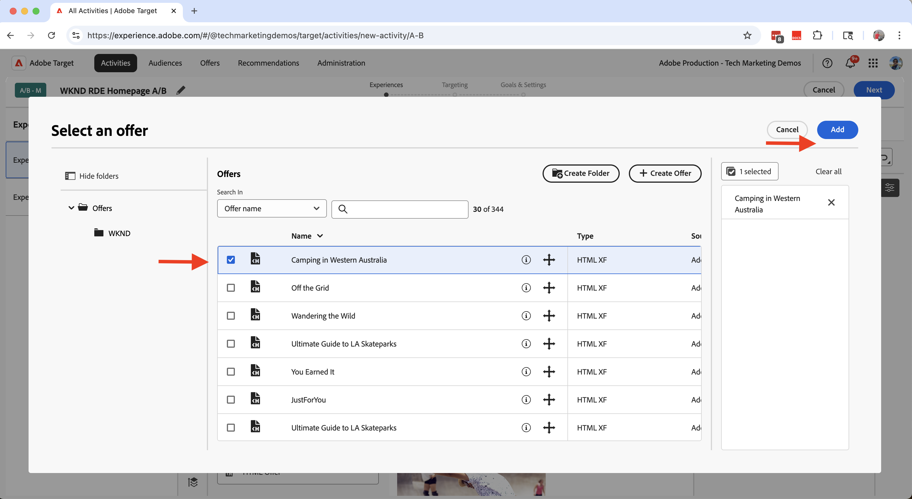
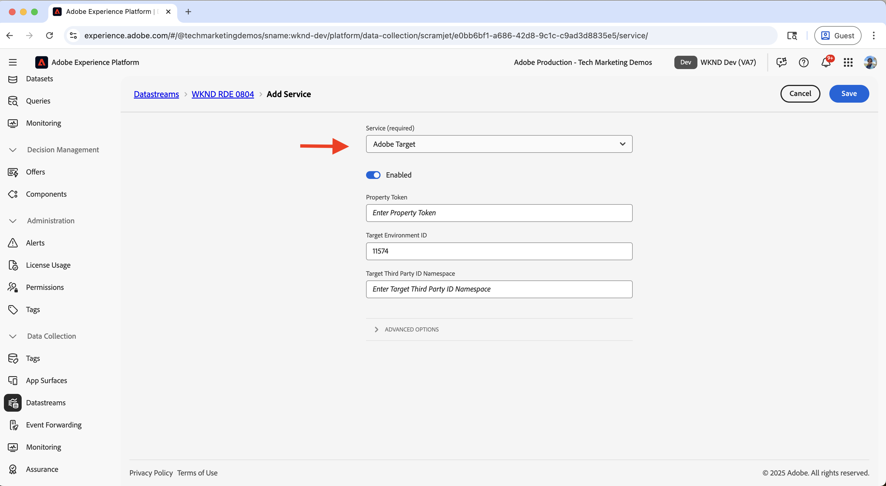
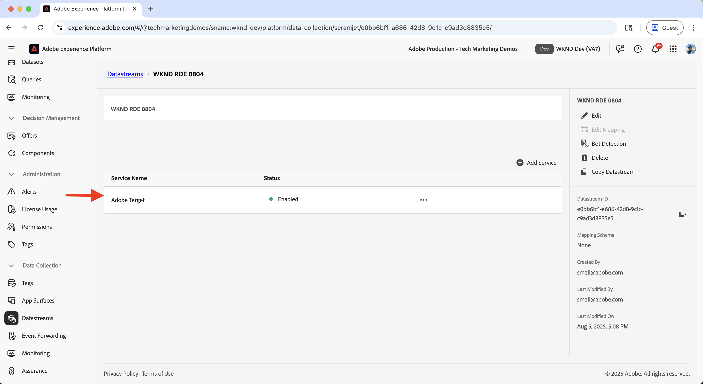

# Experimentação (teste A/B)

Saiba como testar diferentes variações de conteúdo em um site do AEM as a Cloud Service (AEMCS) usando o Adobe Target.

O teste A/B ajuda a comparar diferentes versões do conteúdo para determinar qual tem melhor desempenho para atingir suas metas comerciais. Cenários comuns incluem:

- Teste de variações em títulos, imagens ou botões do call-to-action em uma página de aterrissagem
- Comparação de diferentes layouts ou designs para uma página de detalhes do produto
- Avaliar ofertas promocionais ou estratégias de desconto

## Caso de uso de demonstração

Neste tutorial, você configura o teste A/B para o **Acampamento na Austrália Ocidental** Fragmento de experiência (XF) no site da WKND. Você cria três variações XF e gerencia o teste A/B por meio do Adobe Target.

As variações são exibidas na página inicial da WKND, permitindo medir o desempenho e determinar qual versão gera melhor engajamento e conversões.

### Demonstração ao vivo

Visite o [site de Ativação do WKND](https://wknd.enablementadobe.com/us/en.html) para ver o teste A/B em ação. No vídeo abaixo, você vê todas as três variações de **Camping na Austrália Ocidental** exibidas na página inicial por meio de navegadores diferentes.

>[!VIDEO](https://video.tv.adobe.com/v/3473005/?learn=on&enablevpops)

## Pré-requisitos

Antes de prosseguir com o caso de uso de experimentação, verifique se você concluiu o seguinte:

- [Integrar o Adobe Target](../setup/integrate-adobe-target.md): permite que sua equipe crie e gerencie conteúdo personalizado centralmente no AEM e ative-o como ofertas no Adobe Target.
- [Integrar marcas no Adobe Experience Platform](../setup/integrate-adobe-tags.md): permite que sua equipe gerencie e implante o JavaScript para personalização e coleta de dados sem precisar reimplantar o código AEM.

## Etapas de alto nível

O processo de configuração do teste A/B envolve seis etapas principais que criam e configuram o experimento:

1. **Criar variações de conteúdo no AEM**
2. **Exportar as variações como ofertas para o Adobe Target**
3. **Criar uma atividade de teste A/B no Adobe Target**
4. **Criar e configurar uma Sequência de Dados no Adobe Experience Platform**
5. **Atualize a propriedade Tags com a extensão do Web SDK**
6. **Verificar a implementação do teste A/B nas páginas do AEM**

## Criar variações de conteúdo no AEM

Neste exemplo, você usa o **Acampamento na Austrália Ocidental** Fragmento de experiência (XF) do projeto WKND do AEM para criar três variações, que serão usadas na página inicial do site WKND para testes A/B.

1. No AEM, clique no cartão **Fragmentos de experiência**, navegue até **Camping na Austrália Ocidental** e clique em **Editar**.
   

1. No editor, na seção **Variações**, clique em **Criar** e selecione **Variação**.\
   

1. Na caixa de diálogo **Criar Variação**:
   - **Modelo**: modelo de variação da Web de fragmento de experiência
   - **Título**: por exemplo, &quot;Fora da Grade&quot;

   Clique em **Concluído**.

   

1. Crie a variação copiando o componente **Teaser** da variação mestre e personalize o conteúdo (por exemplo, atualize o título e a imagem).\
   

   >[!TIP]
   >Você pode usar [Gerar Variações](https://experience.adobe.com/aem/generate-variations/) para criar rapidamente novas variações do XF principal.

1. Repita as etapas para criar outra variação (por exemplo, &quot;Wandering the Wild&quot;).\
   

   Agora você tem três variações de Fragmento de experiência para testes A/B.

1. Antes de exibir variações usando o Adobe Target, é necessário remover o teaser estático existente da página inicial. Isso impede a duplicação do conteúdo, já que as variações do Fragmento de experiência são inseridas dinamicamente pelo Target.

   - Navegue até a página inicial **Inglês** `/content/wknd/language-masters/en`
   - No editor, exclua o componente de teaser **Camping na Austrália Ocidental**.\
     

1. Implante as alterações na página inicial (**)** EUA > Inglês`/content/wknd/us/en` para propagar as atualizações.\
   

1. Publique a página inicial **EUA > Inglês** para ativar as atualizações.\
   

## Exportar as variações como ofertas para o Adobe Target

Exporte as variações do Fragmento de experiência para que elas possam ser usadas como ofertas no Adobe Target para o teste A/B.

1. No AEM, navegue até **Camping na Austrália Ocidental**, selecione as três variações e clique em **Exportar para o Adobe Target**.\
   

2. No Adobe Target, acesse **Ofertas** e confirme se as variações foram importadas.\
   

## Criar uma atividade de teste A/B no Adobe Target

Agora crie uma atividade de teste A/B para executar o experimento na página inicial.

1. Instale a extensão do Chrome [Adobe Experience Cloud Visual Editing Helper](https://chromewebstore.google.com/detail/adobe-experience-cloud-vi/kgmjjkfjacffaebgpkpcllakjifppnca).

1. No Adobe Target, navegue até **Atividades** e clique em **Criar atividade**.\
   

1. Na caixa de diálogo **Criar atividade de teste A/B**, digite o seguinte:
   - **Tipo**: Web
   - **Composer**: visual
   - **URL da atividade**: ex.: `https://wknd.enablementadobe.com/us/en.html`

   Clique em **Criar**.

   

1. Renomeie a atividade para algo significativo (por exemplo, &quot;Teste A/B de página inicial WKND&quot;).\
   

1. Em **Experiência A**, adicione o componente **Fragmento de Experiência** acima da seção **Artigos Recentes**.\
   

1. Na caixa de diálogo do componente, clique em **Selecionar uma Oferta**.\
   

1. Escolha a variação **Camping in Western Australia** e clique em **Adicionar**.\
   

1. Repita para a **Experiência B** e **C**, selecionando **Fora da Grade** e **Vagando pela Natureza**, respectivamente.\
   

1. Na seção **Direcionamento**, confirme se o tráfego está dividido uniformemente em todas as experiências.\
   

1. Em **Metas e configurações**, defina sua métrica de sucesso (por exemplo, cliques do CTA no Fragmento de experiência).\
   

1. Clique em **Ativar** no canto superior direito para iniciar o teste.\
   

## Criar e configurar um fluxo de dados no Adobe Experience Platform

Para conectar o Adobe Web SDK ao Adobe Target, crie uma sequência de dados no Adobe Experience Platform. A sequência de dados atua como uma camada de roteamento entre o Web SDK e o Adobe Target.

1. No Adobe Experience Platform, navegue até **Datastreams** e clique em **Criar Datastream**.\
   

1. Na caixa de diálogo **Criar Sequência de Dados**, digite um **Nome** para a Sequência de Dados e clique em **Salvar**.\
   

1. Após criar a sequência de dados, clique em **Adicionar serviço**.\
   

1. Na etapa **Adicionar Serviço**, selecione **Adobe Target** na lista suspensa e insira a **ID do Ambiente de Destino**. Você pode encontrar a ID de ambiente de destino no Adobe Target em **Administração** > **Ambientes**. Clique em **Salvar** para adicionar o serviço.\
   

1. Revise os detalhes da sequência de dados para verificar se o serviço do Adobe Target está listado e configurado corretamente.\
   

## Atualizar a propriedade Tags com a extensão Web SDK

Para enviar eventos de personalização e coleta de dados de páginas do AEM, adicione a extensão Web SDK à propriedade Tags e configure uma regra que é acionada no carregamento da página.

1. No Adobe Experience Platform, navegue até **Tags** e abra a propriedade criada na etapa [Integrar Tags do Adobe](../setup/integrate-adobe-tags.md).
   

1. No menu à esquerda, clique em **Extensões**, alterne para a guia **Catálogo** e procure por **Web SDK**. Clique em **Instalar** no painel direito.\
   

1. Na caixa de diálogo **Instalar Extensão**, selecione a **Sequência de Dados** criada anteriormente e clique em **Salvar**.\
   

1. Após a instalação, verifique se as extensões do **Adobe Experience Platform Web SDK** e do **Core** aparecem na guia **Instalado**.\
   

1. Em seguida, configure uma regra para enviar o evento do Web SDK quando a biblioteca for carregada. Navegue até **Regras** no menu à esquerda e clique em **Criar nova regra**.

   

   >[!TIP]
   >
   >Uma regra permite definir quando e como as tags são acionadas com base em interações do usuário ou eventos do navegador.

1. Na tela **Criar Regra**, digite um nome de regra (por exemplo, `All Pages - Library Loaded - Send Event`) e clique em **+ Adicionar** na seção **Eventos**.
   

1. Na caixa de diálogo **Configuração de Evento**:
   - **Extensão**: Selecionar **Núcleo**
   - **Tipo De Evento**: Selecionar **Biblioteca Carregada (Início Da Página)**
   - **Nome**: Digite `Core - Library Loaded (Page Top)`

   Clique em **Manter alterações** para salvar o evento.

   

1. Na seção **Ações**, clique em **+ Adicionar** para definir a ação que ocorre quando o evento é acionado.

1. Na caixa de diálogo **Configuração de Ação**:
   - **Extensão**: Selecionar **Adobe Experience Platform Web SDK**
   - **Tipo De Ação**: Selecionar **Enviar Evento**
   - **Nome**: Selecionar **AEP Web SDK - Enviar Evento**

   

1. Na seção **Personalization** do painel direito, verifique a opção **Renderizar decisões de personalização visual**. Em seguida, clique em **Manter alterações** para salvar a ação.\
   

   >[!TIP]
   >
   >   Essa ação envia um evento AEP Web SDK quando a página é carregada, permitindo que o Adobe Target forneça conteúdo personalizado.

1. Revise a regra concluída e clique em **Salvar**.
   

1. Para aplicar as alterações, vá para **Fluxo de Publicação**, adicione a regra atualizada a uma **Biblioteca**.\
   

1. Finalmente, promova a biblioteca para **Produção**.
   

## Verifique a implementação do teste A/B nas páginas do AEM

Quando a atividade estiver ativa e a biblioteca de tags tiver sido publicada na produção, você poderá verificar o teste A/B nas páginas do AEM.

1. Visite o site publicado (por exemplo, [site de Ativação do WKND](https://wknd.enablementadobe.com/us/en.html)) e observe qual variação é exibida. Tente acessá-lo a partir de um navegador ou dispositivo móvel diferente para ver variações alternativas.
   

1. Abra as ferramentas de desenvolvedor do seu navegador e verifique a guia **Rede**. Filtre por `interact` para localizar a solicitação do Web SDK. A solicitação deve exibir os detalhes do evento do Web SDK.

   

A resposta deve incluir as decisões de personalização tomadas pelo Adobe Target, indicando qual variação foi apresentada.\

1. Como alternativa, você pode usar a extensão do Chrome [Adobe Experience Platform Debugger](https://chromewebstore.google.com/detail/adobe-experience-platform/bfnnokhpnncpkdmbokanobigaccjkpob) para inspecionar os eventos do Web SDK.
   

## Demonstração ao vivo

Para ver o teste A/B em ação, visite o [site de Ativação da WKND](https://wknd.enablementadobe.com/us/en.html) e observe como as diferentes variações do Fragmento de experiência são exibidas na página inicial.

## Recursos adicionais

- [Visão geral do Teste A/B](https://experienceleague.adobe.com/pt-br/docs/target/using/activities/abtest/test-ab)
- [Adobe Experience Platform Web SDK](https://experienceleague.adobe.com/pt-br/docs/experience-platform/web-sdk/home)
- [Visão geral das sequências de dados](https://experienceleague.adobe.com/pt-br/docs/experience-platform/datastreams/overview)
- [Visual Experience Composer (VEC)](https://experienceleague.adobe.com/pt-br/docs/target/using/experiences/vec/visual-experience-composer)
