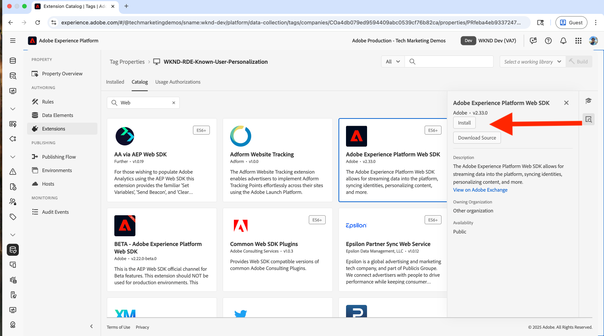
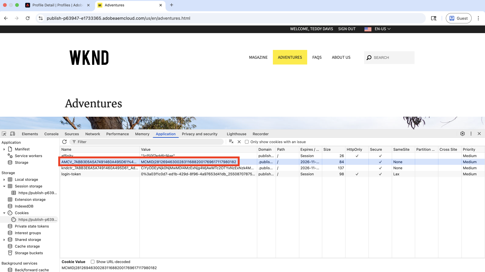
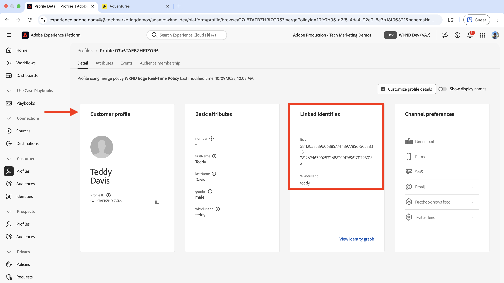
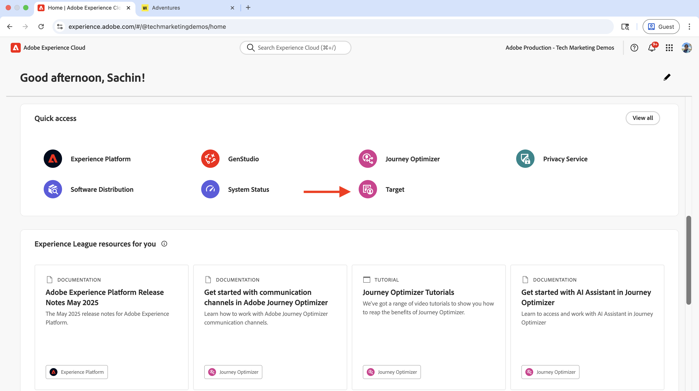

# Personalização de usuário conhecido

Saiba como personalizar o conteúdo com base em dados de usuários conhecidos, como histórico de compras, dados de CRM ou outros dados coletados sobre o usuário.

A personalização de usuário conhecido ajuda a fornecer experiências personalizadas aos usuários com base nos dados coletados sobre eles. Os _dados do usuário podem ter sido coletados por meio de diferentes sistemas_ ou canais, como site, aplicativo móvel, central de atendimento etc. Esses _dados são compilados para criar um perfil de usuário completo_ e usados para personalizar as experiências.

Cenários comuns incluem:

- **Personalização de conteúdo**: exibir experiências personalizadas com base nos dados de perfil do usuário. Por exemplo, exibir um herói personalizado na página inicial com base no histórico de compras do usuário.
- **Venda adicional e venda cruzada**: exibir recomendações personalizadas de venda adicional e venda cruzada com base no histórico de compras do usuário. Por exemplo, exibir uma recomendação de venda adicional personalizada para o histórico de compras do usuário.
- **Programa de fidelidade**: exibir benefícios personalizados do programa de fidelidade com base no histórico de compras do usuário. Por exemplo, exibir um benefício de programa de fidelidade personalizado para o histórico de compras do usuário.

Sua organização pode ter casos de uso diferentes para personalização do usuário conhecido. Veja acima apenas alguns exemplos.

## Exemplo de caso de uso


Neste tutorial, usando o [site WKND de exemplo](https://github.com/adobe/aem-guides-wknd), o processo demonstra como **os usuários conectados** que compraram qualquer aventura **Esqui** veem um herói personalizado na **página inicial da WKND**.

A experiência do herói tenta _vender novamente_ o equipamento de esqui essencial para os usuários que compraram qualquer aventura **de Esqui**. Os usuários que não compraram nenhuma aventura **Esqui** verão o conteúdo principal padrão. Assim, a experiência herói é personalizada para os usuários com base no histórico de compras e no status de logon. Para habilitar essa personalização, dados de diferentes sistemas são compilados para criar um perfil de cliente completo e usados para atividades de personalização.


### Gerenciamento de dados do usuário em todos os sistemas

Para fins de demonstração, suponha que os dados do usuário da WKND estejam nos seguintes sistemas. Cada sistema armazena diferentes tipos de dados que podem ser classificados em duas categorias:

- **Dados comportamentais**: captura as interações e atividades do usuário em canais digitais (exibições de página, cliques, navegação no site, status de logon, padrões de navegação)
- **Dados transacionais**: registra transações comerciais concluídas e informações de perfil do cliente (compras, histórico de pedidos, detalhes do perfil, preferências)

| Sistema | Propósito | Quais dados são armazenados? | Tipo de dados |
|------|------|------|------|
| AEM | Sistema de gerenciamento de conteúdo (CMS), listagens e reservas do Adventure e funcionalidade de logon | Interações do usuário: exibições de página, status de logon, navegação no site. Identificadores de usuário mínimos, como ID do usuário, nome, email. | Dados comportamentais |
| Outros sistemas | Perfil do usuário e registros de transação de compra como um sistema completo de registro. | Perfis de cliente completos: ID de usuário, nome, endereço, número de telefone, histórico de compras, detalhes do pedido, preferências. | Dados transacionais |

O outro sistema pode ser um Sistema da Order Management (OMS), um sistema de CRM (Customer Relationship Management, gerenciamento de relacionamento com o cliente), um sistema de MDM (Master Data Management, gerenciamento de dados mestres) ou qualquer outro sistema que armazene os dados transacionais.

Também se supõe que o site da WKND tenha uma Interface do Usuário (UI) que permita aos usuários comprar/reservar as **Aventuras**. O AEM é integrado ao outro sistema para armazenar os dados de compra de aventura. Além disso, antes ou durante a compra, o usuário criou uma conta no site da WKND.

O diagrama lógico mostra a interação do usuário com o site da WKND e como os dados comportamentais e transacionais são coletados e alimentados na Experience Platform.


Esta é uma versão simplificada demais para demonstrar o conceito de personalização do usuário conhecido. Em um cenário real, você pode ter vários sistemas nos quais dados comportamentais e transacionais são coletados e armazenados.

### Principais aprendizados

- **Armazenamento de dados distribuídos**: os dados do usuário são armazenados em vários sistemas. A AEM armazena o mínimo de dados do usuário (ID do usuário, nome, email) para a funcionalidade de logon, enquanto outros sistemas (OMS, CRM, MDM) mantêm perfis de usuário completos e dados transacionais, como o histórico de compras.
- **Compilação de identidade**: os sistemas são vinculados usando um identificador comum (ID de usuário WKND - `wkndUserId`) que identifica com exclusividade os usuários em diferentes plataformas e canais.
- **Criação completa do perfil**: o objetivo é compilar os dados do usuário desses sistemas distribuídos para criar um perfil de cliente unificado, que é usado para fornecer experiências personalizadas.

Seu caso de uso pode ter sistemas e armazenamento de dados diferentes. O segredo é identificar um identificador comum que identifique exclusivamente os usuários em diferentes plataformas e canais.

## Pré-requisitos

Antes de prosseguir com o caso de uso de personalização de usuário conhecido, verifique se você concluiu o seguinte:

- [Integrar o Adobe Target](../setup/integrate-adobe-target.md): permite que as equipes criem e gerenciem conteúdo personalizado centralmente no AEM e o ativem como ofertas no Adobe Target.
- [Integrar marcas no Adobe Experience Platform](../setup/integrate-adobe-tags.md): permite que as equipes gerenciem e implantem o JavaScript para personalização e coleta de dados sem precisar reimplantar o código AEM.

Familiarize-se também com os conceitos do [Adobe Experience Cloud Identity Service (ECID)](https://experienceleague.adobe.com/pt-br/docs/id-service/using/home) e do [Adobe Experience Platform](https://experienceleague.adobe.com/pt-br/docs/experience-platform/landing/home), como Esquema, Conjunto de Dados, Sequência de Dados, Públicos-alvo, Identidades e Perfis.

Neste tutorial, você aprenderá sobre a identificação de identidades e criará um perfil do cliente no Adobe Experience Platform. Assim, combinando os dados comportamentais com os dados transacionais para criar um perfil de cliente completo.

## Etapas de nível superior

O processo de configuração de personalização de usuário conhecido envolve etapas no Adobe Experience Platform, AEM e Adobe Target.

1. **No Adobe Experience Platform:**
   1. Criar _Namespace de Identidade_ para a ID de usuário WKND (`wkndUserId`)
   1. Crie e configure dois esquemas XDM (Experience Data Model) - estruturas de dados padronizadas que definem como os dados são organizados e validados - um para os dados comportamentais e outro para os dados transacionais
   1. Criar e configurar dois conjuntos de dados, um para os dados comportamentais e um para os dados transacionais
   1. Criar e configurar um fluxo de dados
   1. Criar e configurar uma propriedade de tag
   1. Configurar política de mesclagem para o perfil
   1. Configurar o destino do Adobe Target (V2)

2. **No AEM:**
   1. Aprimore a funcionalidade de Logon no site da WKND para armazenar a ID do usuário no armazenamento de sessão do navegador.
   1. Integrar e inserir a propriedade Tags nas páginas do AEM
   1. Verificar a coleta de dados nas páginas do AEM
   1. Integrar o Adobe Target
   1. Criar ofertas personalizadas

3. **No Adobe Experience Platform:**
   1. Verificar os dados comportamentais e a criação do perfil
   1. Assimilar os dados transacionais
   1. Verificar a compilação de dados comportamentais e transacionais
   1. Criar e configurar um público-alvo
   1. Ativar o público-alvo para o Adobe Target

4. **No Adobe Target:**
   1. Verificar os públicos e as ofertas
   1. Criar e configurar uma atividade

5. **Verificar a implementação de personalização de usuário conhecido em suas páginas do AEM**

As várias soluções da Adobe Experience Platform (AEP) são usadas para coletar, gerenciar, identificar e compilar os dados do usuário em todos os sistemas. Usando os dados do usuário compilados, os públicos-alvo são criados e ativados no Adobe Target. Usando atividades no Adobe Target, experiências personalizadas são entregues aos usuários que correspondem aos critérios dos públicos.

## Configuração do Adobe Experience Platform

Para criar um perfil completo do cliente, é necessário coletar e armazenar dados comportamentais (dados de exibição de página) e transacionais (compras do WKND Adventure). Os dados comportamentais são coletados usando a propriedade Tags e os dados transacionais são coletados usando o sistema de compra WKND Adventure.

Os dados transacionais são assimilados na Experience Platform e compilados com os dados comportamentais para criar um perfil de cliente completo.

Neste exemplo, para categorizar um usuário que comprou qualquer aventura **Esqui**, são necessários os dados de exibição da página, juntamente com os dados de compra da aventura. Os dados são compilados usando a ID de usuário WKND (`wkndUserId`), que é um identificador comum entre sistemas.

Vamos começar fazendo logon na Adobe Experience Platform para configurar os componentes necessários para coletar e compilar os dados.

Faça logon no [Adobe Experience Cloud](https://experience.adobe.com/) e navegue até o **Experience Platform** na seção Alternador de aplicativos ou Acesso rápido.


### Criar namespace de identidade

Um namespace de identidade é um contêiner lógico que fornece contexto às identidades, ajudando a Experience Platform a entender qual sistema de ID está sendo usado (por exemplo, email, ID de CRM ou ID de fidelidade). Para relacionar dois ou mais dados de perfil discretos, um namespace de identidade é usado. Quando ambas as partes distintas dos dados de perfil tiverem o mesmo valor para um atributo e compartilharem o mesmo namespace, elas serão agrupadas. Para qualificar um atributo como um atributo de identificação de identidade, ele deve ter o mesmo namespace.

Neste exemplo, a ID de usuário da WKND (`wkndUserId`) é o identificador comum entre dados comportamentais e transacionais. Usando esse identificador comum, os dados são compilados para criar um perfil de cliente completo.

Vamos criar um namespace de identidade para a ID de usuário WKND (`wkndUserId`).

- Em **Adobe Experience Platform**, clique em **Identidades** na navegação à esquerda. Em seguida, clique no botão **Criar namespace de identidade** na parte superior direita.

  

- Na caixa de diálogo **Criar namespace de identidade**, digite o seguinte:
   - **Nome para exibição**: ID de Usuário WKND
   - **Descrição**: ID de usuário ou nome de usuário do usuário WKND conectado
   - **Selecione um tipo**: ID entre dispositivos individual

  Clique em **Criar** para criar o namespace de identidade.

  

### Criar esquemas

Um esquema define a estrutura e o formato dos dados coletados no Adobe Experience Platform. Ele garante a consistência dos dados e permite criar públicos-alvo significativos com base em campos de dados padronizados. Para personalização por usuários conhecidos, dois esquemas são necessários, um para os dados comportamentais e um para os dados transacionais.

#### Esquema de dados comportamentais

Primeiro, crie um esquema para coletar os dados comportamentais, como eventos de exibição de página e interações do usuário.

- No **Adobe Experience Platform**, clique em **Esquemas** na navegação à esquerda, clique no botão **Criar esquema** na parte superior direita. Em seguida, selecione a opção **Manual** e clique no botão **Selecionar**.

  

- No assistente **Criar Esquema**, para a etapa **Detalhes do esquema**, selecione a opção **Evento de experiência** (para dados de série temporal como exibições de página, cliques e interações de usuário) e clique em **Avançar**.

  

- Para a etapa **Nome e revisão**, insira o seguinte:
   - **Nome para exibição do esquema**: WKND-RDE-Known-User-Personalization-Behavioral
   - **Classe selecionada**: XDM ExperienceEvent

  

- Atualize o esquema da seguinte maneira:
   - **Adicionar grupo de campos**: ExperienceEvent do AEP Web SDK
   - **Perfil**: Habilitar

  Clique em **Salvar** para criar o esquema.

  

- Para saber se o usuário está conectado (autenticado) ou anônimo, adicione um campo personalizado ao esquema. Neste caso de uso, o objetivo é personalizar o conteúdo para usuários conhecidos que compraram qualquer aventura de **Esqui**. Assim, identificar se o usuário está conectado (autenticado) ou anônimo é importante.


   - Clique no botão **+** ao lado do nome do esquema.
   - Na seção **Propriedades do campo**, digite o seguinte:
      - **Nome do campo**: wkndLoginStatus
      - **Nome de exibição**: Status de Logon WKND
      - **Tipo**: cadeia de caracteres
      - **Atribuir a**: Grupo de campos > `wknd-user-details`

     Role para baixo e clique no botão **Aplicar**.

     

- O esquema de dados comportamentais finais deve ser semelhante a:

  

#### Esquema de dados transacionais

Em seguida, crie um esquema para coletar os dados transacionais, como compras do WKND Adventure.

- No assistente **Criar Esquema**, para a etapa **Detalhes do esquema**, selecione a opção **Perfil Individual** (para dados baseados em registros como atributos do cliente, preferências e histórico de compras) e clique em **Avançar**.

  

- Para a etapa **Nome e revisão**, insira o seguinte:
   - **Nome para exibição do esquema**: WKND-RDE-Known-User-Personalization-Transactional
   - **Classe selecionada**: perfil individual XDM

  

- Para armazenar os detalhes de compra do WKND Adventure de um usuário, vamos adicionar um campo personalizado que serve como um identificador para a compra. Lembre-se: a ID de usuário WKND (`wkndUserId`) é o identificador comum entre sistemas.
   - Clique no botão **+** ao lado do nome do esquema.
   - Na seção **Propriedades do campo**, digite o seguinte:
      - **Nome do campo**: wkndUserId
      - **Nome para exibição**: ID de Usuário WKND
      - **Tipo**: cadeia de caracteres
      - **Atribuir a**: Grupo de campos > `wknd-user-purchase-details`

  

   - Role para baixo, verifique **Identidade**, verifique **Identidade principal** (o identificador principal usado para compilar dados de diferentes fontes em um perfil unificado) e, na lista suspensa **Namespace de identidade**, selecione **Id de Usuário WKND**. Finalmente, clique no botão **Aplicar**.

  

- Depois de adicionar o campo de identidade principal personalizado, o esquema deve ter esta aparência:

  

- Da mesma forma, adicione os seguintes campos para armazenar detalhes adicionais de usuário e compra de aventura:

  | Nome do campo | Nome de exibição | Tipo | Atribuir a |
  |----------|------------|----|---------|
  | aventuraComprado | Adventure Purchased | String | Grupo de campos > `wknd-user-purchase-details` |
  | AdventurePurchaseAmount | Valor de Compra de Aventura | Duplo | Grupo de campos > `wknd-user-purchase-details` |
  | AdventurePurchaseQuantity | Quantidade de Compra de Aventura | Número inteiro | Grupo de campos > `wknd-user-purchase-details` |
  | AdventurePurchaseDate | Data de compra do Adventure | Data | Grupo de campos > `wknd-user-purchase-details` |
  | dataDeInícioDaAventura | Data de início da aventura | Data | Grupo de campos > `wknd-user-purchase-details` |
  | dataDeTérminoDaaventura | Data de término da aventura | Data | Grupo de campos > `wknd-user-purchase-details` |
  | firstName | Nome | String | Grupo de campos > `wknd-user-purchase-details` |
  | lastName | Sobrenome | String | Grupo de campos > `wknd-user-purchase-details` |
  | email | Email | Endereço de e-mail | Grupo de campos > `wknd-user-purchase-details` |
  | telefone | Celular | Objeto | Grupo de campos > `wknd-user-purchase-details` |
  | gênero | Gênero | String | Grupo de campos > `wknd-user-purchase-details` |
  | idade | Idade | Número inteiro | Grupo de campos > `wknd-user-purchase-details` |
  | endereço | Endereço | String | Grupo de campos > `wknd-user-purchase-details` |
  | cidade | Cidade | String | Grupo de campos > `wknd-user-purchase-details` |
  | estado | Estado | String | Grupo de campos > `wknd-user-purchase-details` |
  | país | País | String | Grupo de campos > `wknd-user-purchase-details` |
  | zipCode | Código postal | String | Grupo de campos > `wknd-user-purchase-details` |

  

- Ativar perfil para o esquema.

  

Agora você criou ambos os esquemas para os dados comportamentais e transacionais.

### Criar e configurar conjuntos de dados

Um conjunto de dados é um container de dados que segue um esquema específico. Neste exemplo, crie dois conjuntos de dados, um para os dados comportamentais e outro para os dados transacionais.

#### Conjunto de dados comportamentais

- No **Adobe Experience Platform**, clique em **Conjuntos de Dados** na navegação à esquerda, clique no botão **Criar conjunto de dados** na parte superior direita. Em seguida, selecione a opção **Baseado em esquema** e clique em **Avançar**.

  

- Para a etapa **Selecionar esquema**, selecione o esquema **WKND-RDE-Known-User-Personalization-Behavioral** e clique em **Avançar**.

  

- Para a etapa **Configurar conjunto de dados**, insira o seguinte:
   - **Nome**: WKND-RDE-Known-User-Personalization-Behavioral
   - **Descrição**: conjunto de dados para os dados comportamentais, como exibições de página com status de logon de usuário.

  

  Clique em **Concluir** para criar o conjunto de dados.

- Alterne a opção **Perfil** para habilitar o conjunto de dados para Perfil.

  

#### Conjunto de dados transacionais

- Repita as mesmas etapas para o conjunto de dados transacionais. A única diferença é o nome do esquema e do conjunto de dados.

   - **Esquema**: WKND-RDE-Known-User-Personalization-Transactional
   - **Conjunto de dados**: WKND-RDE-Known-User-Personalization-Transactional
   - **Descrição**: conjunto de dados para os dados transacionais, como compras do WKND Adventure.
   - **Perfil**: Habilitar

  O conjunto de dados transacionais final deve ser semelhante a:

  

Com ambos os conjuntos de dados em vigor, agora é possível criar um fluxo de dados para habilitar o fluxo de dados do seu site para a Experience Platform.

### Criar e configurar um fluxo de dados

Uma sequência de dados é uma configuração que define como os dados fluem do seu site para o Adobe Experience Platform por meio da Web SDK. Ele atua como uma Bridge entre o site e a plataforma, garantindo que os dados sejam formatados e roteados corretamente para os conjuntos de dados corretos. Para personalização por usuários conhecidos, ative serviços como Segmentação do Edge e Destinos do Personalization.

Vamos criar uma sequência de dados para enviar os dados _comportamentais_ (e não transacionais) para a Experience Platform por meio da Web SDK.

- Em **Adobe Experience Platform**, clique em **Fluxos de dados** na navegação à esquerda e clique em **Criar fluxo de dados**.

  

- Na etapa **Nova sequência de dados**, digite o seguinte:

   - **Nome**: WKND-RDE-Known-User-Personalization-Behavioral
   - **Descrição**: sequência de dados para enviar dados comportamentais ao Experience Platform
   - **Esquema de Mapeamento**: WKND-RDE-Known-User-Personalization-Behavioral

  

  Clique em **Salvar** para criar a sequência de dados.

- Após criar a sequência de dados, clique em **Adicionar serviço**.

  

- Na etapa **Adicionar Serviço**, selecione **Adobe Experience Platform** na lista suspensa e digite o seguinte:
   - **Conjunto de Dados do Evento**: WKND-RDE-Known-User-Personalization-Behavioral
   - **Conjunto de Dados de Perfil**: WKND-RDE-Known-User-Personalization-Behavioral
   - **Offer Decisioning**: habilitar (permite que o Adobe Target solicite e entregue ofertas personalizadas em tempo real)
   - **Segmentação do Edge**: habilitar (avalia públicos em tempo real na rede de borda para personalização imediata)
   - **Destinos do Personalization**: habilitar (permite o compartilhamento de público com ferramentas de personalização como o Adobe Target)

  Clique em **Salvar** para adicionar o serviço.

  

- Na etapa **Adicionar Serviço**, selecione **Adobe Target** na lista suspensa e insira a **ID do Ambiente de Destino**. Você pode encontrar a ID de ambiente de destino no Adobe Target em **Administração** > **Ambientes**. Clique em **Salvar** para adicionar o serviço.
  

- A sequência de dados final deve ser semelhante a:

  

A sequência de dados agora está configurada para enviar dados comportamentais para o Experience Platform por meio da Web SDK.

Observe que os dados _transacional_ são assimilados na Experience Platform usando a assimilação em lote (um método para carregar grandes conjuntos de dados em intervalos agendados, em vez de em tempo real). Os dados de compra do WKND Adventure são coletados usando o site WKND e armazenados no outro sistema (por exemplo, OMS ou CRM ou MDM). Os dados são assimilados na Experience Platform usando a assimilação em lote.

Também é possível assimilar esses dados diretamente do site para o Experience Platform, o que não é abordado neste tutorial. O caso de uso deseja realçar o processo de compilação dos dados do usuário em todos os sistemas e de criação de um perfil completo do cliente.

## Criar e configurar uma propriedade de tags

Uma propriedade de Tags é um container para código JavaScript que coleta dados do seu site e os envia para a Adobe Experience Platform. Ela age como a camada de coleção de dados que captura as interações do usuário e as exibições de página. Para personalização de usuário conhecido, juntamente com os dados de exibição de página (por exemplo, nome da página, URL, seção do site e nome do host), o status de logon do usuário e a ID de usuário WKND também são coletados. A ID de usuário WKND (`wkndUserId`) é enviada como parte do objeto do Mapa de Identidade.

Vamos criar uma propriedade de Tags que capture os dados de exibição de página e o status de logon do usuário + ID do usuário (se conectado) quando os usuários visitam o site WKND.

Você pode atualizar a propriedade Tags criada na etapa [Integrar Tags do Adobe](../setup/integrate-adobe-tags.md). No entanto, para manter a simplicidade, uma nova propriedade de Tags é criada.

### Criar propriedade de tags

- Em **Adobe Experience Platform**, clique em **Marcas** na navegação à esquerda e clique no botão **Nova Propriedade**.

  

- Na caixa de diálogo **Criar Propriedade**, digite o seguinte:
   - **Nome da Propriedade**: WKND-RDE-Known-User-Personalization
   - **Tipo de Propriedade**: Selecionar **Web**
   - **Domínio**: o domínio onde você implanta a propriedade (por exemplo, `adobeaemcloud.com`)

  Clique em **Salvar** para criar a propriedade.

  

- Abra a nova propriedade, clique em **Extensões** na navegação à esquerda e clique na guia **Catálogo**. Pesquise por **Web SDK** e clique no botão **Instalar**.
  

- Na caixa de diálogo **Instalar Extensão**, selecione a **Sequência de Dados** criada anteriormente e clique em **Salvar**.
  

#### Adicionar elementos de dados

Os elementos de dados são variáveis que capturam pontos de dados específicos do seu site e os disponibilizam para uso em regras e outras configurações de tags. Eles atuam como blocos fundamentais para a coleta de dados, permitindo extrair informações significativas das interações do usuário e das exibições de página. Para personalização por usuários conhecidos, os detalhes da página, como nome do host, seção do site e nome da página precisam ser capturados para criar segmentos de público-alvo. Junto com ele, o status de logon do usuário e a ID de usuário WKND (se conectado) precisam ser capturados.

Crie os seguintes elementos de dados para capturar os detalhes importantes da página.

- Clique em **Elementos de Dados** na navegação à esquerda e clique no botão **Criar Novo Elemento de Dados**.
  

- Na caixa de diálogo **Criar novo elemento de dados**, digite o seguinte:
   - **Nome**: Nome do Host
   - **Extensão**: Selecionar **Núcleo**
   - **Tipo de Elemento de Dados**: Selecionar **Código Personalizado**
   - **Abra o botão Editor** e insira o seguinte trecho de código:

     ```javascript
     if(window && window.location && window.location.hostname) {
         return window.location.hostname;
     }        
     ```

  

- Da mesma forma, crie os seguintes elementos de dados:

   - **Nome**: Seção do Site
   - **Extensão**: Selecionar **Núcleo**
   - **Tipo de Elemento de Dados**: Selecionar **Código Personalizado**
   - **Abra o botão Editor** e insira o seguinte trecho de código:

     ```javascript
     if(event && event.component && event.component.hasOwnProperty('repo:path')) {
         let pagePath = event.component['repo:path'];
     
         let siteSection = '';
     
         //Check of html String in URL.
         if (pagePath.indexOf('.html') > -1) { 
         siteSection = pagePath.substring(0, pagePath.lastIndexOf('.html'));
     
         //replace slash with colon
         siteSection = siteSection.replaceAll('/', ':');
     
         //remove `:content`
         siteSection = siteSection.replaceAll(':content:','');
         }
     
         return siteSection 
     }        
     ```

  

   - **Nome**: Nome da Página
   - **Extensão**: Selecionar **Núcleo**
   - **Tipo de Elemento de Dados**: Selecionar **Código Personalizado**
   - **Abra o botão Editor** e insira o seguinte trecho de código:

     ```javascript
     if(event && event.component && event.component.hasOwnProperty('dc:title')) {
         // return value of 'dc:title' from the data layer Page object, which is propogated via 'cmp:show' event
         return event.component['dc:title'];
     }
     ```

  


   - **Nome**: ID de Usuário WKND
   - **Extensão**: Selecionar **Núcleo**
   - **Tipo de Elemento de Dados**: Selecionar **Código Personalizado**
   - **Abra o botão Editor** e insira o seguinte trecho de código:

     ```javascript
     // Data element for WKND User ID
     if(event && event.user && event.user.userId) {
         console.log('UserID:', event.user.userId);
         return event.user.userId;
     } else {
         console.log('UserID:');
         return "";
     }        
     ```

  


   - **Nome**: Status de Usuário WKND
   - **Extensão**: Selecionar **Núcleo**
   - **Tipo de Elemento de Dados**: Selecionar **Código Personalizado**
   - **Abra o botão Editor** e insira o seguinte trecho de código:

     ```javascript
     // Data element for user login status
     if(event && event.user && event.user.status) {
         console.log('User status:', event.user.status);
         return event.user.status;
     } else {
         console.log('User status:anonymous');
         return 'anonymous';
     }        
     ```

  

- Em seguida, crie um elemento de dados do tipo **Mapa de identidade**. O Mapa de identidade é uma estrutura XDM padrão que armazena vários identificadores de usuário e os vincula, permitindo a identificação de identidades em todos os sistemas. Esse elemento de dados é usado para armazenar a ID de usuário WKND (se conectado) como parte do objeto do Mapa de identidade.

   - **Nome**: IdentityMap-WKND ID de Usuário
   - **Extensão**: Selecionar **Adobe Experience Platform Web SDK**
   - **Tipo de Elemento de Dados**: Selecionar **Mapa de identidade**

  No painel direito,
   - **Namespace**: selecionar **wkndUserId**
   - **ID**: Selecionar elemento de dados **ID de Usuário WKND**
   - **Estado de autenticação**: selecionar **Autenticado**
   - **Principal**: Selecione **verdadeiro**


  Clique em **Salvar** para criar o elemento de dados.

  

- Em seguida, crie um elemento de dados do tipo **Variável**. Esse elemento de dados é preenchido com os detalhes da página antes de enviá-lo para a Experience Platform.

   - **Nome**: Pageview da Variável XDM
   - **Extensão**: Selecionar **Adobe Experience Platform Web SDK**
   - **Tipo de Elemento de Dados**: Selecionar **Variável**

  No painel direito,
   - **Sandbox**: Selecione sua sandbox
   - **Esquema**: selecione o esquema **WKND-RDE-Known-User-Personalization**

  Clique em **Salvar** para criar o elemento de dados.

  

   - Os elementos de dados finais devem ter esta aparência:

     

#### Adicionar regras

As regras definem quando e como os dados são coletados e enviados para a Adobe Experience Platform. Elas atuam como a camada lógica que determina o que acontece quando eventos específicos ocorrem no site. Para personalização de usuário conhecido, crie regras para capturar os dados de exibição de página e o status de logon do usuário + ID do usuário (se conectado) quando os usuários visitarem o site WKND.

Crie uma regra para preencher o elemento de dados **Pageview** da variável XDM usando os outros elementos de dados antes de enviá-lo para a Experience Platform. A regra é acionada quando um usuário navega no site da WKND.

- Clique em **Regras** na navegação à esquerda e clique no botão **Criar nova regra**.
  

- Na caixa de diálogo **Criar Nova Regra**, insira o seguinte:
   - **Nome**: todas as páginas - ao carregar - com dados do usuário

   - Na seção **Eventos**, clique em **Adicionar** para abrir o assistente de **Configuração de Evento**.
      - **Extensão**: Selecionar **Núcleo**
      - **Tipo de Evento**: Selecionar **Código Personalizado**
      - **Abra o botão Editor** e insira o seguinte trecho de código:

     ```javascript
     var pageShownEventHandler = function(evt) {
         // defensive coding to avoid a null pointer exception
         if(evt.hasOwnProperty("eventInfo") && evt.eventInfo.hasOwnProperty("path")) {
             //trigger Launch Rule and pass event
             console.debug("cmp:show event: " + evt.eventInfo.path);
     
             // Get user data from session storage
             var userData = getUserDataFromSession();
     
             var event = {
                 //include the path of the component that triggered the event
                 path: evt.eventInfo.path,
                 //get the state of the component that triggered the event
                 component: window.adobeDataLayer.getState(evt.eventInfo.path),
                 //include user data in the event
                 user: userData
             };
     
             //Trigger the Launch Rule, passing in the new 'event' object
             trigger(event);
         }
     }
     
     /**
      * Get user data from session storage
     */
     function getUserDataFromSession() {
         var userData = {
             userId: null,
             status: 'anonymous'
         };
     
         try {
             var cachedUserState = sessionStorage.getItem('wknd_user_state');
     
             if (cachedUserState) {
                 var userState = JSON.parse(cachedUserState);
                 var userInfo = userState.data;
     
                 // Validate user data structure before transformation
                 if (userInfo && typeof userInfo === 'object' && userInfo.hasOwnProperty('authorizableId')) {
                     // Transform AEM user data to minimal AEP format
                     userData = {
                         userId: userInfo.authorizableId !== 'anonymous' ? userInfo.authorizableId : null,
                         status: userInfo.authorizableId === 'anonymous' ? 'anonymous' : 'authenticated',
                     };
     
                     //console.log('User details from session storage:', userData.username || 'Anonymous');
                 } else {
                     console.warn('Invalid user data structure in session storage');
                     console.log('Using anonymous user data');
                 }
             } else {
                 console.log('No user data in session storage, using anonymous');
             }
         } catch (e) {
             console.warn('Failed to read user data from session storage:', e);
             console.log('Using anonymous user data');
         }
     
         return userData;
     }
     
     //set the namespace to avoid a potential race condition
     window.adobeDataLayer = window.adobeDataLayer || [];
     
     //push the event listener for cmp:show into the data layer
     window.adobeDataLayer.push(function (dl) {
         //add event listener for 'cmp:show' and callback to the 'pageShownEventHandler' function
         dl.addEventListener("cmp:show", pageShownEventHandler);
     });
     ```

     Observe que a função `getUserDataFromSession` é usada para obter o status de logon do usuário e a ID de usuário WKND (se conectado) do armazenamento de sessão. O código AEM é responsável por preencher o armazenamento da sessão com o status de logon do usuário e a ID de usuário WKND. Na etapa específica do AEM, você aprimorou a funcionalidade de logon do site WKND para armazenar a ID do usuário no armazenamento de sessão do navegador.

   - Na seção **Condições**, clique em **Adicionar** para abrir o assistente de **Configuração de Condição**.
      - **Tipo Lógico**: Selecionar **Regular**
      - **Extensão**: Selecionar **Núcleo**
      - **Tipo de Condição**: Selecionar **Código Personalizado**
      - **Abra o botão Editor** e insira o seguinte trecho de código:

     ```javascript
     if(event && event.component && event.component.hasOwnProperty('@type') && event.component.hasOwnProperty('xdm:template')) {
         console.log('The cmp:show event is from PAGE HANDLE IT');
         return true;
     } else {
         console.log('The event is NOT from PAGE - IGNORE IT');
         return false;
     }
     ```

   - Na seção **Ações**, clique em **Adicionar** para abrir o assistente de **Configuração de Ação**.
      - **Extensão**: Selecionar **Adobe Experience Platform Web SDK**
      - **Tipo de ação**: Selecionar **Atualizar variável**

      - Mapeie os campos XDM para os elementos de dados:

        | Campo XDM | Elemento de dados |
        |----------|------------|
        | web.webPageDetails.name | Nome da Página |
        | web.webPageDetails.server | Nome do host |
        | web.webPageDetails.siteSection | Seção do site |
        | web.webPageDetails.value | 1 |
        | identityMap | IdentityMap-ID de usuário WKND |
        | _$YOUR_NAMESPACE$.wkndLoginStatus | Status de Usuário WKND |

     

      - Clique em **Manter alterações** para salvar a configuração da ação.

   - Novamente, clique em Adicionar para adicionar outra ação e abrir o assistente de Configuração de ação.

      - **Extensão**: Selecionar **Adobe Experience Platform Web SDK**
      - **Tipo de ação**: selecionar **Enviar evento**
      - Na seção **Dados** do painel direito, mapeie o elemento de dados **Pageview de Variável XDM** para o tipo **Exibições de Página de Detalhes da Página da Web**.

     

   - Além disso, na seção **Personalization** do painel direito, verifique a opção **Renderizar decisões de personalização visual**. Em seguida, clique em **Manter alterações** para salvar a ação.

     

- Sua regra deve ter esta aparência:

  

A regra agora está configurada para enviar dados de exibição de página e status de logon do usuário + ID do usuário (se conectado) para o Experience Platform.

As etapas de criação de regra acima têm um número considerável de detalhes, portanto, tenha cuidado ao criar a regra. Pode parecer complexo, mas lembre-se de que essas etapas de configuração o tornam plug and play sem precisar atualizar o código do AEM e reimplantar o aplicativo.

#### Adicionar e publicar biblioteca de tags

Uma biblioteca é uma coleção de todas as configurações de tags (elementos de dados, regras, extensões) que são criadas e implantadas no site. Ele agrupa tudo para que a coleta de dados funcione corretamente. Para personalização pelo usuário conhecido, a biblioteca é publicada para tornar as regras de coleta de dados ativas em seu site.

- Clique em **Fluxo de Publicação** na navegação à esquerda e clique no botão **Adicionar Biblioteca**.
  

- Na caixa de diálogo **Adicionar Biblioteca**, digite o seguinte:
   - **Nome**: 1.0
   - **Ambiente**: Selecionar **Desenvolvimento**
   - Clique em **Adicionar todos os recursos alterados** para selecionar todos os recursos.

  Clique em **Salvar e criar no desenvolvimento** para criar a biblioteca.

  

- Para publicar a biblioteca na produção, clique em **Aprovar e publicar na produção**. Quando a publicação estiver concluída, a propriedade estará pronta para uso no AEM.
  

Agora a biblioteca foi publicada e está pronta para coletar dados das páginas do AEM.

### Configurar política de mesclagem para o perfil

Uma política de mesclagem define como os dados do cliente de várias fontes são unificados em um único perfil. Ele determina quais dados têm prioridade quando há conflitos, garantindo uma exibição completa e consistente de cada cliente para personalização de usuário conhecido.

- No **Adobe Experience Platform**, clique em **Perfis** na navegação à esquerda e clique na guia **Mesclar Políticas**.

  

Para o propósito deste caso de uso, uma política de mesclagem é criada. No entanto, você pode usar uma política de mesclagem existente, se tiver uma. Habilite as opções de **Política de mesclagem padrão** e **Política de mesclagem Ative-On-Edge** (que permite que os dados do perfil estejam disponíveis na rede de borda para decisões de personalização em tempo real).

Essas configurações garantem que seus dados comportamentais e transacionais sejam unificados corretamente e estejam disponíveis para a avaliação do público-alvo em tempo real.


### Configurar o destino do Adobe Target (V2)

O Destino do Adobe Target (V2) permite ativar públicos-alvo criados no Experience Platform diretamente no Adobe Target. Essa conexão permite que seus públicos sejam usados para atividades de personalização no Adobe Target.

- No **Adobe Experience Platform**, clique em **Destinos** na navegação à esquerda e clique na guia **Catálogo**. Pesquise por **Personalization** e selecione o destino **(v2) Adobe Target**.

  

- Na etapa **Ativar Destinos**, forneça um nome para o destino e clique no botão **Conectar ao destino**.
  

- Na seção **Detalhes do destino**, digite o seguinte:
   - **Nome**: WKND-RDE-Known-User-Personalization-Destination
   - **Descrição**: Destino para a personalização de usuário conhecido
   - **Sequência de dados**: selecione a **Sequência de dados** que você criou anteriormente
   - **Workspace**: selecione seu espaço de trabalho do Adobe Target

  

- Clique em **Avançar** e conclua a configuração de destino.

  

Após configurado, esse destino permite ativar públicos-alvo criados no Experience Platform para o Adobe Target para uso em atividades de personalização.

## Configuração do AEM

Nas etapas a seguir, você aprimora a funcionalidade de logon do site WKND para armazenar a ID do usuário no armazenamento de sessão do navegador e integrar e injetar a propriedade Tags nas páginas do AEM.

A propriedade das tags é inserida em páginas do AEM para coletar os dados de exibição da página e o status de logon do usuário + ID do usuário (se conectado) quando os usuários visitam o site WKND. A integração do Adobe Target permite exportar ofertas personalizadas para o Adobe Target.

### Aprimorar a funcionalidade de logon no site WKND

Para aprimorar a funcionalidade de Logon do site WKND, clone o [projeto do site WKND](https://github.com/adobe/aem-guides-wknd) do GitHub, crie uma nova ramificação de recurso e abra-a no IDE favorito.

```shell
$ mkdir -p ~/Code
$ git clone git@github.com:adobe/aem-guides-wknd.git
$ cd aem-guides-wknd
$ git checkout -b feature/known-user-personalization
```

- Navegue até o módulo `ui.frontend` e abra o arquivo `ui.frontend/src/main/webpack/components/form/sign-in-buttons/sign-in-buttons.js`. Revise o código, depois de fazer uma chamada do AJAX para `currentuser.json`, ele mostra o botão Entrar ou Sair com base no status de logon do usuário.

- Atualize o código para armazenar a ID do usuário no armazenamento de sessão do navegador e também otimize o código para evitar várias chamadas AJAX para `currentuser.json`.

  ```javascript
  import jQuery from "jquery";
  
  jQuery(function($) {
      "use strict";
  
      (function() {
          const currentUserUrl = $('.wknd-sign-in-buttons').data('current-user-url'),
              signIn = $('[href="#sign-in"]'),
              signOut = $('[href="#sign-out"]'),
              greetingLabel = $('#wkndGreetingLabel'),
              greetingText = greetingLabel.text(),
              body = $('body');
  
          // Cache configuration
          const CACHE_KEY = 'wknd_user_state';
          const CACHE_DURATION = 5 * 60 * 1000; // 5 minutes in milliseconds
  
          /**
           * Get cached user state from session storage
           */
          function getCachedUserState() {
              try {
                  const cached = sessionStorage.getItem(CACHE_KEY);
                  if (cached) {
                      const userState = JSON.parse(cached);
                      const now = Date.now();
  
                      // Check if cache is still valid
                      if (userState.timestamp && (now - userState.timestamp) < CACHE_DURATION) {
                          return userState.data;
                      } else {
                          // Cache expired, remove it
                          sessionStorage.removeItem(CACHE_KEY);
                      }
                  }
              } catch (e) {
                  console.warn('Failed to read cached user state:', e);
                  sessionStorage.removeItem(CACHE_KEY);
              }
              return null;
          }
  
          /**
           * Cache user state in session storage
           */
          function cacheUserState(userData) {
              try {
                  const userState = {
                      data: userData,
                      timestamp: Date.now()
                  };
                  sessionStorage.setItem(CACHE_KEY, JSON.stringify(userState));
              } catch (e) {
                  console.warn('Failed to cache user state:', e);
              }
          }
  
          /**
           * Clear cached user state
           */
          function clearCachedUserState() {
              try {
                  sessionStorage.removeItem(CACHE_KEY);
              } catch (e) {
                  console.warn('Failed to clear cached user state:', e);
              }
          }
  
          /**
           * Update UI based on user state
           */
          function updateUI(userData) {
              const isAnonymous = 'anonymous' === userData.authorizableId;
  
              if(isAnonymous) {
                  signIn.show();
                  signOut.hide();
                  greetingLabel.hide();
                  body.addClass('anonymous');
              } else {
                  signIn.hide();
                  signOut.show();
                  greetingLabel.text(greetingText + ", " + userData.name);
                  greetingLabel.show();
                  body.removeClass('anonymous');
              }
          }
  
          /**
           * Fetch user data from AEM endpoint
           */
          function fetchUserData() {
              return $.getJSON(currentUserUrl + "?nocache=" + new Date().getTime())
                  .fail(function(xhr, status, error) {
                      console.error('Failed to fetch user data:', error);
                      updateUI({ authorizableId: 'anonymous' });
                  });
          }
  
          /**
           * Initialize user state (check cache first, then fetch if needed)
           */
          function initializeUserState() {
              const cachedUserState = getCachedUserState();
  
              if (cachedUserState) {
                  updateUI(cachedUserState);
              } else {
                  fetchUserData().done(function(currentUser) {
                      updateUI(currentUser);
                      cacheUserState(currentUser);
                  });
              }
          }
  
          // Initialize user state
          initializeUserState();
  
          // Clear cache on sign-in/sign-out clicks
          $(document).on('click', '[href="#sign-in"], [href="#sign-out"]', function() {
              clearCachedUserState();
          });
  
          // Clear cache when modal is shown
          $('body').on('wknd-modal-show', function() {
              clearCachedUserState();
          });
  
          // Clear cache when on dedicated sign-in page
          if (window.location.pathname.includes('/sign-in') || window.location.pathname.includes('/errors/sign-in')) {
              clearCachedUserState();
          }
  
          // Clear cache when sign-in form is submitted
          $(document).on('submit', 'form[id*="sign-in"], form[action*="login"]', function() {
              clearCachedUserState();
          });
  
          // Clear cache on successful login redirect
          const urlParams = new URLSearchParams(window.location.search);
          if (urlParams.has('login') || urlParams.has('success') || window.location.hash === '#login-success') {
              clearCachedUserState();
          }
  
          // Debug function for testing
          window.debugUserState = function() {
              console.log('Cache:', sessionStorage.getItem('wknd_user_state'));
              clearCachedUserState();
              initializeUserState();
          };
  
      })();
  });
  ```

  Observe que a regra de propriedade Tags depende da ID do usuário que está sendo armazenada no armazenamento de sessão do navegador. A chave `wknd_user_state` é um contrato comum entre o código AEM e a regra de propriedade de marcas para armazenar e recuperar a ID do usuário.

- Verifique as alterações localmente criando o projeto e executando-o localmente.

  ```shell
  $ mvn clean install -PautoInstallSinglePackage
  ```

  Faça logon usando as credenciais do `asmith/asmith` (ou de qualquer outro usuário que você tenha criado). Elas estão [incluídas](https://github.com/adobe/aem-guides-wknd/blob/main/ui.content.sample/src/main/content/jcr_root/home/users/wknd/l28HasMYWAMHAaGkv-Lj/.content.xml) no projeto `aem-guides-wknd`.

  

  No meu caso, criei um novo usuário com a id `teddy` para testes.

- Depois de confirmar que a ID de usuário está armazenada no armazenamento de sessão do navegador (usando as ferramentas de desenvolvedor do navegador), confirme e envie as alterações para o repositório remoto do Adobe Cloud Manager.

  ```shell
  $ git add .
  $ git commit -m "Enhance the WKND site Login functionality to store the user ID in browser's session storage"
  $ git push adobe-origin feature/known-user-personalization
  ```

- Implante as alterações no ambiente do AEM as a Cloud Service usando os pipelines do Cloud Manager ou o comando RDE do AEM.

### Integrar e inserir a propriedade Tags nas páginas do AEM

Essa etapa integra a propriedade Tags criada anteriormente em suas páginas do AEM, permitindo a coleta de dados para personalização pelo usuário conhecido. A propriedade Tags captura automaticamente os dados de exibição de página e o status de logon do usuário + ID do usuário (se conectado) quando os usuários visitam o site WKND.

Para integrar a propriedade Tags a páginas do AEM, siga as etapas de [Integrar Tags no Adobe Experience Platform](../setup/integrate-adobe-tags.md).

Use a propriedade de marcas **WKND-RDE-Known-User-Personalization** que foi criada anteriormente, não uma propriedade diferente.


Uma vez integrada, a propriedade Tags começa a coletar dados de personalização de usuários conhecidos de suas páginas do AEM e enviá-los para a Experience Platform para criação de público.

### Verificar a coleta de dados nas páginas do AEM

Para verificar a coleção de dados das páginas do AEM, você pode usar as ferramentas de desenvolvedor do navegador para inspecionar as solicitações de rede e ver os dados que estão sendo enviados para o Experience Platform. Você também pode usar o [Experience Platform Debugger](https://chromewebstore.google.com/detail/adobe-experience-platform/bfnnokhpnncpkdmbokanobigaccjkpob) para verificar a coleta de dados.

- No navegador, navegue até o site WKND implantado em seu ambiente AEM as a Cloud Service. Por ser anônimo, você deve ver solicitações de coleta de dados semelhantes.

  

- Faça logon usando as credenciais do `asmith/asmith`. Você deve ver solicitações semelhantes de coleta de dados.

  

Observe que as variáveis `identityMap` e `_YOUR_NAMESPACE.wkndLoginStatus` estão definidas com a ID do usuário e o status de logon, respectivamente.

### Integrar o Adobe Target

Esta etapa integra o Adobe Target ao AEM e permite a exportação de conteúdo personalizado (Fragmentos de experiência) para o Adobe Target. Essa conexão permite que o Adobe Target use o conteúdo criado no AEM para atividades de personalização com os públicos-alvo de usuários conhecidos criados no Experience Platform.

Para integrar o Adobe Target e exportar as ofertas de público-alvo do **WKND-RDE-Known-User-Personalization** para o Adobe Target, siga as etapas de [Integrar o Adobe Target no Adobe Experience Platform](../setup/integrate-adobe-target.md).

Verifique se a configuração do Target foi aplicada aos Fragmentos de experiência para que eles possam ser exportados para o Adobe Target para uso em atividades de personalização.


Uma vez integrado, você pode exportar fragmentos de experiência do AEM para o Adobe Target, onde eles são usados como ofertas personalizadas para os públicos-alvo de usuários conhecidos.

### Criar ofertas personalizadas

Fragmentos de experiência são componentes de conteúdo reutilizáveis que podem ser exportados para o Adobe Target como ofertas personalizadas. Para personalização por usuários conhecidos, vamos _vender novamente_ o equipamento de esqui criando um novo Fragmento de experiência.

- No AEM, clique em **Fragmentos de experiência** e navegue até a pasta **Fragmentos de site do WKND**. No local desejado, crie um novo Fragmento de experiência.

  

- Crie o Fragmento de experiência adicionando um componente de Teaser e personalize-o com conteúdo relevante para a venda adicional do equipamento de esqui.

  

- Exportar o fragmento de experiência para o Adobe Target.

  

Sua oferta personalizada agora está disponível no Adobe Target para uso em atividades do.

## Configuração do Adobe Experience Platform

Revise a Adobe Experience Platform para verificar se os dados comportamentais são coletados e se perfis relacionados são criados. Em seguida, assimile os dados transacionais, verifique a compilação de dados comportamentais e transacionais, crie e configure um Público-alvo e ative-o para o Adobe Target.

### Verificar dados comportamentais e criação de perfil

Vamos verificar se os dados comportamentais são coletados e se perfis relacionados são criados.

- No Adobe Experience Platform, clique em **Conjuntos de Dados** e abra o conjunto de dados **WKND-RDE-Known-User-Personalization-Behavioral**. Verifique se as estatísticas de dados assimilados são válidas.

  

- Para verificar se os perfis foram criados, clique em **Perfis** na navegação à esquerda. Em seguida, navegue até a guia **Procurar** e filtre usando os seguintes critérios:
   - **Política de mesclagem**: $YOUR_MERGE_POLICY_NAME
   - **Namespace de identidade**: ECID (Experience Cloud ID, um identificador exclusivo atribuído automaticamente pela Adobe a cada navegador do visitante)
   - **Valor de identidade**: encontre usando as ferramentas de desenvolvedor do navegador ou o Experience Platform Debugger. É o valor do cookie AMCV_$NAMESPACE$ sem o prefixo `MCMID|`.

  

- Clique no botão **Exibir**.
  

- Clique no perfil para ver os detalhes dele.
  

  No meu caso, eu acessei meu site WKND de dois navegadores diferentes, então eu tenho dois ECIDs associados ao usuário `teddy`. Os dados de ambas as ECIDs são compilados para criar o perfil. Você começou a perceber o poder da compilação de identidade e como ela é usada para criar um perfil de cliente completo. Em breve, os dados transacionais serão compilados com os dados comportamentais para criar um perfil de cliente completo.

- Clique na guia **Eventos** para ver os eventos relacionados ao perfil.
  

### Assimilar os dados transacionais

Em seguida, você assimila os dados transacionais fictícios na Experience Platform. Neste exemplo, os dados transacionais são armazenados no outro sistema (por exemplo, OMS ou CRM ou MDM) e assimilados na Experience Platform usando a assimilação em lote. Os dados transacionais contêm a ID de usuário WKND, que é usada para compilar os dados comportamentais e transacionais.

- No Adobe Experience Platform, clique em **Conjuntos de Dados** e abra o conjunto de dados **WKND-RDE-Known-User-Personalization-Transactional**.

  

- No painel direito, procure a seção **ADICIONAR DADOS** e arraste o arquivo[ski-aventura-compra-dados.json](../assets/use-cases/known-user-personalization/ski-adventure-purchase-data.json) para ela. Esse arquivo contém os dados transacionais fictícios das compras do WKND Adventure. Em um cenário real, esses dados são assimilados do outro sistema (por exemplo, OMS ou CRM ou MDM) usando a assimilação em lote ou por transmissão.

  

- Aguarde a conclusão do processamento de dados.

  

- Quando o processamento de dados estiver concluído, atualize a página do conjunto de dados.

  

### Verificar a compilação de dados comportamentais e transacionais

Em seguida, verifique a compilação de dados comportamentais e transacionais, a parte mais importante do caso de uso de personalização do usuário conhecido. Lembre-se de que a ID de usuário do site WKND é o identificador comum entre os sistemas e é usada para compilar os dados. Neste exemplo, a ID de usuário `teddy` é usada para compilar os dados.

- Clique em **Perfis** na navegação à esquerda. Em seguida, navegue até a guia **Procurar** e filtre usando os seguintes critérios:
   - **Política de mesclagem**: $YOUR_MERGE_POLICY_NAME
   - **Namespace de identidade**: ECID
   - **Valor de identidade**: use o mesmo valor de ECID que você usou para filtrar os dados comportamentais e o perfil associado.

  

- Clique no perfil para ver os detalhes dele. Os dados transacionais são compilados com os dados comportamentais para criar o perfil de cliente completo.

  

- Clique na guia **Atributos** e você deverá ver os detalhes dos dados transacionais e comportamentais associados ao perfil.
  

- Clique no link **Exibir gráfico de identidade** para ver o gráfico de identidade do perfil.
  

Parabéns! Você compilou os dados comportamentais e transacionais para criar um perfil de cliente completo.

A identificação de identidade é um recurso poderoso que cria um perfil completo do cliente ao combinar dados de vários sistemas. Para fins de demonstração, somente dois sistemas são usados para compilar os dados. Em um cenário real, você pode ter vários sistemas, como Aplicativo móvel, Call Center, Chatbot, Ponto de venda etc. que coletam os dados e os armazenam em seus respectivos sistemas. Usando o identificador comum, os dados são compilados para criar um perfil de cliente completo e usados para atividades de personalização. Essa abordagem moderniza a experiência do cliente, fornecendo experiências personalizadas aos usuários, substituindo conteúdo estático e universal por experiências personalizadas com base em perfis de clientes individuais.

#### Pesquisa de perfil usando a ID de usuário WKND

É possível pesquisar o perfil usando a ID de usuário WKND (não ECID) no Experience Platform.

- Clique em **Perfis** na navegação à esquerda. Em seguida, navegue até a guia **Procurar** e filtre usando os seguintes critérios:
   - **Política de mesclagem**: $YOUR_MERGE_POLICY_NAME
   - **Namespace de identidade**: ID de Usuário WKND
   - **Valor de identidade**: `teddy` ou `asmith` ou qualquer outra ID de usuário que você tenha usado.

  

- Clique no perfil para ver os mesmos detalhes que o perfil visto na etapa anterior.
  

### Criar e configurar um público-alvo

Um público-alvo define um grupo específico de usuários com base em seus dados comportamentais e transacionais. Neste exemplo, um público-alvo é criado para qualificar usuários que compraram qualquer aventura **Ski** e estão conectados ao site WKND.

Para criar um público-alvo, conclua as seguintes etapas:

- No Adobe Experience Platform, clique em **Públicos-alvo** na navegação à esquerda e clique no botão **Criar público-alvo**. Em seguida, selecione a opção **Criar-regra** e clique no botão **Criar**.
  

- Na etapa **Criar**, digite o seguinte:
   - **Nome**: UpSell-Ski-Equipment-To-Authenticated
   - **Descrição**: usuários que estão conectados e compraram qualquer aventura de esqui
   - **Método de avaliação**: selecionar **Edge** (avalia a associação de público-alvo em tempo real à medida que os usuários navegam, habilitando a personalização instantânea)

  

- Em seguida, clique na guia **Atributos** e navegue até o grupo de campos **Techmarketingdemos** (ou $NAMESPACE$). Arraste e solte o campo **Aventura Comprada** para a seção **Iniciar construção**. Insira os seguintes detalhes:

  **Adventure Purchased**: selecione **Contains** e insira o valor **ski**.

  

- Em seguida, alterne para a guia **Eventos** e navegue até o grupo de campos **demonstrações de techmarketing** (ou $NAMESPACE$). Arraste e solte o campo **Status de Logon do WKND** para a seção **Eventos**. Insira os seguintes detalhes:

  **Status de Logon do WKND**: Selecione **Igual** e insira o valor **autenticado**.

  Selecione também a opção **Hoje**.

  

- Revise o público e clique no botão **Ativar para destino**.

  

- Na caixa de diálogo **Ativar para destino**, selecione o destino do Adobe Target criado anteriormente e siga as etapas para ativar o público. Clique em **Avançar** e conclua a configuração de destino.

  

Parabéns! Você criou o público-alvo e o ativou para o destino do Adobe Target.

## Configuração do Adobe Target

No Adobe Target, o público-alvo criado no Experience Platform e as ofertas personalizadas exportadas do AEM são verificados para estarem corretamente disponíveis. Em seguida, é criada uma atividade que combina o direcionamento do público-alvo com o conteúdo personalizado para fornecer a experiência de personalização do usuário conhecido.

- Faça logon no Adobe Experience Cloud e navegue até **Adobe Target** a partir do Alternador de aplicativos ou da seção de Acesso rápido.

  

### Verificar públicos e ofertas

Vamos verificar se os públicos-alvo e as ofertas estão disponíveis corretamente no Adobe Target.

- No Adobe Target, clique em **Públicos-alvo** e verifique se o público-alvo **UpSell-Equipment-To-Authenticated** foi criado.

  

- Ao clicar no público-alvo, é possível ver os detalhes do público-alvo e verificar se ele está configurado corretamente.

  

- Clique em **Ofertas** e verifique se a oferta exportada do AEM existe. No meu caso, a oferta (ou Fragmento de experiência) é chamada **Deve ter itens para Esqui**.

  

  Isso valida as ações de integração no Adobe Experience Platform, AEM e Adobe Target.

### Criar e configurar uma atividade

Uma atividade no Adobe Target é uma campanha de personalização que define quando e como o conteúdo personalizado é entregue a públicos específicos. Para personalização por usuários conhecidos, é criada uma atividade que mostra a oferta de venda adicional de equipamentos de esqui aos usuários que estão conectados e compraram qualquer aventura de esqui.

- No Adobe Target, clique em **Atividades**, clique no botão **Criar atividade** e selecione o tipo de atividade **Direcionamento de experiência**.
  

- Na caixa de diálogo **Criar Atividade de Direcionamento de Experiência**, selecione o tipo **Web** e a opção de compositor **Visual** (um editor WYSIWYG que permite criar e testar experiências personalizadas diretamente no seu site) e insira a URL da página inicial do site WKND. Clique no botão **Criar** para criar a atividade.

  

- No editor, selecione o público-alvo **UpSell-Equipment-To-Authenticated** e adicione a oferta **Deve haver itens para esqui** no lugar do conteúdo principal principal. Consulte a captura de tela abaixo para referência.

  

- Clique em **Avançar** e configure a seção **Metas e Configurações** com as metas e métricas apropriadas e, em seguida, ative-a para enviar as alterações ao vivo.

  

Parabéns! Você está pronto para fornecer a experiência de personalização de usuário conhecido aos usuários que estão conectados e compraram qualquer aventura de esqui.

## Verificar a implementação de personalização de usuário conhecido

É hora de verificar a implementação de personalização de usuário conhecido no site da WKND.

- Visite a página inicial do site WKND. Se você não estiver conectado, verá o conteúdo principal padrão.

  

- Faça login usando as credenciais do `teddy/teddy` (ou `asmith/asmith`), você deve ver o conteúdo herói personalizado.

  

- Abra as ferramentas de desenvolvedor do seu navegador e verifique a guia **Rede**. Filtre por `interact` para localizar a solicitação do Web SDK. A solicitação/resposta deve mostrar o evento do Web SDK e os detalhes da decisão do Adobe Target.

  A saída da solicitação deve ser semelhante a:
  

  A saída da resposta deve ficar semelhante a:

  

Parabéns! Você é um especialista em fornecer a experiência de personalização de usuário conhecida, criando um perfil de cliente completo usando os dados compilados em todos os sistemas.

## Recursos adicionais

- [Adobe Experience Platform Web SDK](https://experienceleague.adobe.com/pt-br/docs/experience-platform/web-sdk/home)
- [Visão geral das sequências de dados](https://experienceleague.adobe.com/pt-br/docs/experience-platform/datastreams/overview)
- [Visual Experience Composer (VEC)](https://experienceleague.adobe.com/pt-br/docs/target/using/experiences/vec/visual-experience-composer)
- [Segmentação do Edge](https://experienceleague.adobe.com/pt-br/docs/experience-platform/segmentation/methods/edge-segmentation)
- [Tipos de público-alvo](https://experienceleague.adobe.com/pt-br/docs/experience-platform/segmentation/types/overview)
- [conexão com o Adobe Target](https://experienceleague.adobe.com/pt-br/docs/experience-platform/destinations/catalog/personalization/adobe-target-connection)
